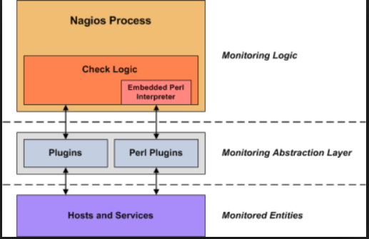
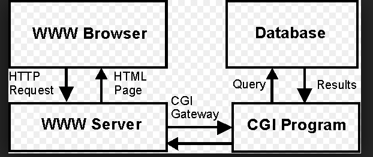
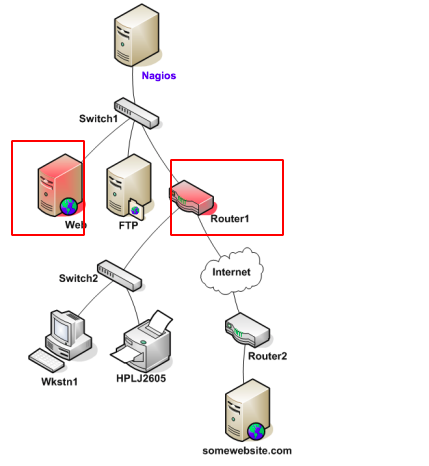
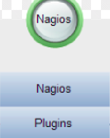
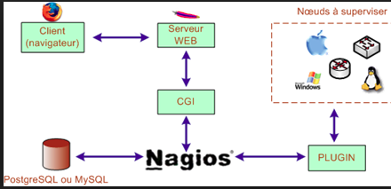

# Mục Lục 
1. [Khái niệm](#a)
2. [Một số chức năng](#b)
3. [Các phiên bản nagios](#c)
4. [Các Khái niệm trong nagios](#d) 
5. [Cấu trúc của nagios](#e)
6. [Ưu nhược điểm của nagios](#f)
7. [Cách thức hoạt động của nagios](#g)

# Tổng quan về nagios 
<a name="a">

1. Khái niệm</a> 
- Nagios(Nagios Ain’t Gonna Insist On Sainthood) Là một phần mềm mà nguồn mở miễn phí của máy tính  dùng để giám sát hệ thống, dịch vụ, mạng...
- Nagios cung cấp dịch vụ giám sát và cảnh bảo cho server. Nó thông báo lần một khi gặp sự cố và lần 2 khi sự cố đã được khắc phục 
- Ban đầu nagios được thiết kế để chạy trên linux
- Một chút về lịch sử của nagios: nagios được tạo ra bởi Ethan Galstad và năm 1999 và được biết đến với cái tên `Nestaint`. Đến năm 2002 đã chính thức đổi tên thành nagios. Đến năm 2009 được đổi tên thành `nagios core`
- Các phầm mềm tương tự nagios : Zenoss, Zabbix, Microsoft System Center Manager (SCOM) và SolarWinds; munin 

<a name="b">

2. Một số Chức năng nagios cung cấp </a>
- Giám sát dịch vụ mạng 
- Giám sát tài nguyên máy chủ
- Giám sát phần cứng 
- Giám sát từ xa 
- cung cấp đồ thị dữ liệu 
- cung cấp dịch vụ nagios bằng giao diện web
- Cảnh báo khi xảy ra sự cố thông qua (mail, sms,...)

<a name="c">

3. Các phiên bản nagios </a>
- nagios core = nagios 
- Nagios Log Server : Là một phiên bản dùng để quản lý và giám sát nhật ký doanh nghiệp. 
- Nagios Fusion : Khi có nhiều nagios core và nagios XL. fusion được tạo ra để tổng hợp lại tất 
cả nagios 
- Nagios XI : Là phần mềm giám sát doanh nghiệp 
- Nagios BPI : Dùng để giám sát các quy trình làm việc 
- Nagios Plugins : Được dùng để kiểm tra trạng thái của máy. Nagios sẽ sử dụng kết quả từ plugins để xác định trạng thái của máy.
- So sánh giữa nagios XI và nagios core thì nagios XI sẽ có tất cả tính năng của nagios core và một số tính năng mà nagios core không có: 
    - Nagios XI sẽ mất phí 
    - Có sẵn Install Script 
    - Dễ dàng tích hợp với các giải pháp khác 
    - Lịch trình sao lưu tự động 
    - Upgrade qua web
    - lưu trữ theo snapshot 
    - Chức năng Auto-Discovery 
    - Máy ảo được cấu hình sẵn 
    - Có app cho điện thoại 
    - Giám sát quy trình Làm việc 
    - Có database backend 
    - Tùy chỉnh người dùng một cách cụ thể 
    - Khôi phục cấu hình 
    - Báo cáo theo lịch trình 
    - Tích hợp google map 

<a name="d">

4. Các khái niệm trong nagios </a>

4.1 Plugins 

- Plugins nó là một lớp ở giữa nagios và host hay service. Nó sẽ kiểm tra trạng thái của của service hay host và sau đó báo cáo kết quả này lại cho nagios xử lý

4.2 APACHE (webserver)
- apache là một phầm mềm của web server. Nó sẽ cung cấp trang web mà ta yêu cầu truy cập. 
- Là nơi lưu trữ các file; thành phần của một website ( file html; css; ảnh ...) 
- Cung cấp cho người dùng dữ liệu website mà họ muốn truy cập và sử dụng 
- Nó sẽ cung cấp cho người dùng cuối thông qua mạng internet  

4.3 CGI (Common Gateway Interface)
- Hay còn được gọi là chương trình giao diện dòng lệnh. Cung cấp giao thức cho web server 
- Web server thường chuyển thông tin biểu mẫu cho ứng dụng xử lý dữ liệu và có thể gửi lại thông báo xác nhận quá trình đó gọi là CGI

- Ưu điểm của CGI: 
    - Là một tiêu chuẩn rõ ràng và được hỗ trợ 
    - CGI thường được viết bằng C; perl; hoặc shell
    - CGI sử dụng giao diện HTML 
    - Tương thích với các trình duyệt web hiện nay 
    - Viết được bằng tất cả ngôn ngữ 
    - CGI sử dụng mã đã được viết hơn là mã riêng 
    - Nhiều tasks dễ chạy hơn java 
- Nhược điểm
    - Tốn nhiều thời gian xử lý 

4.4 Database 
- Là nơi lưu trữ các loại thông tin của nagios.
- DB : Bao gồm cả DBMS và DATA. Trong nagios thì sẽ được hỗ trợ 2 DBMS là mysql và postgreSQL. 

4.5 Macros
- Cho phép tham chiếu các thông tin từ nhiều nguồn khác nhau ví dụ như host, service,....
- Nó lưu trữ thông tin như là một biến môi trường. Trước khi câu lệnh được thực hiện nó sẽ tham chiếu đến macros và thực hiện cũng giống như một biến môi trường. Nhưng có các macros không được cung cấp như biến môi trường là $user$ do cần bảo mật thông tin
- Trước khi nagios thực hiện một command nó sẽ kiểm tra macros và nó sẽ thay thế tất cả các macros bằng giá trị tương ứng của chúng

4.6 Host check 
- Host là những thiết bị giám sát và đặt được địa chỉ IP 
- Host được check bởi nagios core daemon dựa vào một số yếu tố
    - Được check theo lịch trình : làm theo lịch trình được đặt sẵn 
    - Check theo đường tiếp cận của nó :  

    - Một dịch vụ thay đổi trạng thái : Khi dịch vụ của một host thay đổi trạng thái 
- Cache host check : các thông tin sau khi được check xong có thể được cache lại nếu ta sử  dụng tính năng này 
- Host state : trạng thái của máy chủ bao gồm 3 trạng thái 
    - UP 
    - Down
    - UNREACHABLE 
- Khi plugins trả về thông tin của host sẽ là 
    - OK, 
    - WARNING, 
    - UNKNOWN,  
    - CRITICAL.
- Bảng dịch từ plugins sang nagios 

| plungins | Nagios |
|----|---|
| OK | UP |
| WARNING | UP OR DOWN |
| UNKNOWN | DOWN |
| CRITICAL | DOWN | 

- Phân biệt Down và  UNREACHABLE

Theo mô hình web and router 1 down. Còn dưới Router1 sẽ là UNREACHABLE vì nagios không thể xác định được là down hay up   

4.7 Service Check 
- Nagios sẽ check theo một số yếu tố 
    - Theo lịch trình
    - theo sự phụ thuộc dịch vụ 
- Một số trạng thái của service 
    - OK 
    - WARNING
    - UNKNOWN
    - CRITICAL
- Cache service check : tương tự host service cũng có file cache của nó 
*Host ane service có một cơ chế kiểm tra lại trại thái. Ta sẽ đặt được số lần kiểm tra lại trong khi cài đặt*

4.8 Active Checks
- Active Checks có hai tính năng chính 
    - Chạy theo lịch trình
    - Chạy bởi nagios core process
- Active Checks hoạt động 
    - Khi cần check thì nagios sẽ tạo ra plugins để check 
    - Sau đó plugins trả lại kết quả cho thằng nagios xử lý 

4.9 Passive Checks
- Passive Checks 
    - Được thực hiện bởi một tiến trình hoặc app không phải nagios 
    - Kết quả được đưa về cho nagios core xử lý 
    - Được dùng khi nagios không kiểm tra được theo lịch trình 

4.10 state type 
- State type được xác định bởi 2 yếu tố : 
    - Status của host hoặc service : OK, WARNING, UP, DOWN, CRITICAL  
    - type of service : SOFT and HARD 
- Host và service Ở trạng thái SOFT khi 
    - status là non-up hoặc non-OK và chưa được kiểm tra lại 
    - nagios sẽ xử lý tiến trình ở trạng thái này 
    - Nó sẽ được ghi lại trong log 
    - máy được quay lại từ non-up and non-OK thành up và ok 
- Hard States
    - Status là non-up hoặc non-OK và đã được kiểm tra lại 
    - Nó sẽ ghi lại trạng thái vào log 
    - Nagios sẽ xử lý tiến trình với trạng thái của host là hard 

4.11 Time Periods
- Được sử dụng ở một số chức năng
    - Đặt lịch trình kiểm tra 
    - Khi thông báo có thể được gửi đi

4.12 Notifications
- Thông báo được nagios quyết định khi kiểm tra host hoặc service. Thông báo được xảy ra khi. 
    - HARD state thay đổi 
    - Khi SOFT state chuyển thành HARD state 
- Một số dịnh vụ được sử dụng cho việc thông báo : SMS; yahoo; email; cảnh báo âm thanh...

<a name="e">

5. Cấu trúc của nagios </a>

- Bao gồm nagios và plugins. Plugins sẽ làm việc check các thiết bị và rồi trả kết quả về cho nagios xử lý các công việc tiếp theo. 

<a name="f">

6. Ưu nhược điểm của nagios </a>
- Ưu điểm: 
    - Miễn phí  
    - Thích hợp được với nhiều ngôn ngữ 
    - Có hàng nghìn plugins có sẵn để tích hợp với nagios 
- Nhược điểm: 
    - Khá khó khăn khi muốn thêm chức năng phải cấu hình và phải lưu ý việc phù hợp của chức năng đó với môi trường
    - Giao diện đồ họa cổ điển lâu đời 
    - Khả năng tự động cập nhật thiết bị trên mạng không có(auto-Discovery)  Dẫn đến việc khó khăn mở rộng 

<a name="g">

7. Cách thức hoạt động của ngaios </a>

- Apache : là một phần mềm để sử dụng cho webserver của nagios 
- CGI : là quá trình truyền xử lý yêu cầu của người muốn thực hiện giám sát trạng thái 
- Nagios : Nơi tạo ra yêu cầu và xử lý thông tin trả lại từ plugins 
- Pluins : là nơi giám sát sự thay đổi của thiết bị
- Monitored Elements : Thiết bị yêu cầu giám sát 

- Bước 1: Khi client gửi yêu cầu kiểm tra host hoặc service. Thì Sẽ dùng `Browser` và sử dụng giao thức HTTP để truyền tải thông tin yêu cầu đến web server của nagios 
- Bước 2: Sau khi web server của nagios  nhận được yêu cầu của client đó. server sẽ xử lý yêu cầu và xác định xem CGI nào cần dùng. CGI sẽ được dùng để vào nagios (DB của nagios) để lấy thông tin cần thiết và trả lại cho client
- Bước 3: Nagios sẽ xem trong bộ nhớ cache có thông tin của yêu cầu đó không. Nếu có nó sẽ lập tức trả lại cho client. Còn không có thì nagios sẽ tạo ra một plugins để kiểm tra
- Bước 4: Sau đó plugins sẽ kiểm tra lại và trả lại thông tin cho nagios 
- Bước 5: Nagios sẽ lưu trữ lại thông tin được trả lại từ plugins và đồng thời cũng sẽ đưa nó vào bộ nhớ cache. 
- Bước 6: Nagios xác định được các bước phải thực hiện xong sẽ trả lại kết quả cho web server 
- Bước 7: web server sẽ trả cho client thông tin yêu cầu 
8. Một số câu hỏi. 
- FTP dùng để làm gì? 
    - FTP là giao thức dùng để truyền tệp tin 
    - Bạn có thể tải xuống hoặc đẩy tệp tin từ máy này sang máy khác 
- POP3 : 
    - Dùng để download email từ mail server xuống mail client  port 110 ( 995 port POP3S ) 
# Link tham khảo 
https://en.wikipedia.org/wiki/Nagios

https://searchitoperations.techtarget.com/definition/Nagios

https://networklore.com/nagios/

https://www.nagios.org/about/history/

https://assets.nagios.com/downloads/nagioscore/docs/nagioscore/3/en/plugins.html

https://nsrc.org/workshops/2008/walc/nagios/manual/nagios-3.pdf

https://subscription.packtpub.com/book/application_development/9781783288649/1/ch01lvl1sec12/summary

https://www.nagios.org/projects/nagios-plugins/

https://docplayer.net/1104038-Network-monitoring-using-nagios-as-an-example-tool.html
