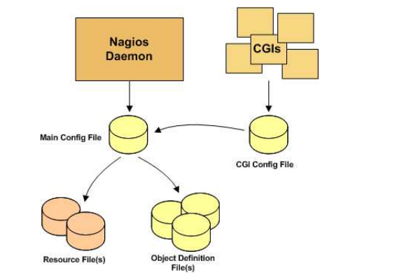

# Mục lục 
1. [Cấu trúc file config](#a)
2. [Main Configuration File](#b)
3. [Object Configuration file](#c) 


<a name="a">

1. Cấu trúc file </a>

Mô hình của file config. Trong nagios có 4 file cấu hình chính. Và được liên kết với nhau bởi file cấu hình chính. 



- Manin Configuration File : Là tệp tin cấu hình chính của nagios. Nó là nơi lưu trữ tất cả các thông tin của nagios. Tất cả các tệp tin được sử dụng đều được khai báo tại `File` này 
- Resource File(s) : Là nơi lưu trữ các giá trị macros 
- Object Definition Files : Là nơi lưu trữ các thông tin; cách thức giám sát của host và service.
- CGI Configuration File : Là nơi lưu trữ các điều kiện cho CGI hoạt động

Khi mà có yêu cầu kiểm tra dịch vụ. Trước khi bắt đầu thực thi lệnh thì nagios sẽ đi vào `Resource File` để thay các giá trị macros để có thể thực thi được câu lệnh. 


<a name="b">

# Main Configuration File </a>
Main Configuration File là nơi lưu trữ thông tin chính của nagios. có tên là `nagios.cfg` và được lưu trong ` /usr/local/nagios/etc/`. Các biến main file là 

1. Log File 
- Format : log_file = < file-name >
- Example: 
```
log_file = /usr/local/nagios/var/nagios.log
```
Biến này được dùng để chỉ định nơi tạo file log của nó. debug của file config cũng được lưu lại vào file log này 

2. Object Configuration File
- Format: cfg_file= < file_name >
- Example: 
```
cfg_file=/usr/local/nagios/etc/hosts.cfg
```
Biến này dùng để trỏ đến file Object Configuration File 

3. Object Configuration Directory
- Biến này được sử dụng để khai báo một thư mục chứa các file Object Configuration File 
- Format: cfg-dir=name
- Example 
```
cfg_dir=/usr/local/nagios/etc/commands
```
4. Status File
Đây là biến dùng để khai báo file lưu trữ trạng thái hiện tại của các client 
- Format : `status_file=< file-name > `
- Example 
```
status_file=/usr/local/nagios/var/status.dat
```
5. Nagios User
- Biến này xác định user mà tiến trình nagios chạy 
- Format: `nagios_user=nagios` 
- Example 
```
nagios_user=nagios
```
6. Nagios Group
- Biến này xác định group mà tiến trình nagios sử dụng 
- Format: `nagios_group=nagios`
- Example 
```
nagios_group=nagios
```
7. State Retention Option
- Biến này để xác định rằng trước khi máy chủ nagios tắt nó có lưu trữ lại trạng thái của các host và service hay không.
- Format: `retain_state_information=<0/1>`
- Example 
```
retain_state_information=0 
```
8. State Retention File 
- Biến này để khai báo file lưu trữ cho State Retention Option
- Format: `state_retention_file=<file_name>`
- Example 
```
state_retention_file=/usr/local/nagios/var/retention.dat
```
9. Resource File 
- Là nơi lưu trữ các giá trị của macros 
- Format: `resource_file=<file_name>`
- Example 
```
resource_file=/usr/local/nagios/etc/resource.cfg
```
10. Use Retained Program State Option
- Biến này xác định là có áp dụng state option cho các biến được lưu trữ trong đó hay không 
- Format: : use_retained_program_state=<0/1>
- Example :
```
use_retained_program_state=1
```
11. Notifications Option 
- Biến này xác định xem có gửi thông báo khi restart nagios hay không. Theo mặc định thì cài đặt này sẽ bị bỏ qua do sử dụng `State Retention option`. và bật tính năng  ` Use Retained Program State Option` 
- Format : enable_notifications=<0/1>
- Example: 
```
enable_notifications=1
```
12. Service Check Execution Option
- Biến này xác định có kiểm tra lại dịch vụ khi mà restart nagios hay không. Theo mặc định thì cài đặt này sẽ bị bỏ qua do sử dụng `State Retention option`. và bật tính năng  ` Use Retained Program State Option` 
- Format : `execute_service_checks=<0/1>
- Example : 
```
execute_service_checks=1
```
13. Host Check Execution Option
- Biến này xác định có kiểm tra lại host khi mà restart nagios hay không. Theo mặc định thì cài đặt này sẽ bị bỏ qua do sử dụng `State Retention option`. và bật tính năng  ` Use Retained Program State Option`
- Format: `execute_host_checks=<0/1>`
- Example: 
```
execute_host_checks=1
```
14. Event Handler Option
- Biến này được bật thì khi mà host hay service thay đổi trạng thái thì các lệnh sẽ được chạy. Theo mặc định thì cài đặt này sẽ bị bỏ qua do sử dụng `State Retention option`. và bật tính năng  ` Use Retained Program State Option`
- Format: `enable_event_handlers=<0/1>`
- Example 
```
enable_event_handlers=<0/1>
```
15. Syslog Logging Option
- Dùng để khai báo xem có bật syslog hay không 
- Example: 
```
use_syslog=1
```
16. Notification Logging Option
- Dùng để khai báo xem có sử dụng log thông báo hay không. Ví dụ thông báo lỗi 
- Example: 
```
log_notifications=1
```
17. Global Host Event Handler Option 
- Dùng để xác định lệnh được sử dụng khi có host thay đổi trạng thái 
- Format :  `global_host_event_handler=<command>`
- Example  
```
global_host_event_handler=log-host-event-to-db
```

<a name="c">

# Object Configuration file </a>
Các file này đã được khai báo trong file main configuration. Một số điều kiện khi cấu hình file 
- Tên chỉ thị phân biệt chữ hoa và thường 
- Những dòng sau dấu `#` sẽ không được xử lý 

1. Host Definition 
- Host: Dùng để chỉ một thiết bị như máy tính; server; máy in.... Các giá trị cần thiết

| Giá trị | Miêu tả | 
|----|----|
| host_name | Được dùng để xác định tên của một host |
| address | Chỉ địa chỉ của một host | 
| parents | Xác định địa chỉ parents  của host | 
| check_command | Tên của lệnh được sử dụng để check host | 
| initial_state | Chọn trạng thái ban đầu cho máy chủ | 
| max_check_attempts | Xác định số lần thử lại khi kết quả trả về trạng thái của host khác OK | 
| check_interval | Kiểm tra lại host trong bao lâu được tính bằng phút theo mặc định |
| retry_interval | Sau khi trạng thái là non-OK. Nó sẽ thực hiện kiểm tra lại theo max_check_attempts và kiểm tra lại sau số phút ở retry_interval. Nếu lần này nó lại là non-OK thì nó sẽ quay lại giá trị check_interval |
| active_checks_enabled | Lệnh này sẽ xác định xem có bật kiểm tra chủ động cho máy này hay không|
| passive_checks_enabled | Xác định xem host có kiểm tra thụ động hay không | 
| check_period | Chỉ định tên của khoảng thời gian thự hiện active check được khai báo | 
| event_handler | Tên của lệnh xử lý khi mà trạng thái host thay đổi | 
| event_handler_enabled | Được sử dụng xem có kiểm tra khi host thay đổi trạng thái hay không | 
| contacts | danh sách chứa tên các địa chỉ cần thông báo tới khi có sự việc nào đó xảy ra |
| contact_groups | danh sách chưa group địa chỉ contacts |  
| notification_interval | Khoảng thời gian thông báo lại là host này vẫn không hoạt động | 
| first_notification_delay | Khoảng thời gian phải để gửi thông báo kể từ lần đầu host non-UP | 
| notification_options | Dùng để xác định khi nào gửi thông báo đi( Down; UNREACHABLE;...) | 
| notification_period | Khi host ở trạng thái notification_options thì sẽ gửi thộng báo sau khoảng thời gian này. Lệnh này chỉ định tên của cài đặt thời gian đó | 
| notifications_enabled | Xác định có bật chế độ gửi thông báo ở host này không | 

- Example 
```
define host{
 host_name                      bogus-router         
 address                        192.168.1.254
 parents                        server-backbone
 check_command                  check-host-alive
 check_interval                 5
 retry_interval                 1
 max_check_attempts             5
 check_period                   time-name
 process_perf_data              0
 retain_nonstatus_information   0
 contact_groups                 router-admins
 notification_interval          30
 notification_period            time-name
 notification_options           d,u,r
 }
 ```
2. Service Definition 
- Service là một số dịch vụ để kiểm tra máy chủ. như check ram, disk, cpu hay một số giao thức http, ping ..

| Giá trị | Miêu tả | 
|----|----|
| host_name | Máy chủ chạy service này |
| service_description | Mô tả về service |
| display_name | Tên hiển thị của service trên web nếu ko có sẽ lấy tên bên trên |
| check_command | Lệnh để thực hiện kiểm tra service | 
| initial_state |  Ghi trạng thái ban đầu của service |
| max_check_attempts | Số lần check lại service khi trạng thái khác OK |
| check_interval | Khai báo khoảng thời gian giữa hai lần check |
| retry_interval | Khai báo khoảng thời gian để check lại nếu có dùng biến `max_check_attempts` |

3. Contact Definition 
- Dùng để xác định các địa chỉ được liên hệ như là địa chỉ mail cảnh báo 

| Giá trị | Miêu tả | 
|----|----|
| contact_name | xác định tên contact sử dụng để khai báo |
| alias | Tên để mô tả rõ hơn về contact |
| host_notifications_enabled | Có bật thông báo liên quan về host không |
| service_notification_enabled | Có bật thông báo liên quan về service không | 
| host_notification_period | Chỉ ra khoảng thời gian mà contact nhận được thông báo | 
| service_notification_commands | xác định lệnh thông báo tin nhắn với service |
| host_notification_commands | xác định lệnh thông báo tin nhắn với host | 

```
define contact{
        contact_name                    nagiosadmin             
        use                             generic-contact       
        alias                           Nagios Admin        
        email                           nguyenanhduchihi@gmail.com     
        service_notification_period             24x7
        service_notification_options            w,u,c,r
        service_notification_commands           notify-service-by-email
        host_notification_period                24x7
        host_notification_options               d,u,r
        host_notification_commands              notify-host-by-email
}
```
4. Contact Group Definition
- Dùng để xác định nhóm các địa chỉ được liên hệ như là địa chỉ mail cảnh báo

| Giá trị | Miêu tả | 
|----|----|
| contactgroup_name	| Tên của group contact | 
| alias	| Miêu tả rõ hơn nhóm group |
| members |	là các contact được nhận thông báo |
| contactgroup_member | Là các nhóm contact phụ để cho vào group này |  

```
define contactgroup {
    contactgroup_name   novell-admins
    alias               Novell Administrators
    members             jdoe,rtobert,tzach
}
```
5. Time Period Definition 
- Được dùng để xác định thời gian được cài đặt để cảnh báo và check host hoặc service.

| Giá trị | Miêu tả | 
|----|----|
| timeperiod_name | Tên của định nghĩa thời gian này | 
| alias	| Miêu tả rõ ràng về định nghĩa là |
| weekday | Là chỉ thị về các khoảng thời gian ngày trong tuần để thông báo | 
| exception	| Là chỉ thị về các ngày nào đặc biệt không tính theo vòng của tuần | 
| exclude | Được chỉ thị tên của các Time Period khác. Time Period này sẽ loại trừ nó ra | 

6. Command Definitions
- Được dùng để xác định thông tin các lệnh để thực hiện để thông báo và kiểm tra 
| Giá trị | Miêu tả | 
|----|----|
| command_name | Được dùng để xác định tên của lệnh	 |
| command_line | Được dùng để xác định lệnh thực thi |

```
define command {
    command_name    check_pop
    command_line    /usr/local/nagios/libexec/check_pop -H $HOSTADDRESS$
}
```
7. templates.cfg 
- Trong templates.cfg sẽ lưu trữ các mẫu cài đặt định nghĩa về host trong linux hay windown hoặc service....
- Có thể sử dụng theo mặc định. Mỗi cài đặt mặc định đó sẽ được đặt cho một cái tên khi muốn sử dụng thì dùng cái tên đó để khai báo 

# Link tham khảo 
https://nsrc.org/workshops/2008/walc/nagios/manual/nagios-3.pdf