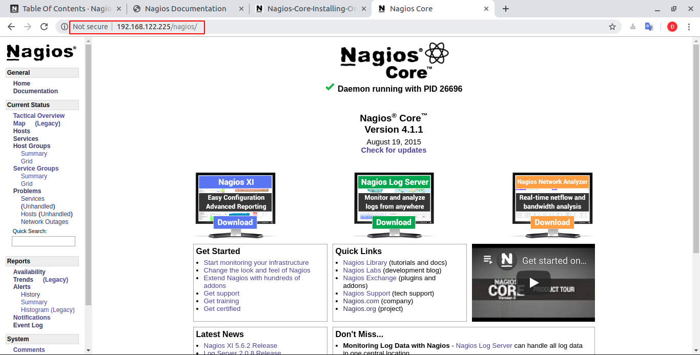

Hướng dẫn cài đặt nagios trên centos7. Chuẩn bị
- OS : centos 7
- RAM : 512 ; Disk 10G
- IP : 192.168.122.225

Các Bước thực hiện 

Bước 1 : Để có thể sử dụng được dịch vụ thì ta cần tắt selinux đi. Sửa file `/etc/selinux/config` và sử dòng `SELINUX` thành disable  
```
sed -i 's/SELINUX=enforcing/SELINUX=disabled/g' /etc/sysconfig/selinux
sed -i 's/SELINUX=enforcing/SELINUX=disabled/g' /etc/selinux/config
```
Bước 2: Tắt firewall 
```
systemctl disable firewalld
systemctl stop firewalld
```
Bước 3: Cài đặt dịch vụ http, php, wget và một số dịch vụ cần thiết
```
yum install httpd php php-cli gcc glibc glibc-common gd gd-devel net-snmp openssl-devel wget unzip -y
```
Bước 4: Tạo user để cho tiến trình xử lý nagios chạy với user đó. 
```
useradd nagios
groupadd nagcmd
usermod -a -G nagcmd nagios
usermod -a -G nagcmd apache
```
Bước 5: Dùng wget để download và cài đặt nagios
```
cd /tmp
wget https://assets.nagios.com/downloads/nagioscore/releases/nagios-4.1.1.tar.gz
tar zxf nagios-4.1.1.tar.gz
cd nagios-4.1.1
./configure --with-command-group=nagcmd
make all
make install
make install-init
make install-config
make install-commandmode
make install-webconf
```
Bước 6: Tạo ra một user để đăng nhập vào web server.
```
htpasswd -c /usr/local/nagios/etc/htpasswd.users nagiosadmin
```
Bước 7: Download và Cài đặt nagios plugins
```
cd /tmp
wget http://www.nagios-plugins.org/download/nagios-plugins-2.1.1.tar.gz
tar zxf nagios-plugins-2.1.1.tar.gz
cd /tmp/nagios-plugins-2.1.1
./configure --with-nagios-user=nagios --with-nagios-group=nagios --with-openssl
make all
make install
```
Bước 8: Chạy dịch vụ nagios
```
service httpd start
service nagios start
```
Bước 9: đăng nhập vào web nagios. Ví dụ 
```
192.168.122.225/nagios
```
Bước 10: Sử dụng user để đăng nhập trang web như đã cài ở bước 6. Và sau đó ta nhận được kết quả 



Kết quả cuối cùng sẽ hiển thị như bên trên thì có nghĩa là nagios đã được hoạt động. Theo mặc định ban đầu thì các status sau khi được check sẽ được lưu trữ tại một file mặc định. Đi sâu vào các file config 

Lệnh check file config. Nó sẽ thông báo lỗi nếu như có cấu hình nào đó sai
```
/usr/local/nagios/bin/nagios -v /usr/local/nagios/etc/nagios.cfg
```

# Link tham khảo 

https://www.digitalocean.com/community/tutorials/how-to-install-nagios-4-and-monitor-your-servers-on-centos-7#install-nagios-4

https://www.digitalocean.com/community/tutorials/how-to-install-linux-apache-mysql-php-lamp-stack-on-centos-7

https://assets.nagios.com/downloads/nagioscore/docs/Nagios-Core-Installing-On-Centos7.pdf#_ga=2.188291052.55387488.1561424196-743685740.1560686364
