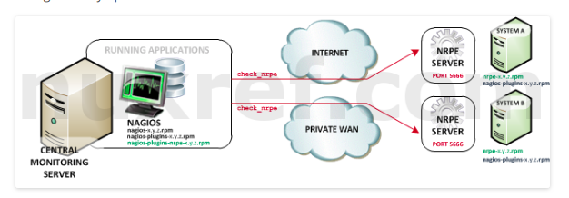
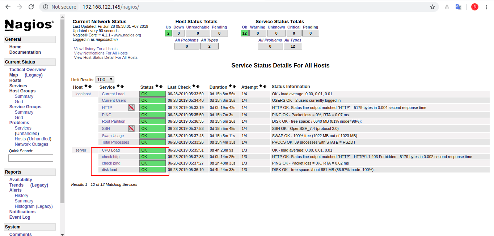

# Luồng hoạt động của NRPE



- Bước 1: Nagios server tạo yêu cầu giám sát đến nrpe được cài đặt trên host
- Bước 2: nrpe thực hiện yêu cầu bằng và trả lại kết quả cho nagios server 
- Bước 3: Nagios server thực hiện công việc của nó


Mô hình 


|hostname | OS | Ram | Disk | IP |
|----|---|---|---|---|
|server | Centos 7 | 0,5 GB | 10GB | 192.168.122.145|
| client |  Centos 7 | 0,5 GB | 10GB | 192.168.122.34 |

# Cài đặt NRPE 
## Trên máy linux từ xa 
- Bước 1: Cài đặt các gói phụ kiện cần thiết 
```
yum install -y gcc glibc glibc-common gd gd-devel make net-snmp openssl-devel
```
- Bước 2: Tạo user để nrpe sử dụng tiến trình bằng user này 
```
useradd nagios
passwd nagios
```
- Bước 3 Download plugins 
```
yum install wget -y 
wget https://www.nagios-plugins.org/download/nagios-plugins-2.1.2.tar.gz
```
- Bước 4: Giải nén file vừa tải về 
```
tar -xvf nagios-plugins-2.1.2.tar.gz
```
- Bước 5: Cài đặt plugins 
```
cd nagios-plugins-2.1.2
./configure
 make
 make install
```
- Bước 6 : Cấp quyền sử dụng nagios cho user 
```
chown nagios.nagios /usr/local/nagios
chown -R nagios.nagios /usr/local/nagios/libexec
```
- Bước 7: Cài đặt xinetd 
```
yum install xinetd
```
- Bước 8: Cài đặt NRPE plugins 
```
wget https://github.com/NagiosEnterprises/nrpe/releases/download/nrpe-3.2.1/nrpe-3.2.1.tar.gz

tar xzf nrpe-3.2.1.tar.gz
cd nrpe-3.2.1
./configure
make all 
make install
make install-plugin
make install-config
make install-daemon
make install-init
make install-inetd
```
- Bước 9: Sửa file `/usr/local/nagios/etc/nrpe.cfg` 
```
allowed_hosts=127.0.0.1,(nagios server IP )
```
ví dụ 
```
allowed_hosts=127.0.0.1,192.168.122.145
```
- Bước 10: Sửa file `/etc/xinetd.d/nrpe`
```
only_from = 127.0.0.1 localhost <nagios_ip_address>
```
- Bước 11: Sửa file ` /etc/services` Thêm vào cuối file dòng sau 
```
nrpe            5666/tcp                 #NRPE
```
- Bước 12: Khởi chạy các dịch vụ 
```
service xinetd restart
systemctl start nrpe 
systemctl enable nrpe 
```

## Trên nagios server 
- Bước 1: Download NRPE plugins 
```
wget https://github.com/NagiosEnterprises/nrpe/releases/download/nrpe-3.2.1/nrpe-3.2.1.tar.gz
```
- Bước 2: Cài đặt NRPE
```
tar xzf nrpe-3.2.1.tar.gz
cd nrpe-3.2.1
./configure
make install
make install-plugin
make install-daemon
```
- Bước 3: Kiểm tra phiên bản NRPE
```
/usr/local/nagios/libexec/check_nrpe -H <remote_linux_ip_address>
```
- Bước 4: Thêm chức năng kiểm tra máy linux từ xa. Khai báo Trong file main config
```
 vi /usr/local/nagios/etc/nagios.cfg
```
- Thêm vào dòng sau 
```
cfg_file=/usr/local/nagios/etc/hosts.cfg
cfg_file=/usr/local/nagios/etc/services.cfg
```
- Bước 5: Chỉnh sửa file host  đã khai báo 
```
vi /usr/local/nagios/etc/hosts.cfg
```

```
define host{
name                            linux-box
use                             generic-host
check_period                    24x7
check_interval                  5
retry_interval                  1
max_check_attempts              10
check_command                   check-host-alive
notification_period             24x7
notification_interval           30
notification_options            d,r
contact_groups                  admins
register                        0
}
define host{
use                             linux-box
host_name                       server
alias                           CentOS 7
address                         192.168.122.34
}

```
- Bước 6: Chỉnh sửa file service 
```
vi /usr/local/nagios/etc/services.cfg
```

```
define service{
        use                     generic-service
        host_name               server
        service_description     CPU Load
        check_command           check_nrpe!check_load
        }
define service{
        use                     generic-service
        host_name               server
        service_description      disk load
        check_command           check_nrpe!check_hda1
        }
define service{
        use                     service-test
        host_name               server
        service_description     check ping
        check_command           check-ping

 }
define service{
        use                     generic-service
        host_name               server
        service_description     check http
        check_command          check_nrpe!check_http

 }
```
- Bước 7: Thêm lệnh `check-ping` vào trong file `/usr/local/nagios/etc/objects/commands.cfg` trên nagios server
```
define command{
        command_name    check-ping
        command_line    $USER1$/check_ping -H $HOSTADDRESS$ -w 3000.0,80% -c 5000.0,100% -p 5
        }
```
Hoặc cũng có thể thêm lệnh như là lệnh kiểm tra http vào file `/usr/local/nagios/etc/nrpe.cfg ` trên client đây là 2 cách đều có thể thực hiện được 
```
command[check_http]=/usr/local/nagios/libexec/check_http  -H 127.0.0.1 -e 'HTTP' --authorization=root:anhduc
```
- Bước 8: Sau đó chạy lệnh check lại file cấu hình
```
/usr/local/nagios/bin/nagios -v /usr/local/nagios/etc/nagios.cfg
```
- Kết quả sẽ như sau là sẽ không có lỗi gì xảy ra
```
Nagios Core 4.1.1
Copyright (c) 2009-present Nagios Core Development Team and Community Contributors
Copyright (c) 1999-2009 Ethan Galstad
Last Modified: 08-19-2015
License: GPL

Website: https://www.nagios.org
Reading configuration data...
   Read main config file okay...
   Read object config files okay...

Running pre-flight check on configuration data...

Checking objects...
	Checked 10 services.
	Checked 2 hosts.
	Checked 1 host groups.
	Checked 0 service groups.
	Checked 1 contacts.
	Checked 1 contact groups.
	Checked 25 commands.
	Checked 5 time periods.
	Checked 0 host escalations.
	Checked 0 service escalations.
Checking for circular paths...
	Checked 2 hosts
	Checked 0 service dependencies
	Checked 0 host dependencies
	Checked 5 timeperiods
Checking global event handlers...
Checking obsessive compulsive processor commands...
Checking misc settings...

Total Warnings: 0
Total Errors:   0
```

- Bước 9: Khởi động lại dịch vụ 
```
service nagios restart
```

Sau khi khởi động lại dịch vụ thì ta sẽ đăng nhập vào web để kiểm tra thông báo của naigos 



Ta thấy rằng nagios đã giám sát được CPU và disk của host 

# link tham khảo 
https://assets.nagios.com/downloads/nagioscore/docs/nrpe/NRPE.pdf

https://www.tecmint.com/how-to-add-linux-host-to-nagios-monitoring-server/

http://nuxref.com/2013/12/09/installing-nrpe-and-nsca-into-nagios-core-4-centos-6/


