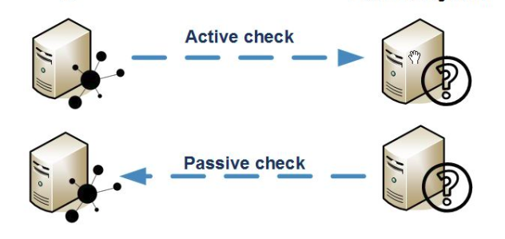

1. Active Checks và Passive Checks



**Active check** 
- Là một kiểu check chủ động. Nagios cần thông tin của host và service thì nagios sẽ sử dụng plugins để thu tập thông tin và nhận thông tin từ plugins trả về 

**Passive checks** 
- Nagios không vần phải sử dụng plugins để kiểm tra thông tin của host và service. Mà sẽ có một dịch vụ được cài đặt tại client sẽ thu thập thông tin rồi sẽ đẩy thông tin nên cho nagios server xử lý. 
2. Thêm dịch vụ ssh; ping cho nagios server 192.168.80.221

- Thêm check ram. Muốn sử dụng NRPE để check ram thì cần download thêm plugins check ram vì NRPE không có sẵn 

# Trên client 
```
cd /usr/local/nagios/libexec/
wget https://raw.githubusercontent.com/justintime/nagios-plugins/master/check_mem/check_mem.pl
chmod +x check_mem.pl
```

Chỉnh sửa file nrpe.cfg thêm lệnh check ram vào bên trong nrpe 
```
command[check-mem]=/usr/local/nagios/libexec/check_mem.pl -f -w 20 -c 10

systemctl restart nrpe
```
Sau khi thêm xong vào thì cần restart dịch vụ nrpe để có thể sử dụng lệnh check_mem này 

# Trên server 
Thêm service và sử dụng lệnh đã khai báo để kiểm tra
```
command check_nrpe!check-mem
```