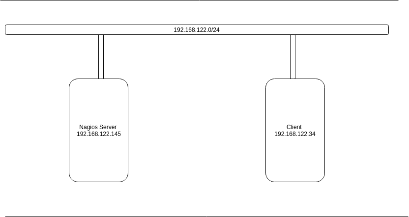
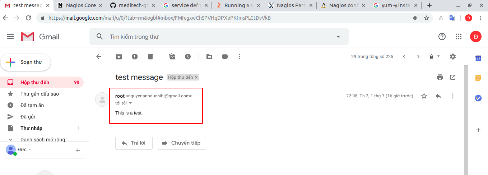
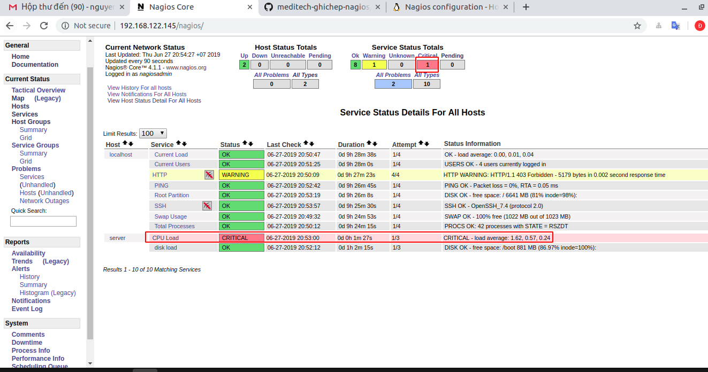
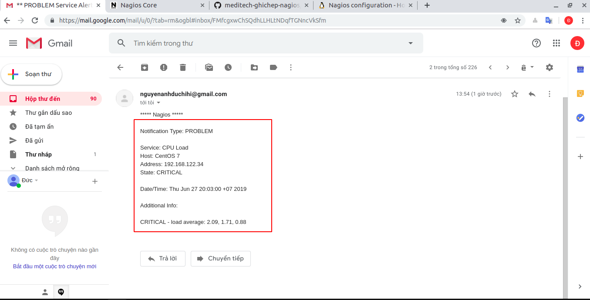
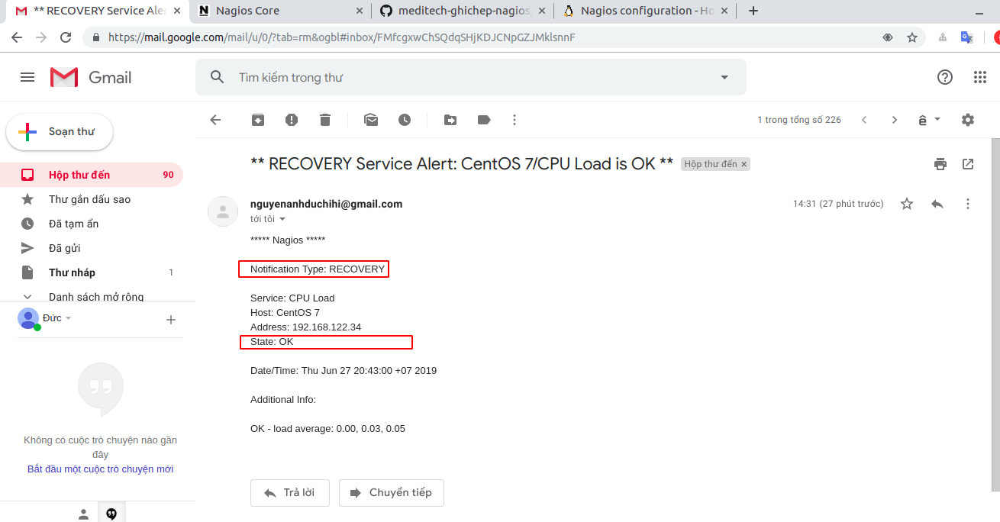
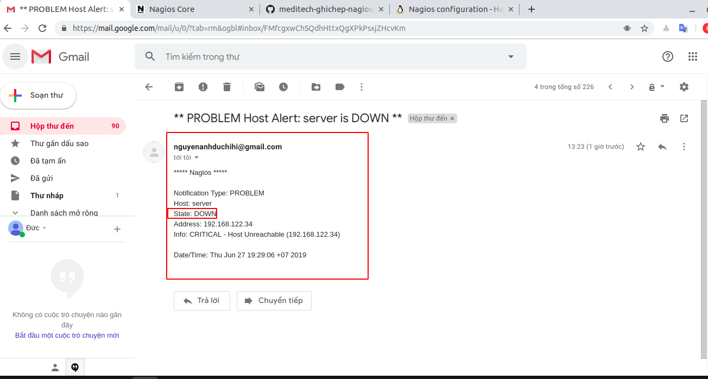
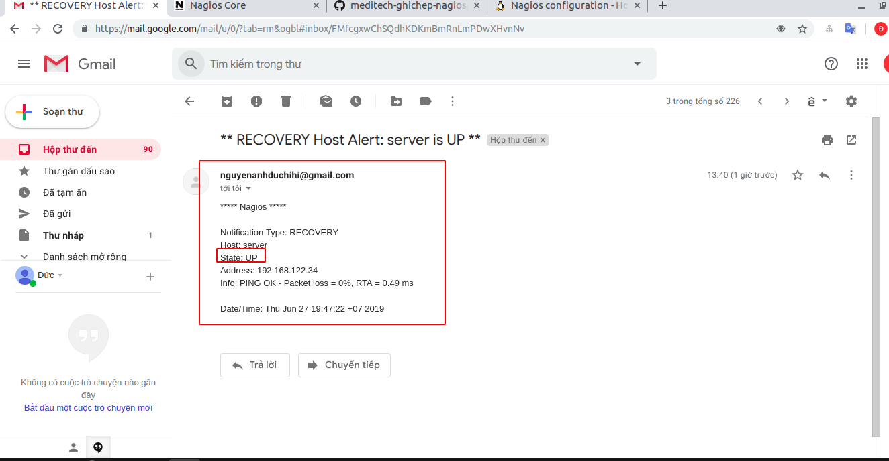

# Hướng dẫn cảnh báo qua mail trong nagios 
Mô hình 



| Hostname | OS | IP |
|---|---|---|
| Nagios server | Centos 7 | 192.168.122.145 |
| Client | Centos 7 | 192.168.122.34 | 

Kịch bản: Ta sẽ thực hiện việc cài đặt gói cảnh báo qua mail. Sau đó thử dùng lệnh gửi mail. Tiếp theo sẽ áp dụng nó vào nagios gửi mail khi máy client bị tắt và khi CPU quá cao sẽ gửi mail cảnh báo. 

Thực hiện 
- Bước 1: Cài đặt gửi cảnh báo qua mail. phải cài gói mail postfix
```
yum -y install postfix cyrus-sasl-plain mailx
```
- Bước 2: Tạo file lưu trữ thông tin mail để gửi đi đến mail nhận cảnh báo 
```
vi /etc/postfix/sasl_passwd
```
example ` [smtp.gmail.com]:587 nguyenanhduc@gmail.com:anhduc`
- Bước 3: Một số trường hợp tắt sự cho phép truy cập của nguồn không an toàn và yêu cầu phải xác nhận. Ta phải vào link dưới để chỉnh sửa 
- Bước 4: Khởi động dịch vụ postfix
```
systemctl reload postfix
```

https://myaccount.google.com/lesssecureapps

- Bước 5: cấu hình dịch vụ mail postfix trong file `/etc/postfix/main.cf` 
```
relayhost = [smtp.gmail.com]:587
smtp_use_tls = yes
smtp_sasl_auth_enable = yes
smtp_sasl_security_options =
smtp_sasl_password_maps = hash:/etc/postfix/sasl_passwd
smtp_tls_CAfile = /etc/ssl/certs/ca-bundle.crt
```
- Bước 6: Khởi động lại dịch vụ 
```
systemctl restart postfix
systemctl enable postfix
```
- Bước 7: Kiểm tra xem dịch vụ thành công hay chưa
```
echo "This is a test." | mail -s "test message" nguyenanhduchihi@gmail.com
```
Ta sẽ thấy được kết quả Sau khi thực hiện dòng lệnh trên là nó sẽ báo về mail mà ta yêu cầu ở trên 



*Đến đây đã cài xong gói dịch vụ gửi mail. Tiếp theo sẽ cài đặt khai báo client ở trên nagios server*

**Khi cài nagios server sẽ có một file cài đặt những cách khai báo service và host chung được lưu trong file `/usr/local/nagios/etc/objects/templates.cfg `. Và nó được mặc định khai báo sẵn trong nagios. Chúng ta có thể sử dụng nó khi khai báo host và service.**

- Bước 8: Nếu sử dụng cách khai báo chung của nagios thì ta sẽ sử dụng contact `nagiosadmin`. Vì vậy ta sẽ sửa thông tin của nó trong file `/usr/local/nagios/etc/objects/contacts.cfg` 
```
define contact{
        contact_name                    nagiosadmin             
        use                             generic-contact       
        alias                           Nagios Admin        
        email                           nguyenanhduchihi@gmail.com     
        service_notification_period             24x7
        service_notification_options            w,u,c,r
        service_notification_commands           notify-service-by-email
        host_notification_period                24x7
        host_notification_options               d,u,r
        host_notification_commands              notify-host-by-email
}
```
- Trong đó mail sẽ được gửi thông báo đi trong các trường hợp:
- d : Down
- u : Up 
- r : Recovery 
- c : Critical 
- w : warning 
 

- Bước 9: Khởi động lại dịch vụ nagios trên server 
```
service nagios restart
```
- Bước 10: Kiểm tra cách hoạt động của nagios với gửi mail cảnh báo với service CPU load. Ta sẽ kiểm tra nagios giám sát CPU load ban đầu 


- Service CPU đã được cài sẵn và sẽ sử dụng lệnh `stress` để  tăng CPU lên để kiểm tra nagios gửi thư cảnh báo. Trên client thực hiện lệnh 
```
[root@server ~]# stress -c 2
stress: info: [3390] dispatching hogs: 2 cpu, 0 io, 0 vm, 0 hdd
```



Thấy rằng khi mà đẩy CPU lên cao thì. Nagios sẽ chuyển dịch vụ CPU load sang trạng thái CRITICAL. Các mức cảnh báo sẽ được cài đặt tùy theo người sử dụng còn theo mặc định sẽ tìm thấy trong file `/usr/local/nagios/etc/nrpe.cfg`. Ở dòng khai báo lệnh check load

```
command[check_load]=/usr/local/nagios/libexec/check_load -r -w .15,.10,.05 -c .30,.25,.20

```
Theo cấu hình được cài sẵn ở đây thì mức `warning` khi cpu load average vược quá 0.15 0.10 0.05 còn mức `CRITICAL` CPU load average sẽ quá 0.3 0.25 0.2 

 

*Ta thấy rằng nagio server đã gửi mail cảnh báo là dịch vụ CPU load đã ở trạng thái CRITICAL.*

- Bước 11: Tắt lệnh `stress` Để CPU trở về hoạt động bình thường. Theo cài đặt ở trên sau khi hoạt động bình thường thì nagios sẽ lại gửi mail để thông báo rằng CPU đã trở lại trạng thái OK 

 

Mail này đúng như đã cài đặt rằng báo cáo dịch vụ CPU load đã quay trở lại trạng thái OK 

- Bước 12: Ta sẽ tắt máy client và xem nagios server gửi mail cảnh báo host. 



Sau khi tắt client thì nagios server đã gửi mail báo cáo rằng client với IP 192.168.122.34 đã DOWN 

- Bước 13: Ta sẽ bật lại client và theo cài đặt bên trên là sẽ được gửi báo cáo UP từ nagios server đến mail được cài đặt 



Đúng như cài đặt nagios server đã gửi mail thông báo client đã quay lại trạng thái OK 

# Tài liệu tham khảo 

https://github.com/meditechopen/meditech-ghichep-nagios/blob/master/docs/thuchanh-nagios/3.Setup-Mail-alert.md#3

