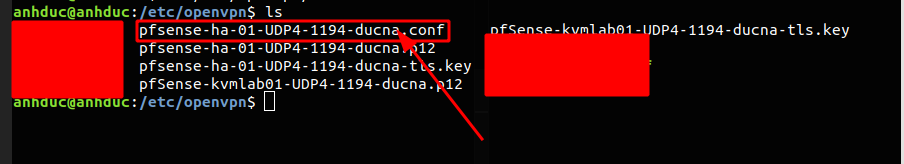
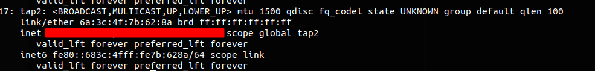

# Hướng dẫn openvpn trên linux 


Để có thể cài đặt được openVPN thì ta cần có điều kiện sau 
- Được cấp key để có thể truy cập được VPN 
- Được cấp tài khoản để có thể nhận VPN 

1. Cài đặt Openvpn nếu chưa có 
```
sudo apt install openvpn 
```

2. copy file được tạo vào trong thư mục 
```
/etc/openvpn
```


3. xong đó tạo ra file lưu user và password của tài khoản được cấp với cú pháp file 
```
user
password
```


4. Chỉnh sửa file conf 



File ở trên đầu tiên có đuôi là `.ovpn` ta phải sửa nó thành đuôi `.conf` 

5. Sửa nội dung file này 
```
sed -i 's|auth-user-pass|auth-user-pass &PATH|' /etc/openvpn
```
Với giá trị `$PATH` Là đường dẫn lưu user password của bạn đã được cấp 

6. Khởi động dịch vụ
```
systemclt start openvpn@file
systemctl enable openvpn
```
- Khi khởi động dịch vụ thì trong đó `openvpn@file` thì file là tên file `.conf` 
7. Kiểm tra IP để xem đã được cấp chưa
```
ip a
```



