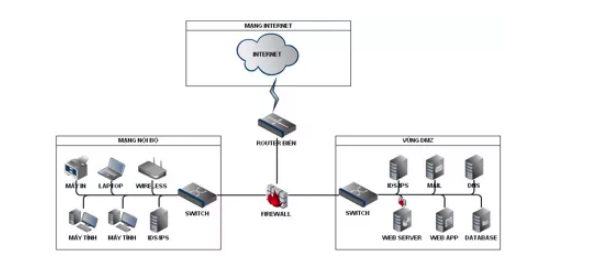
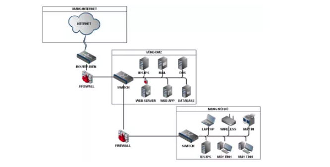

# Tìm hiểu tổng quan về Firewall

1. Khái niệm

Firewall là gì? 
- Firewall là một giải pháp được sử dụng làm rào chắn giữa mạng nội bộ và internet. 
- Firewall bảo về tài nguyên và chống sự truy cập trái phép từ bên ngoài internet
- Quản lý và kiểm soát lưu lượng mạng. Xác thực quyền truy cập 

Firewall làm việc đó như thế nào?
- Mỗi khi có một gói tin được chuyển đến network stack thì firewall sẽ có các target quyết định đối với mỗi gói tin như sau 
    - ACCEPT : Chấp nhận gói tin đi vào bên trong local 
    - DROP : từ chối gói tin đi vào bên trong local 
    - FORWARD : Chuyển tiếp gói tin đến networok stack khác 

2. Nơi đặt firewall 
- Vùng DMZ : là nơi trung lập giữa local và internet. Là nơi cho phép người dùng internet có thể truy cập vào lấy dữ liệu. DMZ thường là vùng đặt những thiết bị dịch vụ như là Webserver, Mailserver, DNS server...
- Mô hình 1:  Vùng DMZ và vùng local sử dụng chung một firewall đặt ở giữa 2 vùng này 

 

- Mô hình 2: có 2 firewall được đặt. 1 là đặt trước vùng DMZ và firewall thứ 2 được đặt ở giữa vùng DMZ và vùng local 

 

3. Phân loại firewall 
- Có rất nhiều cách để phân loại firewall theo từng quan điểm của mỗi người. Tài liệu này sẽ nói về 1 trong các cách phân loại firewall mà tôi sử dụng. 

Firewall cứng. 
- Hardware firewall hay còn gọi là firewall cứng nằm giữa mạng máy tính cục bộ của bạn và Internet. Thường được tích hợp trong bộ định tuyến. Kiểm tra tất cả gói tin từ internet đi đến local. Không thể thay đổi quy tắc lọc gói tin để phục vụ mục đích cá nhân. Chỉ người quản trị mới có thể thay đổi được quy tắc lọc gói tin đó 
- Hoạt động ở giữa tầng network và transpost 
- Ví dụ Cisco PIX, WatchGuard Fireboxes, NetScreen firewall, SonicWall Appliaces, Nokia firewall…
- Ưu điểm của nó là hoạt động với số lượng máy lớn và có hiệu năng cao hơn 
- Nhược điểm không thể thêm bớt quy tắc theo mục đích sử dụng cá nhân mà phải sử dụng với mục đích tập thể. Không thể bảo vệ khi di chuyển 

Firewall mềm 
- Software Firewalls được cài đặt trên các máy tính cá nhân trên mạng. Dễ dàng thêm quy tắc để lọc gói. Hoạt động ở tầng ứng dụng có thể lọc được các gói tin gửi đi và cũng như gửi đến. 
- Một số Firewall mềm thông dụng: Zone Alarm, Microsoft ISA Server 2006, Norton Firewall, firewalld ( trên Centos 7), UFW ( trên Ubuntu ), ...
- Ưu điểm dễ dàng thêm bớt chức năng lọc gói tin với mục đích cá nhân. Hoạt động tốt với những chiếc laptop vì phải mang đi mang lại nhiều nơi. 