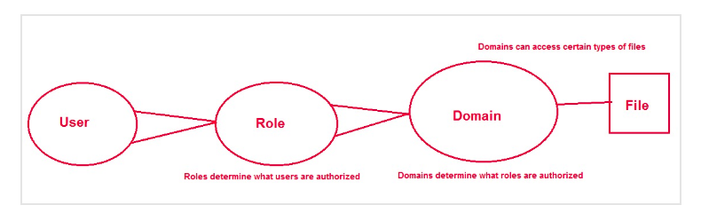

# Mục lục 


## I. Khái niệm và concepts.
SELINUX ( Security Enhanced Linux ) là một cơ chế kiểm soát truy cập có sẵn trên hầu hết các hệ điều hành linux hiện nay. Và log của nó được ghi trong 
```
/var/log/messages 
```
1. SELINUX modes bao gồm có 3 chế độ: 
- Enforcing : SELINUX sẽ thực thi chính sách của mình trên hệ thống và đảm bảo mọi truy cập không được phép của người dùng và tiến trình đều bị từ chối. Và được ghi vào trong file log của hệ thống
- Permissive : Đây là trạng thái bán hoạt động. Các truy cập đều được chấp nhận nhưng những truy cập nào không phù hợp với chính sách sẽ bị ghi lại 
- Disabled : Trạng thái này selinux sẽ không hoạt động 
- Lệnh dùng để check mode selinux
```
getenforce
```
- Lệnh dùng để xem trạng thái của DNS 
```
sestatus
```
- Khi đang ở trạng thái disable thì không dùng command chuyển trạng thái được 
```
[root@CLIENT1 html]#  setenforce 1 
usage:  setenforce [ Enforcing | Permissive | 1 | 0 ]
```

2. `SELINUXTYPE` xác định chính sách mà selinux sẽ chọn để áp dụng.
- targeted : SELINUX cho phép người dùng tùy chỉnh quyền kiểm soát truy cập 

3. SElinux policy

a) Users
- SElinux gọi một tiến trình là `subject`
- SElinux có một hệ thống người dùng được thiết lập sẵn 

b) Roles 
- Như là một cổng kết nối giữa người dùng và tiến trình 
- Nó xem rằng ai có thể đi được qua cổng này 

c) Subjects and Objects
- `Object` là bất cứ thứ gì có thể tạo ra một tiến trình. là file thư mục hay là server... 
- `Subjects` là một tiến trình 

d) Domains are for Subjects
- Domains nó giống như là một khu vực để giới hạn subjects có thể thực hiện được.

e) SELinux policy



SELinux policy được dùng để xác định xem user nào có thể sử dụng roles. Sau đó roles sẽ xác định domain của user đó và domain sẽ cho biết file mà user có thể sử dụng được. 

```
semodule -l
```
Lệnh hiển thị các policy được sử dụng với hệ thống 
 
` /etc/selinux/targeted/modules/active/modules/` là nơi lưu trữ các file chứa các chuẩn chính sách SElinux 


# II. Trường hợp sử dụng SELinux 
1. Quyền domain và roles 
```
ls -Z /etc/*.conf
```
```
...
-rw-r--r--. root root system_u:object_r:etc_t:s0       /etc/GeoIP.conf
-rw-r--r--. root root system_u:object_r:etc_t:s0       /etc/host.conf
-rw-r--r--. root root system_u:object_r:kdump_etc_t:s0 /etc/kdump.conf
-rw-r--r--. root root system_u:object_r:krb5_conf_t:s0 /etc/krb5.conf
-rw-r--r--. root root system_u:object_r:etc_t:s0       /etc/ld.so.conf
-rw-r-----. root root system_u:object_r:etc_t:s0       /etc/libaudit.conf
-rw-r--r--. root root system_u:object_r:etc_t:s0       /etc/libuser.conf
-rw-r--r--. root root system_u:object_r:locale_t:s0    /etc/locale.conf
...
```

ví dụ quyền của một file trong selinux 
```
system_u:object_r:locale_t:s0
```
Có 4 quyền được phân cách bởi dấu `:`  

- `system_u` Quyền người dùng linux 
- `object_r` Quyền roles 
- `locale_t` Quyền domain 

*Lệnh để thay đổi quyền*
```
chcon --type <quyền> <file>
```
```
chcon --type usr_t /www/html/index.html
```
*Lệnh quay lại trạng thái ban đầu trước khi thay đổi quyền*
```
restorecon -v /var/www/html/index.html
```
Có file `/etc/selinux/targeted/contexts/files/file_contexts` Lưu trữ mặc định của các file khi `restorecon` nó sẽ quay lại các quyền trong file này

Lệnh hiển thị các quyền đã được lưu theo kiểu mặc định 
```
matchpathcon -V /www/html/index.html
```

2. Quyền user 

- Không được tạo ra mà chỉ được cài đặt sẵn 
- Mọi user được tạo ra đều được ánh xạ bằng một `selinux user` nào đó. 
- Lệnh kiểm tra ánh xạ
```
semanage login -l
```
```
Login Name           SELinux User         MLS/MCS Range        Service

__default__          unconfined_u         s0-s0:c0.c1023       *
root                 unconfined_u         s0-s0:c0.c1023       *
system_u             system_u             s0-s0:c0.c1023       *
```
user được tạo ra bình thường sẽ là `default` và ánh xạ tới `unconfined_u ` 

Các quyền có trong user selinux
- `guest_u` : Không thể thực thi lệnh. không dùng lệnh su và sudo. Không thể truy cập vào GUI 
- `xguest_u` : Người dùng có quyền truy cập vào GUI 
- `user_u` : Không có quyền chuyển người dùng bằng su và sudo nhưng có nhiều quyền truy cập hơn guest 
- `staff_u` : Có quyền sử dụng lệnh sudo 
- `system_u` : Có quyền chạy các dịch vụ hệ thống


# Link tham khảo 
https://www.digitalocean.com/community/tutorials/an-introduction-to-selinux-on-centos-7-part-1-basic-concepts#selinux-modes

https://www.digitalocean.com/community/tutorials/an-introduction-to-selinux-on-centos-7-part-2-files-and-processes

