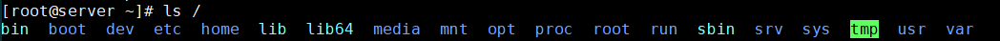

# Filesystem Structure - Cấu trúc hệ thống tập tin  


## 1. `/` 
- Thư mục gốc, mọi đường dẫn tuyệt đối của bất kì file nào đều bắt đầu từ `/`. Thư mục `/` chứa toàn bộ hệ điều hành, chỉ có root user mới có quyền truy cập và thay đổi thư mục trong này.(phân biệt `/` và `/root`)    

  

## 2. `/bin` - `user binaries` - thư mục lưu trữ các file nhị phân chương trình thực thi của người dùng như: pwd, cat, cp,...  

    


## 3. `/sbin` - System Binaries
Cũng chứa các tập tin thực thi như bin. Các mục được lưu trong thư mục này được dùng cho quản trị viên và bảo trì hệ thống.   


## 4. `/etc` - Configuration Files  
- Chứa các tập tin cấu hình cho các chương trình.  
- Chứa các đoạn mã khởi động và tắt các chương trình đơn lẻ.


## 5. `/dev` - Device Files  
- Chứa các tập tin thiết bị. Nó chứa tất cả các tập tin thiết bị đầu cuối như là USB hoặc bất kì thiết bị nào gắn vào hệ thống.  
- Mỗi thiết bị đều có file đại diện và được đặt tên nhất định:  
  - cdrom : đĩa CDROM / DVD

  - hd : ổ đĩa IDE , ATA
    - hda : ổ cứng thứ nhất  
    - hdb :	ổ cứng thứ hai  
    - hdb1 : phân vùng thứ nhất của ổ cứng thứ nhất
  - sd : ổ đĩa SCSI , SATA ( SSD , HDD ) , USB
    - sda : ổ cứng thứ nhất
    - sdb :	ổ cứng thứ hai
    - sda1 : phân vùng thứ nhất của ổ cứng sda
  - nvme0 : ổ cứng SSD NVMe
    - nvme0n1 : ổ nvme thứ nhất
    - nvme0n2 : ổ nvme thứ hai
    - nvme0n2p1 : phân vùng thứ nhất của ổ nvme0n2
  - tty : cổng giao tiếp ( COM ,...)
  - eth: cổng Ethernet


## 6. `/proc` - Process Information  
- Chứa thông tin về tiến trình hệ thống.
- Tệp tin chứa thông tin về các tiến trình đang chạy.


## 7. `/var` - Variable Files  
- Tập tin biến đổi: chứa các tập tin mà dung lượng biến đổi lớn dần theo thời gian 
- Bao gồm:  
   - Các tập tin ghi chú về hệ thống (/var/log); 
   - Các gói và các tập tin cơ sở dữ liệu (/var/lib); - Thư điện tử (/var/mail); 
   - File đợi in queues (/var/spool); 
   - Các tập tin khóa (/var/lock); 
   - Các tập tin tạm được dùng khi khởi động lại (/var/tmp);

## 8. `/tmp` - Temporary Files
- Thư mục chứa tập tin tạm được tạo bởi hệ thống và người dùng.
- Bị xóa khi hệ thống khởi động lại.  

## 9. `/usr` - User Programs  
 - Chứa các tập tin thực thi, thư viện,tài liệu và mã nguồn cho các tập tin ở mức độ 2.  
 - `usr/bin` chứa các tập tin thực thi cho các chương trình của người dùng.
 - `usr/sbin` chứa các tập tin thực thi cho người quản trị hệ thống. 
 - `usr/lib` chứa các tập tin thư viện usr/bin và usr/sbi.
 - `usr/loca`l chứa các chương trình của người dùng được cài từ mã nguồn.

## 10. `/home` - Home Directories  
- Chứa các tập tin của người dùng trong hệ thống.  

## 11. `/boot` - Boot Loader Files  
- Chứa những tập tin liên quan đến chương trình khởi động máy.
- Các tập tin vmlinux, grub được lưu trong thư mục /boot
- Vd: initrd.img-2.6.32-24-generic, vmlinuz-2.6.32-24-generic..  

## 12. `/lib` -  System Libraries  
- Chứa các file thư viện để hỗ trợ thực thi lệnh trong /bin và /sbin.
- Tên các tập tin này là lib* hoặc lib*.so*.  

## 13. `/opt` - Optional add-on Apps  
- Chứa các ứng dụng thêm của các hãng.
- Các ứng thêm có thể được cài đặt ở /opt hoặc ở các thư mục conn của /opt(nên)  

## 14. `/mnt` - Mount Directory  
Thư mục gắn kết tạm thời, nơi mà người quản trị có thể gắn kết các tập tin hệ thống.

## 15. `/media` - Removale Devices  
- Thư mục chứa các gắn kết tạm thời cho các thiết bị tháo lắp.  
Vd:  /media/cdrom cho CD-ROM; /media/floppy cho ổ đĩa mềm; /media/cdrecorder cho ổ đĩa ghi CD.  

## 16. `/srv` - Service Data  
- srv là viết tắt của Service  
- Chứa các dữ liệu liên quan đến dịch vụ trên máy chủ.  


## Đường dẫn tương đối và đường dẫn tuyệt đối  
- Đường  dẫn tuyệt đối là đường dẫn đầy đủ từ thư mục gốc `/` đến nó.  
  ```
  Ví dụ đường dẫn tuyệt đối  

  1 /etc/passwd  
  2 /users/tyson/ko/notes  
  3 /media/D/  
  4 /mnt/ntfs  
  ```

- Đường dẫn tương đối thì gọn hơn. Ví dụ nếu bạn đang ở Desktop thì đường dẫn tương đối tới file `keys.txt` sẽ chỉ là `Desktop/keys.txt`.
  ```
  Ví dụ đường dẫn tương đối

  1 Documents/notes
  2 Music/Achilles_calling_out.mp3
  ```


## TÀI LIỆU THAM KHẢO  
- https://github.com/hocchudong/thuctap012017/blob/master/TamNT/TimHieuLinux/C%E1%BA%A5u%20tr%C3%BAc%20th%C6%B0%20m%E1%BB%A5c%20Linux.md  
- http://vietnamlinux.blogspot.com/2017/06/series-linux-co-ban-bai-1-so-o-cau-truc.html 
