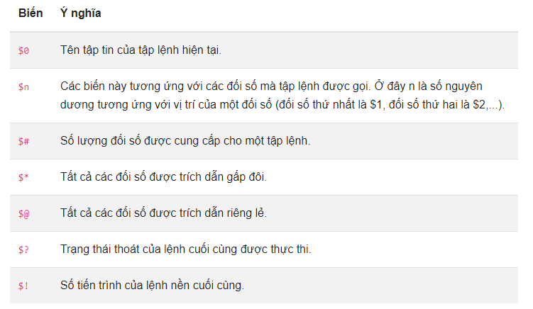

# Tìm hiểu về lập trình Shell(Bash Script) 

## 1. Khái niệm cơ bản về Bash Script:

- Trong những ngày đầu, máy tính chỉ hiểu được ngôn ngữ nhị phân, đó là điều khó khăn đối với người dùng và cả những nhà phát triển.

    Theo nhu cầu đó, một chương trình đặc biệt ra đời, nó được gọi là Shell. Shell chấp nhận các câu lệnh tiếng Anh, theo một cú pháp cho trước và chuyển nó đển Kernel để xử lý tiếp, sau đó trả lại kết quả cho người dùng.

    Shell là chương trình để tương tác giữa người dùng và máy tính. Thông dịch các lệnh của người dùng nhập vào hoặc từ các file.

    Shell không phải là một phần của hạt nhân hệ thống, nhưng nó dùng hạn nhân để thực thi các chương trình, tạo ra các tập tin…

- Các loại Shell Script:

    Một số Shell có sẵn trên Linux:

    - BASH ( Bourne-Again SHell ) phát triển bởi Brian Fox và Chet Ramey. Đây là Shell thông dụng nhất trên Linux.
    - CSH (C SHell) phát triển bởi Bill Joy tại University of California (dành cho BSD). Sử dụng cấu trúc lệnh giống C, rất thân thiện cho các lập trình viên C trên linux.
    - KSH (Korn SHell) phát triển bởi David Korn tại AT & T Bell Labs.
    - TCSH
    
    Để xem hệ thống của bạn hỗ trợ những loại shell nào, có thể dùng lệnh` #cat /etc/shells`. Mỗi loại shell có cú pháp, cách dùng khác nhau, cung cấp cho bạn các chức năng khác nhau.

- Trong MS-DOS, Shell là được cọi là COMMAND.COM, cũng được sử dụng cho mục đích tương tự, nhưng không mạnh mẽ bằng Shell Linux.

    Tất cả các loại Shell phía trên đều đọc các lệnh người dùng nhập và đưa đến Linux OS để nói với OS rằng người dùng đang muốn gì. Các dòng lệnh được gọi là command line.

- Để xem system đang chạy shell gì, bạn có thể dùng lệnh `#echo $SHELL`

## 2. Các khái niệm cơ bản khi viết bash shell
 
- Các tập lệnh được lưu trữ dưới dạng các tập tin và chúng ta có thể đặt tên tùy ý cho tập lệnh shell. Nhưng điều quan trọng đầu tiên là nó cần bắt đầu với một `shebang` ngay dòng đầu tiên:

  ```sh
    #!/bin/bash
  ```

- Tiếp theo thì nó phải là một tập tin thực thi. Để có thể phân quyền cho tập tin là thực thi thì chúng ta sử dụng lệnh chmod:
  ```sh
    chmod u+x [name_file_script]
  ```

  Lệnh trên giúp cho tập tin script có thể thực thi được cho người dùng của bạn.

- Bạn có thể thực thi tập lệnh nếu bạn đang ở trong cùng một thư mục bằng cách gọi nó `./name_file_scipt` hoặc sử dụng đường dẫn đầy đủ đến nó.

  Ngoài cách thực thi trên chúng ta có thể sử dụng lệnh bash để thực thi cú pháp như sau:

    ```sh
        bash duong-dan-file-script
    ```

### Sử dụng tính năng chú thích trong bash shell

- Chú thích là một trong những điều quan trọng nhất khi viết chương trình. Một dòng bắt đầu bằng ký tự # là một chú thích (ngoại trừ dòng shebang ở trên).

  ```sh
    #!/bin/bash
    # this is a comment
  ```

- Một chú thích cũng có thể bắt đầu ở cuối dòng:

  ```sh
    #!/bin/bash
    echo myscript # this is a comment
  ```

### Biến và toán tử trong bash shell

- Chúng ta có thể đặt biến bằng cách sử dụng toán tử `=` với cú pháp như sau:
  ```sh
    name=value
  ```
  Ví dụ:
  ```sh
    NUMBER=1999
    name=blogd.net
  ```

- Sau khi đặt biến chúng ta có thể in một biến bằng cách sử dụng lệnh echo và thêm một ký tự $ tiếp theo là tên biến:
  ```sh
    echo $NUMBER
    echo $name
  ```

- Bash shell sử dụng một số toán tử số học thường được dùng trên các ngôn ngữ lập trình:
 
    `+`	Cộng vào  
    `-`	Trừ ra  
    `*`	Nhân  
    `/`	Chia  
    `%`	Phép chia lấy phần dư  
    `**` Tính luỹ thừa  
    `=`	Gán giá trị  

- Chúng ta có thể so sánh các giá trị bằng cách sau:

    `<` hoặc `-lt`  : Bé hơn  
    `<=` hoặc `-le` : Bé hơn bằng  
    `>` hoặc `-gt`	: Lớn hơn  
    `>=` hoặc `-ge`	: Lớn hơn bằng  
    `==` hoặc `-eq`	: Bằng nhau  
    `-ne`           : Không bằng

  Ví dụ sử dụng so sánh giá trị trong bash shell:
  ```sh
    #!/bin/bash
    age=23
    min_age=18
    if test $age -lt $min_age
        then
            echo "Not old enough"
    fi
  ```
- Toán tử logic:
  ```sh
    && logic và
    || logic hoặc
  ```

### Các biến đặc biệt trong Linux. Các biến này được dành riêng cho các chức năng cụ thể.

- Ký tự $ đại diện cho số ID tiến trình, hoặc PID.
  ```sh
     echo $$
    2119
  ```

  Bảng sau đây thống kê một số biến đặc biệt mà bạn có thể sử dụng trong lập trình bash shell:

    

**Ví dụ 1:** Sử dụng các biến đặc biệt như `$0`, `$n`, `$#`, `$@`, `$*`:  

  ```sh
    vi tesh.sh
    #!/bin/sh
    echo "Ten file hien tai: $0"
    echo "Doi so 1: $1"
    echo "Doi so 2: $2"
    echo "Doi so 3: $3"
    echo "Tong cac doi so: $#"
    echo "Tat ca doi so duoc trich dan: $@"
    echo "Tat ca doi so duoc trich dan: $*"
  ```

  Chạy tập tin bash chúng ta được kết quả như sau:

  ```sh
    #./tesh.sh https:// news .cloud365.vn/
    Ten file hien tai: ./tesh.sh
    Doi so 1: https://
    Doi so 2: news
    Doi so 3: .cloud365.vn/
    Tong cac doi so: 3
    Tat ca doi so duoc trich dan: https:// news .cloud365.vn/
    Tat ca doi so duoc trich dan: https:// news .cloud365.vn/
  ```

**Ví dụ 2:** Kết hợp tham số đặc biệt `#@` và `#*` với dòng lặp for như sau:

  ```sh
  vi test_2.sh
  #!/bin/sh
  #Su dung bien dac biet $*
  for a in $*
  do
    echo $a
  done
  #Su dung bien dac biet $@
  for a in $@
  do
    echo $a
  done
  ```

  Chạy tập lệnh shell chúng ta được kết quả như bên dưới:
  ```sh
    #./test_2.sh https:// news .cloud365.vn/
    https://
    news
    .cloud365.vn/
    https://
    news
    .cloud365.vn/
  ```

**Ví dụ 3:** Trạng thái thoát của lệnh cuối cùng được thực thi:

```sh
#vi exit.sh
#!/bin/sh
echo "Trang thai thoat cua lenh cuoi cung duoc thuc thi: $?"
```

Chạy tệp với lệnh bash:

```sh
#bash exit.sh
Trang thai thoat cua lenh cuoi cung duoc thuc thi: 0
```

>Theo mặc định thì hầu hết các lệnh được thực hiện thành công thì trả về một trạng thái thoát là 0 và 1 nếu chúng không thành công.

## 3. Sử dụng bash shell
### 3.1. Sử dụng bash shell in ra màn hình
- Ví dụ 1 câu lệnh bash đơn giản
  ```sh
  #echo "test"
  test
  ```

- Khi chúng ta cần thực hiện in ra màn hình nhiều đầu ra và thực hiện thường xuyên thì việc gõ lệnh trên bash rất tốn thời gian vì vậy chúng ta sẽ tạo một bash shell in ra màn hình, khi cần chúng ta chỉ cần chạy file bash shell đó. Các bước như sau: 

  - Tạo 1 file bash script với tên "test.sh" và thêm vào nội dung
    ```sh
      #vi test.sh
      #!/bin/bash
      echo "test"
      echo test
      echo news.cloud365.vn
    ```
  - Chạy tập tin bash bằng 2 cách sau:
    - Sử dụng câu lệnh `bash`

      ```sh
        bash test.sh
      ```

    - Chạy tập tin bash bằng cách thiết lập quyền thực thi đối với tập tin bash và chạy tập tin:
      ```sh
        chmod +x test.sh
        # ./test.sh
      test
      test
      news.cloud365.vn
      ```

**Ví dụ 1:** Sử dụng chú thích trong bash shell biểu tượng # được sử dụng để thêm chú thích dòng đơn trong tập lệnh bash. Tạo một tập tin mới có tên comment.sh và thêm tập lệnh sau với nhận xét dòng đơn.

```sh
# vi comment.sh
#!/bin/bash
# Tinh tong gia tri cua hai so 55 va 75
((Tong=55+75))
#In ket qua
echo Tong la: $Tong
```

Chạy tập tin với lệnh bash
```sh
#bash comment.sh
Tong la: 130
```  

**Ví dụ 2:** Sử dụng chú thích nhiều dòng trong bash theo nhiều cách khác nhau. Tạo một bash mới có tên comments.sh và thêm tập lệnh sau. Ở đây biểu tượng `:` và `'` được sử dụng để thêm chú thích nhiều dòng trong bash shell.

```sh
#vi comment.sh
#!/bin/bash
: '
Vi du sau se tinh
gia tri binh phuong cua so 5.
'
((area=5*5))
echo Ket qua: $area
```
Chạy tập tin với lệnh `bash`

```sh
bash comment.sh
Ket qua: 25
```

**Ví dụ 3:** Bash sử dụng lệnh mkdir để tạo một thư mục mới.  

```sh
vi folder.sh
#!/bin/bash
echo "Nhap ten thu muc can tao"
read ten
`mkdir $ten`
```

Chạy tệp bằng lệnh bash
```sh
# bash folder.sh
Nhap ten thu muc can tao
test
```

### 3.2. Sử dụng cấu trúc điều kiện trong bash shell
- Chúng ta có thể sử dụng cấu trúc điều kiện với một hoặc nhiều điều kiện. Trong đó cấu trúc điều kiện bắt đầu bằng `if` và kết thúc bằng `fi`.

- Một số cú pháp thường dùng của cấu trúc điều kiện:

  - Câu lệnh if đơn cú pháp như sau:

    ```sh
    if condition
    then
        command
    fi
    ```

  - Câu lệnh if sau đó else:
    ```sh
    if condition
    then
        command
    else
        anothercommand
    fi
    ```

  - Lồng if và theo sau đó là else:

    ```sh
    if condition
    then
        command
    elif
        anothercommand
    else
        yetanothercommand
    fi
    ```

**Ví dụ 1:** Tạo file có tên `if.sh` 
. Chúng ta gán biến n bằng 20 và thực hiện điều kiện so sánh nếu $n bé hơn 10 in kết quả ra màn hình số có một chữ số và ngược lại in ra màn hình số có hai chữ số:

```sh
  #vi if.sh
#!/bin/bash
n=20
if [ $n < 10 ];
then
echo "So co mot chu so"
else
echo "So co hai chu so"
fi
```

Chạy tệp với lệnh bash
```sh
    #bash if.sh
  So co hai chu so
```

**Ví dụ 2:** Sử dụng câu lệnh if với logic AND:

>Chúng ta có thể xác định nhiều điều kiện trong câu lệnh if bằng logic AND (&&). Tạo một tệp có tên if_and.sh giá trị của các biến tên người dùng và mật khẩu sẽ được nhập vào và so sánh với username va password trong if. Nếu cả hai giá trị khớp nhau thì đầu ra sẽ là người dùng hợp lệ , nếu không, đầu ra sẽ là người dùng không hợp lệ .

```sh
  # vi if_and.sh
#!/bin/bash
echo "Nhap ten nguoi dung:"
read username
echo "Nhap mat khau"
read password

if [[ ( $username == "admin" && $password == "admin" ) ]]; then
echo "Nguoi dung hop le"
else
echo "Nguoi dung khong hop le"
fi
```

Chạy tệp với lệnh bash

```sh
  
  # bash if_and.sh
Nhap ten nguoi dung:
thuyhien
Nhap mat khau
123@123
Nguoi dung khong hop le
```

**Ví dụ 3:** Sử dụng câu lệnh `if` với logic `OR(||)`

>Tạo một file có tên `if_or.sh` và giá trị của n sẽ được nhập từ người dùng. Nếu giá trị bằng 150 hoặc 400 thì đầu ra sẽ là bạn đã nhập đúng, ngược lại thì trả về kết quả bạn nhập sai.

```sh
  # vi if_or.sh
#!/bin/bash
echo "Nhap gia tri vao:"
read n

if [[ ( $n == 150 || $n == 400 ) ]]
then
echo "Ban da nhap dung"
else
echo "Ban da nhap sai"
fi
```

Chạy tập lệnh với bash
```sh
~]# bash if_or.sh
Nhap gia tri vao:
10
Ban da nhap sai
```

**Ví dụ 4:** Nếu bạn muốn kiểm tra sự tồn tại của thư mục trong vị trí hiện tại trước khi thực hiện lệnh `mkdir` thì có thể sử dụng tùy chọn `-d` để kiểm tra một thư mục cụ thể có tồn tại hay không như sau:

```sh
  #vi folder.sh
#!/bin/bash
echo "Nhap ten thu muc can tao: "
read name
if [ -d "$name" ]
then
echo "Ten thu muc da ton tai"
else
`mkdir $name`
echo "Tao thu muc thanh cong"
fi
```

Chạy tệp lệnh bằng lệnh bash
```
  # bash folder.sh
Nhap ten thu muc can tao:
mk
Tao thu muc thanh cong
```

### 3.3. Sử dụng cấu trúc vòng lặp trong bash shell
- Một số cú pháp cấu trúc vòng lặp thường được sử dụng:
  - Vòng lặp while
    ```sh
    while condition
    do
        command
    done
    ```

  - Vòng lặp until
    ```sh
    until condition
    do
        command
    done
    ```

  - Vòng lặp for: Lặp lại một danh sách và thực hiện một lệnh cho mỗi lần lặp
    ```sh
    for item in list
    do
        command
    done
    ```

  Trong các vòng lặp, chúng ta có thể sử dụng các câu lệnh break hay continue để phá vỡ vòng lặp hoặc chỉ cần bỏ qua bước lặp hiện tại.

**Ví dụ 1:** Sử dụng vòng lặp for

>Tạo một tệp có tên for.sh và thêm tập lệnh sau bằng vòng lặp for. Ở đây, vòng lặp for sẽ lặp lại trong 5 lần và in tất cả các giá trị của biến, bộ đếm trong một dòng.

```sh
  # vi for.sh
#!/bin/bash
for ((n=5; n>0; n--))
do
echo -n "$n  "
done
printf "\n"
```

Chạy tệp lệnh bằng lệnh bash

```sh
# bash for.sh
5  4  3  2  1
```

**Ví dụ 2:** Sử dụng vòng lặp while

>Tạo một tệp có tên `while.sh` và thêm tập lệnh sau bằng vòng lặp while. Ở đây, vòng lặp while sẽ in tất cả các số từ 1 đến 5.

```sh
#!/bin/sh
a=1
while [ $a -le 5 ]
do
   echo $a
   a=`expr $a + 1`
done
```

Chạy lệnh bằng câu lệnh bash

```sh
# bash while.sh
1
2
3
4
5
```

**Ví dụ 3:** Sử dụng vòng lặp until

>Tạo một tệp có tên `until.sh` và thêm tập lệnh sau bằng vòng lặp until. Ở đây, vòng lặp until sẽ in tất cả các số từ 10 đến 15.

```sh
  # vi until.sh
#!/bin/sh
a=10
until [ ! $a -le 15 ]
do
   echo $a
   a=`expr $a + 1`
done
```

Chạy tệp lệnh bằng lệnh bash

```sh
# bash until.sh
10
11
12
13
14
15
```

### 3.4. Cấu trúc case trong bash shell
Cấu trúc của case nó được bắt đầu bằng case và kết thúc bằng esac cho phép chúng ta chọn các tuyến khác nhau tùy thuộc vào một giá trị có cú pháp như sau:

```sh
case value in
  a)
    command
    #...
    ;;
  b)
    command
    #...
    ;;
esac
```

Chúng ta cần thêm một dấu chấm phẩy kép (;;) sau mỗi trường hợp.

**Ví dụ:** Tạo một tệp mới có tên `case.sh` và thêm tập lệnh sau. Đầu ra của tập lệnh sau sẽ giống với tập lệnh trong ví dụ:

```sh
  # vim case.sh
#!/bin/bash
echo "Nhap gia tri n:"
read n
case $n in
10|15)
echo "Ban doan dung so n thu nhat" ;;
119)
echo "Ban doan dung so n thu hai" ;;
389)
echo "Ban doan dung so n thu ba" ;;
*)
echo "Thu lai lan tiep theo" ;;
esac
```

Chạy tệp lệnh với câu lệnh bash

```sh
  # bash case.sh
Nhap gia tri n:
79
Thu lai lan tiep theo
  # bash case.sh
Nhap gia tri n:
119
Ban doan dung so n thu hai
```

### 3.5. Cú pháp lựa chọn trong bash shell
- Cấu trúc `select` sẽ hiển thị cho người dùng một menu các lựa chọn để người dùng có thể lựa 

  ```sh
    select item in list
    do
        command
    done
  ```

**Ví dụ:** Tạo tập tin select.sh và tạo các tùy chọn như sau:

```sh
#!/bin/bash
select n in "di bien" "an uong" "di nui" "xem phim" "the thao"
do
  if [ "$n" == "" ]; then
    echo "Ban hay chon mot";
  else
    break
  fi
done
echo "So thich cua ban $n"
```

Chạy tệp lệnh với lệnh bash
```sh
# bash select.sh
1) di bien
2) an uong
3) di nui
4) xem phim
5) the thao
#? 1
So thich cua ban di bien
```

### 3.6 Làm việc với các chuỗi
Cho một chuỗi:

```sh
strings="thuyhiend.com"
```

Chúng ta có thể lấy chiều dài của chuỗi bằng cách sử dụng ${#strings}. Luôn sử dụng dấu ngoặc kép quanh các chuỗi, khi chúng ta làm việc với nó để tránh bash diễn giải các ký tự đặc biệt bên trong chúng.

Ngoài ra bạn có thể so sánh 2 chuỗi bằng cách sử dụng toán tử = hoặc ==:

```sh
"$strings" = "$anotherstrings" "$strings" == "$anotherstrings"
```

Bạn cũng có thể kiểm tra sự khác nhau giữa hai chuỗi:

```sh
"$strings" != "$anotherstrings"
```

**Ví dụ:** Kết hợp các biến chuỗi trong bash. Tạo một tập tin có tên `string.sh` và thêm đoạn mã sau để có thể kết hợp các biến chuỗi trong bash sử dụng toán tử `+` hoặc in các biến với nhau như sau:

```sh
  # vim string.sh
#!/bin/bash
string1="Centos"
string2="7"
echo "$string1$string2"
string3=$string1+$string2
string3+=" thuyhiend.com"
echo $string3
```

Chạy tệp lệnh với câu lệnh bash

```sh
# bash string.sh
Centos7
Centos+7 thuyhiend.com
```

### 3.7. Sử dụng mảng
Mảng là một danh sách các mục, được khai báo bên trong dấu ngoặc đơn như sau:

```sh
a=("di bien" "an uong" "di nui" "xem phim" "the thao")
```

Bạn có thể tham chiếu bất kỳ mục nào trong một mảng bằng dấu ngoặc vuông:

```sh
a[0]
a[1]
```

Bạn có thể nhận được tổng số mục trong một mảng bằng cú pháp này:

```sh
${#a[@]}
```

### 3.8. Sử dụng function
Cũng giống như javascript hay ngôn ngữ lập trình nào khác, chúng ta có thể tạo ra các đoạn mã nhỏ để có thể sử dụng lại khi cần thiết, bằng cách đặt tên cho chúng và gọi chúng khi cần.

Cú pháp của một hàm như sau:

```sh
function name {

}
```
Trong đó `name` là tên chúng ta cần đặt cho hàm, và là tên để chúng ta gọi khi cần thiết.

**Ví dụ 1:** Tạo một hàm đơn giản và gọi hàm được hiển thị trong đoạn script sau. Tạo một tập tin có tên `function.sh` và thêm đoạn mã sau. Bạn có thể gọi bất kỳ chức năng nào bằng tên mà không sử dụng bất kỳ dấu ngoặc nào trong tập lệnh bash.

```sh
#!/bin/bash
function test1(){
echo "Toi rat thich news.cloud365.vn"
}
test1
```

Chạy tệp lệnh với lệnh bash
```sh
# bash function.sh
Toi rat thich news.cloud365.vn
```

**Ví dụ 2:** Bash không thể khai báo tham số tại thời điểm khai báo hàm. Nhưng chúng ta có thể sử dụng các tham số trong hàm bằng cách sử dụng biến khác. Tạo một tập tin có tên function.sh và thêm đoạn mã sau tính diện tích hình chữ nhật:

```sh
  # vim function_parameter.sh
#!/bin/bash
Tinh_s() {
area=$(($1*$2))
echo "Dien tich la : $area"
}
Tinh_s 30 20
```

Chạy tệp lệnh bằng lệnh bash

```sh
# bash function_parameter.sh
Dien tich la : 600
```


