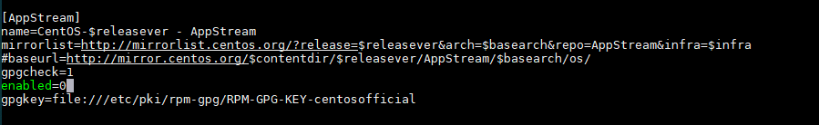
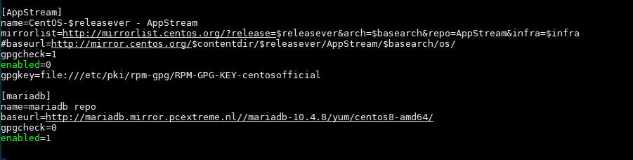
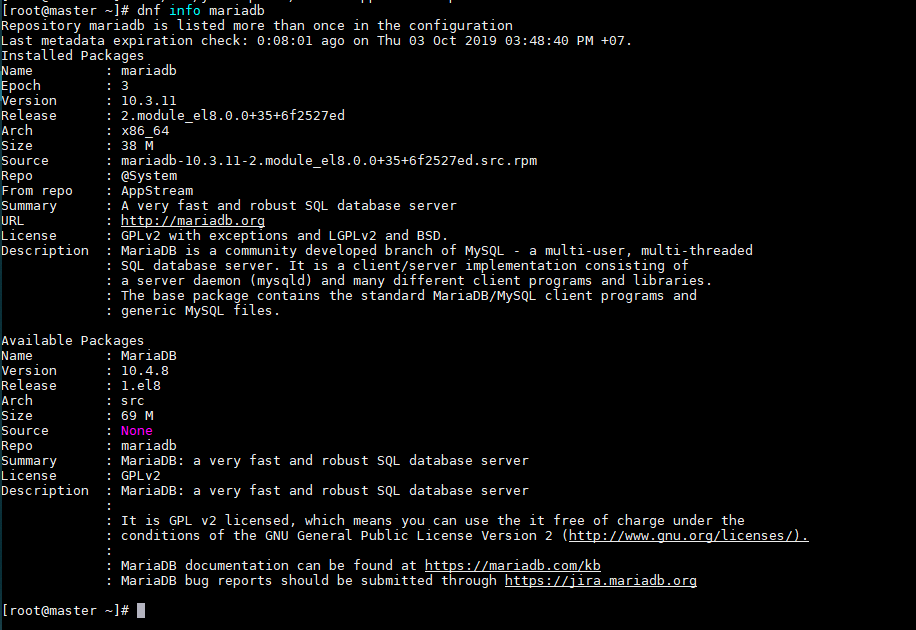

# Cài đặt MariaDB trên CentOS 8  

- Cài đặt qua repo mặc định trên hệ điều hành

  ```sh
    # yum install -y mariadb-server mariadb
  ```

  - Start dịch vụ MariaDB Server

    ```sh
      # systemctl start mariadb
    ```

  - Cho phép dịch vụ MariaDB khởi động cùng hệ điều hành

    ```sh
      # systemctl enable mariadb
    ```

  - Kiểm tra trạng thái dịch vụ MariaDB Server

    ```sh
      # systemctl status mariadb
    ```  

- Cài đặt qua mirror chính thức của MariaDB  

  - Cài đặt gói `boost-program-options`

    ```sh
      # yum install -y boost-program-options
    ```

  - Vào chỉn sửa file `/etc/yum.repos.d/Centos-AppStream.repo`  

    - Chỉnh sửa trạng thái của repo AppStream từ `enable=1` thành `enable=0`(disable)

      

    - Thêm vào file các dòng sau để cài đặt MariaDB 10.4.8  

      ```sh
        [mariadb]
        name=mariadb repo
        baseurl=http://mariadb.mirror.pcextreme.nl//mariadb-10.4.8/yum/centos8-amd64/
        gpgcheck=0
        enabled=1
      ```

        

    - Lưu và thoát file  

  - Kiểm tra thông tin của MariaDB 10.4.8 trên hệ điều hành đã sẵn sàng để cài đặt chưa

    ```sh
      # dnf info mariadb
    ```

    OUTPUT

      

  - Gỡ cài đặt MariaDB 10.3.11(ver mặc định của MariaDB trên Cen8)  

    ```sh
      # dnf erase mariadb
      # rm -rf /var/lib/mysql
    ```

  - Cài đặt MariaDB v10.4.8

    ```sh
      # yum install -y MariaDB
    ```

  - Kiểm tra version của MariaDB

    ```sh
      # mysql -V
    ```

    OUTPUT

    ```sh
    mysql  Ver 15.1 Distrib 10.4.8-MariaDB, for Linux (x86_64) using readline 5.1
    ```

    
