# Hướng dẫn cấu hình static IP trên CentOS 8.x  


## Giới thiệu  
  Các tập lệnh `network` không được sử dụng trên CentOS 8. Thay vào đó bạn sẽ sử dụng `NetworkManager` cùng với câu lệnh `nmcli` để thực hiện các thao tác với network. `nmcli` là phiên bản mới của tập lệnh `ifup` và `ifdown`.  

## Start/Stop/Restart NetworkManager?
- Sử dụng các câu lệnh:  
  ```sh
    # systemctl start NetworkManager
    # systemctl stop NetworkManager
    # systemctl restart NetworkManager
    # systemctl status NetworkManager
  ```

  <p align="center">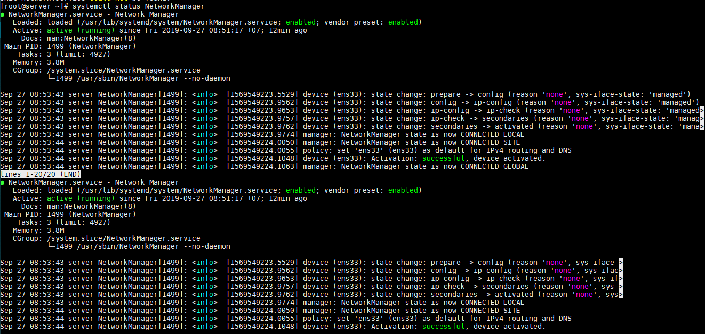</p>

## Liệt kê các interface trên CentOS 8
- Sử dụng `ip command`  

  ```sh
    # ip  a
  ```

  Sample outputs:

  <p align="center">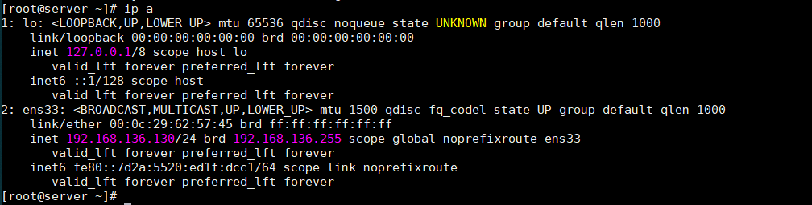</p>

- Sử dụng câu lệnh `nmcli`  

  ```sh
    # nmcli device
    # nmcli device show ens33
  ```

  <p align="center">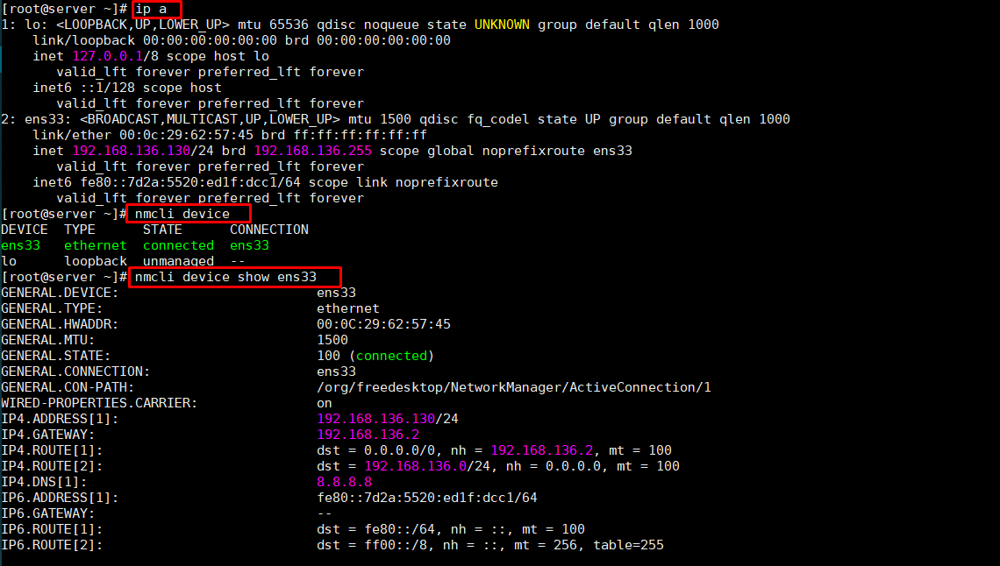</p>  

- Xem các kết nối NetworkManager  
  ```sh
    # nmcli connection
  ```  

  Sample outputs:

  <p align="center">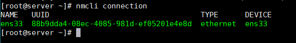</p>

- Dưới đây là cấu hình DHCP điển hình cho tệp ens33 (được lưu trữ trong tệp `/etc/sysconfig/network-scripts/ ifcfg-ens33`): 

  ```sh
    # cat /etc/sysconfig/network-scripts/ifcfg-ens33
  ```  

  Sample outputs:

  ```sh
    TYPE=Ethernet
    PROXY_METHOD=none
    BROWSER_ONLY=no
    BOOTPROTO="dhcp"
    DEFROUTE=yes
    IPV4_FAILURE_FATAL=no
    IPV6INIT=yes
    IPV6_AUTOCONF=yes
    IPV6_DEFROUTE=yes
    IPV6_FAILURE_FATAL=no
    IPV6_ADDR_GEN_MODE=stable-privacy
    NAME=ens33
    UUID=88b9dda4-08ec-4085-981d-ef05201e4e8d
    DEVICE=ens33
  ```

## Cấu hình Static IP với ethernet ens33  
### Cách 1: Sử dụng câu lệnh `nmcli`  
- Đặt địa chỉ IPv4
  ```sh
    # nmcli connection modify ens33 ipv4.address 192.168.136.100/24
  hoặc  
    # nmcli con mod ens33 ipv4.address 192.168.136.100/24
  ```

- Đặt địa chỉ Gateway và DNS
  ```sh
    # nmcli connection modify ens33 ipv4.gateway 192.168.136.2
    # nmcli connection modify ens33 ipv4.dns 8.8.8.8
  ```

- Đặt manual(thủ công) cho cài đặt static(đặt `auto` với cài đặt DHCP)  
  ```sh
    # nmcli connection modify ens33 ipv4.method manual
  ```

- Khởi động lại giao diện để xác nhận cài đặt mới
  ```sh
    # nmcli connection down ens33
    # nmcli connection up ens33
  ```

- Xem tập tin cấu hình đã được cập nhật:  
  ```sh
    # cat /etc/sysconfig/network-scripts/ifcfg-ens33
  ```  

  Sample outputs:

  <p align="center">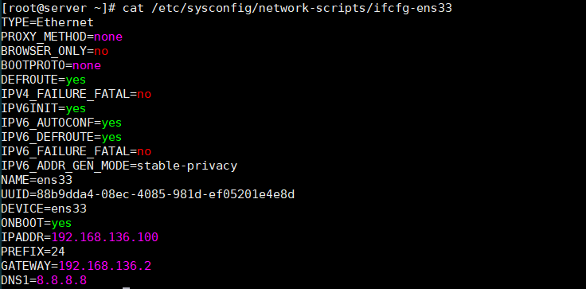  

> Nếu sử dụng vi/vim chỉnh sửa `/etc/sysconfig/network-scripts/ifcfg-ens3` file thì bạn phải sử dụng các câu lệnh dưới đây để cập nhật lại file cấu hình:  
>  ```sh
>    # nmcli connection reload ## reload all connections ##
>    # nmcli con load /etc/sysconfig/network-scripts/ifcfg-ens3 ## reload only ens3 by config file ##
>    # nmcli con up ens3 ## reload by connection name ##
>  ```

- Xác nhận lại cấu hình với các câu lệnh: 
  ```sh
    # ip a
    # ip a show ens33
    # ping -c 3 8.8.8.8
  ```

  <p align="center">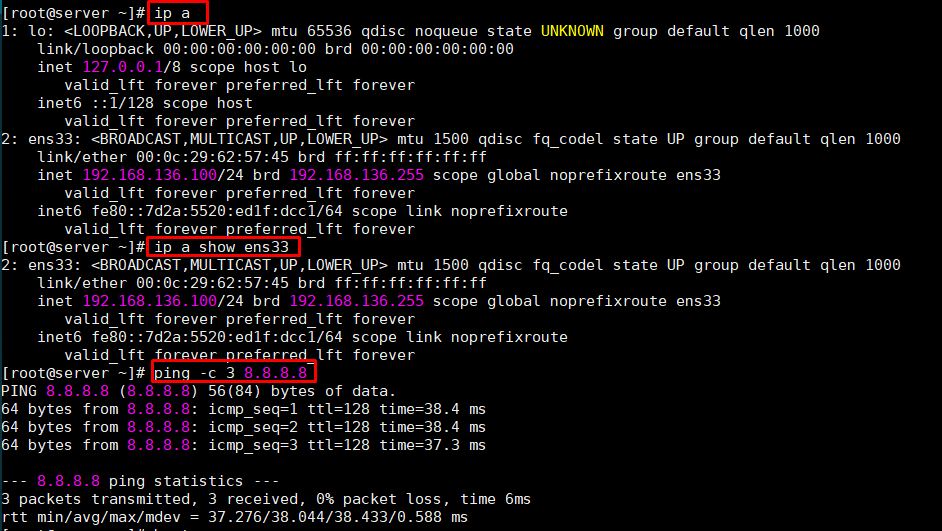</p>


### Cách 2: Sử dụng `nmtui`  
- Sử dụng câu lệnh:  
  ```sh
    # nmtui
  ```

  <p align="center">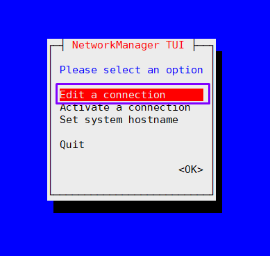</p>   

  <p align="center">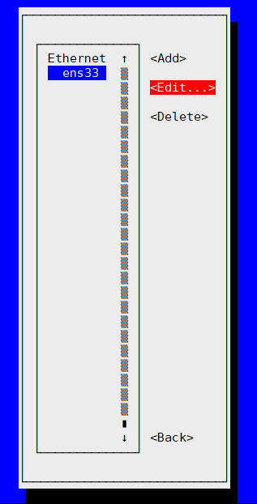</p> 

  <p align="center">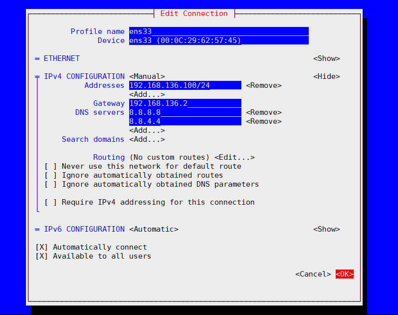</p> 

  <p align="center">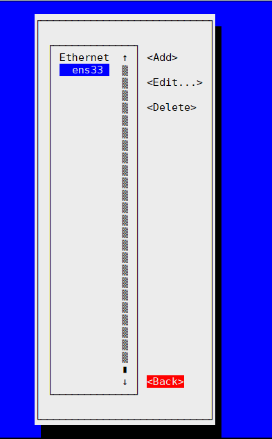</p> 

  <p align="center">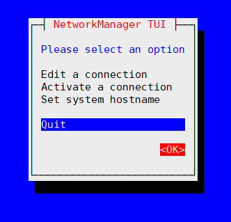</p> 

## TÀI LIỆU THAM KHẢO
- https://www.cyberciti.biz/faq/how-to-configure-a-static-ip-address-on-rhel-8/
- https://www.server-world.info/en/note?os=CentOS_8&p=initial_conf&f=3