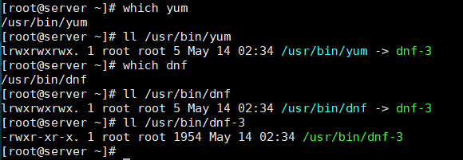
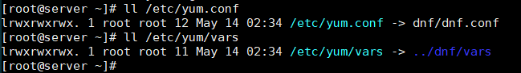

# Update System

- CentOS 8 sử dụng trình quản lý gói `dnf` (Dandified Packaging Tool) làm trình quản lý gói mặc định.  
- Lệnh `yum` được sử dụng như là một liên kết dẫn tới `dnf` do đó chúng ta có thể sử dụng cả `yum` và `dnf`
- `yum` và `dnf` được liên kết tới câu lệnh `dnf-3`  

  <p align="center"></p>  


  - Trình quản lý gói `yum` đã được cài đặt  

    ```sh
      # rpm -q yum
    yum-4.0.9.2-5.el8.noarch
    ```

    ```sh
    # rpm -ql yum
    /etc/yum.conf
    /etc/yum/pluginconf.d
    /etc/yum/protected.d
    /etc/yum/vars   
    /usr/bin/yum
    /usr/share/man/man1/yum-aliases.1.gz
    /usr/share/man/man5/yum.conf.5.gz
    /usr/share/man/man8/yum-shell.8.gz
    /usr/share/man/man8/yum.8.gz
    ```

  - Các file được liên kết đến `dnf`  

    <p align="center"></p>

- Sau khi CentOS Server được đặt giống như hệ thống sản xuất, có thể rất khó để update system, nhưng ít nhất là sau khi cài đặt, bạn có thể cập nhật CentOS Server mới nhất.
  ```sh
    # dnf -y upgrade
  ```