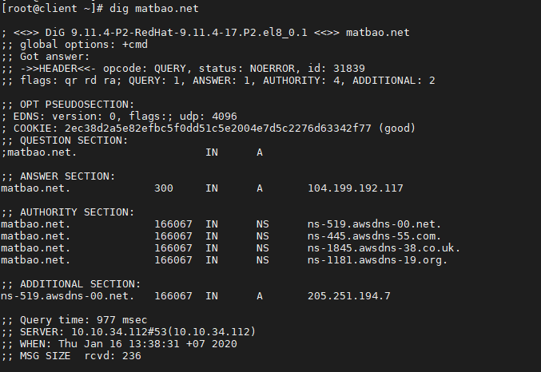
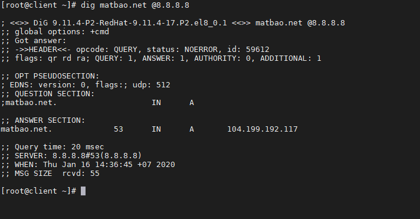
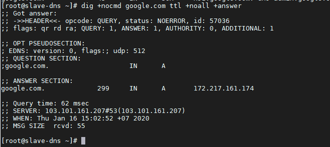
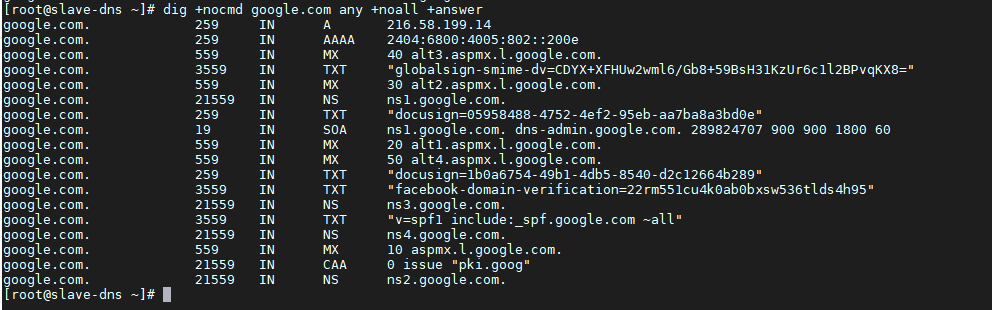
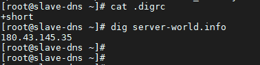

# DIG - Domain Information Groper  

  

- DNS là viết tắt của Domain Information Groper là một công cụ dòng lệnh quản trị mạng được dùng để truy vấn DNS name servers. Với lệnh `dig`, bạn có thể truy vấn thông tin về các bản ghi DNS, bao gồm: host addresses, mail exchanges, và name servers. Đây là công cụ được các quản trị viên hệ thống sử dụng phổ biến nhất để khắc phục sự cố DNS vì tính linh hoạt và dễ sử dụng của nó.   `dig` là một phần của bộ phần mềm BIND DNS. Câu lệnh `dig` thay thế công cụ  là `nslookup` và host. 

## Cài đặt Dig trên Linux
- Trên Ubuntu:
  ```sh
    apt-get install dnsutils
  ```

- Trên CentOS 7
  ```sh
    yum install bind-utils
  ```

- Trên CentOS 8:
  ```sh
    dnf install bind-utils
  ```

- Sau khi cài đặt xong, kiểm tra version của `dig`:

  ```sh
    dig -v
  ```

  OUTPUT CentOS 8:

  ```sh
  DiG 9.11.4-P2-RedHat-9.11.4-17.P2.el8_0.1
  ```

Nếu `dig` chưa được cài đặt vào hệ thống, output sẽ có dạng: `"dig: command not found"`. Bạn 

## Cú pháp

- Ở dạng đơn giản nhất, cú pháp của câu lệnh `dig` sẽ có dạng:

  ```sh
    dig [server] [name] [type]
  ```

  Trong đó:
  - `[server]` - địa chỉ IP hoặc hostname của name server sẽ dùng để thực hiện triu vấn.  
    - Nếu bạn cung cấp cho đối số server thông tin về 
hostname thì nó sẽ giải quyết hostname trước khi tiếp tục truy vấn name server. 
    - Đây là tùy chọn nên bạn cũng có thể không khai báo ở đây, trong trường hợp không khai báo thì `dig` sẽ lấy thông tin này trong file `/etc/resolv.conf`.  
  - `[name]` - tên của bản ghi resource sẽ được truy vấn.  
  - `[type]` - loại truy vấn được yêu cầu bởi dig. Nó có thể là 1 trong số các bản ghi: A, MX, SOA,...Nếu không có bản ghi nào được chỉ định thì dig sẽ mặc định đó là bản ghi A.  

## Cách sử dụng câu lệnh `dig`  

- Thực hiện tra cứu DNS cho một tên miền, thực hiện câu lệnh:
  ```sh
    dig wiki.matbao.net
  ```

  OUTPUT

    

  Giải thích output của câu lệnh `dig`  

  - Dòng đầu tiên của đầu ra hiển thị version đã cài đặt và truy vấn được gọi. Dòng thứ hai hiển thị các tùy chọn(theo mặc định chỉ cmd).

    ```sh
    ; <<>> DiG 9.11.4-P2-RedHat-9.11.4-17.P2.el8_0.1 <<>> matbao.net
    ;; global options: +cmd 
    ```  

    Nếu bạn không muốn những dòng này xuất hiện ở output, có thể sử dụng tùy chọn `+nocmd` ở ngay sau câu lệnh `dig`

  - Phần tiếp thep, dòng đầu tiên của phần này là tiêu đề, bao gồm opcode và trạng thái của hành động. Trong trường hợp này, trạng thái NOERROR có nghĩa là yêu cầu truy vấn truy vấn DNS không gặp lỗi.

    ```sh
    ;; Got answer:
    ;; ->>HEADER<<- opcode: QUERY, status: NOERROR, id: 31839
    ;; flags: qr rd ra; QUERY: 1, ANSWER: 1, AUTHORITY: 4, ADDITIONAL: 2
    ```

    Bạn cũng có thể cho phép không hiển thị phần này ở output bằng cách sử dụng tùy chọn `+nocomments`, đồng thời nó cũng sẽ disable output của 1 vài phần header khác.  

  - Phần `"OPT"` được hiển thị theo mặc định chỉ trên các phiên bản mới hơn.

    ```sh
    ;; OPT PSEUDOSECTION:
    ; EDNS: version: 0, flags:; udp: 4096
    ```

  - Phần `"QUESTION"` là phần mà lệnh `dig` hiển thị truy vấn của chúng ta. Theo mặc định, dig sẽ yêu cầu bản ghi A.

    ```sh
    ;; QUESTION SECTION:
    ;matbao.net.                    IN      A
    ```  

    Bạn có thể disable output của phần này bằng cách sử dụng tùy chọn `+noquestion`  

  - Phần ANSWER cung cấp cho chúng ta tên miền matbao.net. trỏ đến địa chỉ IP 104.199.192.117

    ```sh
    ;; ANSWER SECTION:
    matbao.net.             300     IN      A       104.199.192.117
    ```

    Disable phần output này với tùy chọn `+noanswer` nếu bạn cần.

  - Phần `"AUTHORITY"` nói cho chúng ta biết những server nào là `authority` để trả lời truy vấn DNS về truy vấn tên miền.  

    ```sh
    ;; AUTHORITY SECTION:
    matbao.net.             166067  IN      NS      ns-519.awsdns-00.net.
    matbao.net.             166067  IN      NS      ns-445.awsdns-55.com.
    matbao.net.             166067  IN      NS      ns-1845.awsdns-38.co.uk.
    matbao.net.             166067  IN      NS      ns-1181.awsdns-19.org.
    ```  
    Disable nó bằng tùy chọn `+noauthority`  

  - Phần `"ADDITIONAL"` cho chúng ta thông tin về địa chỉ IP của các authoritative DNS server

    ```sh
    ;; ADDITIONAL SECTION:
    ns-519.awsdns-00.net.   166046  IN      A       205.251.194.7
    ```  

    Tùy chọn `+noadditional` sẽ giúp bạn disable phần này.

  - Phần cuối của OUTPUT bao gồm các số liệu đầu ra của truy vấn
    ```sh
    ;; Query time: 194 msec
    ;; SERVER: 10.10.34.112#53(10.10.34.112)
    ;; WHEN: Thu Jan 16 13:38:52 +07 2020
    ;; MSG SIZE  rcvd: 241
    ```

    Bạn có thể disable phần này với tùy chọn `+nostats`

## Sử dụng lệnh `dig` với các truy vấn ngắn  

### Truy vấn lấy địa chỉ IP  
- Sử dụng `dig` với tùy chọn `+short`

  ```sh
    # dig matbao.net +short
    104.199.192.117
  ```

  Kết quả trả về chỉ bao gồm địa chỉ IP của bản ghi A.

- Để có kết quả chi tiết hơn, bạn có thể sử dụng thêm 2 tùy chọn `+noall` và `+answer`

  ```sh
      # dig matbao.net +noall +answer

    ; <<>> DiG 9.11.4-P2-RedHat-9.11.4-17.P2.el8_0.1 <<>> matbao.net +noall +answer
    ;; global options: +cmd
    matbao.net.             300     IN      A       104.199.192.117
  ```
  Trong đó:
    - `+noall:` tắt tất cả các section
    - `+answer:` chỉ mở với secion `ANSWER`  

### Truy vấn với name server cụ thể
- Theo mặc định nếu khi sử dụng lệnh `dig` mà không chỉ rõ name server nào thì server sẽ sử dụng name server được khai báo trong file `/etc/resolv.conf`

- Để chỉ định name server mà truy vấn sẽ thực hiện, sử dụng biểu tượng `@` + địa chỉ IP/hostname  

  Ví dụ: Truy vấn name server Google có địa chỉ là 8.8.8.8 để lấy thông tin về tên miền `matbao.net`  

  ```sh
  # dig matbao.net @8.8.8.8
  ```
  OUTPUT

   

### Truy vấn theo bản ghi  
- Dig cho phép bạn thực hiện bất kỳ truy vấn hợp lệ nào bằng cách nối thêm loại bản ghi vào cuối truy vấn.

#### [1] Truy vấn bản ghi A  
- Để có danh sách địa chỉ cho 1 tên miền, sử dụng tùy chọn `a`

  ```sh
  # dig +nocmd matbao.net a +noall +answer
  ```
  OUTPUT
  ```sh
  matbao.net.             300     IN      A       104.199.192.117
  ```

  Tuy nhiên bạn cũng có cần sử dụng tùy chọn `a` vì theo mặc định nếu không có bản ghi nào được chọn, hệ thống sẽ mặc định truy vấn bản ghi A.

#### [2] Truy vấn bản ghi CNAME
- Sử dụng tùy chọn `cname`

  ```sh
  # dig +nocmd mail.google.com cname +noall +answer
  ```
  OUTPUT
  ```sh
  mail.google.com.        21501   IN      CNAME   googlemail.l.google.com.
  ```

#### [3] Truy vấn bản ghi TXT
- Sử dụng tùy chọn `txt`

  ```sh
  # dig +nocmd google.com txt +noall +answer
  ```
  OUTPUT
  ```sh
    google.com.             299     IN      TXT     "docusign=05958488-4752-4ef2-95eb-aa7ba8a3bd0e"
    google.com.             3599    IN      TXT     "globalsign-smime-dv=CDYX+XFHUw2wml6/Gb8+59BsH31KzUr6c1l2BPvqKX8="
    google.com.             3599    IN      TXT     "facebook-domain-verification=22rm551cu4k0ab0bxsw536tlds4h95"
    google.com.             3599    IN      TXT     "v=spf1 include:_spf.google.com ~all"
    google.com.             299     IN      TXT     "docusign=1b0a6754-49b1-4db5-8540-d2c12664b289"
  ```

#### [4] Truy vấn bản ghi MX  
- Sử dụng tùy chọn `mx`  

  ```sh
  # dig +nocmd google.com mx +noall +answer
  ```

  OUTPUT
  ```sh
    google.com.             599     IN      MX      10 aspmx.l.google.com.
    google.com.             599     IN      MX      20 alt1.aspmx.l.google.com.
    google.com.             599     IN      MX      40 alt3.aspmx.l.google.com.
    google.com.             599     IN      MX      50 alt4.aspmx.l.google.com.
    google.com.             599     IN      MX      30 alt2.aspmx.l.google.com.
  ```

#### [5] Truy vấn bản ghi NS
- Sử dụng tùy chọn `ns`  

  ```sh
  # dig +nocmd google.com ns +noall +answer
  ```
  OUTPUT
  ```
  google.com.             14951   IN      NS      ns1.google.com.
  google.com.             14951   IN      NS      ns3.google.com.
  google.com.             14951   IN      NS      ns4.google.com.
  google.com.             14951   IN      NS      ns2.google.com.
  ```

#### [6] Truy vấn bản ghi SOA
- Sử dụng tùy chọn `soa`

  ```sh
  # dig +nocmd google.com soa +noall +answer
  ```
  OUTPUT
  ```sh
  google.com.             43      IN      SOA     ns1.google.com. dns-admin.google.com. 289824707 900 900 1800 60
  ```

#### [7] Truy vấn bản ghi TTL
- Sử dụng tùy chọn `ttl`

  ```sh
  # dig +nocmd google.com ttl +noall +answer
  ```
  OUTPUT

    


#### [8] Truy vấn tất cả bản ghi  
- Sử dụng tùy chọn `any`

  ```sh
  dig +nocmd google.com any +noall +answer
  ```
  OUTPUT
  
    


#### [9] Tra cứu DNS ngược  
- Để truy vấn tên máy chủ được liên kết với một địa chỉ IP cụ thể, hãy sử dụng tùy chọn `-x`.

- Ví dụ: Tra cứu địa chỉ IP `103.15.50.222` thành tên miền

  ```sh
  dig -x 31.13.95.36 +noall +answer
  ```
  OUTPUT
  ```sh
    ; <<>> DiG 9.11.4-P2-RedHat-9.11.4-26.P2.el8 <<>> -x 31.13.95.36 +noall +answer
    ;; global options: +cmd
    36.95.13.31.in-addr.arpa. 1988  IN      PTR     edge-star-mini-shv-01-hkg3.facebook.com.
  ```

#### [10] Truy vấn số lượng lớn tên miền
- Nếu bạn muốn truy vấn một số lượng lớn tên miền, bạn có thể thêm chúng vào một tệp và sử dụng tùy chọn `-f` để truy vấn.

- Trong ví dụ dưới đây, chúng tôi sẽ sử dụng các tên miền được liệt kê trong file `domain.txt`  

    

#### [11] Truy vấn DNS bằng TCP
- Theo mặc định thì lệnh dig truy vấn DNS qua udp, để có thể dùng lệnh dig truy vấn DNS qua tcp chúng ta thực hiện như sau:

  ```sh
  dig +tcp [domain]
  ```

#### [12] Điều chỉnh mặc định với tệp `~/.digrc`
- Chúng ta có thể tạo tệp `.digrc` trong thư mục chính để bao gồm tùy chọn mà chúng ta muốn lệnh dig thực hiện. Chúng ta có thể chỉ định các tùy chọn khác nhau trong tệp `~/.digrc` sẽ luôn tự động chạy khi sử dụng lệnh dig.

- Trong ví dụ dưới đây, chúng ta thêm tùy chọn +short vào `~/.digrc` sau đó thực hiện lệnh dig:  

    


## TÀI LIỆU THAM KHẢO
- https://linuxize.com/post/how-to-use-dig-command-to-query-dns-in-linux/
- https://blogd.net/linux/cac-vi-du-ve-lenh-dig/
- https://www.hostinger.com/tutorials/how-to-use-the-dig-command-in-linux/