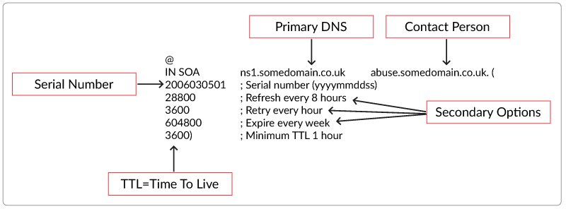
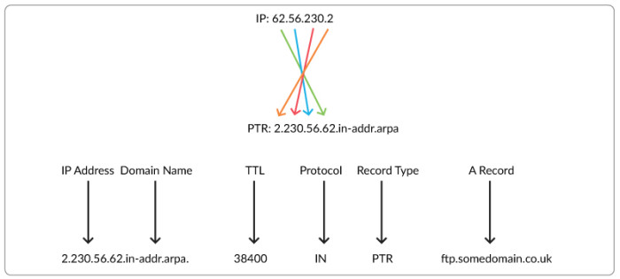

# Các loại bản ghi trên DNS  

## 1. SOA (Start of Authority)

- Thông thường, mỗi tên miền sẽ sử dụng 1 cặp DNS nào đó để trỏ về 1 hoặc nhiều máy chủ DNS, và ở đây, các máy chủ DNS có trách nhiệm cung cấp thông tin bản ghi DNS của hệ thống cho tên miền này để nó hoạt động. SOA được coi như dấu hiệu nhận biết của hệ thống về tên miền này. Một cấu trúc của bản ghi SOA thông thường sẽ bao gồm: 


  ```sh
    [tên miền] IN SOA [tên-server-dns] [địa-chỉ-email] (serial number;refresh number;retry number;experi number;time-to-live number)
  ```

  Ví dụ:  

  ```js
    $TTL 86400
  @       IN SOA  masterdns.hiennt.com.     admin.hiennt.com. (
                                  2014090401    ; serial
                                        3600    ; refresh
                                        1800    ; retry
                                      604800    ; expire
                                       86400 )  ; TTL
  ```

    
  
  Trong đó:

  - `masterdns.hiennt.com.` - giá trị DNS chính của tên miền hoặc máy chủ.
  - `admin.hiennt.com.` chuyển đổi từ dạng admin@hiennt.com, thể hiện chủ thể sở hữu tên miền này.
  - `Serial:` áp dụng cho mọi dữ liệu trong zone và có định dạng `YYYYMMDDNN` với `YYYY` là năm, `MM` là tháng, `DD` là ngày, `NN` là số lần sửa đổi dữ liệu zone trong ngày. Luôn luôn phải tăng số này lên mỗi lần sửa đổi dữ liệu zone. Khi Slave DNS Server liên lạc với Master DNS Server, trước tiên nó sẽ hỏi số serial. Nếu số serial của Slave nhỏ hơn số serial của máy Master tức là dữ liệu zone trên Slave đã cũ và sau đó Slave sẽ sao chép dữ liệu mới từ Master thay cho dữ liệu đang có.
  - `Refresh:` chỉ ra khoảng thời gian Slave DNS Server kiểm tra dữ liệu zone trên Master để cập nhật nếu cần. Giá trị này thay đổi tùy theo tuần suất thay đổi dữ liệu trong zone.
  - `Retry:` nếu Slave DNS Server không kết nối được với Master DNS Server theo thời hạn mô tả trong refresh (ví dụ Master DNS Server bị shutdown vào lúc đó thì Slave DNS Server phải tìm cách kết nối lại với Master DNS Server theo một chu kỳ thời gian mô tả trong retry. Thông thường, giá trị này nhỏ hơn giá trị refresh).
  - `Expire:` nếu sau khoảng thời gian này mà Slave DNS Server không kết nối được với Master DNS Server thì dữ liệu zone trên Slave sẽ bị quá hạn. Khi dữ liệu trên Slave bị quá hạn thì máy chủ này sẽ không trả lời mỗi truy vấn về zone này nữa. Giá trị expire này phải lớn hơn giá trị refresh và giá trị retry.  
  - `Minimum TTL:` chịu trách nhiệm thiết lập TTL tối thiểu cho 1 zone.

## 2. NS (Name Server)  
- Bản ghi NS dùng để khai báo máy chủ tên miền cho một tên miền. Nó cho biết các thông tin về tên miền này được khai báo trên máy chủ nào. Với mỗi một tên miền phải có tổi thiểu hai máy chủ tên miền quản lý, do đó yêu cầu có tối thiểu hai bản ghi NS cho mỗi tên miền. 

- Cú pháp của bản ghi NS:

  ```sh
    <tên miền> IN NS <tên của máy chủ tên miền>
  ```

- Ví dụ: 

  ```sh
    thuyhiend.space IN NS ns1.zonedns.vn
    thuyhiend.space IN NS ns2.zonedns.vn
  ```

  Với khai báo trên, tên miền thuyhiend.space sẽ do máy chủ tên miền có tên ns1.zonedns.vn và ns2.zonedns.vn quản lý. Điều này có nghĩa, các bản ghi như A, CNAME, MX ... của tên miền thuyhiend.space và các tên miền cấp dưới của nó sẽ được khai báo trên máy chủ ns1.zonedns.vn và ns2.zonedns.vn.

## 3. Record A
- Là một record căn bản và quan trọng, dùng để ánh xạ từ một domain thành địa chỉ IP cho phép có thể truy cập website. Đây là chức năng cốt lõi của hệ thống DNS. Record A có dạng như sau:

  ```sh
    domain IN A <địa chỉ IPv4 của máy> 
  ```

- Ví dụ về 1 khai báo bản ghi A

  ```sh
    thuyhiend.space   A    103.101.161.201
  ```

  Tên miền con (subdomain):

  ```sh
    sub.thuyhiend.space   A   103.101.161.201
  ```

## 4. Record AAAA
Có nhiệm vụ tương tự như bản ghi A, nhưng thay vì địa chỉ IPv4 sẽ là địa chỉ IPv6.

## 5. PTR(Pointer Records)
- Bản ghi PTR (pointer) trỏ một địa chỉ IP đến một bản ghi A trong chế độ ngược (reverse)  và được sử dụng trong kiểu tên miền infrastructure TLD.

    

- Ví dụ về dạng thức một bản ghi PTR như sau:

  ```sh
    90.163.101.103.in-addr.arpa       IN PTR     masterdns.thuyhiend.space.  
  ```

  đối với IPv4, hoặc đối với IPv6:

  ```sh
    0.0.0.0.0.0.0.0.0.0.0.0.d.c.b.a.4.3.2.1.3.2.1.0.8.c.d.0.1.0.0.2.ip6.arpa  IN PTR masterdns.thuyhiend.space. 
  ```

## 6.SRV(Service)
- Bản ghi SRV được sử dụng để xác định vị trí các dịch vụ đặc biệt trong 1 domain, ví dụ tên máy chủ và số cổng của các máy chủ cho các dịch vụ được chỉ định. Ví dụ:

  ```sh
    _ldap._tcp.thuyhiend.space. 3600  IN  SRV  10  0  389  ldap01.thuyhiend.space.
  ```

  Một Client trong trường hợp này có thể nhờ DNS nhận ra rằng, trong tên miền thuyhiend.space có LDAP Server ldap01, mà có thể liên lạc qua cổng TCP Port 389 .

    - Các trường trong record SRV :
        - Tên dịch vụ service.
        - Giao thức sử dụng.
        - Tên miền (domain name).
        - TTL: Thời gian RR được giữ trong cache
        - Class: standard DNS class, luôn là IN
        - Ưu tiên: ưu tiên của host, số càng nhỏ càng ưu tiên.
        - Trọng lượng: khi cùng bực ưu tiên, thì trọng lượng 3 so với trọng lượng 2 sẽ được lựa chọn 60% (hỗ trợ load balancing).
        - Port của dịch vụ (tcp hay udp).
        - Target chỉ định FQDN cho host hỗ trợ dịch vụ.

## 7. CNAME (Canonical Name)

- Bản ghi CNAME cho phép một máy tính có thể có nhiều tên. Nói cách khác bản ghi CNAME cho phép nhiều tên miền cùng trỏ đến một địa chỉ IP cho trước.

- Để có thể khai báo bản ghi CNAME, bắt buộc phải có bản ghi kiểu A để khai báo tên của máy. Tên miền được khai báo trong bản ghi kiểu A trỏ đến địa chỉ IP của máy được gọi là tên miền chính (canonical domain). Các tên miền khác muốn trỏ đến máy tính này phải được khai báo là bí danh của tên máy (alias domain).

- Cú pháp của bản ghi CNAME:

  ```sh
    alias-domain IN CNAME canonical domain.
  ```

- Ví dụ:
  ```sh
    www.thuyhiend.space IN CNAME home.thuyhiend.space.
  ```
  
  Tên miền www.thuyhiend.space sẽ là tên bí danh của tên miền home.thuyhiend.space , hai tên miền www.thuyhiend.space và home.thuyhiend.space sẽ cùng trỏ đến địa chỉ IP 103.101.161.201.

## 8. MX(Mail Exchange)
- Bản ghi MX có tác dụng xác định, chuyển thư đến domain hoặc subdomain đích. Bản ghi MX có dạng

  ```sh
    thuyhiend.space    MX    10    mail.thuyhiend.space.
    mail.thuyhiend.space    A    103.101.161.201
  ```

  Độ ưu tiền càng cao thì số càng thấp. Ví dụ nếu khai báo

  ```sh
    thuyhiend.space MX 10 mail_1.thuyhiend.space
    thuyhiend.space MX 20 mail_2.thuyhiend.space
    thuyhiend.space MX 30 mail_3.thuyhiend.space
  ```

  Thì tất cả các thư điện tử có cấu trúc địa chỉ user@thuyhiend.space trước hết sẽ được gửi đến trạm chuyển tiếp thư điện tử mail_1.thuyhiend.space. Chỉ trong trường hợp máy chủ mail_1.thuyhiend.space không thể nhận thư thì các thư này mới lần lượt được chuyển đến trạm chuyển tiếp thư điện tử mail_2.thuyhiend.space và mail_3.thuyhiend.space.

- Bản ghi MX không nhất thiết phải trỏ đến hosting – VPS- Server của người dùng. Nếu người dùng đang sử dụng dịch vụ mail của bên thứ ba như Gmail thì cần sử dụng bản nghi MX do họ cung cấp.

## 9. TXT(Text)
Bản ghi TXT(text) được sử dụng để cung cấp khả năng liên kết văn bản tùy ý với máy chủ. Chủ yếu dùng trong mục đích xác thực máy chủ với tên miền.

## 10. DKIM(DomainKeys Identified Email)  
Là bản ghi dùng để xác thực người gửi bằng cách mã hóa một phần email gửi bằng một chuỗi ký tự, xem như là chữ ký.

Khi email được gửi đi máy chủ mail sẽ kiểm so sánh với thông tin bản ghi đã được cấu hình trong DNS để xác nhận. Bản ghi DKIM có dạng:

```sh
    mail._domainkey.thuyhiend.space     TXT  k=rsa;p=MIIBIjANBgkqhkiG9w0BA
```

## 11. SPF(Sender Policy Framework)  
- Record SPF được tạo ra nhằm đảm bảo các máy chủ mail sẽ chấp nhận mail từ tên miền của khách hàng chỉ được gửi đi từ server của khách hàng. Sẽ giúp chống spam và giả mạo email. Bản ghi SPF thể hiện dưới dạng:

  ```sh
    thuyhiend.space   SPF     "v=spf1 ip4:103.101.162.0/24 -all" 3600
  ```

- Tùy vào hệ thống DNS mà có thể hiển thị bản ghi SPF hoặc TXT Với bản ghi SPF, máy chủ tiếp nhận mail sẽ kiểm tra IP của máy chủ gửi và IP của máy chủ đã đăng kí bản ghi SPF example.com. Nếu Khách hàng có nhiều máy chủ mail nên liệt kê tất cả trong bản ghi SPF giúp đảm bảo thư đến được chính xác và đầy đủ.


## TÀI LIỆU THAM KHẢO
- https://blog.cloud365.vn/linux/dns-record/#5-record-ptr
- https://likegeeks.com/linux-dns-server/#Setting-up-Linux-DNS-Server
- https://www.mystown.com/2016/08/dns-la-gi-tim-hieu-he-thong-ten-mien.html?m=1
- https://wiki.matbao.net/kb/mot-so-dinh-nghia-ve-cac-dns-record/