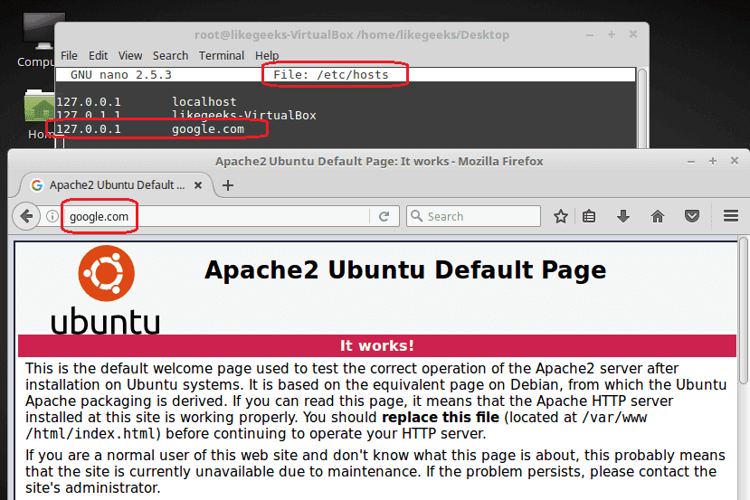
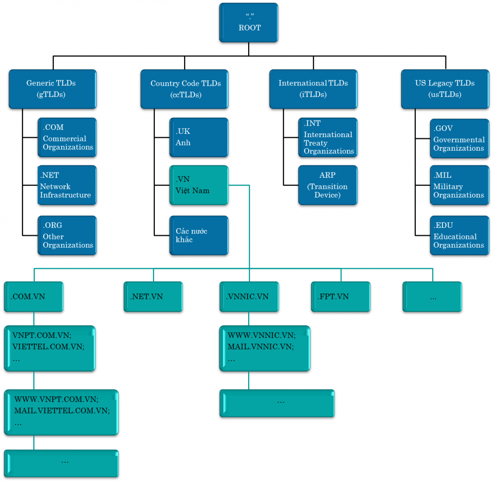
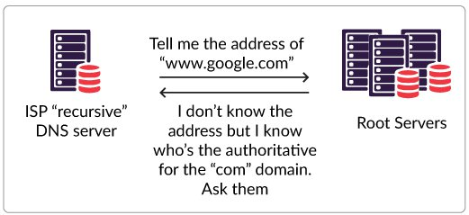
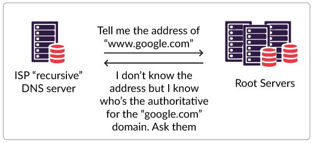
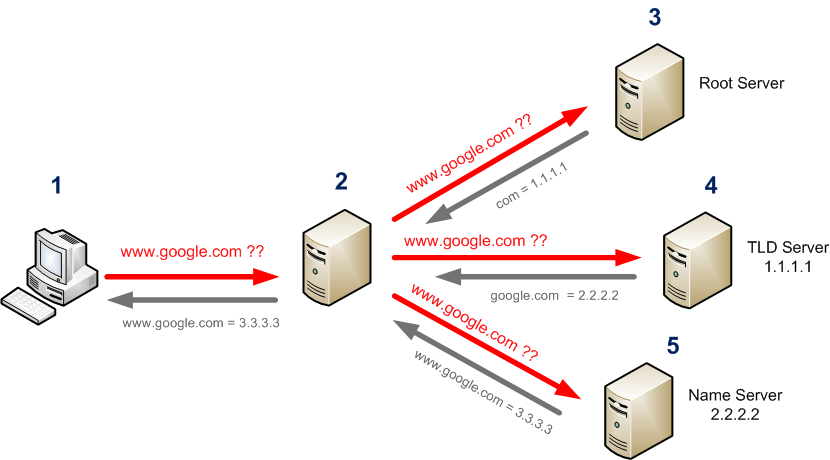

# Tìm hiểu về DNS


## Mục lục

## DNS 

### Định nghĩa

- DNS là viết tắt của **D**omain **N**ame **S**ystem - hệ thống tên miền. DNS được phát minh vào năm 1984 cho Internet với nhiệm vụ phân giải tên miền sang địa chỉ IP và ngược lại từ địa chỉ IP sang tên miền. 

- Trong những ngày đầu tiên của mạng Internet, tất cả các tên máy và địa chỉ IP tương ứng của chúng được lưu giữ trong file hosts.txt, file này được trung tâm thông tin mạng NIC ( Network Information Center ) ở Mỹ lưu giữ. Tuy nhiên khi hệ thống Internet phát triển, việc lưu giữ thông tin trong một file không thể đáp ứng nhu cầu phân phối và cập nhật. Do đó, hệ thống tên miền DNS đã phát triển dưới dạng các cơ sở dữ liệu phân bố, mỗi cơ sở dữ liệu này sẽ quản lý một phần trong hệ thống tên miền.

### Chức năng của DNS
- Tất cả các thiết bị trên Internet có thể giao tiếp được với nhau là nhờ có địa chỉ IP(IPv4 và IPv6). Khi bạn muốn truy cập vào 1 trang web như facebook.com, github.com, dantri.com.vn,...  thì bản chất thực sự của nó là truy cập vào địa chỉ IP của server chứa dữ liệu của các trang web này. Tuy nhiên không phải ai cũng có thể nhớ được đúng và nhớ được hết địa chỉ IP của các trang web, từ đó DNS đã xuất hiện.  

- DNS đóng vai trò như 1 người phiên dịch, dịch giữa địa chỉ IP và tên miền chứ không có tác dụng thay thế hoàn toàn cho địa chỉ IP. Bạn cũng có thể tải 1 website bằng cách nhập trực tiếp địa chỉ IP thay vì dùng tên miền nếu bạn biết và nhớ địa chỉ IP của trang web đó.  

  Ví dụ, khi bạn gõ “www.google.com” vào trình duyệt, máy chủ DNS sẽ lấy địa chỉ IP của máy chủ Google là “74.125.236.37”. Sau đó, bạn sẽ nhìn thấy trang chủ Google tải trang trên trình duyệt. Đó là quá trình phân giải DNS.

- Mỗi DNS còn có chức năng ghi nhớ những tên miền mà nó đã phân giải và ưu tiên sử dụng cho những lần truy cập sau.

- Nhờ DNS, bạn có thể sử dụng nhiều dịch vụ mạng như tìm kiếm thông tin, xem phim, chơi game, đăng nhập các website,…Có thể nói nếu không có DNS, con người không thể duyệt Internet nhanh chóng và dễ dàng như ngày nay.

### File `/etc/hosts`
- Nếu không cần DNS Server, mọi hệ thống sẽ phải giữ file chứa bảng tên miền và địa chỉ IP, trên hệ thống Linux nó là file `/etc/hosts`

- Khi bạn bắt đầu truy cập vào 1 trang web, hệ thống sẽ tìm trong file này đầu tiên, nếu tìm thấy thông tin về địa chỉ IP và tên miền thì nó sẽ không đi tới DNS Server nữa.

- Cú pháp:
  ```sh
    IP_address domain
  ```
  
  Ví dụ bạn chạy Apache trên máy Ubuntu và cấu hình IP, domain trong file `/etc/hosts`, sau đó dùng domain bạn vừa cấu hình truy cập vào Internet

    


- Tuy nhiên file trên chỉ làm việc trên môi trường localhost, còn với những mạng bên ngoài nó sẽ không làm việc. Lúc này bạn sẽ cần đến DNS.

## Domain
- Khi bạn đi tới 1 website, bạn sẽ gõ FQDN (Fully Qualified Domain Name) - tên miền đủ điều kiện hoặc tên miền có dạng: news.cloud365.vn hoặc www.news.cloud365.vn.

- Cấu trúc của hệ thống tên miền:
  - Hiện nay hệ thống tên miền trên thế giới được phân bố theo cấu trúc hình cây. tên miền cấp cao nhất là tên miền gốc (ROOT) được thể hiện bằng dấu ".".
  - Dưới tên miền gốc có hai loại tên miền là: tên miền cấp cao dùng chung- gTLDs (generic Top Level Domains) và tên miền cấp cao quốc gia – ccTLD (country code Top Level Domains) như .vn, .jp, .kr, .…  

      


  Hình trên các tên miền iTLD và usTLD thực chất thuộc nhóm gTLD (việc phân tách ra chỉ có ý nghĩa lịch sử). Tên miền cấp cao dùng chung hiện nay được tổ chức quốc tế ICANN (Internet Coroperation for Assigned Names and Numbers) quản lý.

  Danh sách tên miền cấp cao (TLD), bao gồm các tên miền cấp cao dùng chung (gTLD) và tên miền cấp cao quốc gia (ccTLD) tham khảo tại:

  http://www.iana.org/domains/root/db

### Top Level Domain Names (TLDs)

- TLDs được chia dựa trên các khu vực địa lý hoặc các lĩnh vực liên quan.

- Tại thời điểm của bài viết, trên thế giới hiện có khoảng 800 TLDs.

- Danh mục TLDs hiện tại:

  - Generic top-level domain, ví dụ: .org, .com, .net, .gov, .edu,...
  - Country-code top-level domains(tên miền cấp cao quốc gia), ví dụ: .us, .ca, .vn,...
  - New branded top-level domains(tên miền cấp mới cho các thương hiệu), ví dụ: .linux, .microsoft, .companyname,...
  - Infrastructure top-level domains(tên miền cấp cao cho cơ sở hạ tầng), ví dụ: .arpa,...

### Subdomains
- Khi bạn đi tới một trang web, ví dụ như `mail.google.com` thì `mail` ở đây được gọi là subdomain của `google.com`

- Chỉ các name server cho `mail.google.com` biết được tất cả các host tồn tại phía bên dưới nó, cho nên google sẽ trả lời có subdomain mail hay không, root name server sẽ không có dữ liệu cho việc này.  

### Định nghĩa máy chủ tên miền (name server)  

- Máy chủ tên miền (name server) là máy chủ chứa cơ sở dữ liệu dùng cho việc chuyển đổi giữa tên miền và địa chỉ IP. Như cách phân cấp của hệ thống tên miền, tương ứng với mỗi cấp và mỗi loại tên miền có máy chủ tên miền phục vụ tên miền ở cấp đó và loại tên miền đó. Máy chủ tên miền ở mức ROOT sẽ chứa cơ sở dữ liệu quản lý tên miền ở mức top-level-domain. Ở mức quốc gia sẽ có máy chủ tên miền quản lý domain ở mức quốc gia.

  - Nó tồn tại ở tất cả các cấp trong kiến trúc DNS
  - Authoritative name server kiểm soát một phần cơ sở dữ liệu DNS
  - Một NS có thể phục vụ nhiều zone khác nhau
  - Nhiều NS phục vụ cho một số zone/subzones nhất định

- Hệ thống DNS định nghĩa hai kiểu máy chủ tên miền là máy chủ tên miền chính (primary name server) và máy chủ tên miền phụ (secondary name server). 

  - Primary name server là máy chủ tên miền lấy dữ liệu cho các zone của nó từ các file có sẵn trên máy.

  - Secondary name server là máy chủ tên miền lấy dữ liệu cho các zone của nó từ một máy chủ tên miền primary khác. Khi máy chủ secondary khởi động nó sẽ kết nối đến máy chủ primary để lấy dữ liệu từ máy này về cho các zone mà nó quản lý. Quá trình lấy dữ liệu từ máy primary về máy secondary được gọi là zone transfer.

    

- Truy vấn tương tác và truy vấn đệ quy
  - Truy vấn tương tác (Iterative) và truy vấn đệ quy (Recursive) là hai chức năng thường bị hiểu nhầm trong Name Server. NS truy vấn tương tác chỉ có thể trả lời thông tin mà máy chủ này biết hoặc đã được cache. Ngược lại NS đệ quy không ghi nhớ thông tin, nó sẽ hỏi các tài nguyên khác về thông tin được yêu cầu đến.

  - Hãy cùng xem ví dụ khi người dùng gõ http://www.google.com vào trình duyệt web và nhấn [Enter]:

    - Bước 1: Máy tính gửi một yêu cầu phân giải đến máy chủ NS đã được cấu hình, thông thường được đặt tại nhà cung cấp dịch vụ Internet của người dùng.

        
      
    - Bước 2: NS đệ quy bắt đầu hỏi một trong những máy chủ DNS gốc đã được cấu hình trước để tìm tài nguyên được yêu cầu.​

        

      Máy chủ root DNS không biết địa chỉ này là gì nhưng biết máy chủ DNS chịu trách nhiệm cho tên miền .com. Hãy hỏi tiếp máy chủ DNS đó”​  

    - Bước 3: NS đệ quy tiếp tục hỏi một trong những máy chủ DNS chịu trách nhiệm tên miền .com

      

      Máy chủ root DNS không biết địa chỉ này là gì nhưng biết máy chủ DNS nào chịu trách nhiệm cho tên miền .google.com. Hãy hỏi tiếp máy chủ DNS đó.

    - Bước 4: NS đệ quy hỏi một trong những NS google.com

        

      Máy chủ DNS chịu trách nhiệm cho tên miền .google.com trả kết quả cho NS đệ quy

    - Bước 5: NS đệ quy gửi kết quả trả về máy tính của người dùng. Sau đó nó sẽ ghi nhớ (cache) dữ liệu trong khoảng thời gian TTL.

       

      Địa chỉ của www.google.com là 216.239.53.99

    - Bước 6: Máy tính người dùng đã có thể gửi HTTP request đến máy chủ web của Google.

        


### Máy chủ tên miền DNS ROOT server

- Máy chủ tên miền ở mức cao nhất (ROOT name server) là máy chủ tên miền chứa các thông tin để tìm kiếm các máy chủ tên miền lưu trữ (authority) cho các tên miền thuộc mức cao nhất (top-level-domain).

- Máy chủ ROOT có thể đưa ra các truy vấn (query) để tìm kiếm tối thiểu là các thông tin về địa chỉ của các máy chủ tên miền authority thuộc lớp top-level-domain chứa tên miền muốn tìm. Sau đó, các máy chủ tên miền ở mức top-level-domain có thể cung cấp các thông tin về địa chỉ của máy chủ authority cho tên miền ở mức second-level-domain chứa tên miền muốn tìm. Quá trình tìm kiếm tiếp tục cho đến khi chỉ ra được máy chủ tên miền authority cho tên miền muốn tìm.

- Theo cơ chế hoạt động trên máy chủ tên miền đóng vai trò quan trọng trong việc tìm kiếm một tên miền bất kỳ trên không gian tên miền. Quá trình tìm kiếm tên miền luôn được bắt đầu bằng các truy vấn gửi cho máy chủ ROOT, nếu như các máy chủ tên miền ở mức ROOT không hoạt động, quá trình tìm kiếm tên miền sẽ không được thực hiện. Để tránh điều này không xảy ra, trên mạng Internet hiện tại có 13 hệ thống máy chủ tên miền ở mức ROOT, các máy chủ tên miền này nói chung và ngay trong cùng một hệ thống cũng được đặt tại nhiều vị trí khác nhau trên mạng Internet.

Xem thông tin về hệ thống root server name [***tại đây***](https://root-servers.org/) và cách DNS Root Server hoạt động [***tại đây***](https://securitytrails.com/blog/dns-root-servers)


## Các loại DNS Servers

- `Primary DNS servers:` chứa các file cấu hình tên miền và phản hồi các truy vấn DNS
- `Secondary DNS server:` làm việc như một backup và load balancer server. Các Primary DNS server biết sự tồn tại của Secondary DNS server và sẽ gửi các bản cập nhật cho chúng.
- `Caching DNS server:` làm nhiệm vụ lưu trữ các phản hồi DNS nhờ vậy bạn sẽ không cần hỏi lại Primary DNS server trong lần thứ 2 truy cập vào website.  

## Hoạt động của hệ thống DNS

  


## TÀI LIỆU THAM KHẢO
- https://likegeeks.com/linux-dns-server/#Setting-up-Linux-DNS-Server
- https://opensource.com/article/17/4/introduction-domain-name-system-dns
- https://vnnic.vn/dns/congnghe/h%E1%BB%87-th%E1%BB%91ng-t%C3%AAn-mi%E1%BB%81n#M%E1%BB%A5c%20VII