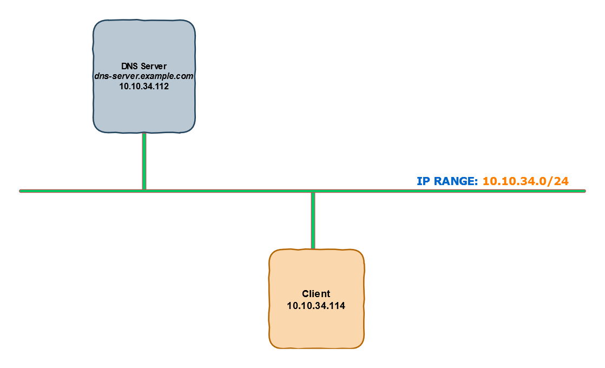
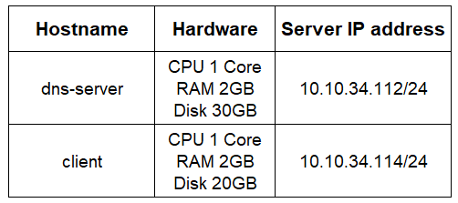
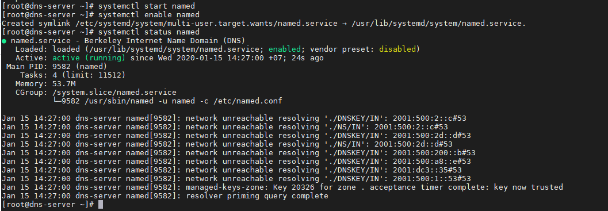
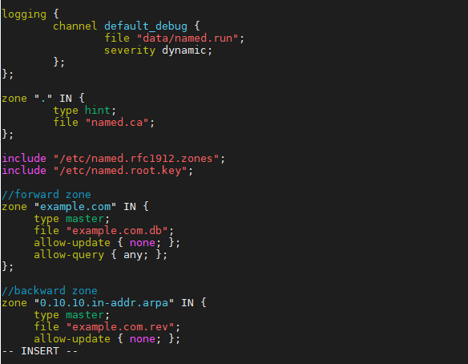
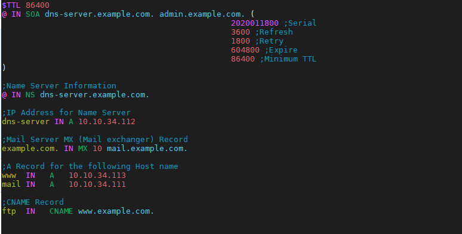
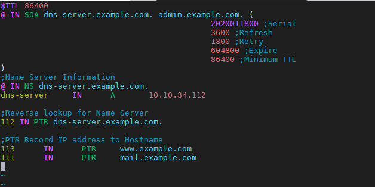
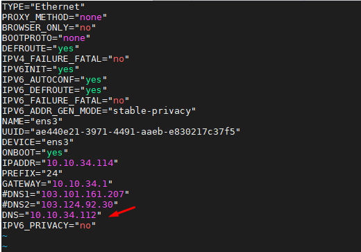
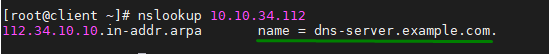
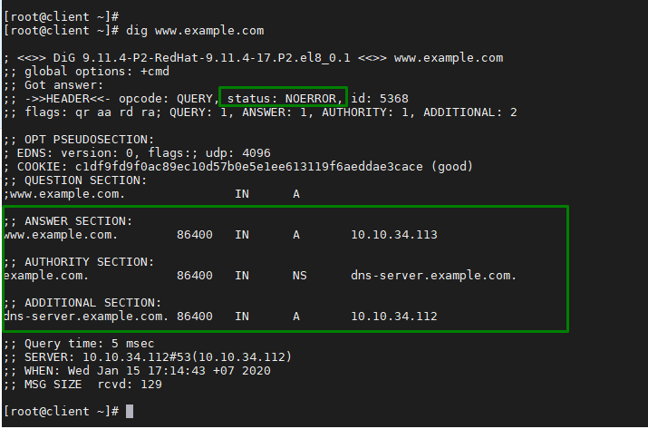
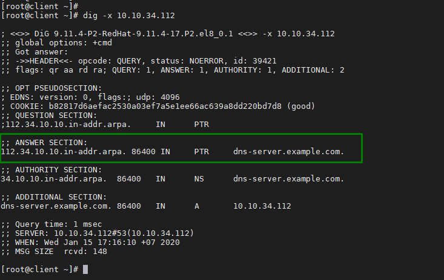

# Triển khai mô hình DNS Server trên Linux(CentOS 8)

## Mô hình triển khai và phân hoạch IP

### Mô hình triển khai



***Mô tả:*** Mô hình lab này sử dụng 2 máy CentOS 8 với quyền root user, trong đó có 1 máy được sử dụng làm DNS Server và 1 máy client để kiểm tra hoạt động của DNS Server. Tên miền được sử dụng trong bài lab là: `example.com`

### Phân hoạch IP

  


## Các bước triển khai  

### Thực hiện trên DNS Server

### [1] Cài đặt bind và bind-utils
- Cài đặt gói phần mềm BIND và bind-utills(để sử dụng được 2 câu lệnh `nslookup` và `dig`). BIND là ứng dụng cung cấp DNS server phổ biến nhất hiện nay. Sử dụng câu lệnh:

  ```sh
    dnf -y install bind*
  ```  

- Start dịch vụ DNS

  ```sh
    systemctl start named
    systemctl enable named
    systemctl status namedv
  ```

  


### [2] Cấu hình bind DNS server
- Cấu hình DNS Server, chỉnh sửa file `/etc/named.conf`  
   *Chú ý:* Thay địa chỉ IP trong file cấu hình thành địa chỉ IP của bạn.

  ```sh
    cp /etc/named.conf  /etc/named.bak
    vim /etc/named.conf
  ```

  Trong phần `options`, chuyển 2 dòng sau thành bình luận như sau:
 
  ```js
  //listen-on port 53 { 127.0.0.1; };
  //listen-on-v6 port 53 { ::1; };
  ```

  Chỉnh sửa thông số `allow-query`, chú ý địa chỉ IP của bạn

  ```js
    allow-query     { localhost; 10.10.34.0/24; };
  ```

    

  Cài đặt này chỉ cho phép các máy chủ trong mạng được xác định truy cập vào máy chủ DNS.

  Một **forward lookup DNS zone** là vùng lưu trữ thông tin mối quan hệ giữa địa chỉ IP và host name. Khi được truy vấn, nó cung cấp địa chỉ IP của host system bằng host name. Ngược lại, **reverse DNS zone** trả về tên miền đủ điều kiện(Fully Qualified Domain Name (FQDN)) của máy chủ liên quan tới địa chỉ IP của nó.

  Để xác định `reverse và forward lookup zones`, thêm vào cuối file `named.conf` cấu hình dưới:

  ```js
    //forward zone
    zone "example.com" IN {
         type master;
        file "example.com.db";
        allow-update { none; };
        allow-query { any; };
    };

    //backward zone
    zone "34.10.10.in-addr.arpa" IN {
        type master;
        file "example.com.rev";
        allow-update { none; };
        allow-query { any; };
    };
  ```

    

  Trong đó:
    
    - `type:` Quy định vai trò của server cho một zone(khu vực) cụ thể. Thuộc tính `master` cho biết đây là 1 server có thẩm quyền.

    - `file:` chứa thông tin về file forward / reverse zone của domain.
    - `allow-update:` Thuộc tính này xác định các host system có được phép chuyển tiếp cập nhật DNS động. Trong trường hợp này không.  

### [3] Tạo forward DNS zone file cho tên miền
- Tạo một forward DNS zone file cho tên miền `example.com` theo câu lệnh bên dưới:

  ```sh
    vim /var/named/example.com.db
  ```

  Thêm vào nội dung

  ```js
  $TTL 86400
    @ IN SOA dns-server.example.com. admin.example.com. (
                                            2020011800 ;Serial
                                            3600 ;Refresh
                                            1800 ;Retry
                                            604800 ;Expire
                                            86400 ;Minimum TTL
    )

    ;Name Server Information
    @ IN NS dns-server.example.com.

    ;IP Address for Name Server
    dns-server IN A 10.10.34.112

    ;Mail Server MX (Mail exchanger) Record
    example.com. IN MX 10 mail.example.com.

    ;A Record for the following Host name
    www  IN   A   10.10.34.113
    mail IN   A   10.10.34.111

    ;CNAME Record
    ftp  IN   CNAME www.example.com.
    ```

    

Trong đó:

  - `TTL:` là viết tắt của Time-To-Live là khoảng thời gian(hoặc hops) mà gói tin tồn tại trên mạng trước khi bị router loại bỏ.
  - `IN:` là Internet
  - `SOA:` là viết tắt của Start of Authority. Về cơ bản nó xác định name server có thẩm quyền, trong trường hợp này là `dns-server.example.com` và thông tin liên lạc - `admin.example.com`
  - `NS:` là viết tắt của Name Server
  - `A:` là bản ghi A. Nó trỏ 1 domain/subdomain tới địa chỉ IP
  - `Serial:` áp dụng cho mọi dữ liệu trong zone và có định dạng `YYYYMMDDNN` với `YYYY` là năm, `MM` là tháng, `DD` là ngày, `NN` là số lần sửa đổi dữ liệu zone trong ngày. Luôn luôn phải tăng số này lên mỗi lần sửa đổi dữ liệu zone. Khi Slave DNS Server liên lạc với Master DNS Server, trước tiên nó sẽ hỏi số serial. Nếu số serial của Slave nhỏ hơn số serial của máy Master tức là dữ liệu zone trên Slave đã cũ và sau đó Slave sẽ sao chép dữ liệu mới từ Master thay cho dữ liệu đang có.
  - `Refresh:` chỉ ra khoảng thời gian Slave DNS Server kiểm tra dữ liệu zone trên Master để cập nhật nếu cần. Giá trị này thay đổi tùy theo tuần suất thay đổi dữ liệu trong zone.
  - `Retry:` nếu Slave DNS Server không kết nối được với Master DNS Server theo thời hạn mô tả trong refresh (ví dụ Master DNS Server bị shutdown vào lúc đó thì Slave DNS Server phải tìm cách kết nối lại với Master DNS Server theo một chu kỳ thời gian mô tả trong retry. Thông thường, giá trị này nhỏ hơn giá trị refresh).
  - `Expire:` nếu sau khoảng thời gian này mà Slave DNS Server không kết nối được với Master DNS Server thì dữ liệu zone trên Slave sẽ bị quá hạn. Khi dữ liệu trên Slave bị quá hạn thì máy chủ này sẽ không trả lời mỗi truy vấn về zone này nữa. Giá trị expire này phải lớn hơn giá trị refresh và giá trị retry.  
  - `Minimum TTL:` chịu trách nhiệm thiết lập TTL tối thiểu cho 1 zone
  - `MX:` đây là bản ghi Mail exchanger. Nó chỉ định server nhận và gửi mail
  - `CNAME:` Là viết tắt của Canonical Name - tên miền chính. Nó sẽ map alias domain(tên miền phụ) tới tên miền khác.
  - `PTR:` là viết tắt của Pointer. Thuộc tính này phân giải địa chỉ IP thành domain.  

### [4] Tạo reverse DNS zone file cho tên miền

- Tạo một reverse DNS zone file cho tên miền `example.com` theo câu lệnh bên dưới:

  ```sh
    vim /var/named/example.com.rev
  ```

  Thêm vào nội dung

  ```js
    $TTL 86400
    @ IN SOA dns-server.example.com. admin.example.com. (
                                            2020011800 ;Serial
                                            3600 ;Refresh
                                            1800 ;Retry
                                            604800 ;Expire
                                            86400 ;Minimum TTL
    )
    ;Name Server Information
    @ IN NS dns-server.example.com.
    dns-server     IN      A       10.10.34.112

    ;Reverse lookup for Name Server
    112 IN PTR dns-server.example.com.

    ;PTR Record IP address to Hostname
    113      IN      PTR     www.example.com
    111      IN      PTR     mail.example.com
  ```

    

- Gán các quyền cần thiết cho 2 file cấu hình trên

  ```sh
    chown named:named /var/named/example.com.db
    chown named:named /var/named/example.com.rev
  ```

- Kiểm tra các file DNS zone lookup có gặp lỗi không, sử dụng các câu lệnh:

  ```sh
    named-checkconf
    named-checkzone example.com /var/named/example.com.db
    named-checkzone 10.10.34.112 /var/named/example.com.rev
  ```

  Nếu không có lỗi, ouput của bạn sẽ như hình:

   

- Khởi động lại Bind DNS server để hệ thống nhận cấu hình mới:

  ```sh
    systemctl restart named
  ```

- Cấu hình firewall để cho phép client truy cập vào hệ thống

  ```sh
    firewall-cmd  --add-service=dns --zone=public  --permanent
    firewall-cmd --reload 
  ```

### Thực hiện trên máy Client

### [5] Kiểm tra Bind DNS server từ phía client
- Chỉnh sửa file `/etc/resolv.conf` và thêm vào cấu hình

  ```js
    nameserver 10.10.34.112
  ```

- Chỉnh sửa file `/etc/sysconfig/network-scripts/ifcfg-ens3`, khai báo DNS mới là địa chỉ IP của BIND DNS Server

  ```js
    DNS="10.10.34.112"
  ```

    

- Restart NetworkManager để nhận cấu hình mới

  ```sh
    systemctl restart NetworkManager
  ```

- Sử dụng câu lệnh `nslookup` để kiểm tra hoạt động của Bind DNS server, như sau:

  ```js
    nslookup dns-server.example.com
    nslookup mail.example.com
    nslookup www.example.com
    nslookup ftp.example.com
  ```

  
    
  ```sh
      nslookup 10.10.34.112
  ```

    

- Để chi tiết hơn, bạn có thể sử dụng câu lệnh `dig`

  ```sh
    dig www.example.com
  ```

    

  ```sh
    dig -x 10.10.34.112
  ```

    


## TÀI LIỆU THAM KHẢO
- https://opensource.com/article/17/4/introduction-domain-name-system-dns
- https://www.linuxtechi.com/setup-bind-server-centos-8-rhel-8/
- https://users.soict.hust.edu.vn/hoangph/textbook/ch04-1.html
- https://blog.cloud365.vn/linux/dns-record/