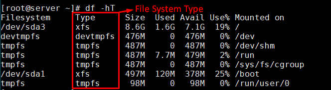
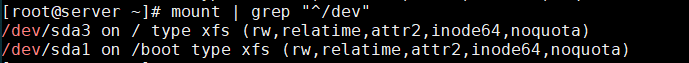
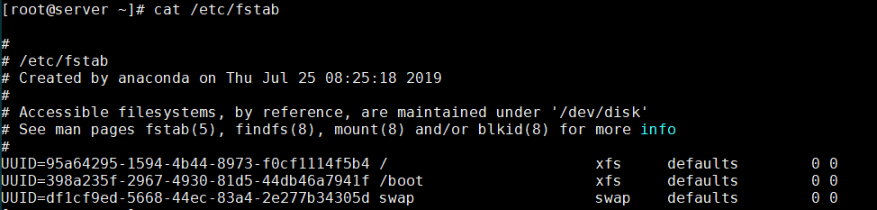
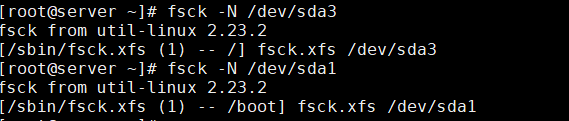
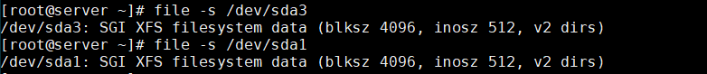
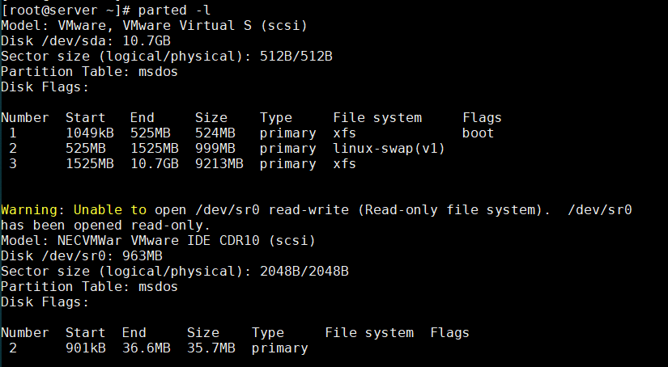
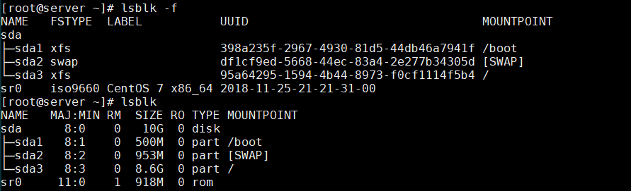
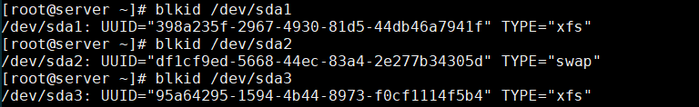
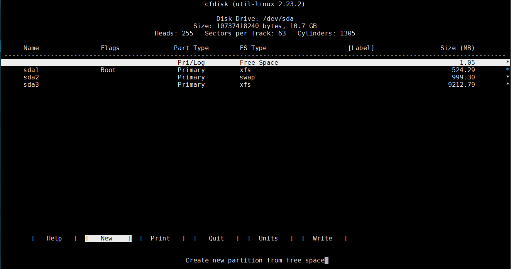

# Xác định loại hệ thống tệp trong Linux  

## 1. Sử dụng lệnh `df`  
- `df` là viết tắt của `Disk Filesystem` cung cấp thông tin sử dụng không gian đĩa của hệ thống tệp của bạn. 
- Sử dụng tùy chọn `-T` với lệnh `df` để biết type của file system, `-h` để hiển thị đơn vị dung lượng:   
  ```sh
    # df -hT
  ```  
    

## 2. Sử dụng lệnh `mount`  
- Lệnh `mount` được sử dụng để gắn kết một hệ thống tệp trong Linux, nó cũng có thể được sử dụng để gắn kết một hình ảnh ISO, gắn kết hệ thống tệp Linux từ xa và hơn thế nữa.

- Khi sử dụng lệnh `mount` mà không có bất kỳ đối số nào, nó sẽ in thông tin về các phân vùng đĩa bao gồm loại hệ thống tệp như dưới đây:  

  ```sh
    # mount | grep "^/dev"
  ```

    

## 3. Nhận thông tin chi tiết từ file `/etc/fstab`  
- Sử dụng lệnh:  
  ```sh
    # cat /etc/fstab
  ```  

    

## 4. Sử dụng lệnh `fsck`  
- `fsck` được sử dụng để kiểm tra và tùy ý sửa chữa một hoặc nhiều hệ thống tệp Linux. Sử dụng tùy chọn `-N` với `fsck` để in thông tin loại hệ thống tệp thay vì kiểm tra hệ thống tệp (Không thực hiện và chỉ hiển thị đầu ra).  

  ```sh
    # fsck -N [file_system]
  ```  

    

## 5. Sử dụng lệnh `file`  
- Lệnh `file` được sử dụng để xác định loại tập tin. Sử dụng tùy chọn `-s` với tệp để in thông tin loại hệ thống tệp.  
  ```sh
    # file -s [file_system]
  ```

    

## 6. Sử dụng lệnh `parted`  
- `parted` là một chương trình để thao tác phân vùng đĩa. Nó hỗ trợ nhiều định dạng bảng phân vùng, bao gồm MS-DOS và GPT. Sử dụng tùy chọn `-l` để liệt kê bố cục phân vùng trên tất cả các thiết bị khối.  
  ```sh
    # parted -l
  ```  

    

# 7. Sử dụng lệnh `lsblk`  
- `lsblk` liệt kê thông tin về tất cả các thiết bị khối có sẵn hoặc được chỉ định. Lệnh `lsblk` đọc hệ thống tập tin `sysfs` và `db udev` để thu thập thông tin.  
  ```sh
    # lsblk
  ```  

    

## 8. Sử dụng lệnh `blkid`  
- Chương trình `blkid` là giao diện dòng lệnh xác định vị trí/in thông tin thiết bị khối (ví dụ: hệ thống tập tin hoặc trao đổi).
  ```sh
    # blkid [file_system]  
  ```

    

## 9. Sử dụng lệnh `cfdisk`
- `cfdisk` là một chương trình dựa trên curses để phân vùng bất kỳ thiết bị khối nào. Nó hiển thị hoặc thao tác thông tin bảng phân vùng đĩa.  
  ```sh
    # cfdisk
  ```

    
