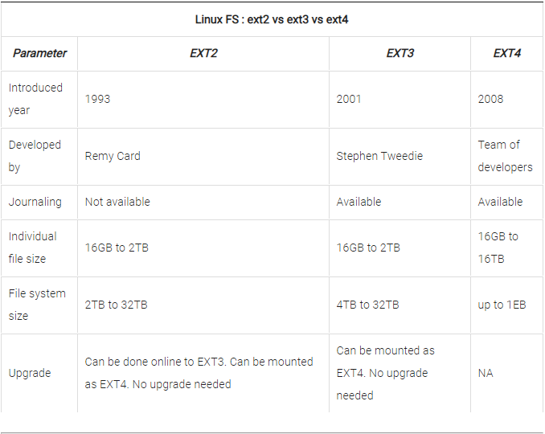
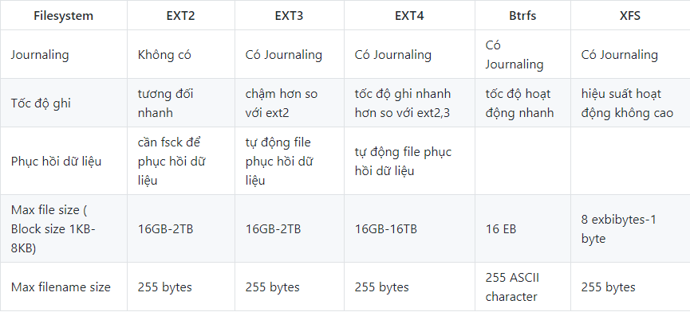
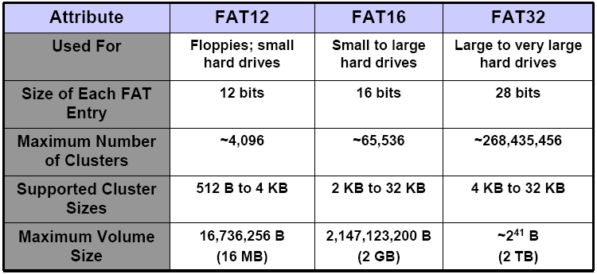
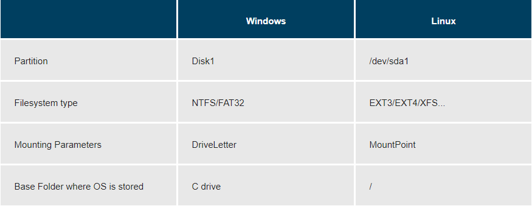

# File System   

## 1. File system
- File system được dùng để quản lý các dữ liệu được đọc và lưu trên thiết bị.

- File system cho phép người dùng truy cập nhanh chóng và an toàn khi cần thiết.
- Các thiết bị lưu trữ như đĩa cứng, usb,..đều có file system, bên dưới là dữ liệu được lưu trữ.  

## 2. Các loại filesystem phổ biến trên Linux
- Các loại filesystem được Linux hỗ trợ:

  - Filesystem cơ bản: EXT2, EXT3, EXT4, XFS, Btrfs, JFS, NTFS,…
  - Filesystem dành cho dạng lưu trữ Flash(thẻ nhớ): ubifs, JFFS2, YAFFS v.v.
  - Filesystem dành cho hệ cơ sở dữ liệu
  - Filesystem mục đích đặc biệt: procfs, sysfs, tmpfs, squashfs, debugfs,…

- Cụ thể:  
  - `ext` - Extended Filesystem  
    - `ext` - phần mở rộng của hệ thống tập tin `minix`. Nó đã được thay thế hoàn toàn bởi phiên bản thứ hai của hệ thống tập tin mở rộng (ext2) và đã bị xóa khỏi kernel.  
    - `ext2` - Hệ thống tệp mở rộng thứ hai được tạo ra để khắc phục các hạn chế của `ext`. Hệ thống tệp Linux đầu tiên cho phép lữu trữ 2TB dữ liệu; phù hợp với thẻ SD và USB vì nó có hiệu suất cao và ghi thấp (vì không có nhật ký).  
    - `ext3` - phiên bản ghi nhật ký của hệ thống tập tin ext2(Ghi nhật ký theo dõi các thay đổi tệp giúp phục hồi nhanh và giảm cơ hội nếu mất dữ liệu trong trường hợp xảy ra sự cố hệ thống). Nâng cấp FS từ ext2 lên ext3 là quy trình trực tuyến không có thời gian chết. 
    - `ext4` - bộ nâng cấp của ext3. Có thêm nhiều tính năng mới:   - Hỗ trợ volume có dung lượng tối đa lên đến 1 exbibyte (1 EiB = 10­30 TB) và file có kích thước 16 tebibyte (1 TiB = 1024 TB)
      - Cải thiện hiệu suất tập tin lớn và chống phân mảnh
      - Không giới hạn thư mục con
      - Kiểm tra toàn vẹn dữ liệu (checksum)
      - Tính toán thời gian chuẩn đến nano giây (1 nano giây = 10-9 giây).  
    Do khả năng tương thích ngược, ext2, ext3 có thể được gắn trực tiếp dưới dạng ext4 nên không cần nâng cấp FS.  

          

  - `JFS` - Journaled File System: được phát triển bởi IBM AIX UNIX được sử dụng như là một thay thế cho hệ thống tệp ext. Nó được tích hợp sẵn vào Linux trong kernel 2.4.24. JFS là một thay thế cho ext4 hiện tại và được sử dụng khi cần sự ổn định với việc sử dụng rất ít tài nguyên. 

  - `XFS` -  là một JFS tốc độ cao nhằm xử lý I/O song song.  
  - `Btrfs` - (B-tree file system): Btrfs được đưa vào sử dụng chính thức năm 2014. Mục tiêu của nó nhằm giải quyết các vấn đề pooling, snapshot, checksum và tích hợp thiết bị mở rộng trong Linux. Không giống như ext4, Btrfs dựa trên công nghệ hoàn toàn mới và cải tiến hơn: Copy-on-write (COW). Công nghệ này đã giúp Btrfs có những tính năng vượt trội sau:
    - Tự kiểm tra và sửa lỗi cấu trúc của file system  
    - Chống phân mảnh dữ liệu
    - Kiểm tra và khôi phục lỗi của dữ liệu bằng các bản dự phòng.
    - Hỗ trợ cơ chế Cloning (kể cả tập tin)
    - Hỗ trợ subvolume và snapshot (writable hoặc readonly)
    - Hỗ trợ Incremental backup (toàn bộ dữ liệu lẫn thay đổi được backup đều lưu trong 1 task).    

### So Sánh EXT, Btrfs, XFS

    

- [Kiểm tra type linux file system](check_type_file_system.md)  

## 3. Filesystem trên Window  
- `FAT` - là viết tắt của "File Allocation Table" tạm dịch là "Bảng cấp phát tập tin". FAT được giới thiệu lần đầu tiên vào năm 1977 với phiên bản FAT12. Sau đó là các phiên bản FAT16 và FAT32.  
  - FAT12: 
    - Được giới thiệu vào năm 1980, cùng với các phiên bản đầu tiên của DOS.
    - Dùng cho ổ đĩa mềm, ổ đĩa có dung lượng dưới 32MB.  
     - Hỗ trợ kích thước ổ đĩa và kích thước tệp lên tới 16MB bằng cách sử dụng cluster 4KB hoặc 32 MB bằng cách sử dụng cluster 8KB, với số lượng tối đa 4.084 tệp trên một ổ đĩa (khi sử dụng cluster 8KB). 
    - Tên file: giới hạn ký tự tối đa 8 ký tự và 3 ký tự đối với phần đuôi(ví dụ: .exe).  

  - FAT16: 
    - Được giới thiệu vào năm 1984 trong PC DOS 3.0 và MS-DOS 3.0. 
    - Tùy thuộc vào OS và kích thước cluster được sử dụng, kích thước ổ đĩa tối đa có định dạng FAT16 có thể dao động từ 2GB đến 16GB. Kích thước tệp trên ổ đĩa FAT16 tối đa là 4GB khi bật hỗ trợ tệp lớn hoặc 2GB mà không có hỗ trợ. Số lượng tệp tối đa có thể được giữ trên một ổ đĩa FAT16 là 65.536 tệp. 
    - Tên file: Giống như với FAT12, tên tệp được giới hạn ở 8.3 ký tự nhưng được mở rộng thành 255 ký tự bắt đầu từ Windows 95.  

  - FAT32: 
    - Được giới thiệu trong phiên bản Windows 95 Service Pack 2 (OSR 2), được xem là phiên bản mở rộng của FAT16. 
    - Do sử dụng không gian địa chỉ 32 bit nên FAT32 hỗ trợ nhiều cluster trên một partition hơn, do vậy không gian đĩa cứng được tận dụng nhiều hơn. 
    - Kích thước của phần vùng FAT32 bắt buộc phải nhỏ hơn 8TB.
    - Kích thước tập tin tối đa trong phân vùng sử dụng định dạng FAT32 là 4GB. Phiên bản sửa đổi của FAT32, được gọi là FAT32+, hỗ trợ các tệp có kích thước gần 256 GB.
    - Có thể chứa tối đa 268.173.300 tệp trên một ổ đĩa FAT32  nếu sử dụng cluster 32KB. 
    - Tên file: tối đa 255 ký tự.   
    
    

- `NTFS` - New Technology File System là định dạng hiện đại hơn so với FAT. NTFS lần đầu xuất hiện trên Windows NT 3.1. Một số tính năng hiện đại của NTFS có thể kể đến là: 
  - Tính năng về bảo mật như:    
    - Đặt quyền truy cập cho tập tin  
    - Ghi nhận những thay đổi dữ liệu giúp dễ dàng phục hồi nếu máy tính gặp sự cố
    - Tạo các bản sao (copy) dành cho sao lưu (backup)
    - Mã hoá (encryption)
    - Đặt hạn ngạch đĩa (disk quota limit).
  - NTFS sử dụng bảng quản lý tập tin MFT (Master File Table) thay cho bảng FAT
  - Với không gian địa chỉ 64 bit, khả năng thay đổi kích thước của cluster độc lập với dung lượng đĩa cứng, NTFS hầu như đã loại trừ được những hạn chế về số cluster, kích thước tối đa của tập tin trên một phân vùng đĩa cứng.
  -  NTFS cũng hỗ trợ các ổ đĩa lớn và các giải pháp lưu trữ như RAID. 
  - NTFS có khả năng chịu lỗi cao, cho phép người dùng đóng một ứng dụng “chết” (not responding) mà không làm ảnh hưởng đến những ứng dụng khác. Tuy nhiên, NTFS lại không thích hợp với những ổ đĩa có dung lượng thấp (dưới 400 MB) và không sử dụng được trên đĩa mềm. 
  - Phân vùng cài Windows của bạn buộc phải ở dạng NTFS. Ngoài ra, nếu bạn muốn dùng một phân vùng khác để cài phần mềm thì phân vùng đó cũng nên chọn NTFS

### So sánh FAT và NTFS  

  

## 4. Phân vùng và file system  
- Một phân vùng là một vùng chứa trong đó có một filesystem được lưu trữ , trong một số trường hợp thì filesystem có thể mở rộng hơn một phân vùng nếu filesystem sử dụng các liên kết.

- File system là một phương pháp lưu trữ hoặc tìm kiếm các tập tin trên một đĩa cứng ( trong một phân vùng ).

- So sánh giữa filesystem trên hệ điều hành Windows và hệ điều hành Linux:  

    

## 5. Filesystem Hierarchy Standard (FHS)
- Filesystem của hệ điều hành Linux được tổ chức theo tiêu chuẩn cấp bậc của hệ thống tập tin Filesystem Hierarchy Standard (FHS). Tiêu chuẩn này định nghĩa mục đích của mỗi thư mục.

  Hình bên dưới là cấu trúc thư mục trong Linux:  

    

- Linux  sử dụng ký tự `/` để phân tách các đường dẫn (không giống như Windows, sử dụng `\`) và không có ký tự ổ đĩa. Các ổ đĩa mới được gắn dưới dạng thư mục trong hệ thống tệp đơn, thường nằm dưới  `/media`  (ví dụ, đĩa CD-ROM có nhãn FedORA có thể được tìm thấy tại `/media/FedORA` và tệp  `README.txt`  trên đĩa đó sẽ là tại `/media/FEDORA/README.txt`).  
- Tất cả các tên hệ thống tập tin Linux đều phân biệt chữ hoa chữ thường, vì vậy  `/boot`, `/Boot` và  `/BOOT`  là ba thư mục khác nhau. 

   

## TÀI LIỆU THAM KHẢO  
- [w3resource.com](https://www.w3resource.com/linux-system-administration/file-system.php)
- [redhat.com](https://www.redhat.com/sysadmin/navigating-filesystem-linux-terminal)
- [wiki.archlinux.org](https://wiki.archlinux.org/index.php/File_systems)
- [man7.org](http://man7.org/linux/man-pages/man5/filesystems.5.html)
- [poorvavmlinux.blogspot.com](http://poorvavmlinux.blogspot.com/2015/06/file-system-in-linux.html)
- [kerneltalks.com](https://kerneltalks.com/disk-management/difference-between-ext2-ext3-and-ext4/)
- [courses.edx.org](https://courses.edx.org/asset-v1:LinuxFoundationX+LFS101x.2+1T2015+type@asset+block@LFS101_Ch3_Sec1_FSH.pdf)
- https://vnreview.vn/tu-van-may-tinh/-/view_content/content/1715965/phan-biet-cac-dinh-dang-ntfs-fat32-va-exfat
- https://www.lifewire.com/what-is-file-allocation-table-fat-2625877
- http://www.data-recovery-app.com/datarecovery/fat16.html
- https://support.microsoft.com/vi-vn/help/100108/overview-of-fat-hpfs-and-ntfs-file-systems
- http://thuthuat.taimienphi.vn/cach-mount-gan-thiet-bi-luu-tru-tren-linux-terminal-47720n.aspx