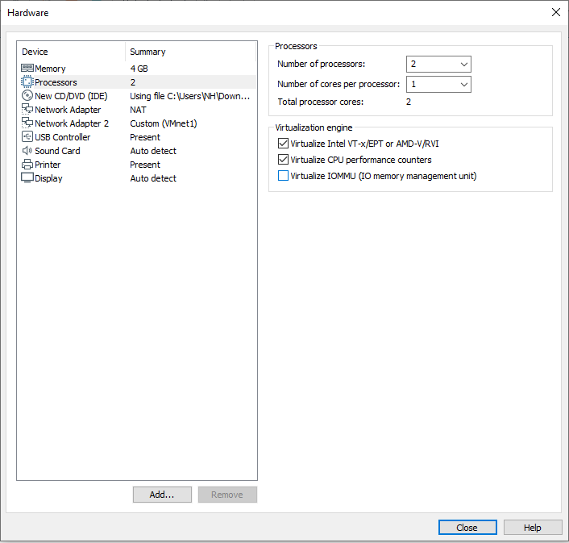
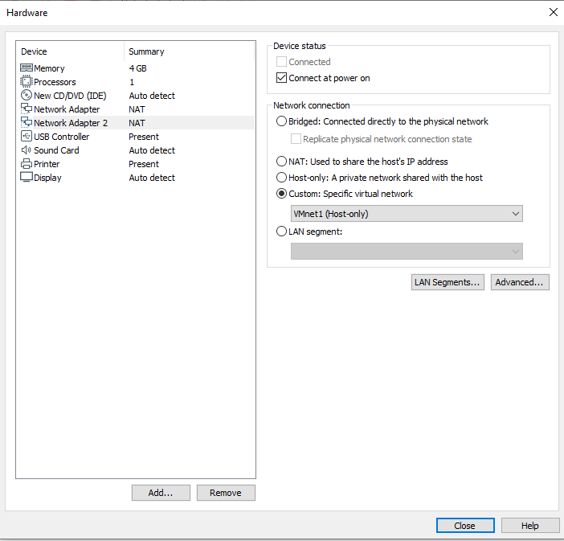
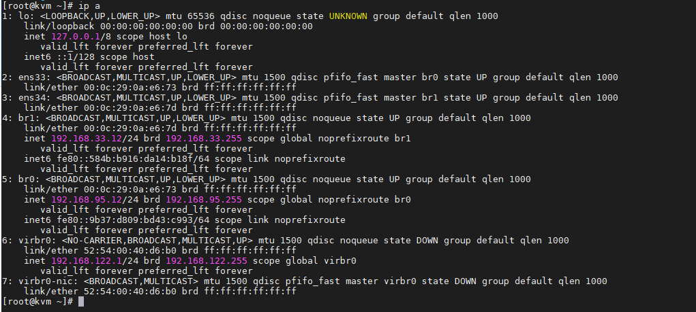

# Cài đặt KVM

## Chuẩn bị
- 1 máy ảo Centos 7 trên VMware với CPU 2 core, RAM 4GB, disk 200GB, sử dụng 2 card mạng(nat và host-only)

  
    

## Hướng dẫn cài đặt  
- Kiểm tra CPU có hỗ trợ cài đặt KVM  không bằng câu lệnh:
  ```sh
    egrep -c "svm|vmx" /proc/cpuinfo
  ```
  Nếu kết quả trả về khác `0` thì là CPU có hỗ trợ.  

- Cài KVM và các gói phụ trợ liên quan
  ```sh
    yum install -y qemu-kvm libvirt bridge-utils virt-manager
  ``` 
  Trong đó:
  `qemu-kvm`: Phần phụ trợ cho KVM.  
  `libvirt-bin`: cung cấp libvirt mà bạn cần quản lý qemu và KVM bằng libvirt.  
  `bridge-utils`: chứa một tiện ích cần thiết để tạo và quản lý các thiết bị bridge.  
  `virt-manager`: cung cấp giao diện đồ họa để quản lý máy ảo.

- Kiểm tra để chắc chắn rằng KVM đã được cài đặt
  ```sh
    lsmod | grep kvm
  ```
  OUTPUT
  ```
    kvm_intel             188644  0
    kvm                   621480  1 kvm_intel
    irqbypass              13503  1 kvm
  ```  

- Đối với bản Minimal của Centos 7 để dùng được công cụ đồ họa virt-manager người dùng phải cài đặt gói x-window bằng câu lệnh:
  ```sh
    yum install "@X Window System" xorg-x11-xauth xorg-x11-fonts-* xorg-x11-utils -y
  ```  
- Start dịch vụ libvirt và cho nó khởi động cùng hệ thống  
  ```sh
    systemctl start libvirtd
    systemctl enable libvirtd
  ```

- Cấu hình Bridge networking cho máy ảo KVM  
  - Thêm bridge `br0` sử dụng cho dải mạng nat và `br1` sử dụng cho dải mạng host-only 

    ```sh
      nmcli connection add type bridge autoconnect yes con-name br0 ifname br0
      ##Connection 'br0' (274164a5-bea2-4200-a0e1-c61de245b923) successfully added.
      nmcli connection add type bridge autoconnect yes con-name br1 ifname br1
      ##Connection 'br1' (0c247ff8-5541-4384-aa6b-a744baa887f8) successfully added.
    ```

  - Chỉnh sửa file cấu hình của br0 và br1, set IP cho br0 và br1
    ```sh
      vi /etc/sysconfig/network-scripts/ifcfg-br0
        STP=yes
        BRIDGING_OPTS=priority=32768
        TYPE=Bridge
        PROXY_METHOD=none
        BROWSER_ONLY=no
        BOOTPROTO=static
        DEFROUTE=yes
        IPV4_FAILURE_FATAL=no
        IPV6INIT=yes
        IPV6_AUTOCONF=yes
        IPV6_DEFROUTE=yes
        IPV6_FAILURE_FATAL=no
        IPV6_ADDR_GEN_MODE=stable-privacy
        NAME=br0    
        UUID=274164a5-bea2-4200-a0e1-c61de245b923
        DEVICE=br0
        ONBOOT=yes
        IPADDR=192.168.95.12
        PREFIX=24
        GATEWAY=192.168.95.1
        DNS=8.8.8.8
    ```
    ```sh
      STP=yes
      BRIDGING_OPTS=priority=32768
      TYPE=Bridge
      PROXY_METHOD=none
      BROWSER_ONLY=no
      BOOTPROTO=static
      DEFROUTE=yes
      IPV4_FAILURE_FATAL=no
      IPV6INIT=yes
      IPV6_AUTOCONF=yes
      IPV6_DEFROUTE=yes
      IPV6_FAILURE_FATAL=no
      IPV6_ADDR_GEN_MODE=stable-privacy
      NAME=br1
      UUID=0c247ff8-5541-4384-aa6b-a744baa887f8
      DEVICE=br1
      ONBOOT=yes
      IPADDR=192.168.33.12
      PREFIX=24
    ``` 

  - Lưu và thoát file config. Restart lại network
    ```sh
      systemctl restart network
    ```  

  - Xóa cài đặt hiện tại
    ```sh
      nmcli connection delete ens33
      nmcli connection delete ens34
    ```

  - Thêm một interface giống như một member của br0
    ```sh
      nmcli connection add type bridge-slave autoconnect yes con-name ens33 ifname ens33 master br0
      nmcli connection add type bridge-slave autoconnect yes con-name ens34 ifname ens34 master br1
    ```
  - Restart
    ```sh
      reboot
    ```

      
