# Hướng dẫn cài đặt Webvirt Cloud 

## Chuẩn bị
 1 máy ảo cài Centos 7, RAM 2GB, Disk 50GB, CPU 1 core.

## Cài đặt  
- Cài đặt các packages cần thiết
  ```sh
    yum install epel-release -y
    yum -y install python-virtualenv python-devel libvirt-devel glibc gcc nginx supervisor python-lxml git python-libguestfs
  ```

- Tạo thư mục và clone source code từ trang chủ về
  ```sh
    cd /srv
    git clone https://github.com/retspen/webvirtcloud && cd webvirtcloud
    cp webvirtcloud/settings.py.template webvirtcloud/settings.py
  ```

- Thay thế secret key
  ```sh
     pwd
        /srv/webvirtcloud
    vim webvirtcloud/settings.py
    SECRET_KEY = 'Thuctap2019'
  ```

- Cài đặt webvirtcloud
  ```sh
    pwd
        /srv/webvirtcloud
    virtualenv venv
    source venv/bin/activate
    venv/bin/pip install -r conf/requirements.txt
    pip install --upgrade pip
    cp conf/nginx/webvirtcloud.conf /etc/nginx/conf.d/
    venv/bin/python manage.py migrate
  ```

- Cấu hình supervisor
  - Copy file supervisord.conf
    ```sh
      cp /etc/supervisord.conf /etc/supervisord.conf.bk
    ```

  - Chỉnh sửa file `/etc/supervisord.conf` và thêm vào đoạn sau:

    ```sh
    [program:webvirtcloud]
    command=/srv/webvirtcloud/venv/bin/gunicorn webvirtcloud.wsgi:application -c /srv/webvirtcloud/gunicorn.conf.py
    directory=/srv/webvirtcloud
    user=nginx
    autostart=true
    autorestart=true
    redirect_stderr=true

    [program:novncd]
    command=/srv/webvirtcloud/venv/bin/python /srv/webvirtcloud/console/novncd
    directory=/srv/webvirtcloud
    user=nginx
    autostart=true
    autorestart=true
    redirect_stderr=true
    ```

- Cấu hình nginx
  - Comment lại block server trong file /etc/nginx/nginx.conf
    ```sh
      vim /etc/nginx/nginx.conf 
    ```
    Như sau:
    ```sh
    #    server {
    #        listen       80 default_server;
    #        listen       [::]:80 default_server;
    #        server_name  _;
    #        root         /usr/share/nginx/html;
    #
    #        # Load configuration files for the default server block.
    #        include /etc/nginx/default.d/*.conf;
    #
    #        location / {
    #        }
    #
    #        error_page 404 /404.html;
    #            location = /40x.html {
    #        }
    #
    #        error_page 500 502 503 504 /50x.html;
    #            location = /50x.html {
    #        }
    #    }
    ```

  - Sau đó chỉnh sửa file /etc/nginx/conf.d/webvirtcloud.conf
    ```sh
    vim /etc/nginx/conf.d/webvirtcloud.conf
    ```

    Như sau
    ```sh
    upstream gunicorn_server {
      #server unix:/srv/webvirtcloud/venv/wvcloud.socket fail_timeout=0;
      server 127.0.0.1:8000 fail_timeout=0;
    }
    server {
      listen 80;

      server_name servername.domain.com;
      access_log /var/log/nginx/webvirtcloud-access_log; 

    location /static/ {
        root /srv/webvirtcloud;
        expires max;
    }

    location / {
        proxy_pass http://gunicorn_server;
        proxy_set_header X-Real-IP $remote_addr;
        proxy_set_header X-Forwarded-for $proxy_add_x_forwarded_for;
        proxy_set_header Host $host:$server_port;
        proxy_set_header X-Forwarded-Proto $remote_addr;
        proxy_connect_timeout 600;
        proxy_read_timeout 600;
        proxy_send_timeout 600;
        client_max_body_size 1024M;
      }
    }
    ```

- Phần quyền cho các thư mục
  - Phân quyền cho user nginx có thể đọc được file trong thư mục chứa code
    ```sh
      chown -R nginx:nginx /srv/webvirtcloud
    ```

  - Phần quyền cho selinux
    ```sh
        yum install policycoreutils-python -y
        setenforce 0
        semanage fcontext -a -t httpd_sys_content_t "/srv/webvirtcloud(/.*)"
    ```

- Cấu hình firewalld
  ```sh
    firewall-cmd --permanent --add-port=80/tcp
    firewall-cmd --permanent --add-port=6080/tcp
    firewall-cmd --reload
  ```

- Restart và Enable services
  ```sh
    systemctl restart nginx && systemctl restart supervisord
    systemctl enable nginx && systemctl enable supervisord
  ```

## Cấu hình trên host KVM
  Để WebvirtCloud có thể kết nối đến Host KVM và quản lý được các VM trong host KVM ta cần cấu hình một số thông tin sau trên host KVM

- Tắt firewall (chỉ nên sử dụng trong môi trường lab)  
  ```sh
    systemctl stop firewalld  
  ```
  Hoặc nếu không muốn tắt firewall bạn có thể mở port 16509 để WebvirtCloud có thể kết nối đến.

- Cài đặt gói `libvirt`

  - cài đặt một số gói cần thiết
    ```sh
      yum install -y libvirt
    ```
  - Chỉnh sửa file cấu hình libvirt
    ```sh
      vim /etc/libvirt/libvirtd.conf
    ```
    Sửa các dòng thành nội dung như sau
    ```sh
    listen_tls = 0
    listen_tcp = 1
    tcp_port = "16509"
    listen_addr = "0.0.0.0"
    auth_tcp = "none"  
    ```

    ```sh
    cat /etc/libvirt/libvirtd.conf | egrep -v "^#|^$"
    listen_tls = 0
    listen_tcp = 1
    tcp_port = "16509"
    listen_addr = "0.0.0.0"
    auth_tcp = "none"
    ```

  - chỉnh sửa trên file `/etc/sysconfig/libvirtd`, bỏ dấu `#` ở phía trước dòng dưới trong file cấu hình
    ```sh
      LIBVIRTD_ARGS="--listen"  
    ```

    ```sh
     cat /etc/sysconfig/libvirtd | egrep -v "^#|^$"
    LIBVIRTD_ARGS="--listen"
    ```  

  - Kiểm tra lại cài đặt:
    ```sh
    systemctl restart libvirtd  
    ps ax | grep libvirtd  
    ss -antup | grep libvirtd  
    ```  

## Sử dụng
- Trên trình duyệt, nhập vào thanh tìm kiếm địa chỉ IP của máy cài Webvirt Cloud  
  ```sh
    http://192.168.95.13/
  ```

- Màn hình đăng nhập hiện ra, nhập vào user và password là admin
  
  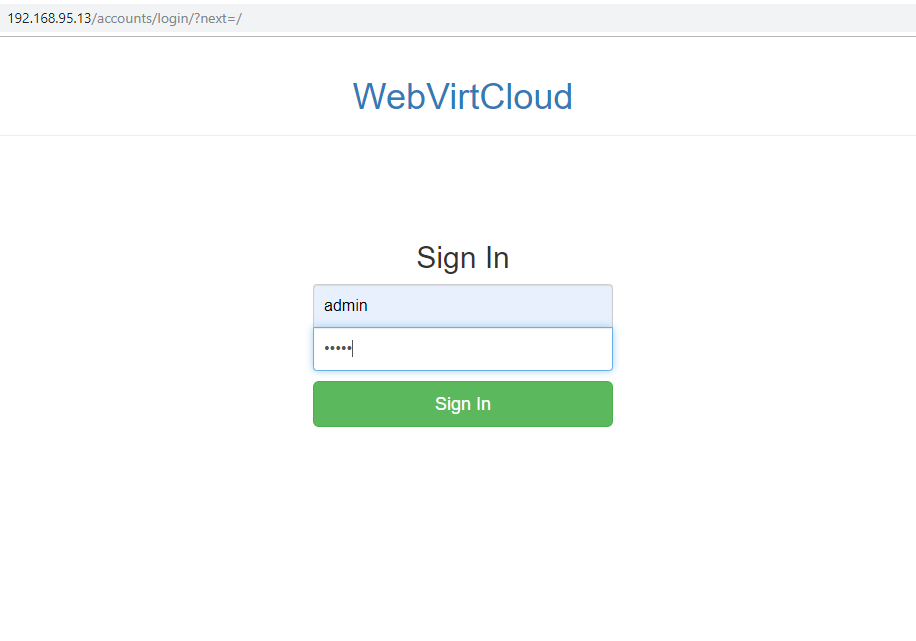  

- Add note: Vào task `Computes` rồi chọn dấu `+` để add note mới

  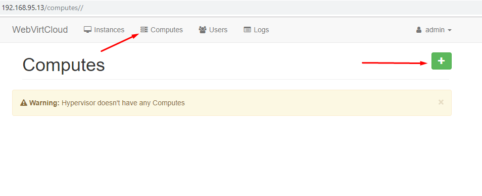  

  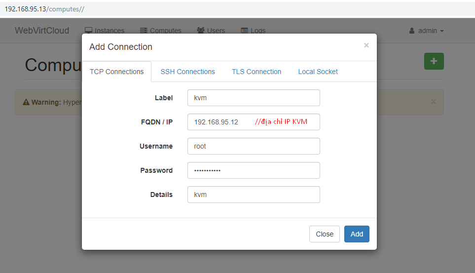  

- Tạo Storage Pool: Vào Computes --> chọn server muốn tạo --> Storages --> click vào biểu tượng dấu `+` màu xanh lá cây ở góc bên phải màn hình rồi điền thông tin như dưới đây để thêm 1 storage pool mặc định

  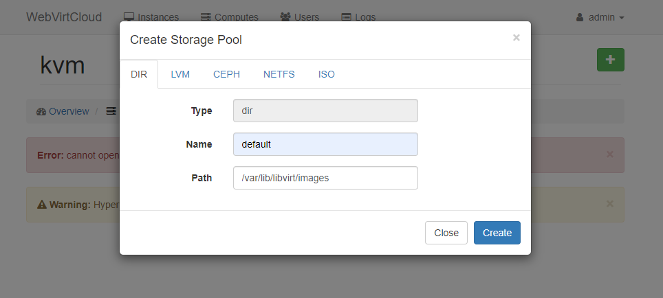  

  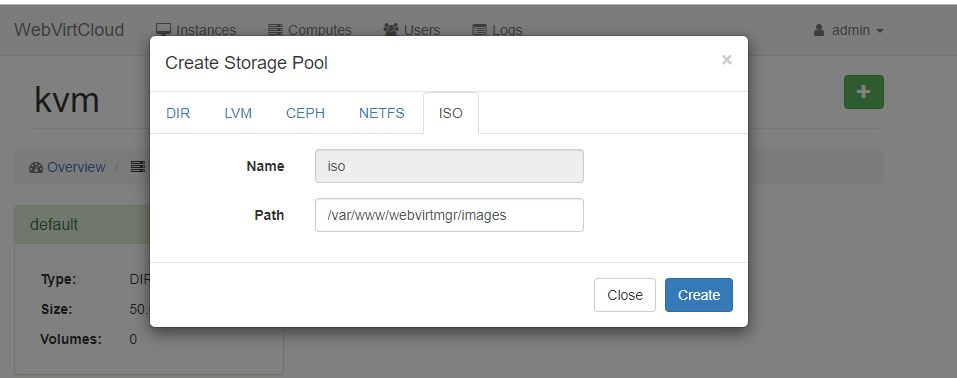  

- Tải hoặc copy file iso Centos vào folder `/var/www/webvirtmgr/images`  

- Tạo 1 network mới
  
  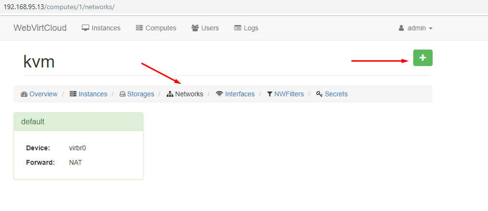

  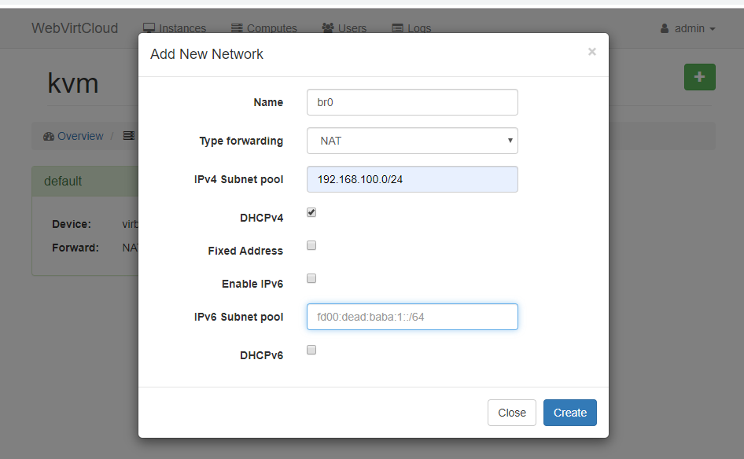  

- Chọn 1 compustes cho new instances  
  
  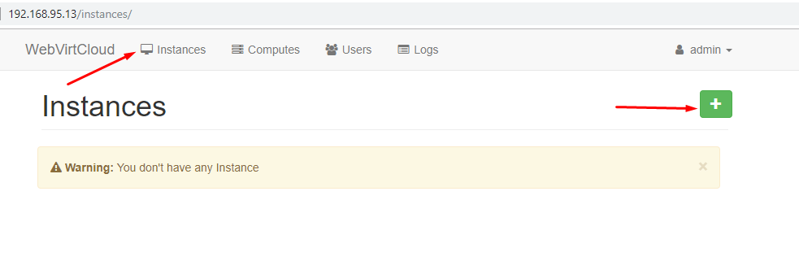

  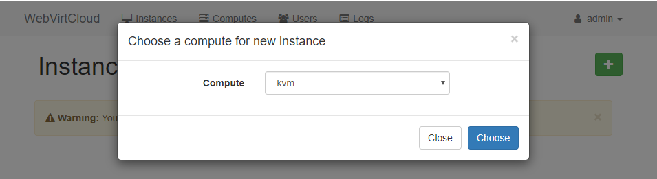

### Tạo VM với flavor
- Sau khi add 1 computes vào new instances, màn hình sẽ hiển thị như ảnh. Ở đây sẽ có các tùy chọn để bạn tạo máy ảo.

  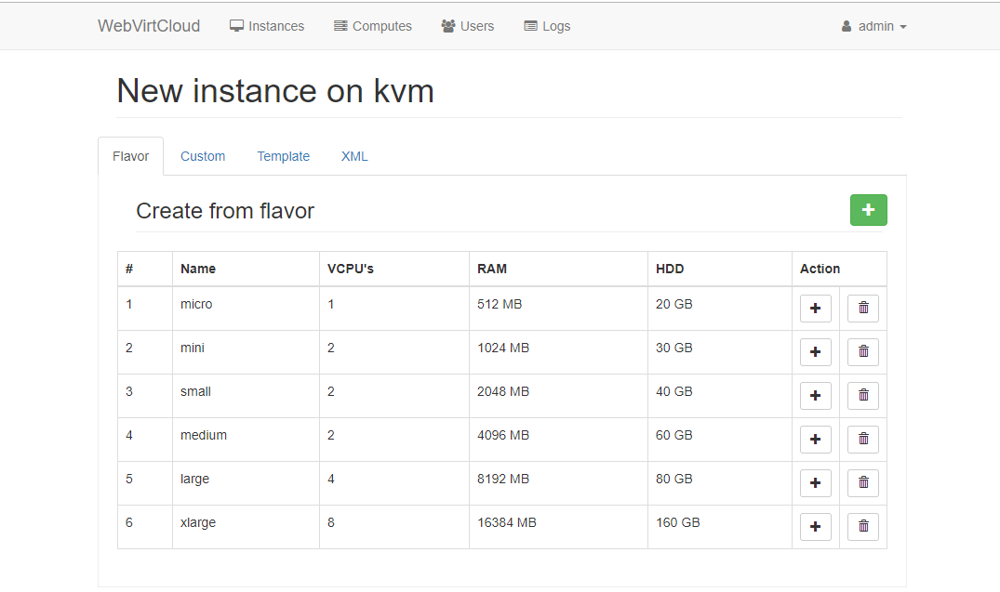  

- Để tạo VM với Flavor, chọn 1 cấu hình bạn muốn rồi bấm vào biểu tượng dấu `+`. Ví dụ này sử dụng cấu hình là RAM 2GB, HDD 40GB  

    

  Sau khi điền các thông tin, chọn Create để bắt đầu tạo máy. Màn hình của Instances sau khi bạn tạo thành công VM

  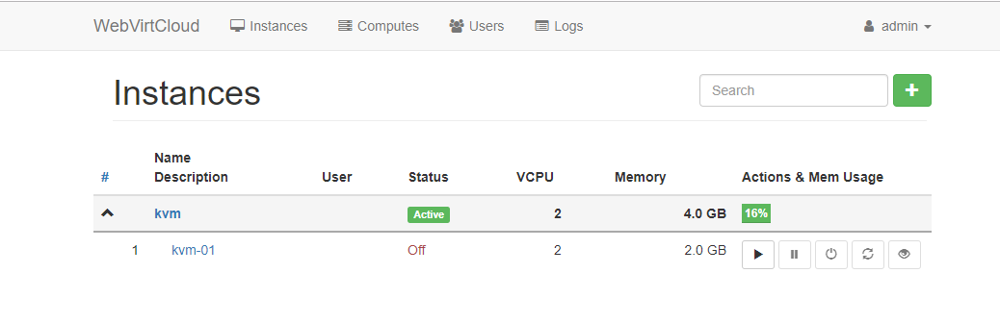  

**Lưu ý:** Khi tạo VM bằng Flavor, khi power on sẽ gặp lỗi. Để sửa lỗi này,bạn cần vào task `User` tạo 1 user mới, gán các quyền cho user mới tạo; log in vào user mới tạo để xóa user admin ban đầu sau đó tạo lại 1 user admin mới. Kết quả bạn có thể sử dụng VM mới tạo bình thường bằng cả 2 user ở trên.
