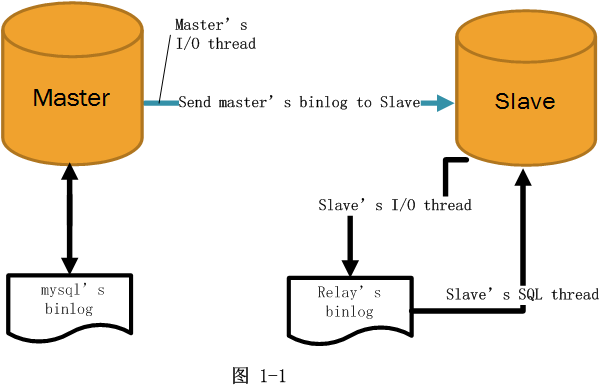

# Tìm hiểu về MariaDB Master-Slave Replication  

## I - Giới thiệu  
- `Master-slave replication` là một kiểu nhân bản(replication) trong đó dữ liệu chỉ được replicated 1 chiều. Server chứa dữ liệu nhân bản được gọi là `Slave`. Server chứa dữ liệu gốc được gọi là `Master`  

  - Các thay đổi xảy ra với dữ liệu gốc trên Master cũng sẽ xảy ra với dữ liệu trên Slave. Slave sẽ tự động sao chép các thay đổi đó.  
  - Những thay đổi với dữ liệu được thực hiện trên Slave sẽ không thay đổi dữ liệu trên Master.  

- `Master-slave replication` được sử dụng cho một số mục đích:  

  - Khả năng mở rộng - Scalability: thao tác ghi có thể được thực hiện trên master trong khi thao tác đọc có thể được trải rộng trên 2 hoặc nhiều slave ==> giúp cải thiện hiệu suất.    
  - Tính sẵn sàng cao - High availability: Tăng dữ liệu dự phòng để cải thiện khả năng chịu lỗi.  
  - Sao lưu chuyên dụng - Dedicated Backup: Bạn có thể có nhiều slave server và 1 trong số chúng được sử dụng chỉ để làm nhiệm vụ backup dữ liệu. Không có truy vấn được gửi đến backup slave server này. Khối lượng công việc trên master và các slave server khác sẽ không bị gián đoạn khi tạo bản sao lưu.  

  

## II - Master-Slave Replication trong MariaDB hoạt động như thế nào?  

  

- MariaDB replication dựa trên **binary log (binlog)**. `binary log` là một bản ghi chứa tất cả các thay đổi trong db, data, structure cũng như thời gian thực thi mỗi câu lệnh. `binlog` bao gồm các log file and 1 index. Các câu lệnh SQL chính như CREATE, ALTER, INSERT, UPDATE và DELETE sẽ được đưa vào nhật ký này; các câu lệnh như SELECT sẽ không được ghi lại. Những thông tin này có thể được ghi chung vào một `query.log file`.  

- Để `replication` hoạt động thì master và slave server phải có cùng một dữ liệu lúc đầu. Sau đó thay đổi(còn gọi là `transaction`) xảy ra trên master server. Master sẽ chỉ định cho mỗi transaction một global transaction ID (GTID) và ghi transaction tới `binlog` của nó. Slave sẽ kiểm tra định kì binlog trên master, nếu có transaction mới thì slave sẽ ghi transaction mới vào **relay log** của nó và thực hiện transaction.  

- `Master-Slave Replication` được gọi là **asynchronous replication**(sao lưu không đồng bộ) có nghĩa là master sẽ thực hiện transaction ngay lập tức mà không đợi slave sao chép transaction do đó sẽ không ảnh hưởng đến hiệu suất ghi. Trong bản ghi không đồng bộ, kết nối giữa master và slave chỉ là kết nối tạm thời không phải là kết nối vĩnh viễn.  

- Đối lập với sao chép không đồng bộ là sao chép đồng bộ, thường được sử dụng trong  multi-master cluster. Với sao chép đồng bộ, một transaction được thực hiện sau khi các thay đổi của nó được sao chép tới mọi nút trong cụm.

- Thiết lập master-slave replication có thể được thực hiện trên 5 bước:  
  - Enable binary log and replication on the master
  - Enable relay log and replication on the slave
  - Dump databases on the master and import them into the slave
  - (optional) Enable TLS encryption
  - Connect the slave to the master

- Hoạt động

  

  - Trên Master:

    - Các kết nối từ web app tới Master DB sẽ mở một `Session_Thread` khi có nhu cầu ghi dữ liệu. `Session_Thread` sẽ ghi các statement SQL vào một file `binlog` (ví dụ với format của binlog là statement-based hoặc mix). Binlog được lưu trữ trong `data_dir` (cấu hình my.cnf) và có thể được cấu hình các thông số như kích thước tối đa bao nhiêu, lưu lại trên server bao nhiêu ngày.

    - Master DB sẽ mở một `Dump_Thread` và gửi binlog tới cho `I/O_Thread` mỗi khi `I/O_Thread` từ Slave DB yêu cầu dữ liệu
  
  - Trên Slave:

    - Trên mỗi Slave DB sẽ mở một `I/O_Thread` kết nối tới Master DB thông qua network, giao thức TCP (với MySQL 5.5 replication chỉ hỗ trợ `Single_Thread` nên mỗi Slave DB sẽ chỉ mở duy nhất một kết nối tới Master DB, các phiên bản sau 5.6, 5.7 hỗ trợ mở đồng thời nhiều kết nối hơn) để yêu cầu binlog.

    - Sau khi `Dump_Thread` gửi binlog tới `I/O_Thead`, `I/O_Thread` sẽ có nhiệm vụ đọc binlog này và ghi vào `relaylog`.

    - Đồng thời trên Slave sẽ mở một `SQL_Thread`, `SQL_Thread` có nhiệm vụ đọc các event từ `relaylog` và apply các event đó vào Slave => quá trình replication hoàn thành.

## III - Thiết lập MariaDB Master-Slave Replication trên CentOS 7  

## TÀI LIỆU THAM KHẢO
- https://kipalog.com/posts/Gioi-thieu-MySQL-Replication
- https://linoxide.com/how-tos/configure-mariadb-replication-centos-linux/
- https://www.linuxbabe.com/mariadb/master-slave-replication-ubuntu-18-04-18-10
- https://techblog.vn/gioi-thieu-ve-mysql-replication-master-slave