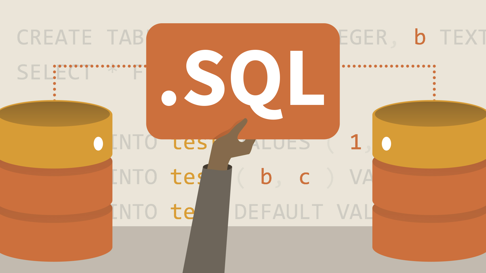

# SQL - Structured Query Language  

   

## Mục lục  

<a name="1"></a>

## I - Giới thiệu  
- `SQL` là viết tắt của Structured Query Language - ngôn ngữ truy vấn cấu trúc được sử dụng cho các hệ quản trị CSDL quan hệ(hệ quản trị biểu diễn dữ liệu dưới dạng bảng. Ngoài ra còn có các mô hình dữ liệu khác như mô hình dữ liệu phân cấp - biểu diễn dữ liệu dưới dạng cây, mô hình dữ liệu mạng - biểu diễn bằng đồ thị có hướng,...).  
- Các thành phần của SQL:  
  - Ngôn ngữ định nghĩa dữ liệu - Data Definition Language(DDL) bao gồm:  
    - Câu lệnh cho phép người dùng định nghĩa CSDL và các đối tượng trong CSDL như các bảng, các khung nhìn, chỉ mục,...
  - Ngôn ngữ thao tác dữ liệu - Data Manipulation Language - DML bao gồm: 
    - Câu lệnh tìm kiếm, thêm, xóa, sửa dữ liệu trong CSDL
  - Ngôn ngữ điều khiển dữ liệu - Data Control Language - DCL bao gồm:  
    - Câu lệnh thay đổi cấu trúc các bảng dữ liệu, khai báo bảo mật thông tin, quyền hạn người dùng trong khai thác CSDL.  

<a name="2"></a>

## II - Ngôn ngữ định nghĩa dữ liệu 
### &nbsp;1. Bảng dữ liệu  
- Dữ liệu bên trong 1 CSDL được tổ chức lưu trữ trong các bảng. Bên trong các bảng, dữ liệu được dưới dạng các dòng và cột.  
- Mỗi dòng biểu diễn cho 1 bản ghi duy nhất. Mỗi cột biểu diễn cho một trường.  

#### &emsp;1.1. Các thuộc tính liên quan đến bảng  
##### &emsp;&emsp;a. Kiểu dữ liệu  
- Mỗi một cột(trường) của một bảng đều phải thuộc vào một kiểu dữ liệu nhất định đã được định nghĩa từ trước. Kiểu dữ liệu qui định các giá trị dữ liệu được cho phép đối với cột đó. Ngoài các kiểu dữ liệu chuẩn có sẵn người dùng cũng có thể tự định nghĩa các kiểu dữ liệu dựa trên các kiểu dữ liệu có sẵn.  
- Một số kiểu dữ liệu thường được sử dụng trong SQL: Binary, Char, Float, Image, Int, Money, Rel, Text, Varchar,..

##### &emsp;&emsp;b. Các ràng buộc - Constraints  
- Trên các bảng dữ liệu, các ràng buộc đước sử dụng với mục đích:  
  - Qui định các giá trị dữ liệu hay khuôn dạng dữ liệu được cho phép chấp nhận trên các cột của bảng(ràng buộc **CHECK**)  
  - Qui định giá trị mặc định cho các cột(ràng buộc **DEFAULT**)  
  - Tạo nên tính toàn vẹn thực thể trong 1 bảng dữ liệu và toàn vẹn tham chiếu giữa các bảng dữ liệu trong CSDL(ràng buộc **PRIMARY KEY**, **UNIQUE** và **FOREIGN KEY**)
  
#### &emsp;1.2. Tạo bảng bằng truy vấn SQL  
##### &emsp;&emsp;a. Tạo bảng dữ liệu  
- Câu lệnh:  
  ```sh
  CREATE TABLE table_name
  (
    {colname_1 col_1_properties [constraints_1 ]
    [,{colname_2 col_2_properties [constraints_2 ]]
    ...
    [,{colname_N col_N_properties [constraints_N ]]
    [table_constraints]
  )
  ```
  Trong đó:  
  - `table_name` - tên bảng cần tạo. Tên của bảng phải là duy nhất trong mỗi CSDL và phải tuân theo các qui tắc về định danh.  
  - `colname_i` - tên của cột trong bảng. Các cột trong bảng phải có tên khác nhau và phải tuân theo các qui tắc về định danh. Mỗi bảng phải có ít nhất 1 cột.  
  - `col_i_properties` - các thuộc tính của cột thứ i qui định kiểu dữ liệu của cột và chỉ định cột có cho phép chấp nhận giá trị NULL hay NOT NULL.  
  - `table_constraint` - các ràng buộc trên bảng dữ liệu.  

  Ví dụ 1.1: Tạo bảng `NHANVIEN` bao gồm các cột MANV, HOTEN, NGAYSINH, DIACHI, DIENTHOAI:  
  


