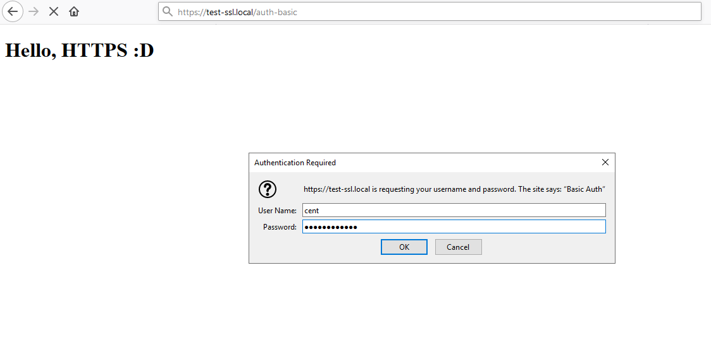
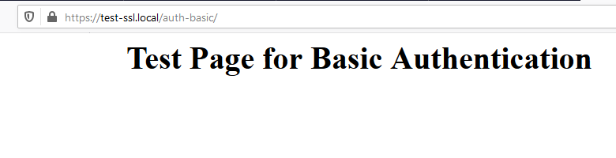

# Nginx : Basic Authentication

Đặt xác thực cơ bản để giới hạn quyền truy cập trên các trang web cụ thể.

## [1] Username và password được gửi với văn bản đơn giản trên xác thực cơ bản, vì vậy [sử dụng kết nối an toàn với SSl/TLS tại đây](ssl_localhost.md)  

### [2] Thêm cấu hình trên trang website bạn muốn giới hạn truy cập  
Trong bài viết này sẽ cấu hình giới hạn truy cập tới thư mục [/auth-basic]

- Cài đặt gói `httpd-tools`  

  ```sh
    dnf -y install httpd-tools
  ```

- Chỉnh sửa file `test-ssl.conf`

  ```sh
    vim /etc/nginx/conf.d/test-ssl.conf
  ```

  Thêm vào nội dung

  ```nginx
    location /auth-basic/ {
        auth_basic            "Basic Auth";
        auth_basic_user_file  "/etc/nginx/.htpasswd";
    }
  ```

- Tạo thư mục `auth-basic`

  ```sh
    mkdir /usr/share/nginx/html/test-ssl/auth-basic
  ```

- Restart service

  ```sh
    systemctl restart nginx
  ```

- Thêm user cho xác thực cơ bản

  ```sh
    htpasswd -c /etc/nginx/.htpasswd cent 
  ```

  OUTPUT
  ```sh
    New password:
    Re-type new password:
    Adding password for user cent
  ```

- Tạo 1 file `index.html` trong thư mục `auth-basic` để hiển thị nội dung trang test.  
  
  ```sh
    vim /usr/share/nginx/html/test-ssl/auth-basic/index.html
  ```


  ```html
    <html>
    <body>
    <div style="width: 100%; font-size: 40px; font-weight: bold; text-align: center;">
    Test Page for Basic Authentication
    </div>
    </body>
    </html>
  ```

## [3] Kiểm tra

- Truy cập vào địa chỉ `https://test-ssl.local/auth-basic/` từ một trình duyệt bất kỳ. Trang web sẽ yêu cầu bạn nhập vào username và password vừa tạo phía trên

    

- Kết quả sau khi xác thực:
  
  