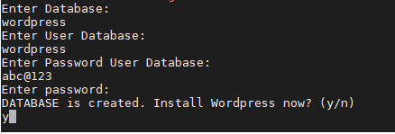

# Hướng dẫn cài đặt LEMP + Wordpress trên CentOS 7 bằng Script  

- Tải script về máy
Vào [link](../tools/CentOS-7) để tải script về máy

- Trong file `lemp.sh` tìm đến phần `server_name` sửa lại địa chỉ IP thành địa chỉ IP máy của bạn. Lưu và thoát file.

  
  
- Chạy script bằng cách sử dụng câu lệnh `bash`

  ```sh
    bash script_name
  ```

- Nhập thông tin về database, user database, password user database sẽ được dùng cho wordpress. Không nhập password cho phần `Enter password`

  

- Kiểm tra: Trên thanh tìm kiếm của trình duyệt của bạn nhập vào địa chỉ `http://your-server-ip/wordpress`.
