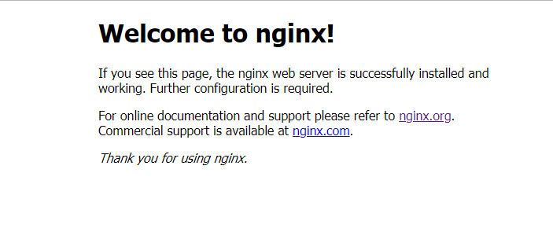

# Cài đặt Nginx Server trên Centos 8  

 

## I - Stable vs. mainline version
Nginx Open Source có sẵn trong hai phiên bản:
- Mainline  – Bao gồm các tính năng mới nhất và sửa lỗi và luôn cập nhật. Nó đáng tin cậy, nhưng nó có thể bao gồm một số mô-đun thử nghiệm và nó cũng có thể có một số lỗi mới.
- Ổn định(Stable)  – Không bao gồm tất cả các tính năng mới nhất, nhưng có các sửa lỗi nghiêm trọng luôn được đưa vào phiên bản chính.

## II - Cài đặt Nginx
- Cài bằng package từ OS Repository
- Cài bằng package từ kho lưu trữ của NGINX Inc.’s.
- Cài bằng source

### 2.1. Cài bằng package từ OS Repository
- Cài EPEL repository
  ```sh
    yum install epel-release
  ```

- Update the repository:
  ```sh
    yum update
  ```

- Install NGINX Open Source
  ```sh
    yum install nginx
  ```

- Kiểm tra lại version của nginx đã được cài đặt
  ```sh
    nginx -v
  ```

### 2.2. Cài bằng package từ kho lưu trữ của NGINX Inc.’s

- Cài đặt kho lưu trữ gói nginx. Sau đó, bạn có thể cài đặt và cập nhật nginx từ kho lưu trữ.  

  ```sh
    yum install -y yum-utils
  ```  

- Để set up yum repository, tạo 1 file với tên `/etc/yum.repos.d/nginx.repo` và thêm vào file:  

  ```sh
    [nginx-stable]
    name=nginx stable repo  
    baseurl=http://nginx.org/packages/centos/$releasever/$basearch/
    gpgcheck=1
    enabled=1
    gpgkey=https://nginx.org/keys/nginx_signing.key
    module_hotfixes=true

    [nginx-mainline]
    name=nginx mainline repo  
    baseurl=http://nginx.org/packages/mainline/centos/$releasever/$basearch/
    gpgcheck=1
    enabled=0
    gpgkey=https://nginx.org/keys/nginx_signing.key
    module_hotfixes=true
  ```  

- Theo mặc định, kho lưu trữ sẽ sử dụng các nginx package ổn định. Nếu bạn muốn sử dụng mainline nginx packages, sử dụng câu lệnh sau:  

  ```sh
    yum-config-manager --enable nginx-mainline
  ```

- Install nginx, chạy câu lệnh:  

  ```sh
    yum install -y nginx
  ```  

- Sau khi install xong, start và enable service `nginx`

  ```sh
    systemctl start nginx
    systemctl enable nginx
  ```  

- Cấu hình firewall  

  ```sh
    firewall-cmd --permanent --zone=public --add-service=http
    firewall-cmd --permanent --zone=public --add-service=https
    firewall-cmd --reload
  ```  

- Kiểm tra hoạt động của Nginx server bằng cách truy cập trên trình duyệt bằng địa chỉ IP của server: ***http://IP***  
  Nếu thành công, màn hình sẽ hiển thị như hình:  

  

### 2.2. Cài từ source code
- Chỉnh sử file `/etc/yum.repos.d/CentOS-AppStream.repo` để tắt việc sử dụng repo mặc định của Centos 8 như sau:

  ```sh
    #gpgcheck=1
    enabled=0
  ````

- Tải xuống source code từ trang web chính thức của NGINX sử dụng câu lệnh `dnf`, sau đó biên dịch các gói để cài đặt nó. 

  ```sh
    dnf groupinstall " Development Tools"  -y
  ```  

- Cài đặt các package dưới đây để biên dịch NGINX từ source của nó  
  ```sh
    dnf install zlib-devel pcre-devel openssl-devel -y
  ```

- Cài đặt epel repository vào target system
  ```sh
    dnf install epel-release -y
  ``` 

- Cài đặt các gói phụ thuộc bên dưới để NGINX có thể chạy trong target system  
  ```sh
     dnf install perl perl-devel perl-ExtUtils-Embed libxslt libxslt-devel libxml2 libxml2-devel gd gd-devel GeoIP GeoIP-devel -y
  ```

- Chỉnh sửa file `/etc/yum.repos.d/CentOS-AppStream.repo` để `enable=1` và bỏ comment `gpgcheck=1` để cài đặt `wget`

- Tải xuống Nginx source code từ trang web chính thức của NGINX
  ```sh
     wget http://nginx.org/download/nginx-1.16.1.tar.gz
  ```

- Giải nén gói đã tải xuống 
  ```sh
    #tar -xzf nginx-1.16.1.tar.gz
    #cd nginx-1.16.1
    #ll
    total 752
    drwxr-xr-x. 6 1001 1001   4096 Dec 17 11:02 auto
    -rw-r--r--. 1 1001 1001 296463 Aug 13 19:51 CHANGES
    -rw-r--r--. 1 1001 1001 452171 Aug 13 19:51 CHANGES.ru
    drwxr-xr-x. 2 1001 1001    168 Dec 17 11:02 conf
    -rwxr-xr-x. 1 1001 1001   2502 Aug 13 19:51 configure
    drwxr-xr-x. 4 1001 1001     72 Dec 17 11:02 contrib
    drwxr-xr-x. 2 1001 1001     40 Dec 17 11:02 html
    -rw-r--r--. 1 1001 1001   1397 Aug 13 19:51 LICENSE
    drwxr-xr-x. 2 1001 1001     21 Dec 17 11:02 man
    -rw-r--r--. 1 1001 1001     49 Aug 13 19:51 README
    drwxr-xr-x. 9 1001 1001     91 Dec 17 11:02 src
  ```

- Để định cấu hình quy trình cài đặt Nginx, chạy câu lệnh `./configure` với các tùy chọn. Để xem các tùy chọn, thực hiện câu lệnh

  ```sh
    pwd
  /root/nginx-1.16.1
    ./configure --help
  ```
  
  Bạn cũng có thể cài đặt cấu hình mặc định bằng cách chạy câu lệnh `./configure` mà không sử dụng thêm tùy chọn nào.  

- Chạy configure script command dưới

  ```sh
    ./configure --prefix=/etc/nginx --sbin-path=/usr/sbin/nginx --error-log-path=/var/log/nginx/error.log --pid-path=/var/run/nginx.pid --lock-path=/var/run/nginx.lock --user=nginx --group=nginx
  ```

> Nếu gặp lỗi như ở dưới
  ```sh
  checking for OS
  + Linux 4.18.0-80.el8.x86_64 x86_64
  checking for C compiler ... not found

  ./configure: error: C compiler cc is not found
  ```
  **Fix**

  - Cài đặt `gcc` bằng câu lệnh:

    ```sh
      dnf install gcc -y
    ```
  
  - Sau khi cài đặt, bạn có thể xác minh lại như dưới đây.
    ```sh
      # gcc
    gcc: fatal error: no input files
    compilation terminated.
    ```
  
  - Bây giờ bạn có thể thực hiện lại câu lệnh phía trên.

- Thực thi lệnh `make` cho tiến trình cấu hình

  ```sh
    #make
  ```

- Cài đặt NGINX cùng với câu lệnh `make` như sau:

  ```sh
    make install
  ```

- Kiểm tra version của nginx
  ```sh
    nginx -v
  nginx version: nginx/1.16.1
  ```

- Tạo user cho Nginx và đặt quyền sở hữu thích hợp cho thư mục cài đặt Nginx bằng cách chạy lệnh sau.
  ```sh
    useradd nginx
    chown -R nginx:nginx /etc/nginx/
  ```

- Định cấu hình service daemon cho Nginx bằng cách sử dụng trình chỉnh sửa vim chỉnh sửa nội dung file `/usr/lib/systemd/system/nginx.service` và nhập nội dung sau vào tệp. Lưu và thoát tệp.

  ```sh
    vim /usr/lib/systemd/system/nginx.service
    [Unit]
    Description=nginx - high performance web server
    Documentation=https://nginx.org/en/docs/
    After=network-online.target remote-fs.target nss-lookup.target
    Wants=network-online.target

    [Service]
    Type=forking
    PIDFile=/var/run/nginx.pid
    ExecStartPre=/usr/sbin/nginx -t -c /etc/nginx/conf/nginx.conf
    ExecStart=/usr/sbin/nginx -c /etc/nginx/conf/nginx.conf
    ExecReload=/bin/kill -s HUP $MAINPID
    ExecStop=/bin/kill -s TERM $MAINPID

    [Install]
    WantedBy=multi-user.target
  ```

- Start và enable Nginx service 
  ```sh
    systemctl start nginx
    systemctl enable nginx
  ```

- Stop firewalld
  ```sh
    systemctl stop firewalld
  ```

- Kiểm tra bằng cách nhập địa chỉ IP của server cài Nginx lên trình duyệt. Kết quả sẽ như trong hình dưới

  


## TÀI LIỆU THAM KHẢO
- https://linuxize.com/post/how-to-install-nginx-on-centos-8/#nginx-configuration-files-structure-and-best-practices
- https://www.nginx.com/resources/wiki/start/topics/examples/server_blocks/
- https://nginx.org/en/
- https://www.linuxhelp.com/how-to-install-nginx-from-source-code-on-centos-7