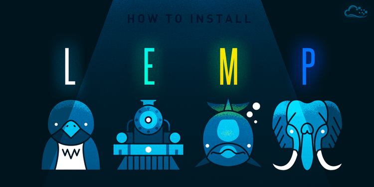
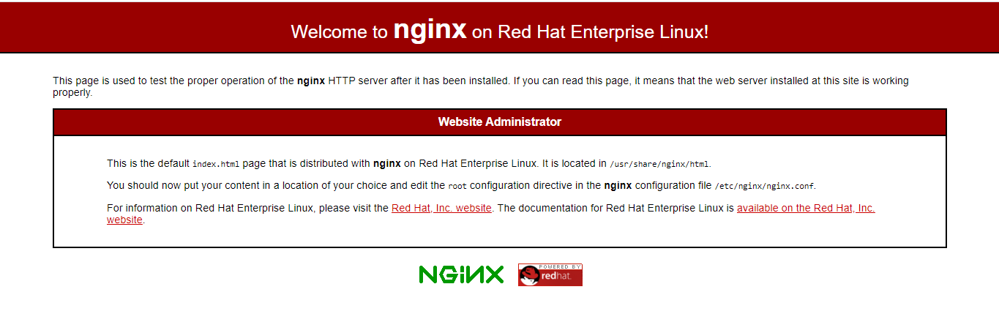
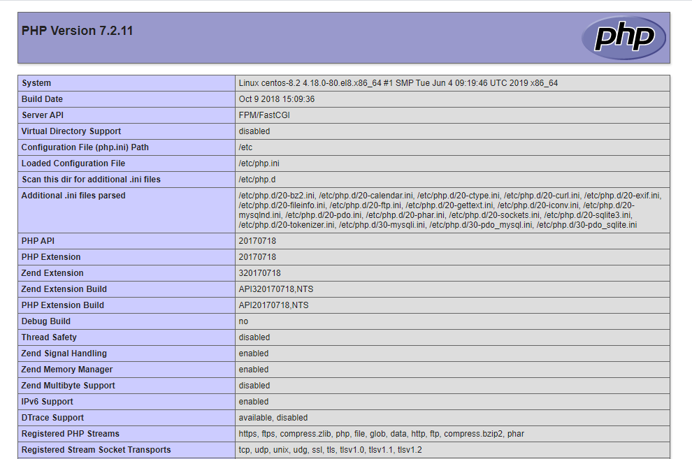

  

# Cài đặt LEMP Stack trên Centos 8  

## Giới thiệu  

Cũng giống với LAMP Stack, LEMP Stack là một bộ công cụ mã nguồn mở thường được sử dụng cho phát triển và triển khai các ứng dụng web. LEMP là viết tắt của Linux Operating System(trong bài viết này sử dụng OS là Centos 8), Nginx(Engine-X) là 1 web server nhẹ và mạnh mẽ, hệ quản trị CSDL MySQL/MariaDB, ngôn ngữ kịch bản phía máy chủ PHP.  

## Cài đặt  

- Chạy câu lệnh update system  

  ```sh
    dnf update -y
  ```  

### Cài đặt Nginx trên Centos 8  

- Nginx có sẵn trong repo AppStream mặc định của CentOS 8. Sử dụng câu lệnh dưới để cài đặt Nginx từ kho lưu trữ mặc định của CentOS 8.  

  ```sh
    dnf install nginx -y
  ```

- Kiểm tra version

  ```sh
    nginx -v
    nginx version: nginx/1.14.1
  ```  

- Sau khi cài đặt xong, enable và start service

  ```sh
    systemctl enable nginx
    systemctl start nginx
  ```  

- Kiểm tra status service

  ```sh
    systemctl status nginx
  ```

- Cấu hình firewall cho Nginx

  ```sh
    firewall-cmd --add-port=80/tcp --permanent
    firewall-cmd --reload
  ```  

- Kiểm tra hoạt động của Nginx: trên trình duyệt của bạn, gõ vào thanh tìm kiếm địa chỉ IP của server. Kết quả:

    


### Cài đặt MariaDB Database Server  

- Cài đặt MariaDB trên CentOS 8 với câu lệnh:  

  ```sh
    dnf install mariadb-server -y
  ```  

- Kiểm tra version:

  ```sh
    mysql -V
    mysql  Ver 15.1 Distrib 10.3.11-MariaDB, for Linux (x86_64) using readline 5.1
  ```

    Trong repo mặc định của CentOS 8 sẽ sử dụng MariaDB v10.3.11, nếu muốn sử dụng MariaDB v10.4, bạn có thể làm theo [hướng dẫn cài MariaDB 10.4.8 trên CentOS 8](https://github.com/nhanhoadocs/thuctapsinh/blob/master/HienNT/Linux/docs/CentOS_8/install_mariadb.md)  

- Sau khi cài đặt, enable và start service

  ```sh
    systemctl enable mariadb
    systemctl start mariadb
  ```

- Kiểm tra trạng thái service

  ```sh
    systemctl status mariadb
  ```

- Chạy câu lệnh dưới để disable remote root login, remove test databases, remove anonymous user accounts.

  ```sh
    mysql_secure_installation
  ```  

### Cài đặt PHP trên CentOS 8  

- Cài đặt PHP và các mô-đun PHP cần thiết trên CentOS 8 bằng cách sử dụng câu lệnh

  ```sh
    dnf install php php-fpm php-mysqlnd -y
  ```  

- Nếu cần sử dụng các PHP extensions khác cho ứng dụng web của bạn, sử dụng câu lệnh:

  ```sh
    dnf install php-EXTENSION
  ```

    Thay thế `EXTENSION` bằng mô-đun PHP tương ứng của bạn.  

- Kiểm tra version của PHP

  ```sh
    php -v
    PHP 7.2.11 (cli) (built: Oct  9 2018 15:09:36) ( NTS )
    Copyright (c) 1997-2018 The PHP Group
    Zend Engine v3.2.0, Copyright (c) 1998-2018 Zend Technologies
  ```  

- Start và enable PHP-FPM để cho phép khởi động cùng hệ thống

  ```sh
    systemctl enable php-fpm
    systemctl start php-fpm
  ```  

- Kiểm tra PHP trên CentOS 8

    Kiểm tra PHP để xác nhận nó đang hoạt động theo yêu cầu đồng thời kiểm tra version và các mô-đun PHP.  

  - Sử dụng câu lệnh:

    ```sh
      tee /usr/share/nginx/html/info.php<<EOF
    > <?php
    > phpinfo();
    > ?>
    > EOF
    ```

  - Restart dịch vụ Nginx
   
    ```sh
      systemctl restart nginx
    ```

  - Sử dụng trình duyệt của bạn, truy cập theo địa chỉ `http://<server-IP>/info.php`. Kết quả:

      

  - Xóa trang test sau khi test xong

    ```sh
      rm -rf /var/www/html/info.php
    ```  


