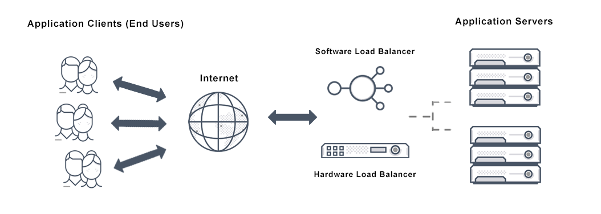
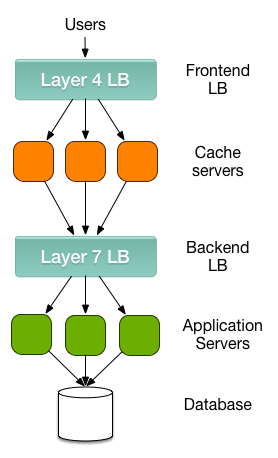
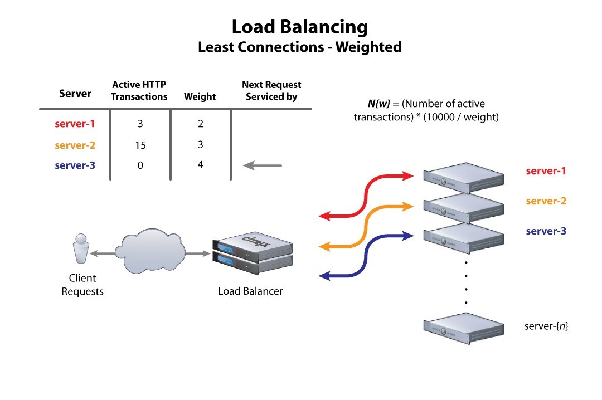
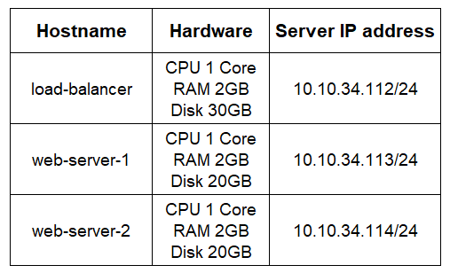
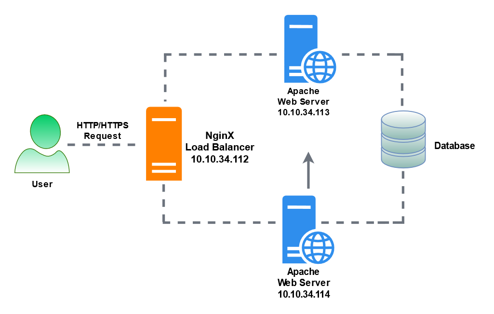
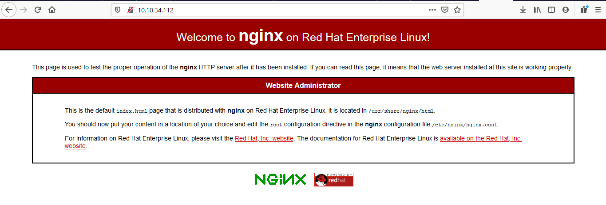

# Thiết lập cân bằng tải(load balancer) trong hệ thống máy chủ Nginx


## Cân bằng tải(Load Balancing) là gì?
- `Load Balancing` hay còn gọi là cân bằng tải là một kỹ thuật thường được sử dụng để tối ưu hóa việc sử dụng tài nguyên, băng thông, giảm độ trễ, và tăng cường khả năng chịu lỗi.

- Khi chúng ta có nhiều hơn một web server, cùng với đó là sự gia tăng lưu lượng truy cập thì việc bổ sung thêm một máy chủ để phân phối lưu lượng này một cách hợp lý là cần thiết. Máy chủ được bổ sung này được gọi là Load balancer.

    

- Load balancers thường được chia thành hai loại chính: Layer 4 và Layer 7.

  

  - Cân bằng tải Layer 4 hoạt động dựa trên dữ liệu tìm thấy trong các giao thức mạng và giao vận layer (IP, TCP, FTP, UDP).
  - Các bộ cân bằng tải Layer 7 phân phối các yêu cầu dựa trên dữ liệu được tìm thấy trong các giao thức layer ứng dụng như HTTP.
  - Bộ cân bằng tải Layer 7 (Load balancer Layer 7) có thể phân phối thêm các requests dựa trên dữ liệu cụ thể của ứng dụng như HTTP header, cookies hoặc dữ liệu trong chính thông báo ứng dụng, chẳng hạn như giá trị của một thông số cụ thể.

  Yêu cầu (request) được nhận bởi cả 2 loại Load balancer (cân bằng tải) và chúng được phân phối đến một server cụ thể dựa trên một thuật toán được cấu hình. 

- **Một số thuật toán được sử dụng trong các hệ thống cân bằng tải là:**

  - `Round robin:` Là thuật toán điều phối vòng tròn, các máy chủ sẽ được xem ngang hàng và sắp xếp theo một vòng quay. Các truy vấn dịch vụ sẽ lần lượt được gửi tới các máy chủ theo thứ tự sắp xếp.
  
  - `Weighted round robin:` Tương tự như kỹ thuật Round Robin nhưng WRR còn có khả năng xử lý theo cấu hình của từng server đích. Mỗi máy chủ được đánh giá bằng một số nguyên (giá trị trọng số Weight – mặc định giá trị là 1). Một server có khả năng xử lý gấp đôi server khác sẽ được đánh số lớn hơn và nhận được số request gấp đôi từ bộ cân bằng tải.

  - `Least connections:` Các requests sẽ được chuyển vào server có ít kết nối nhất trong hệ thống. Thuật toán này được coi như thuật toán động, vì nó phải đếm số kết nối đang hoạt động của server.

    

  - `Least response time:`  Đây là thuật toán dựa trên tính toán thời gian đáp ứng của mỗi server (response time), thuật toán này sẽ chọn server nào có thời gian đáp ứng nhanh nhất. Thời gian đáp ứng được xác định bởi khoảng thời gian giữa thời điểm gửi một gói tin đến server và thời điểm nhận được gói tin trả lời.

  - `IP Hash:` Thuật toán xác định kết nối chính xác từ một IP của máy khách sẽ được kết nối trực tiếp đến một server backend.

## Sử dụng NGINX làm load balancer cho Web Server Apache trên CentOS 8

### Chuẩn bị
- 3 máy chủ ảo chạy CentOS 8
- Phân hoạch IP

    

- Mô hình

    

### Thiết lập ban đầu
### [Tại node Load Balancer]
- Thiết lập hostname, cập nhật hệ thống
  ```sh
    hostnamectl set-hostname load-balancer
    dnf update -y
  ```

- Tắt Firewall và SELinux
  ```sh
    sed -i 's/SELINUX=enforcing/SELINUX=disabled/g' /etc/sysconfig/selinux
    sed -i 's/SELINUX=enforcing/SELINUX=disabled/g' /etc/selinux/config
    systemctl stop firewalld
    systemctl disable firewalld
  ```

- Cấu hình host file
  ```sh
    echo "10.10.34.112 loadbalancer" >> /etc/hosts
    echo "10.10.34.113 web1" >> /etc/hosts
    echo "10.10.34.114 web2" >> /etc/hosts
  ```

- Khởi động lại hệ thống
  ```sh
    init 6
  ```

#### [Tại node web1]
- Thiết lập hostname, cập nhật hệ thống
  ```sh
    hostnamectl set-hostname web-server-1
  ```

- Tắt Firewall và SELinux
  ```sh
    sed -i 's/SELINUX=enforcing/SELINUX=disabled/g' /etc/sysconfig/selinux
    sed -i 's/SELINUX=enforcing/SELINUX=disabled/g' /etc/selinux/config
    systemctl stop firewalld
    systemctl disable firewalld
  ```

- Cấu hình host file
  ```sh
    echo "10.10.34.112 loadbalancer" >> /etc/hosts
    echo "10.10.34.113 web1" >> /etc/hosts
    echo "10.10.34.114 web2" >> /etc/hosts
  ```

- Khởi động lại hệ thống
  ```sh
    init 6
  ```

#### [Tại node web2]
- Thiết lập hostname, cập nhật hệ thống
  ```sh
    hostnamectl set-hostname web-server-2
  ```

- Tắt Firewall và SELinux
  ```sh
    sed -i 's/SELINUX=enforcing/SELINUX=disabled/g' /etc/sysconfig/selinux
    sed -i 's/SELINUX=enforcing/SELINUX=disabled/g' /etc/selinux/config
    systemctl stop firewalld
    systemctl disable firewalld
  ```

- Cấu hình host file
  ```sh
    echo "10.10.34.112 loadbalancer" >> /etc/hosts
    echo "10.10.34.113 web1" >> /etc/hosts
    echo "10.10.34.114 web2" >> /etc/hosts
  ```

- Khởi động lại hệ thống
  ```sh
    init 6
  ```

### Cài đặt

#### [1] Trên node Nginx Load Balancer 

- Thêm repo của NginX
  ```sh
    dnf install -y epel-release
  ```

- Cài đặt NginX
  ```sh
    dnf install -y nginx
  ```

- Khởi động nginx 
  ```sh
    systemctl enable nginx
    systemctl start nginx
  ```

- Khởi động firewall
  ```sh
    systemctl enable firewalld
    systemctl start firewalld
  ```

- Cấu hình firewall và restart lại dịch vụ
  ```sh
    firewall-cmd --permanent --zone=public --add-service=http 
    firewall-cmd --permanent --zone=public --add-service=https
    firewall-cmd --reload
  ```

- Truy cập vào địa chỉ IP của server để kiểm tra

    

- Sửa file config của Nginx

  ```sh
    vim /etc/nginx/nginx.conf
  ```

  - Thêm vào http block cấu hình sau
    ```sh
    upstream backends {
        server 10.10.34.113:80 weight=3;
        server 10.10.34.114:80 weight=2;
    }
    # Cấu hình trên có nghĩa là cứ 5 request gửi tới server sẽ có 3 request vào web 1 và 2 request vào web 2.
    ```

  - Tại block server thêm hoặc sửa các cấu hình thành như sau

    ```nginx
    server {

        listen      80 default_server;
        listen      [::]:80 default_server;
        server_name _;

        proxy_redirect           off;
        proxy_set_header         X-Real-IP $remote_addr;
        proxy_set_header         X-Forwarded-For $proxy_add_x_forwarded_for;
        proxy_set_header         Host $http_host;

        location / {
            proxy_pass http://backends;
        }
    ```

- Restart lại nginx
  ```sh
    systemctl restart nginx
  ```

#### [2] Trên các node Apache Web server

- Cài đặt Apache
  ```sh
    dnf install -y httpd
  ```

- Khởi động apache 
  ```sh
    systemctl enable httpd
    systemctl start httpd
  ```

- Truy cập thư mục `/var/www/html`

  ```sh
    cd /var/www/html
  ```

  - Tạo file `index.html`

    ```sh
      vim index.html
    ```

  - Thêm nội dung vào file index.html

    ```sh
      Hello!!!
      WEB SERVER 1(2)
    ```

#### [3] Kiểm tra
- Truy cập vào địa chỉ của máy cài Nginx

  - Lần 1

    

  - Lần 3

    


## TÀI LIỆU THAM KHẢO
- https://www.journaldev.com/29943/haproxy-load-balancer-nginx-centos
- 
