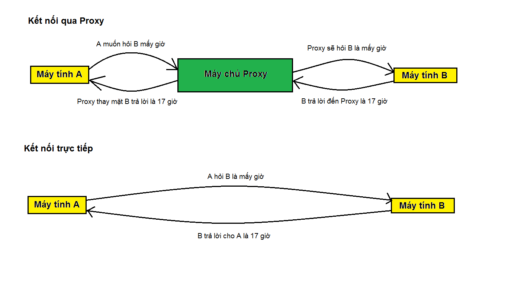
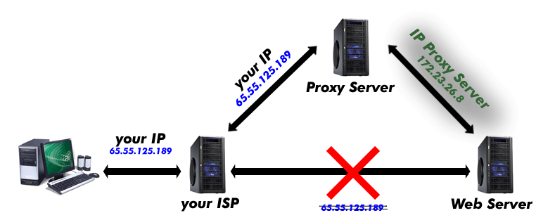
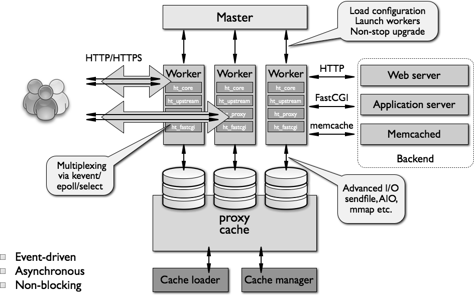

  

# Tìm hiểu về NGINX  

## NGINX là gì?  
- NGINX(đọc là "engine x") là một phần mềm mã nguồn mở cho web serving, reverse proxying, caching, load balancing, media streaming,...Ban đầu nó giống như một web server được thiết kế để cho hiệu suất(performance) và tính ổn định(stability) cao nhất. Ngoài khả năng là 1 HTTP server, NGINX cũng có thể hoạt động như một proxy server cho email(IMAP, POP3 và SMTP) và reverse proxy và load balancer cho HTTP, TCP, và UDP server.

- NGINX xuất bản chính thức vào tháng 10 năm 2004. Nhà sáng lập của phần mềm này là Igor Sysoev, triển khai dự án từ năm 2002 để giải quyết vấn đề [C10k](https://en.wikipedia.org/wiki/C10k_problem). C10k là giới hạn của việc xử lý 10 ngàn kết nối cùng lúc. Ngày nay, có nhiều web server còn phải chịu nhiều kết nối hơn vậy để xử lý. NGINX sử dụng kiến trúc hướng sự kiện (event-driven) không đồng bộ (asynchronous). Tính năng này khiến NGINX server trở nên đáng tin cậy, tốc độ và khả năng mở rộng lớn nhất.

- Vì khả năng mạnh mẽ, và để có thể xử lý hàng ngàn kết nối cùng lúc, nhiều website có traffic lớn đã sử dụng dịch vụ NGINX. Một vài trong số những ông lớn công nghệ dùng nó là Google, Netflix, Adobe, Cloudflare, WordPress, và còn nhiều hơn nữa.

## Các khái niệm liên quan tới nginx
- ***Proxy Server:*** Một proxy server về cơ bản là một máy tính trên mạng internet với địa chỉ IP riêng mà máy tính của người dùng có thể nhận biết được. Khi bạn gửi đi một web request, request đó sẽ tới proxy server trước tiên. Proxy server sau đó sẽ thay bạn thực hiện web request, nhận các phản hồi từ web server và chuyển bạn đến trang web dữ liệu để bạn có thể xem trang trong trình duyệt của mình. Khi proxy server chuyển tiếp web request của bạn, server có thể gây ra các thay đổi trong dữ liệu gửi đi mà vẫn cung cấp cho bạn thông tin mà bạn mong muốn. Một proxy server có thể thay đổi địa chỉ IP nên web server sẽ không thể biết được vị trí chính xác của bạn là ở đâu. Proxy server có thể mã hóa dữ liệu và ẩn chúng (không thể đọc được) trong lúc chuyển tiếp. Và cuối cùng, một proxy server có thể chặn truy cập một trang web nhất định dựa trên địa chỉ IP.

  
  

  << Xem thêm [tại đây](https://tech.bizflycloud.vn/proxy-la-gi-20181029114707565.htm) >>

- ***Reverse Proxy:*** Là một loại proxy server trung gian giữa server và các client. Nó được đặt bên phía server. Nó kiểm soát yêu cầu của các client, nếu hợp lệ, sẽ chuyển đến các server thích ứng.
  > Có 1 loại proxy server khác là forward proxy, nó là một trung gian cho các client liên hệ với nó liên lạc với bất kỳ server nào, còn reverse proxy là một trung gian cho các server liên hệ với nó được liên lạc bởi bất kỳ client nào.  

    

  Ảnh từ: [https://docs.microsoft.com](https://docs.microsoft.com/en-us/iis/extensions/configuring-application-request-routing-arr/creating-a-forward-proxy-using-application-request-routing)

- ***Load balancer:*** là một phương pháp để tối ưu khả năng sử dụng tài nguyên. Tài nguyên ở đây có thể là network, disk, web server,...  

  Load balancer có thể là thiết bị vật lý hoặc application.  

  Mục đích của load balancer là tối ưu tài nguyên sử dụng, tối đa hóa thông lượng, tối thiểu thời gian phản hồi, tránh quá tải ở một đơn vị tài nguyên từ đó đảm bảm hệ thống ổn định và luôn sẵn có (available).

## Kiến trúc NGINX  

   
   
- Nginx hoạt động theo kiến trúc bất đồng bộ(asynchronous) và hướng sự kiện(event driven)
- Khi khởi chạy service, Nginx khởi tạo 1 process được gọi là `master process` - tiến trình cha, đây cũng là process duy nhất tồn tại trong bộ nhớ.
  - Master process được chạy với quyền của tài khoản và nhóm tài khoản hiện tại (thường là root/root nếu service được chạy tại thời gian khởi động bởi script init).
  - Master process sẽ không trực tiếp xử lý các request từ client mà nó sẽ tạo ra các `worker process` - tiến trình công nhân để trực tiếp xử lý các request đến từ phía client. 
  - Mỗi worker sẽ handle nhiều connection(có thể lên đến hàng ngàn). Các worker làm được điều này là nhờ sử dụng kiến trúc fast looping vừa kiểm tra vừa thực hiện các sự kiện trên.
  - Số worker process, số lượng kết nối tối đa cho mỗi worker process, tài khoản và nhóm tài khoản mà các worker process chạy dưới quyền có thể được cấu hình trong file config của nginx. 

- Kiến trúc NGINX:
  - ***Master process:*** thực thi những tác vụ như đọc config, binding ports, tạo một số lượng các process con. Cache loader process: process này chạy lúc khởi động để nạp bộ nhớ disk cache vào memory sau đó nó sẽ exit. Process này được lên kế hoạch trước, sử dụng ít tài nguyên hệ thống.
  - ***Cache manager process:*** process chạy định kỳ, để giữ cho bộ nhớ disk cache luôn đúng kích thước như trong config.
  - ***Worker process:*** là những process làm việc với connections, nó đọc và ghi nội dung vào disk, giao tiếp với app server, handle request từ clients.

## Tính năng chính của NGINX

### Những tính năng của máy chủ HTTP Nginx
- Có khả năng xử lý hơn 10.000 kết nối cùng lúc với bộ nhớ thấp.
- Webserver cho các ứng dụng website
- Proxy Server cho email(IMAP, POP3 và SMTP)
- Load balancer cho HTTP, TCP và UDP server
- Content cache gia tăng performence cho hệ thống
- Hỗ trợ Websocket
- Security Controls(Giới hạn kết nối từ địa chỉ IP)
- Phục vụ tập tin tĩnh (static files), index file và auto indexing.
- [Rewrite URL](https://vi.wikipedia.org/wiki/Rewrite_URL) (URL rewriting) dùng regular expressions
- Tăng tốc reverse proxy bằng bộ nhớ đệm (cache), cân bằng tải đơn giản và khả năng chịu lỗi.
- Hỗ trợ tăng tốc với bộ nhớ đệm của FastCGI, uwsgi, SCGI, và các máy chủ memcached.
- Kiến trúc modular, tăng tốc độ nạp trang bằng nén gzip tự động.
- Hỗ trợ mã hoá SSL và TLS.
- Cấu hình linh hoạt; lưu lại nhật ký truy vấn
- Chuyển hướng lỗi 3XX-5XX
- Hạn chế tỷ lệ đáp ứng truy vấn
- Giới hạn số kết nối đồng thời hoặc truy vấn từ 1 địa chỉ
- Khả năng nhúng mã PERL
- Hỗ trợ và tương thích với IPv6
- Hỗ trợ WebSockets
- Hỗ trợ truyền tải file FLV và MP4

### Những tính năng máy chủ mail proxy của Nginx
- Các phương pháp xác thực :

    - POP3: USER/PASS, APOP, AUTH LOGIN/PLAIN/CRAM-MD5;

    - IMAP: LOGIN, AUTH LOGIN/PLAIN/CRAM-MD5;

    - SMTP: AUTH LOGIN/PLAIN/CRAM-MD5;

- Hỗ trợ SSL, STARTTLS và STLS

## Hạn chế của Nginx
Không support [.htaccess](https://blog.tinohost.com/file-htaccess-la-gi-tac-dung-cua-file-htaccess/)

## Hoạt động của Nginx server  
- Cách web server hoạt động: khi bạn gửi một yêu cầu để mở một trang web. Trình duyệt sẽ liên lạc với server chứa website đó. Sau đó, server sẽ tìm kiếm đúng file yêu cầu của trang đó và gửi ngược về cho server. Đây là một loại truy vấn đơn giản nhất.

  Ví dụ trên được xem như là một single thread – một bộ các bước xử lý dữ liệu được thực thi theo 1 trình tự duy nhất. Web server truyền thống tạo một thread cho mỗi yêu cầu (request). 
  
- Hoạt động của Nginx server: NGINX hoạt động theo một cách khác. Nó hoạt động theo kiến trúc bất đồng bộ (asynchronous), hướng sự kiện (event driven). Kiến trúc này có thể hiểu là những threads tương đồng nhau sẽ được quản lý trong một tiến trình (process), và mỗi tiến trình hoạt động chứa các thực thể nhỏ hơn gọi là worker connections. Cả bộ đơn vị này chịu trách nhiệm xử lý các threads.

  Worker connections sẽ gửi các truy vấn cho một worker process, worker process sẽ gửi nó tới process cha (master process). Cuối cùng, master process sẽ trả kết quả cho những yêu cầu đó.

## TÀI LIỆU THAM KHẢO
- https://www.nginx.com/resources/glossary/nginx/
- https://blog.vietnamlab.vn/2019/11/19/nginx-co-ban/
- https://www.hostinger.vn/huong-dan/nginx-la-gi-no-hoat-dong-nhu-the-nao/
- https://tech.bizflycloud.vn/nginx-la-gi-cach-cai-dat-nginx-20181101092814419.html

