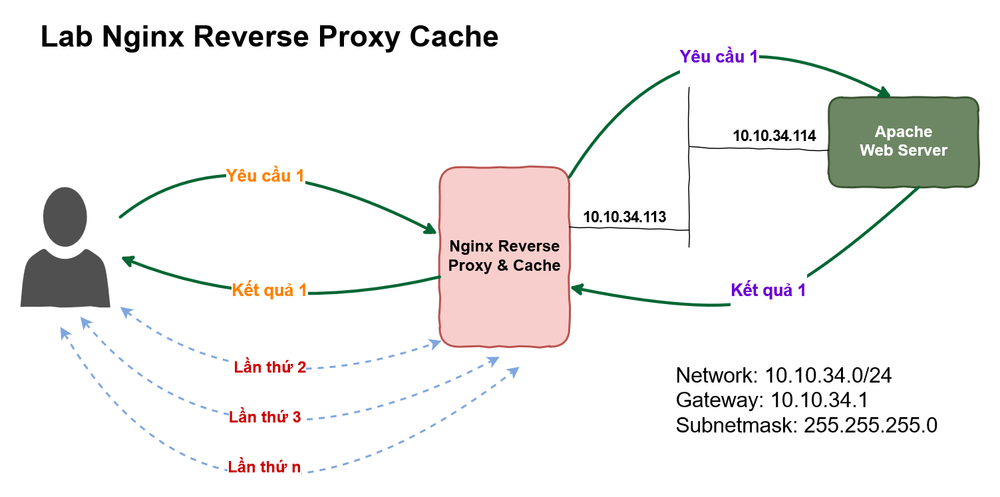
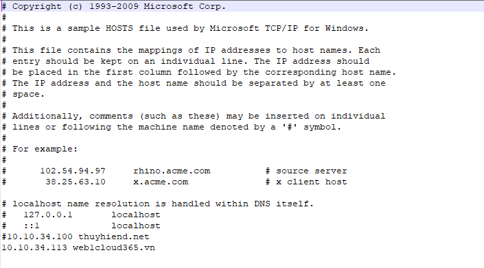
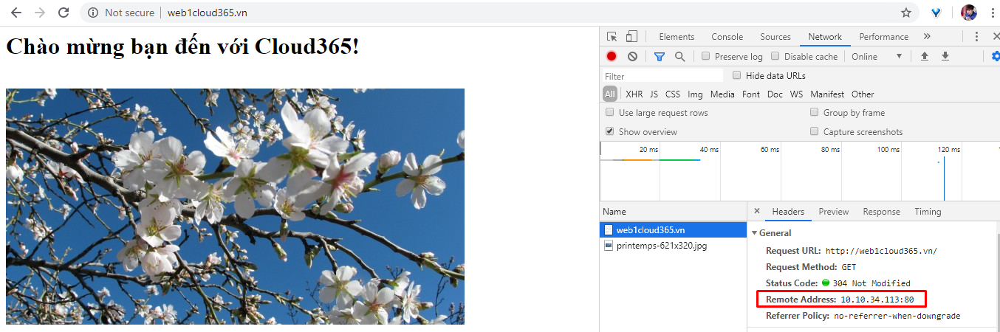
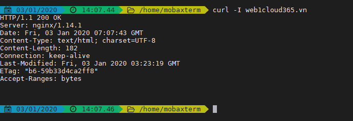
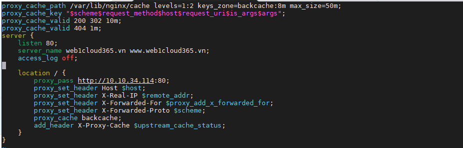
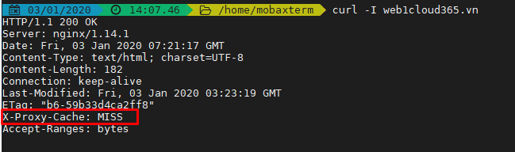
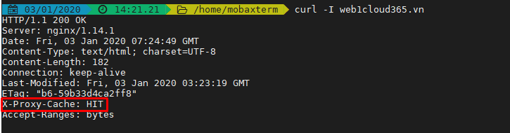
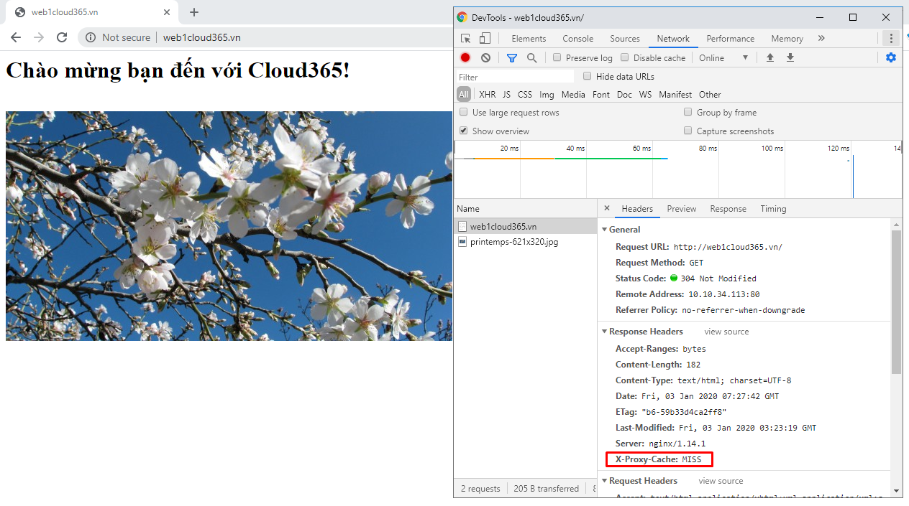
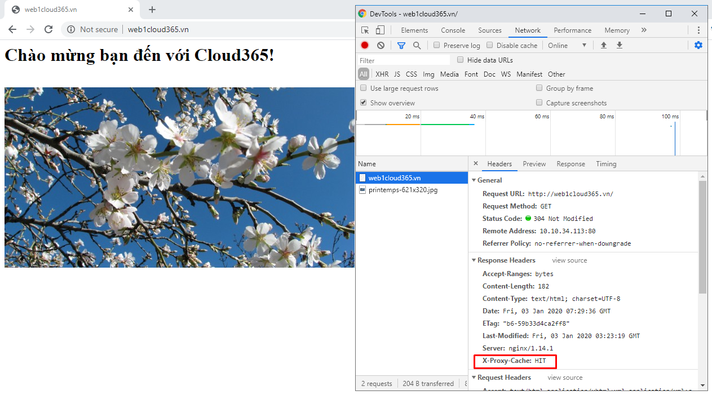
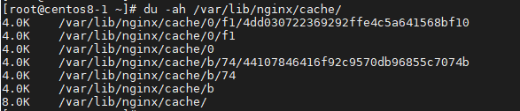

# LAB NGINX REVERS PROXY & CACHING  

## Giới thiệu  

- *Cache:* Tác dụng của cache là giúp tăng tốc độ truy cập dữ liệu và giảm tắc nghẽn băng thông khi có quá nhiều người cùng truy cập vào 1 dữ liệu cần dùng.  

- *Nginx đóng vai trò là Cache:* ngoài việc đóng vai trò là reverse proxy server, nginx còn có thêm chức năng nữa là cache. Kỹ thuật cache trong nginx được sử dụng để tăng tốc độ truy cập web hoặc ứng dụng trong các giải pháp CDN(Conten Dilevery Network).

    

  Hình ảnh mô tả hoạt động của reverse proxy. Có thể tận dụng mô hình này để triển khai cache cho nginx.

  Trong bài lab này sẽ giới thiệu cho bạn cách sử dụng nginx để triển khai reverse proxy và cache.

## Mô hình triển khai



## Các hoạt động triển khai  
- Trên Web Server(10.10.34.114 - VM)
  - Cài đặt Apache Web Server
  - Tạo 1 site html đơn giản(có ảnh hoặc file js) hoặc up các file ảnh.

- Trên máy 10.10.34.113 - VM
  - Cài đặt Nginx
  - Cấu hình Nginx với chức năng reverse proxy và cache
 
- Kiểm tra trên máy vật lý:
  - Mở trình duyệt truy cập vào domain đã được cấu hình ở trên hoặc sử dụng lệnh `curl` với tùy chọn `-I` để kiểm tra hoạt động của proxy.
  - Truy cập nhiều lần vào domain phía trên hoặc sử dụng lệnh `curl` để kiểm tra hoạt động của cache.  

## Các bước thực hiện
### 1. Trên VM 10.10.34.114  
- SSH bằng root user hoặc user có quyền sudo
- Cài đặt các gói bổ trợ
  ```sh
    dnf -y update
    dnf install -y epel-release
    dnf install -y wget byobu
  ```  

- Cài đặt Apache  
  - Cài đặt gói `httpd`  

    ```sh
      dnf install -y httpd
    ```

  - Start service httpd và cấu hình cho phép httpd khởi động cùng hệ thống:  

    ```sh
      systemctl enable httpd
      systemctl start httpd
    ```

  - Kiểm tra hoạt động của httpd:

    ```sh
      systemctl status httpd
    ```

- Cấu hình Apache

  - Tạo file Vhost trên Apache 
    ```sh
      cd /etc/httpd/conf.d
      cat >> web1cloud365.vn.conf << EOF
    <VirtualHost *:80>

        ServerName web1cloud365.vn
        ServerAlias www.web1cloud365.vn
        ServerAdmin webmaster@web1cloud365.vn
        DocumentRoot "/var/www/web1cloud365.vn/public_html"
        ErrorLog "/var/log/httpd/web1cloud365.vn-error_log"
        CustomLog "/var/log/httpd/web1cloud365.vn-access_log" combined
        <Directory "/var/www/web1cloud365.vn">
            DirectoryIndex index.html
            Options FollowSymLinks
            AllowOverride All
            Require all granted
        </Directory>
    </VirtualHost>
    EOF
    ```
 
  - Sử dụng lệnh dưới để tải file `content.html` về máy

    ```sh
      wget -O /var/www/html/web1cloud365.vn/index.html https://gist.githubusercontent.com/thuyhiend/8a35a0550cf833e7429b38a4db277416/raw/2392e411df0eb4648baa86b7a7c3e872a244f5f7/content.html
    ```

  - Restart service httpd
    ```sh
      systemctl restart httpd
    ```

- Truy cập vào địa chỉ IP của máy webserver hoặc gõ domain `web1cloud365.vn` trên trình duyệt. Nội dung của trang sẽ như hình:

    


### 2. Trên VM 10.10.34.113
- SSH với root user hoặc với user có quyền sudo.  
- Cài đặt các gói bổ trợ
  ```sh
    dnf -y update
    dnf install -y epel-release
    dnf install -y wget byobu
  ``` 

- Cài đặt Nginx từ kho lưu trữ mặc định của CentOS 8
  - Cài đặt gói nginx
   
    ```sh
      dnf install -y nginx
    ```

  - Start service nginx và cấu hình cho phép nginx khởi động cùng hệ thống:

    ```sh
      systemctl start nginx
      systemctl enable nginx
    ```

  - Kiểm tra trạng thái hoạt động của Nginx
    ```sh
      systemctl status nginx
    ```

### 3. Cấu hình Nginx làm reverse proxy
Trước khi cấu hình Nginx làm reverse proxy thì việc truy cập vào website của máy 10.10.34.113 sẽ thông qua địa chỉ IP hoặc domain được trỏ trong file `/etc/hosts`. Sau khi cấu hình Nginx làm reverse proxy cho máy web server thì khi người dùng truy cập vào IP 10.10.34.114 hoặc domain được trỏ về IP 10.10.34.114 Nginx sẽ đóng vai trò điều phối để truy cập vào máy 10.10.34.113 lấy nội dung người dùng yêu cầu và trả kết quả về cho người dùng.  

#### Các bước thực hiện
- Sao lưu file cấu hình mặc định của Nginx
  ```sh
    cp /etc/nginx/nginx.conf /etc/nginx/nginx.conf.backup
  ```

- Cấu hình Nginx Reverse Proxy
  - Di chuyển vào thư mục `/etc/nginx/conf.d` để khai báo file cấu hình làm nhiệm vụ reverse proxy

    ```sh
      cd /etc/nginx/conf.d
    ```

    - Tạo file có phần mở rộng là `.conf` bằng 1 trong 2 cách sau đây. Chú ý: Trong directive `proxy_pass` ta sẽ khai báo địa chỉ IP của máy cài `httpd`

      - Cách 1: Tạo file `web1cloud365.vn.conf` bằng `vi` hoặc `vim` với nội dung

        ```nginx
        server {
            listen 80;
            server_name web1cloud365.vn www.web1cloud365.vn;
            access_log off;

            location / {
            proxy_pass http://10.10.34.114:80;
            proxy_set_header Host $host;
            proxy_set_header X-Real-IP $remote_addr;
            proxy_set_header X-Forwarded-For $proxy_add_x_forwarded_for;
            proxy_set_header X-Forwarded-Proto $scheme;
            }
        }
        ```
    
      - Cách 2: Tạo file bằng lệnh cat  
        ```nginx
          cat << EOF> /etc/nginx/conf.d/web1cloud365.vn.conf
        server {
            listen 80;
            server_name web1cloud365.vn www.web1cloud365.vn;
            access_log off;

            location / {
            proxy_pass http://10.10.34.114:80;
            proxy_set_header Host $host;
            proxy_set_header X-Real-IP $remote_addr;
            proxy_set_header X-Forwarded-For $proxy_add_x_forwarded_for;
            proxy_set_header X-Forwarded-Proto $scheme;
            }
        }
        EOF
        ```

    - Kiểm tra lại cấu hình phía trên đã đúng chưa bằng lệnh
      ```nginx
        nginx -t
      ```
    
    - Nếu ouput như sau thì tiến hành restart lại service
      ```nginx
        nginx: the configuration file /etc/nginx/nginx.conf syntax is ok
        nginx: configuration file /etc/nginx/nginx.conf test is successful
      ```

      ```sh
        nginx -s reload
      ```
      hoặc
      ```sh
        systemctl restart nginx
      ```

> Đối với môi trường thật thì việc cấu hình này sẽ có IP Public và domain chuẩn, nhưng do đây là môi trường lab nên ta dùng thủ thuật nhỏ để trỏ domain thông qua file host. Cụ thể là sẽ mở file host trên windows hoặc /etc/hosts của linux để khai báo file host. Mục tiêu là nói cho client biết địa chỉ web1cloud365.vn sẽ nằm ở máy chủ nào.  


- *Đối với windows:* Ta thêm dòng `10.10.34.113 web1cloud365.vn` vào file `C:\Windows\System32\drivers\etc\hosts`

    

- *Đối với Linux:* Chỉnh sửa file `/etc/hosts` và thêm vào cấu hình `10.10.34.113 web1cloud365.vn`

***Lưu ý:*** Mặc dù website được đặt trên máy 10.10.34.114 nhưng vì Nginx được cấu hình với tính năng reverse proxy nên domain sẽ được trỏ về IP của máy Nginx. Tính năng này cho phép cấu hình điều hướng các kết nối của người dùng với máy chủ gốc(origin).  

- Kiểm tra hoạt động của Nginx reverse proxy bằng cách truy cập vào domain `web1cloud365.vn` trên trình duyệt. Show các kết nối của client đến webserver bằng cách sử dụng phím `F12`, kết quả như hình:

  

  Hoặc bạn có thể sử dụng câu lệnh `curl` với option `-I` để kiểm tra. Kết quả như hình:

  


***//Error:***

```sh
*1 connect() to 10.10.34.114:80 failed (13: Permission denied) while connecting to upstream, client: 10.10.34.1, server: web1cloud365.vn, request: "GET / HTTP/1.1", upstream: "http://10.10.34.114:80/", host: "web1cloud365.vn"
```

***//Fix:*** sử dụng câu lệnh
```sh
setsebool -P httpd_can_network_connect 1
```

### 4. Cấu hình triển khai cache cho Nginx
- Tạo ra folder chứa các file cache và cấp quyền cho folder vừa tạo

  ```sh
    mkdir -p /var/lib/nginx/cache
    chown nginx /var/lib/nginx/cache/
    chmod 700 /var/lib/nginx/cache/
  ```

- Chỉnh sửa file `/etc/nginx/conf.d/web1cloud365.conf` rồi thêm vào nội dung sau(nội dung này không nằm trong server block)

  ```nginx
    proxy_cache_path /var/lib/nginx/cache levels=1:2 keys_zone=backcache:8m max_size=50m;
    proxy_cache_key "$scheme$request_method$host$request_uri$is_args$args";
    proxy_cache_valid 200 302 10m;
    proxy_cache_valid 404 1m;
  ```

- Tiếp tục thêm các dòng dưới vào directive localtion
  ```nginx
    proxy_cache backcache;
    add_header X-Proxy-Cache $upstream_cache_status;
  ```

  Nội dung của file `/etc/nginx/conf.d/web1cloud365.conf` sau khi thêm vào cấu hình sẽ như này

    

- Kiểm tra lại các khai báo về cache ở trên bằng câu lệnh:

  ```sh
    nginx -t
  ```
  OUTPUT
  ```nginx
    nginx: the configuration file /etc/nginx/nginx.conf syntax is ok
    nginx: configuration file /etc/nginx/nginx.conf test is successful
  ```

- Restart service để nhận cấu hình mới
  ```sh
    systemctl restart nginx
  ```
  hoặc
  ```sh
    nginx -s reload
  ```

- Kiểm tra hoạt động của cache:
  - Cách 1: Sử dụng phần mềm MobaXterm với câu lệnh `curl -I web1cloud365.vn`. Quan sát trạng thái của dòng `X-Proxy-Cache` trong 2 lần sử dụng câu lệnh curl
    - Lần 1:

        

    - Lần 2:

      

  - Cách 2: Sử dụng trình duyệt truy cập vào domain `web1cloud365.vn`

    - Lần 1:
     
      

    - Lần 2:

      

- Kiểm tra trên máy chủ Nginx: Trên máy chủ cài Nginx, sử dụng câu lệnh dưới để xem nội dung thư mục `cache` đã tạo phía trên

  ```sh
    du -ah /var/lib/nginx/cache/
  ```

  OUTPUT

    


## TÀI LIỆU THAM KHẢO
- https://www.digitalocean.com/community/tutorials/how-to-configure-nginx-as-a-web-server-and-reverse-proxy-for-apache-on-one-ubuntu-18-04-server
- https://gist.github.com/congto/bb0a2c37348ced72284659a86cd24052
- https://www.linuxhelp.com/how-to-configure-nginx-as-a-reverse-proxy-in-centos
- https://linuxize.com/post/nginx-reverse-proxy/