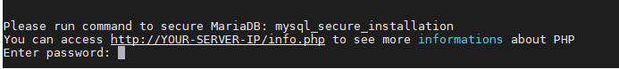
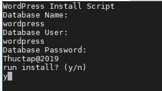
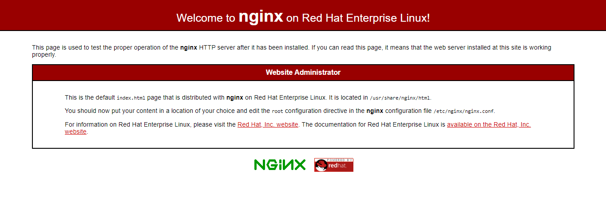
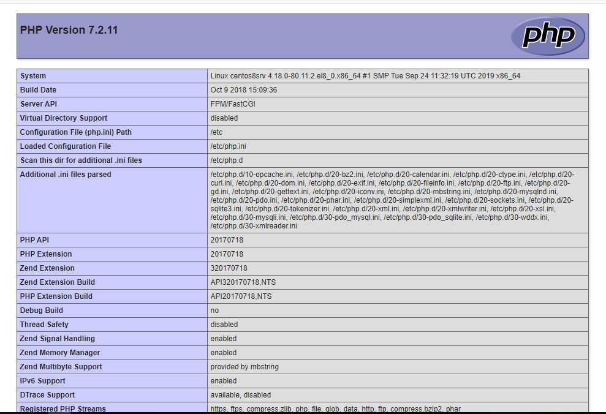

# Hướng dẫn cài đặt LEMP + Wordpress trên CentOS 8  

## Chuẩn bị
1 máy cài CentOS 8, RAM tối thiểu 1GB, Disk 20GB, CPU 1 core.

## Cài đặt
- Bước 1: Vào [link](https://gist.github.com/thuyhiend/2c8b3c7d6da051f58a176145810b086f) tải về máy CentOS 8 của bạn script có trong link

***Chú ý:*** Sửa lại địa chỉ IP trong file `lemp_wordpress.sh` thành địa chỉ IP của máy bạn để có thể truy cập qua domain.

    


- Bước 2: Chạy script bằng cách sử dụng câu lệnh `bash`

  ```sh
    bash lemp_wordpress.sh
  ```

  Trong quá trình chạy script sẽ yêu cầu nhập vào password, database name, databasse user và password của database user. Nhập vào thông tin như hình, phần Enter password bỏ trắng.

  


  

- Bước 3: Kiểm tra
Trên thanh tìm kiếm của trình duyệt, nhập vào lần lượt:

  - http://IP - kiểm tra hoạt động của 
  
    

  - http://IP/info.php - xem thông tin của PHP

    

  - http://IP/wordpress hoặc http://thuyhiend.net - truy cập vào trang sử dụng Wordpress
