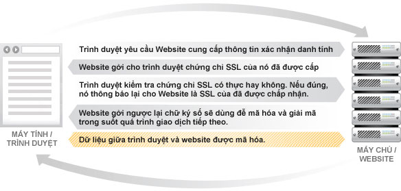
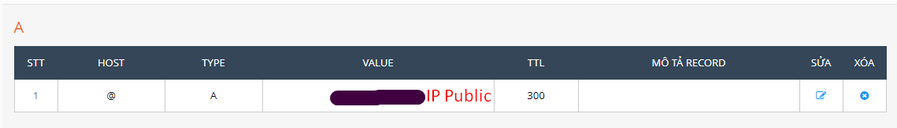
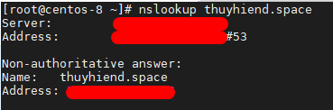
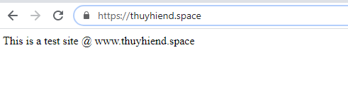
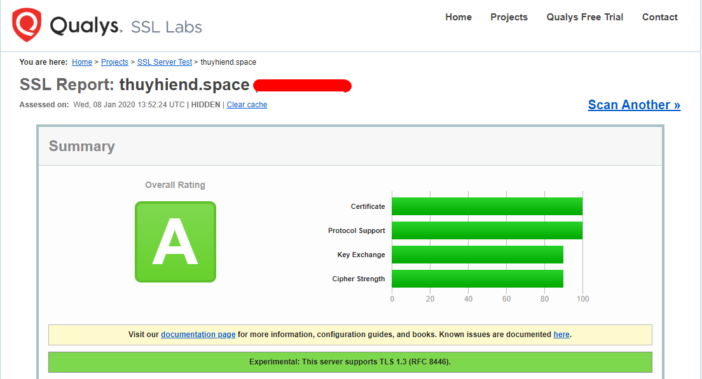

# Cài chứng chỉ SSL miễn phí từ Let’s Encrypt cho các website

  

## Mục lục

## Giới thiệu
- SSL là chữ viết tắt của Secure Sockets Layer (Lớp socket bảo mật). Một loại bảo mật giúp mã hóa liên lạc giữa website và trình duyệt. Công nghệ này đang lỗi thời và được thay thế hoàn toàn bởi TLS.

- TLS là chữ viết tắt của Transport Layer Security, nó cũng giúp bảo mật thông tin truyền giống như SSL. Nhưng vì SSL không còn được phát triển nữa, nên TLS mới là thuật ngữ đúng nên dùng.

- Let’s Encrypt là một tổ chức xác thực SSL giống như Comodo, GeoTrust, Symantec nhưng cái khác là họ là tổ chức phi lợi nhuận được thành lập với sự bảo trợ của những tổ chức lớn trên thế giới Cisco, Akamai, Mozilla, Facebook,…với mục đích là cung cấp chứng chỉ SSL miễn phí cho mọi người giúp mọi website đều được mã hóa, tạo nên một môi trường internet an toàn hơn.

- HTTPS là phần mở rộng bảo mật của HTTP. Website được cài đặt chứng chỉ SSL/TLS có thể dùng giao thức HTTPS để thiết lập kênh kết nối an toàn tới server. Tóm lại, các điều cơ bản bạn cần nắm rõ về SSL là:

    - Mục tiêu của SSL/TLS là bảo mật các thông tin nhạy cảm trong quá trình truyền trên internet như, thông tin cá nhân, thông tin thanh toán, thông tin đăng nhập.
    - Nó là giải pháp thay thế cho phương pháp truyền thông tin văn bản dạng plain text, văn bản loại này khi truyền trên internet sẽ không được mã hóa, nên việc áp dụng mã hóa vào sẽ khiến cho các bên thứ 3 không xâm nhập được bào thông tin của bạn, không đánh cắp hay chỉnh sửa được các thông tin đó.
    - Hầu hết mọi người đều quen thuộc với các chứng chỉ SSL/TLS, đang được dùng bởi các website lớn và các webmaster nghiêm túc trong việc bảo vệ các giao dịch người dùng.
    Bạn có thể biết được website có đang dùng chứng chỉ bảo mật - SSL/TLS hay không đơn giản bằng cách nhìn vào icon trong URL ngay trong thanh địa chỉ.

- Các hoạt động xảy ra khi máy tính kết nối đến 1 website đã được chứng thực

    

- Trình duyệt làm thế nào để kiểm tra một SSL là có thực hay không?

  Khi Website gửi cho trình duyệt một chứng chỉ SSL, trình duyệt sẽ gửi chứng chỉ này đến một máy chủ lưu trữ các chứng chỉ số đã được phê duyệt. Về mặt kỹ thuật, SSL sử dụng mã hóa công khai. Kỹ thuật này giúp cho Website và trình duyệt tự thỏa thuận (bước 4 ở hình trên) một bộ khóa sẽ dùng trong suốt quá trình trao đổi thông tin sau đó. Bộ khóa sẽ thay đổi theo mỗi trong lần giao dịch kế tiếp, một người khác sẽ không thể giải mã ngay cả khi có được dữ liệu của máy chủ lưu trữ chứng chỉ số nói trên.

- Có 2 cách tạo SSL:

  - Nhờ một tổ chức CA(Certification Authority) cấp, là tổ chức có độ tin cậy cao, được quyền cấp và chứng nhận SSL. Sẽ mất phí.
  - Self-signed SSL: là tự server cấp, tự kí, tự xác thực (ko an toàn và tin tưởng bằng nhờ bên thứ 3). Cách này sẽ free do người dùng sẽ tự cấu hình.  
  
Bài viết này sẽ hướng dẫn bạn nhận chứng chỉ SSL miễn phí từ Let's Encrypt và cài đặt SSL trên môi trường NginX và CentOS 8.

Xem thêm thông tin tại website chính thức của Let's Encrypt: *https://letsencrypt.org/*

***Chú ý:*** Chứng chỉ SSL được tạo theo cách này chỉ có tác dụng trong 90 ngày. Sau 90 ngày bạn sẽ cần update lại chứng chỉ. 

## Mô hình chuẩn bị


## Các bước thực hiện


### [1] Cài đặt Certbot 

Certbot là một công cụ dòng lệnh miễn phí giúp đơn giản hóa quy trình lấy và gia hạn chứng chỉ SSL từ Let's Encrypt và tự động kích hoạt HTTPS trên máy chủ của bạn.

- Cài đặt các gói cần thiết

  ```sh
    dnf module -y install python36 
    dnf -y install gcc mod_ssl python3-virtualenv redhat-rpm-config augeas-libs libffi-devel openssl-devel 
  ```

- Tải về certbot script
  ```sh
    curl -O https://dl.eff.org/certbot-auto
  ```

- Sau khi tải xuống hoàn tất, di chuyển file `certbot-auto` tới thư mục `/usr/local/bin` và cấp quyền cho file `certbot-auto`

  ```sh
    mv certbot-auto /usr/local/bin/certbot-auto
    chmod 0755 /usr/local/bin/certbot-auto
  ```

### [2] Tạo Virtualhost
- Tạo 1 file cấu hình virtual host(server block) cho tên miền `www.thuyhiend.space`  

  ```sh
    vim /etc/nginx/conf.d/thuyhiend.space.conf
  ```

  Thêm vào nội dung bên dưới:

  ```nginx
    server {
      server_name thuyhiend.space;
      root /opt/nginx/www.thuyhiend.space;

      location / {
         index index.html index.htm index.php;
      }

      access_log /var/log/nginx/www.thuyhiend.space.access.log;
      error_log /var/log/nginx/www.thuyhiend.space.error.log;

      location ~ \.php$ {
        include /etc/nginx/fastcgi_params;
        fastcgi_pass 127.0.0.1:9000;
        fastcgi_index index.php;
        fastcgi_param SCRIPT_FILENAME $document_root$fastcgi_script_name;
      }
    }
  ```

- Tạo 1 document root để đặt các tệp HTML của bạn  

  ```sh
    mkdir -p /opt/nginx/www.thuyhiend.space
  ```

- Thay đổi quyền với thư mục:

  ```sh
    chown -R nginx:nginx /opt/nginx/www.thuyhiend.space
  ```

- Đặt file HTML thử nghiệm vào thư mục gốc của tên miền web của bạn.

  ```sh
    echo "This is a test site @ www.thuyhiend.space" > /opt/nginx/www.thuyhiend.space/index.html
  ```

- Restart Nginx service

  ```sh
    systemctl restart nginx
  ```

### [3] Tạo/Cập nhật bản ghi DNS  
- Truy cập vào công cụ quản lý DNS hoặc trang quản lý tên miền của bạn để tạo bản ghi A tới tên miền

    

- Kiểm tra việc truyền DNS với câu lệnh nslookup: `yum install -y bind-utils`.

    

### [4] Thiết lập nhận chứng chỉ miễn phí từ Let’s Encrypt  
- Sử dụng câu lệnh `certbot` để tạo và cài đặt chứng chỉ Let’s Encrypt

  ```sh
    /usr/local/bin/certbot-auto --nginx
  ```

```nginx
Saving debug log to /var/log/letsencrypt/letsencrypt.log
Plugins selected: Authenticator nginx, Installer nginx
Enter email address (used for urgent renewal and security notices) (Enter 'c' to cancel): havy.nt12@gmail.com  << Email Address to receive renewal/security notification

- - - - - - - - - - - - - - - - - - - - - - - - - - - - - - - - - - - - - - - -
Please read the Terms of Service at
https://letsencrypt.org/documents/LE-SA-v1.2-November-15-2017.pdf. You must
agree in order to register with the ACME server at
https://acme-v02.api.letsencrypt.org/directory
- - - - - - - - - - - - - - - - - - - - - - - - - - - - - - - - - - - - - - - -
(A)gree/(C)ancel: A  << Access Terms and Conditions

- - - - - - - - - - - - - - - - - - - - - - - - - - - - - - - - - - - - - - - -
Would you be willing to share your email address with the Electronic Frontier
Foundation, a founding partner of the Let's Encrypt project and the non-profit organization that develops Certbot? We'd like to send you email about our work encrypting the web, EFF news campaigns, and ways to support digital freedom.
- - - - - - - - - - - - - - - - - - - - - - - - - - - - - - - - - - - - - - - -
(Y)es/(N)o: Y  << Subscribe to Newsletter
Which names would you like to activate HTTPS for?
- - - - - - - - - - - - - - - - - - - - - - - - - - - - - - - - - - - - - - - -
1: thuyhiend.space
- - - - - - - - - - - - - - - - - - - - - - - - - - - - - - - - - - - - - - - -
Select the appropriate numbers separated by commas and/or spaces, or leave input blank to select all options shown (Enter 'c' to cancel): 1
Obtaining a new certificate
Performing the following challenges:
http-01 challenge for thuyhiend.space
Waiting for verification...
Cleaning up challenges
Deploying Certificate to VirtualHost /etc/nginx/conf.d/www.thuyhiend.space.conf

Please choose whether or not to redirect HTTP traffic to HTTPS, removing HTTP access.
- - - - - - - - - - - - - - - - - - - - - - - - - - - - - - - - - - - - - - - -
1: No redirect - Make no further changes to the webserver configuration.
2: Redirect - Make all requests redirect to secure HTTPS access. Choose this for new sites, or if you're confident your site works on HTTPS. You can undo this change by editing your web server's configuration.
- - - - - - - - - - - - - - - - - - - - - - - - - - - - - - - - - - - - - - - -
Select the appropriate number [1-2] then [enter] (press 'c' to cancel): 2
Redirecting all traffic on port 80 to ssl in /etc/nginx/conf.d/www.thuyhiend.space.conf

- - - - - - - - - - - - - - - - - - - - - - - - - - - - - - - - - - - - - - - -
Congratulations! You have successfully enabled https://thuyhiend.space

You should test your configuration at:
https://www.ssllabs.com/ssltest/analyze.html?d=thuyhiend.space
- - - - - - - - - - - - - - - - - - - - - - - - - - - - - - - - - - - - - - - -

IMPORTANT NOTES:
 - Congratulations! Your certificate and chain have been saved at:
   /etc/letsencrypt/live/thuyhiend.space/fullchain.pem
   Your key file has been saved at:
   /etc/letsencrypt/live/thuyhiend.space/privkey.pem
   Your cert will expire on 2020-04-07. To obtain a new or tweaked version of this certificate in the future, simply run certbot-auto again with the "certonly" option. To non-interactively renew *all*
   of your certificates, run "certbot-auto renew"
 - If you like Certbot, please consider supporting our work by:

   Donating to ISRG / Let's Encrypt:   https://letsencrypt.org/donate
   Donating to EFF:                    https://eff.org/donate-le
```


### [5] Redirect tất cả các truy vấn tới HTTPS 
- Thêm vào file `www.thuyhiend.space.conf` một config server có nội dung như sau:

  ```nginx
  server {
    listen 80;
    server_name thuyhiend.space;
    return 301 https://thuyhiend.space$request_uri;
  }
  ```

- Restart service Nginx

  ```sh
    systemctl restart nginx
  ```

### [6] Cấu hình Firewall
- Cấu hình firewall cho phép các yêu cầu HTTPS
  
  ```sh
  firewall-cmd --permanent --add-port=443/tcp

  firewall-cmd --reload
  ```
### [7] Xác nhận chứng nhận Let’s Encrypt  

Từ trình duyệt của bạn nhập vào địa chỉ: `http://your_domain` để kiểm tra. Trình duyệt sẽ tự động redirect yêu cầu từ HTTP sang HTTPS

  

### [8] Kiểm tra chứng nhận SSL
Kiểm tra chứng chỉ SSL của bạn để biết bất kỳ vấn đề nào và xếp hạng bảo mật của nó bằng cách truy cập URL bên dưới.

`https://www.ssllabs.com/ssltest/analyze.html?d=thuyhiend.space`

  

hoặc sử dụng trang `https://www.sslshopper.com/`.

### [9] Thiết lập gia hạn tự động  
- Sử dụng lệnh:
  ```sh
    echo "0 0,12 * * * root python -c 'import random; import time; time.sleep(random.random() * 3600)' && /usr/local/bin/certbot-auto renew" | sudo tee -a /etc/crontab > /dev/null
  ```

- Bạn cũng có thể mô phỏng quá trình gia hạn chứng chỉ bằng lệnh bên dưới để đảm bảo quá trình gia hạn diễn ra suôn sẻ.

  ```sh
    /usr/local/bin/certbot-auto renew --dry-run
  ```

  **OUTPUT**

```nginx
Saving debug log to /var/log/letsencrypt/letsencrypt.log

- - - - - - - - - - - - - - - - - - - - - - - - - - - - - - - - - - - - - - - -
Processing /etc/letsencrypt/renewal/thuyhiend.space.conf
- - - - - - - - - - - - - - - - - - - - - - - - - - - - - - - - - - - - - - - -
Cert not due for renewal, but simulating renewal for dry run
Plugins selected: Authenticator nginx, Installer nginx
Renewing an existing certificate
Performing the following challenges:
http-01 challenge for thuyhiend.space
Waiting for verification...
Cleaning up challenges

- - - - - - - - - - - - - - - - - - - - - - - - - - - - - - - - - - - - - - - -
new certificate deployed with reload of nginx server; fullchain is
/etc/letsencrypt/live/thuyhiend.space/fullchain.pem
- - - - - - - - - - - - - - - - - - - - - - - - - - - - - - - - - - - - - - - -

- - - - - - - - - - - - - - - - - - - - - - - - - - - - - - - - - - - - - - - -
** DRY RUN: simulating 'certbot renew' close to cert expiry
**          (The test certificates below have not been saved.)

Congratulations, all renewals succeeded. The following certs have been renewed:
  /etc/letsencrypt/live/thuyhiend.space/fullchain.pem (success)
** DRY RUN: simulating 'certbot renew' close to cert expiry
**          (The test certificates above have not been saved.)
- - - - - - - - - - - - - - - - - - - - - - - - - - - - - - - - - - - - - - - -

IMPORTANT NOTES:
 - Your account credentials have been saved in your Certbot
   configuration directory at /etc/letsencrypt. You should make a
   secure backup of this folder now. This configuration directory will
   also contain certificates and private keys obtained by Certbot so
   making regular backups of this folder is ideal.
```

Nếu đầu ra không báo cáo bất kỳ vấn đề nào, việc gia hạn chứng chỉ sẽ hoạt động như mong đợi.


## TÀI LIỆU THAM KHẢO
- https://viblo.asia/p/https-va-ssl-OeVKBg4AZkW
- https://www.digitalocean.com/community/tutorials/how-to-create-a-self-signed-ssl-certificate-for-apache-in-debian-10#step-1-%E2%80%94-creating-the-ssl-certificate
- https://www.itzgeek.com/how-tos/linux/centos-how-tos/how-to-setup-lets-encrypt-ssl-certificate-with-nginx-on-rhel-8-centos-7-rhel-7.html