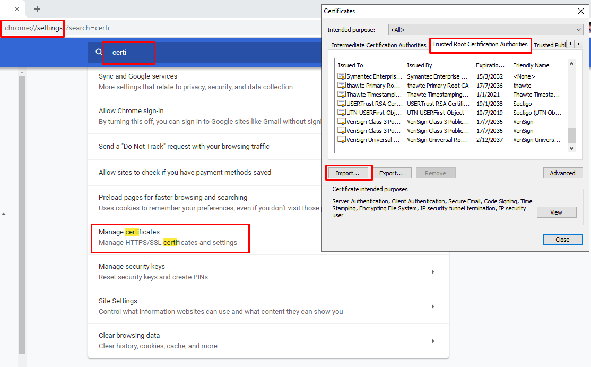
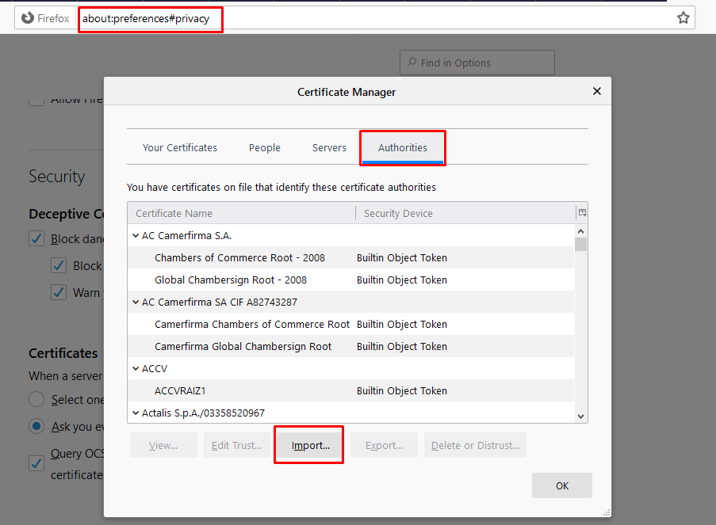
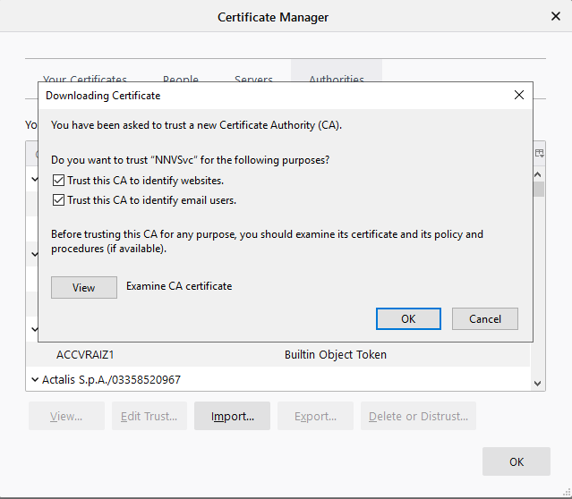
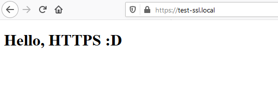
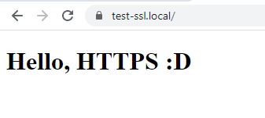
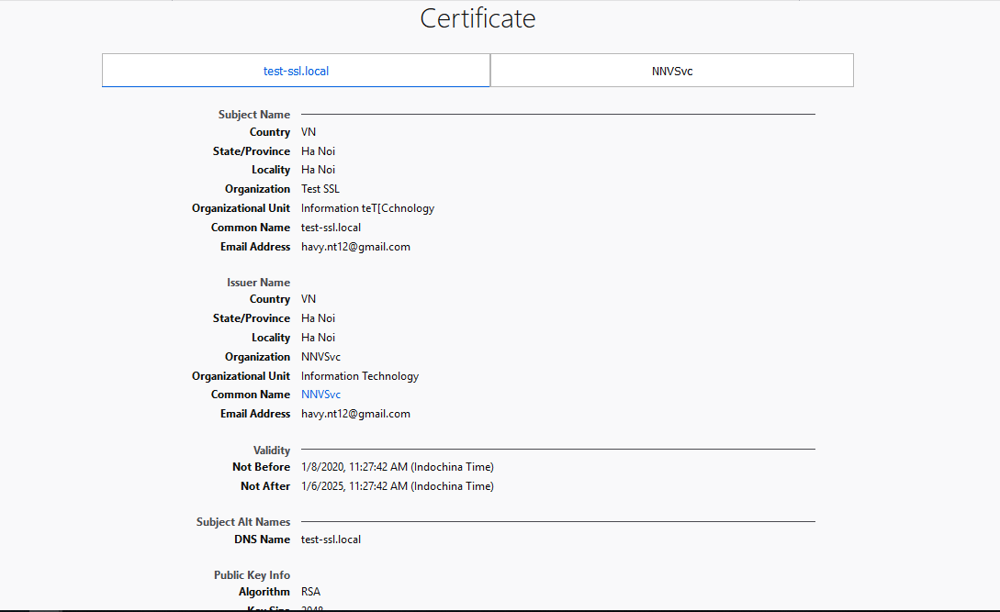

# Tạo SSL Certificate Authority cho HTTPS trên local

## Tạo Certificate Authority
Đầu tiên, chúng ta phải tự trở thành một nhà cung cấp chứng chỉ (giống như các nhà cung cấp chứng chỉ hiện tại như GlobalSign, Comodo, DigiCert, …) và thông báo cho trình duyệt rằng những chứng chỉ được tạo bởi Certificate Authority do chúng ta cung cấp là hợp lệ.

Thực hiện tạo root Certificate Authority (CA) bằng việc đầu tiên là tạo private key:

```s
  openssl genrsa -des3 -out rootCA.key 2048
```

Sau khi nhập lệnh này, chúng ta thực hiện nhập pass phase để tạo. Kết quả có dạng:

```java
  Generating RSA private key, 2048 bit long modulus (2 primes)
  ............................+++++
  ....+++++
  e is 65537 (0x010001)
  Enter pass phrase for rootCA.key:
  Verifying - Enter pass phrase for rootCA.key:
```  

Sau khi đã có private key, chúng ta tạo root certificate:

```sh
  openssl req -x509 -new -nodes -key rootCA.key -sha256 -days 1825 -out rootCA.pem
```

Khi thực hiện lệnh này, nó sẽ hỏi pass phase của file `rootCA.key` mà chúng ta vừa nhập ban nãy, bạn hãy nhập chính xác vào và thực hiện điền một số thông tin nó yêu cầu, kết quả có dạng như sau (dữ liệu demo do mình nhập):

```java
  Enter pass phrase for rootCA.key:
  You are about to be asked to enter information that will be incorporated
  into your certificate request.
  What you are about to enter is what is called a Distinguished Name or a DN.
  There are quite a few fields but you can leave some blank
  For some fields there will be a default value,
  If you enter '.', the field will be left blank.
  -----
  Country Name (2 letter code) [XX]:VN
  State or Province Name (full name) []:Ha Noi
  Locality Name (eg, city) [Default City]:Ha Noi
  Organization Name (eg, company) [Default Company Ltd]:NNVSvc
  Organizational Unit Name (eg, section) []:Information technology
  Common Name (eg, your name or your server's hostname) []:NNVSvc
  Email Address []:havy.nt12@gmail.com
```

Sau khi thực hiện xong, bạn sẽ có được hai files là `rootCA.key` và `rootCA.pem`. Từ bây giờ, bạn đã trở thành một Certificate Authority (chỉ ở localhost) rồi. Và cũng từ bây giờ, chúng ta có thể tạo SSL cho chính bản thân mình từ hai files trên. Nhưng đến bước này vẫn chưa hẳn là bạn đã được một SSL hoàn chỉnh vì các trình duyệt chưa có thông tin về root certificate (chứng chỉ gốc) của chúng ta. Chúng ta sẽ sang bước tiếp theo, nó cực kỳ quan trọng để SSL của chúng ta trở nên hoàn chỉnh.  

## Cài đặt Root Certificate cho các trình duyệt
Với bài viết này, mình sẽ hướng dẫn cho mọi người làm sao để cài đặt root certitficate cho Chrome và FireFox.

### Google Chrome
Đầu tiên, mở Google Chrome và truy cập vào đường dẫn sau: `chrome://settings`, trong thanh tìm kiếm tìm kiếm `certificates`. Sau đó, bạn chọn tab `Trusted Root...` và nhấp vào `IMPORT` rồi chọn file `rootCA.pem` mà chúng ta vừa tạo ban nãy.

  


### Mozilla Firefox

Đầu tiên, mở Mozilla Firefox lên và truy cập vào đường dẫn sau: `about:preferences#privacy`. Sau đó, bạn kéo xuống dưới cùng của trang, tại phần `Certificates` chúng ta nhấp vào `View Certificates…`, tại popup này, bạn chọn tab `Authorities` rồi nhấp vào `Import…` và chọn file `rootCA.pem` mà chúng ta vừa tạo ban nãy.

  

  

Giờ chúng ta thử thực hiện tạo HTTPS cho một website ở local để xem kết quả như thế nào nhé.

## Tạo HTTPS cho local site  
Đầu tiên, chúng ta tạo một private key cho domain local (mình sẽ chọn domain là test-ssl.local):

```sh
  openssl genrsa -out /etc/pki/tls/certs/test-ssl.local.key 2048
```

Sau đó tạo CSR (Certificate Signing Request):

```sh
  openssl req -new -key /etc/pki/tls/certs/test-ssl.local.key -out /etc/pki/tls/certs/test-ssl.local.csr
```

Chúng ta sẽ được hỏi các thông tin như lần trước tạo root CA:

```java
  You are about to be asked to enter information that will be incorporated
  into your certificate request.
  What you are about to enter is what is called a Distinguished Name or a DN.
  There are quite a few fields but you can leave some blank
  For some fields there will be a default value,
  If you enter '.', the field will be left blank.
  -----
  Country Name (2 letter code) [XX]:VN
  State or Province Name (full name) []:Ha Noi
  Locality Name (eg, city) [Default City]:Ha Noi
  Organization Name (eg, company) [Default Company Ltd]:Test SSL
  Organizational Unit Name (eg, section) []:Information Technology
  Common Name (eg, your name or your server's hostname) []:test-ssl.local
  Email Address []:havy.nt12@gmail.com

  Please enter the following 'extra' attributes
  to be sent with your certificate request
  A challenge password []:
  An optional company name []:
```

Các bạn có thể tùy nhập các thông tin mà các bạn muốn. Phần `A challegen password` và `An optional company name` các bạn có thể bỏ rỗng.

Bước tiếp theo, chúng ta thực hiện tạo một file config để định nghĩa Subject Alternative Name (SAN) cho SSL này. Chúng ta thực hiện tạo file:

```sh
  vim /etc/pki/tls/certs/test-ssl.local.ext
```

Và nhập nội dung bên dưới:

```java
  authorityKeyIdentifier=keyid,issuer
  basicConstraints=CA:FALSE
  keyUsage = digitalSignature, nonRepudiation, keyEncipherment, dataEncipherment
  subjectAltName = @alt_names
 
  [alt_names]
  DNS.1 = test-ssl.local
```

Bạn có thể thêm nhiều DNS.x = <Domain bạn muốn>. Nhưng ở đây mình chỉ sử dụng cho chính domain này thôi. Giờ chúng ta sẽ tạo certificate cho domain:

```sh
  openssl x509 -req -in /etc/pki/tls/certs/test-ssl.local.csr -CA rootCA.pem -CAkey rootCA.key -CAcreateserial \
-out /etc/pki/tls/certs/test-ssl.local.crt -days 1825 -sha256 -extfile /etc/pki/tls/certs/test-ssl.local.ext
```

Trong đó:
  
- `openssl` là một command để tạo vào quản lý chứng chỉ OpenSSL , keys và các file khác.  
- `req` là một subcommand chỉ định rõ chúng ta mún sử dụng X.509 CSR (certificate signing request) : chứng chỉ yêu cầu ký.   
- `X.509` là một chuẩn public key của SSL và TLS.    
- `nodes` chỉ rõ OpenSSL bỏ qua việc bảo mặt chứng chỉ của chúng ta bằng một chuỗi mật khẩu (passphrase). Nếu để mật khẩu này thì nginx của chúng ta luôn phải nhập mật khẩu này mỗi khi khởi động nên rất là bất tiện.  
- `days 365` là tham số xác định thời hạn sử dụng chứng chỉ là 365 ngày (1 năm).  
- `newkey rsa:4096` là tham số chỉ định chúng ta muốn sinh ra một chứng chỉ mới và một key mới tại cùng câu lệnh với key RSA có độ dài 2048 bít.  
- `keyout` chỉ định nơi chứng ta lưu trữ private key được sinh ra lúc tạo  
- `out` chỉ định nơi chứng chỉ được lưu trữ sau khi tạo

Khi này chúng ta sẽ được hỏi pass phase của `rootCA.pem`, bạn nhập pass phase mà bạn đã sử dụng lúc tạo `rootCA.key`. Vậy là xong, lúc này chúng ta sẽ có các file sau:

- `test-ssl.local.key:` Private key
- `test-ssl.local.csr:` Certificate Signing Request
- `test-ssl.local.crt:` Signed certificate

Bây giờ chúng ta có thể thêm HTTPS cho local domain của chúng ta với private key file và certificate file rồi. Mình sẽ thực hiện luôn demo với NginX (mặc định là bạn đã cài đặt NginX rồi).

## Cài đặt HTTPS với NginX  
- Tạo thư mục chứa code

  ```sh
    mkdir -p /usr/share/nginx/html/test-ssl
  ```

- Sau đó, tạo file `index.html` với nội dung đơn giản để hiển thị:
  
  ```sh
    vim /usr/share/nginx/html/test-ssl/index.html
  ```

  Nội dung file `index.html`

  ```html
    <!DOCTYPE html>
    <html>
    <head>
        <meta charset="utf-8">
        <title>Test SSL Local</title>
    </head>
    <body>
        <h1>Hello, HTTPS :D</h1>
    </body>
    </html>
  ```

- Tạo 1 virtual host cho Nginx
  
  ```sh
    vim /etc/nginx/conf.d/test-ssl.conf
  ```

  Nội dung file virtual host

  ```nginx
    server {
        listen 443 ssl;
 
        server_name test-ssl.local;
    
        ssl_certificate     /etc/pki/tls/certs/test-ssl.local.crt;
        ssl_certificate_key /etc/pki/tls/certs/test-ssl.local.key;
        ssl_protocols       TLSv1 TLSv1.1 TLSv1.2;
        ssl_ciphers         HIGH:!aNULL:!MD5;
 
        location / {
            root /usr/share/nginx/html/test-ssl;
            index index.html index.htm;
        }
    }
  ```

- Khởi động lại Nginx
  ```sh
    systemctl restart nginx
  ```  

- Tiếp theo, chúng ta sẽ trỏ domain của chúng ta về localhost bằng cách thêm nội dung sau vào file /etc/hosts:

  ```sh
    vim /etc/hosts
  ```

  Thêm vào dòng

  ```nginx
    127.0.0.1 test-ssl.local
  ```

Vậy là xong, bây giờ bạn thử truy cập vào `https://test-ssl.local` để xem kết quả. Chúng ta sẽ được một trang HTTPS hoàn hảo mà không hề bị màn hình warning và cũng không có dấu gạch chéo đỏ lòm ở trên thanh địa chỉ.

  



  


## TÀI LIỆU THAM KHẢO
- https://techtalk.vn/tao-ssl-certificate-authority-cho-https-tren-local.html
- https://gist.github.com/cecilemuller/9492b848eb8fe46d462abeb26656c4f8