# Thêm/cài đặt Cloudflare SSL cho WordPress Website

## Chuẩn bị  

## Giới thiệu
SSL (HTTPS) ngày càng trở nên phổ biến sau khi Google công bố họ sẽ ưu tiên các blog/website sử dụng giao thức HTTPS trên bảng xếp hạng kết quả tìm kiếm.

Trong WordPress, các bạn có thể cài đặt SSL một cách dễ dàng với sự trợ giúp của các plugin, lúc đó website bạn sẽ chỉ sử dụng giao thức HTTPS và tự động chuyển hướng từ HTTP sang HTTPS.

## Các bước thực hiện  

### [1] Tạo 1 website Wordpress

- Tài liệu: [Cài đặt Wordpress trên CentOS 8 cùng LEMP Stack](wordpress.md)  

- Sau khi tạo thành công một website wordpress với domain `thuyhiend.space` chúng ta sẽ bắt đầu cấu hình nhận chứng chỉ SSL cho website trên. Trong bài viết này sẽ hướng dẫn bạn ....

### [2] Thiết lập Flexible SSL miễn phí trên Cloudflare  

#### [2.1] Thiết lập trên Cloudflare

- Đi tới trang [Đăng ký Cloudflare](https://www.cloudflare.com/). Nhập thông tin của bạn và xác minh địa chỉ email để tạo 1 tài khoản. Nếu đã có tài khoản, bạn có thể đăng nhập bằng tài khoản đó.

  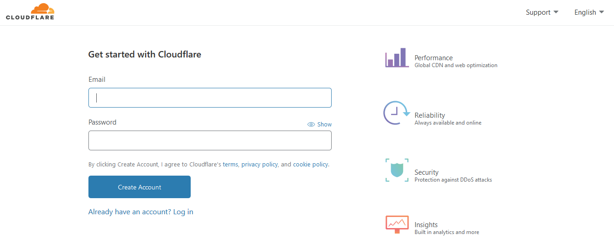  

- Thêm trang web của bạn bằng cách nhập vào domain của trang wordpress của bạn. Trong bài này domain được sử dụng là `thuyhiend.space`  

  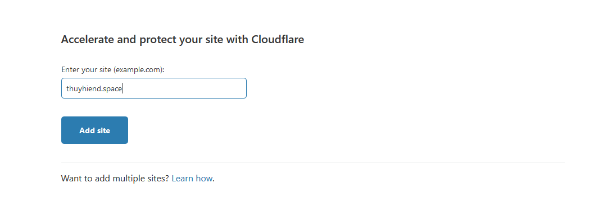  

  Tiếp đó bạn sẽ được hỏi về kế hoạch sử dụng đối với domain vừa thêm. Chọn kế hoạch bạn muốn sử dụng rồi chọn `Confirm plan`, ở đây mình sử dụng plan free

  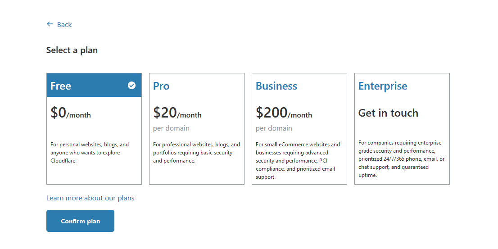  

- Khai báo các bản ghi cho domain `thuyhiend.space`

  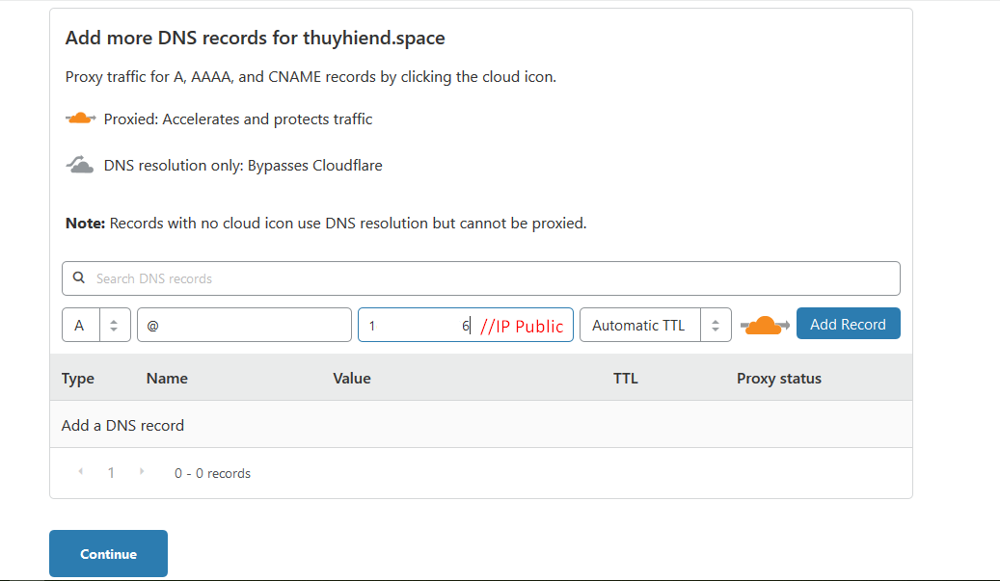

- Thay đổi nameservers của bạn. Để mặc định như vậy rồi chọn `Done,...`

  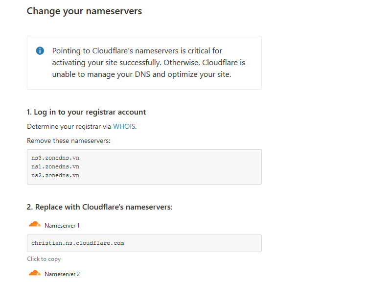  
 
   **QUAN TRỌNG** : bạn sẽ phải trỏ name server của domain về CloudFlare. Bạn sẽ cần phải thiết lập cấu hình này tại tên miền của bạn đăng ký. Sau nhấp vào ‘Tiếp tục’ và bạn sẽ được chuyển hướng đến các thiết lập cho tên miền này.

- Kết quả

  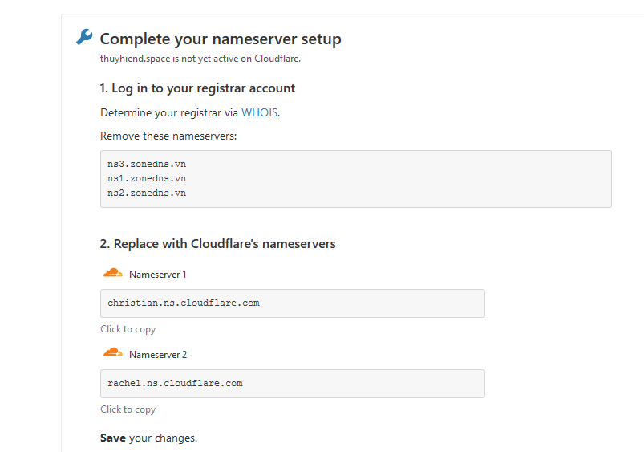  

- Yêu cầu chứng chỉ Flexible SSL

  Chi tiết về các loại SSL của CloudFlare

  Trong lúc chọn SSL có thể thấy ngoài kiểu Flexible thì CloudFlare còn có nhiều kiểu khác nhau, ý nghĩa nó là gì mình xin giải thích như sau:

  - **Flexible SSL:** Kiểu này CloudFlare sẽ hỗ trợ người truy cập vào website của bạn thông qua giao thức HTTPS, nhưng dữ liệu gửi từ CloudFlare về máy chủ sẽ không được mã hóa. Và bạn không cần cài chứng chỉ SSL bên trong server. Có thể sử dụng bất cứ website nào, từ Shared Host đến máy chủ riêng và không cần thiết lập gì thêm.
  - **Full SSL:** Kiểu này CloudFlare sẽ hỗ trợ người truy cập vào website thông qua giao thức HTTPS và dữ liệu từ CloudFlare gửi về máy chủ cũng sẽ được mã hóa. Tuy nhiên bạn phải có một chứng chỉ SSL, nhưng CloudFlare sẽ không xác thực chứng chỉ này nên bạn có thể sử dụng chứng chỉ tự ký, hoặc tạo chứng chỉ của CloudFlare. Và tài khoản bạn phải là tài khoản Pro mới có thể sử dụng chứng chỉ riêng trên CloudFlare.
  - **Full SSL (strict):** Giống như kiểu Full SSL nhưng CloudFlare sẽ xác thực chứng chỉ này, chứng chỉ của bạn phải mua hoặc sử dụng Let’s Encrypt. Và tài khoản của bạn phải là Pro mới có thể sử dụng chứng chỉ riêng.  

    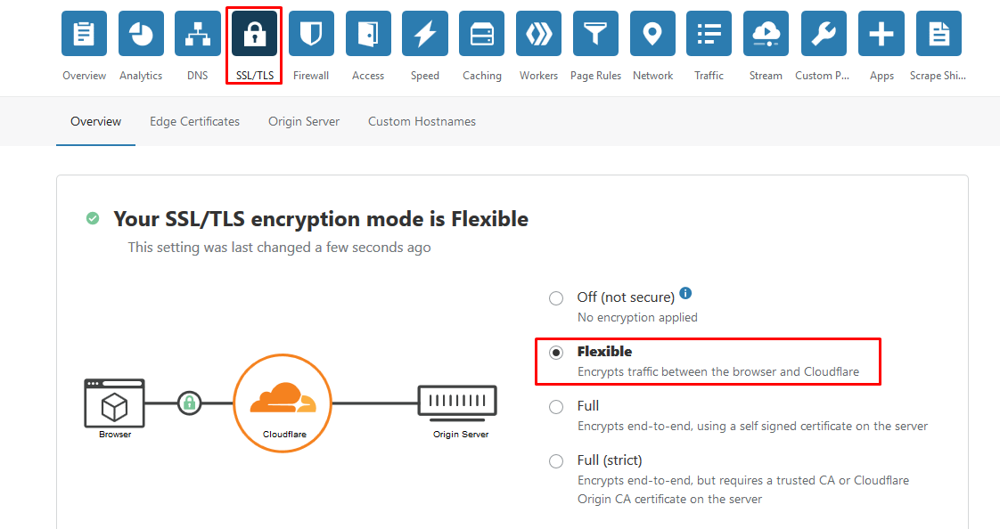  

  Nếu bạn đã trỏ nameserver của mình vào Cloudflare như được hướng dẫn trong bước trước, SSL sẽ hoạt động trong khoảng 15 phút. Điều này có thể thay đổi tùy thuộc vào một số yếu tố như thời gian lan truyền trên DNS, Cloudflare, v.v.

#### [2.2] Cài đặt plugin WordPress cần thiết

- **CloudFlare Flexible SSL Plugin**

  Đi tới phần `Plugins` trong bảng điều khiển `wp-admin` của bạn và nhấp vào `Add new`. Tìm kiếm `Cloudflare Flexible SSL` trên thanh tìm kiếm và install nó. Plugin này cho phép Flexible SSL và ngăn chặn vòng lặp chuyển hướng vô hạn có thể xảy ra.

    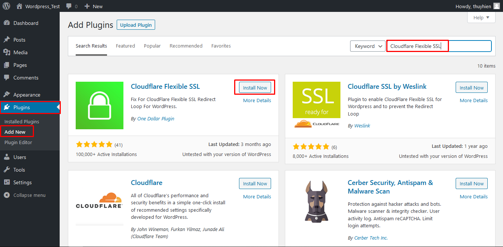  

- **HTTPS redirection plugin**

  Các plugin redirect được yêu cầu khi cài đặt CloudFlare SSL trên WordPress để tránh vòng lặp chuyển hướng vô hạn - "redirect loops". CloudFlare sẽ buộc tất cả lưu lượng truy cập vào website của bạn thông qua HTTPS. Các máy chủ sẽ phải đáp ứng tốt giao thức HTTPS. Vì vậy, bạn sẽ cần một trong 2 plugin này. Tùy vào website, máy chủ và các thiết lập khác của hosting, nếu 1 plugin không hoạt động, bạn có thể thử một plugin khác.

  - WordPress HTTPS (SSL)
    
    Tìm kiếm pliugin với tên `WordPress HTTPS (SSL)`, sau khi install plugin, active nó và đi tới cài đặt, chọn `Yes` trong phần `Proxy` rồi chọn `Save changes` để lưu thay đổi.

    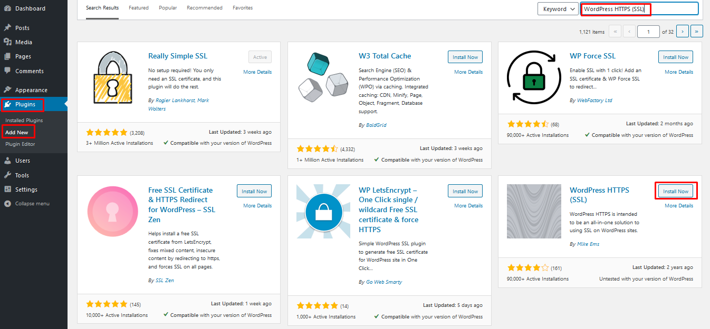

    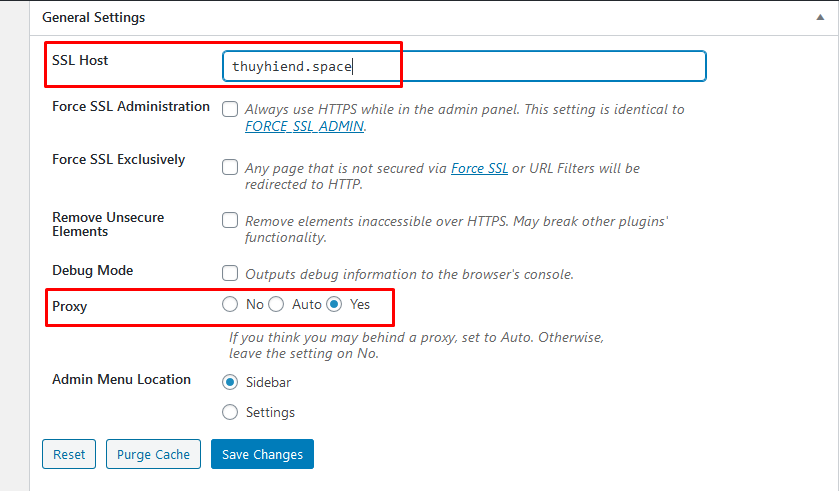  

  - Really Simple SSL

    Plugin này dùng để thay thế cho plugin ở trên. Nó khá phổ biến và được nhiều người sử dụng. Với plugin này bạn sẽ không cần phải thay đổi cấu hình trong cài đặt. Để sử dụng bạn chỉ cần `Install` nó rồi `active`.

### [2.3] Thay đổi URL trang web WordPress

Có 2 URL bạn cần đổi: WordPress address và Site address.

  - **WordPress address** là URL quản trị admin, nội dung và thư mục cần thiết khác và các tập tin.

  - **Site address** là URL mà khách truy cập vào website.

Hai địa chỉ đều giống nhau ở một cài đặt WordPress mặc định. Tại sao đôi khi là khác nhau? Có hai lý do chính:

  - Quá trình cài đặt WordPress không nằm trong thư mục gốc trên máy chủ lưu trữ web. Một số người dùng đặt các website WordPress trong thư mục con với mục đích bảo mật WordPress .

  - Một số phần của website không phải là WordPress. Ví dụ có một website mà có một blog chạy WordPress, trong khi các phần khác của website là tĩnh hoặc sử dụng một CMS khác.

Trong trường hợp flexible CloudFlare SSL, chúng ta cần Site address trỏ đến URL HTTPS của website (bởi CloudFlare). WordPress address nên giữ nguyên vì nó được trỏ đến máy chủ lưu trữ web của chúng ta mà không có giấy chứng nhận SSL.

Đăng nhập vào bảng điều khiển `wp-admin`, đến phần `Setting` --> `General`, thực hiện thay đổi `http` thành `https` trong phần Site Address

  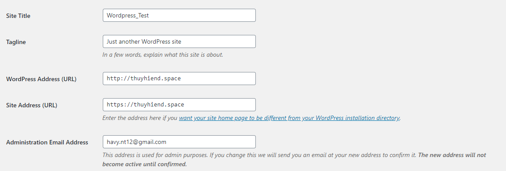

### [2.4] Enforce HTTPS qua Cloudflare
- Thực hiện các bước dưới đây để điều chỉnh điều hướng trên Cloudflare:
  - Quay trở lại trang chủ của Cloudflare
  - Chọn domain của bạn
  - Bật `ON` với tùy chọn `Always Use HTTPS`

    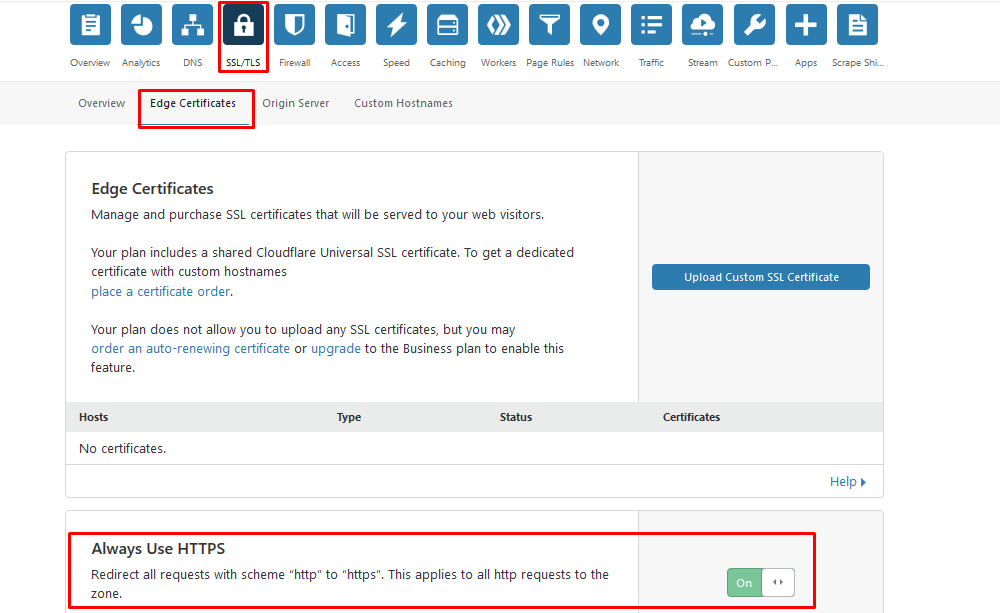  

  - Kiểm tra 2 tùy chọn `Opportunistic Encryption` và `Automatic HTTPS Rewrites` đã ở trạng thái `ON`(mặc định) chưa. Nếu chưa thì bật `ON`

- Bạn cũng có thể tạo `Page Rule`. Nó thực hiện chính xác tương tự như tùy chọn `Always Use HTTPS` tuy nhiên nó có phản hồi nhanh hơn vì nó được xử lý ở rìa của Cloudflare.

  Các bước tạo page rule:
  - Di chuyển tới tab `page rule` trên Cloudflare
  - Click vào `Create Page Rule`

    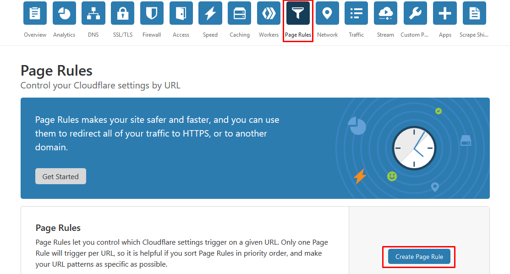

  - Nhập vào domain của bạn ở giữa 2 dấu `*`
  - Trong phần `Pick a setting` chọn `SSL` rồi chọn `Flexible`

    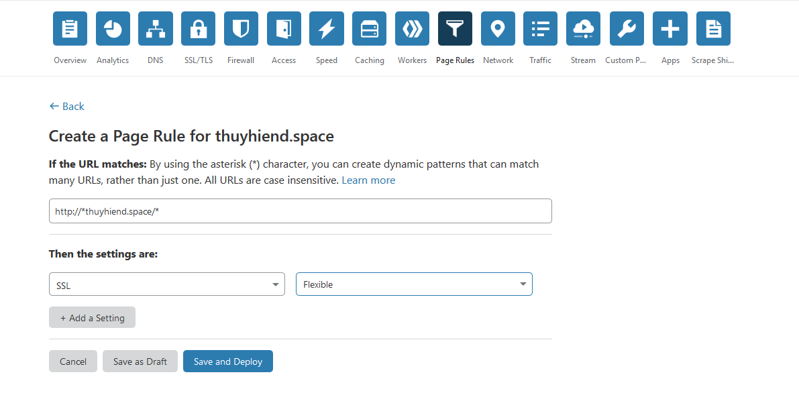

### [2.5] Giải quyết vấn đề nội dung hỗn hợp  
- Khi bạn đến bước này, trang web của bạn sẽ tự động chuyển hướng khách truy cập đến phiên bản HTTPS của trang web.

- Chuyển hướng một trang web WordPress sang https có thể dẫn đến các vấn đề hỗn hợp nội dung. Điều này có nghĩa rằng một số tài nguyên (bao gồm cả các liên kết, hình ảnh, script, vv.) được nạp không an toàn bởi giao thức ‘HTTP’ trong khi trang web được tải với ‘https’. Tùy thuộc vào trình duyệt, các ổ khóa SSL có thể bị mất từ ​​thanh địa chỉ hoặc trang web của bạn sẽ không được hiển thị khóa mầu xanh đầy đủ.

**hardcoded URL không an toàn**

- Các URL mà được mã hóa cứng có thể được tìm thấy trong giao diện hoặc các file plugin. Điều này xảy ra bởi vì các nhà phát triển sử dụng URL tuyệt đối thay vì đường dẫn tương đối (ví dụ: http://mywebsite.com/wp-content/image.png (tuyệt đối) vs /wp-content/image.png (tương đối)).

- Trong trường hợp này, bạn sẽ phải chỉnh sửa các tập tin bằng tay. Vì nó là không thực tế để chỉ tìm kiếm các file theme  / plugin cho các liên kết mã hóa cứng, điều tốt nhất để làm là sử dụng plugin String Locator. Nó sẽ giúp bạn xác định vị trí các tập tin và chính xác dòng mã nào chứa các URL không an toàn.

### [2.6] Kết quả

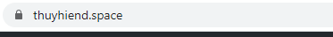  

## 3. Cài đặt chứng chỉ SSL miễn phí từ Let's Encrypt cho Wordpress Website

### [3.1] Sử dụng SSH  

## TÀI LIỆU THAM KHẢO
- https://blog.templatetoaster.com/install-ssl-certificate-wordpress-website/
- https://www.fixrunner.com/how-to-setup-cloudflare-ssl-on-wordpress/
- https://mythemeshop.com/blog/lets-encrypt-free-ssl/
- https://techxanh.com/lam-web/bao-mat-web/tao-ssl-free-cho-wordpress-voi-lets-encrypt/
- https://www.fixrunner.com/how-to-setup-cloudflare-ssl-on-wordpress/
- https://thachpham.com/thu-thuat/su-dung-ssl-mien-phi-tu-cloudflare.html
- https://thachpham.com/thu-thuat/su-dung-ssl-mien-phi-tu-cloudflare.html#ftoc-heading-8
- https://nzwebtech.com/how-to-set-up-cloudflare-ssl-in-whm/