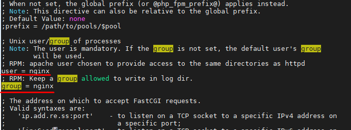
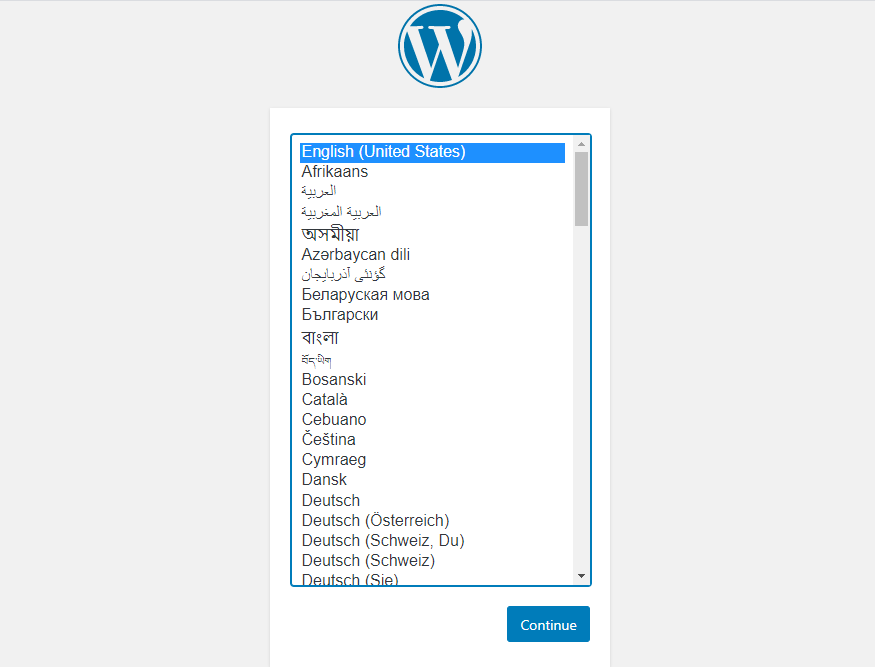
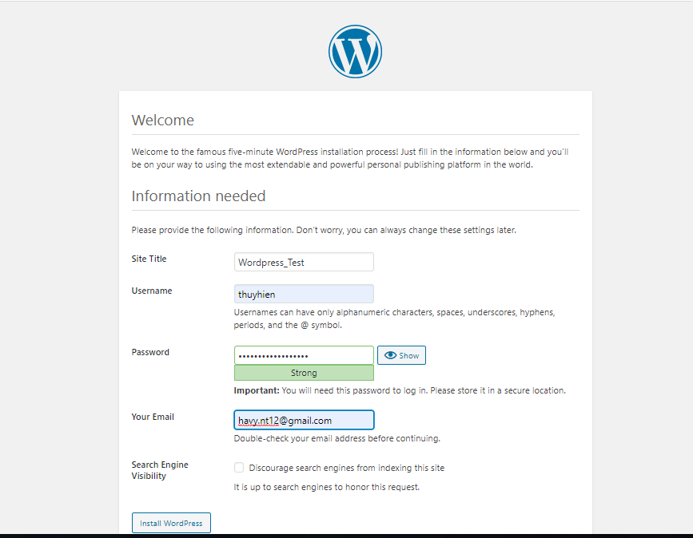
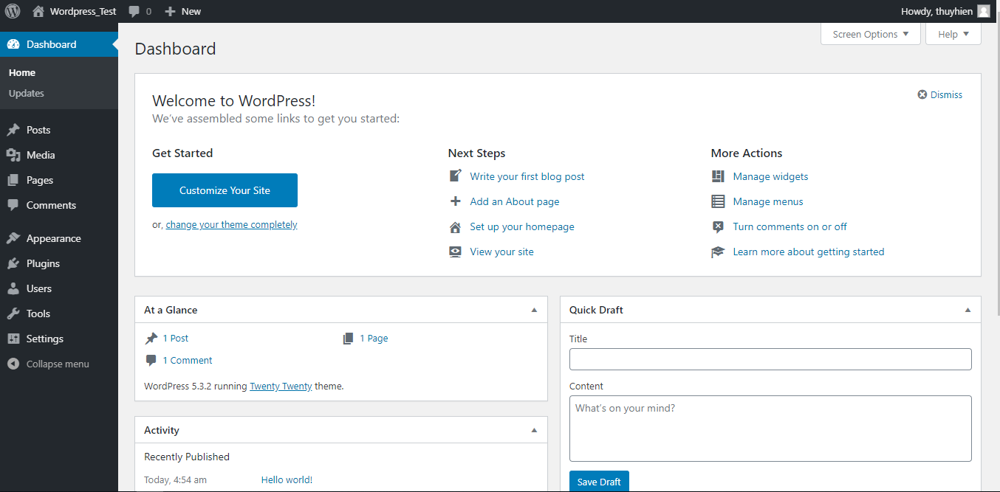

  

# Cài đặt Wordpress trên CentOS 8 cùng LEMP Stack  

## Bước 1: Cài đặt LEMP Stack  

[Hướng dẫn cài đặt LEMP Stack trên CentOS 8](lemp.md)

## Bước 2: Cài đặt các mô-đun PHP cần thiết
  
  ```sh
    dnf install -y php-mysqlnd php-dom php-simplexml php-xml php-xmlreader php-curl php-exif php-ftp php-gd php-iconv  php-json php-mbstring php-posix php-sockets php-tokenizer
  ```

## Bước 3: Cài đặt Wordpress
- Di chuyển tới Nginx root directory.

  ```sh
    cd /usr/share/nginx/html
  ```

- Tải xuống phiên bản mới nhất của Wordpress

  ```sh
    wget https://wordpress.org/latest.tar.gz
  ```

- Giải nén file vừa tải xuống. Vì `tar` không được cài đặt mặc định trên CentOS 8 nên trước khi giải nén, bạn phải cài đặt `tar`  

  ```sh
    dnf install -y tar
    tar -zxvf latest.tar.gz
  ```  

- Xóa file không cần thiết

  ```sh
    rm latest.tar.gz
  ```
- Thay đổi quyền sở hữu của thư mục Wordpress

  ```sh
    chown -R apache:apache /usr/share/nginx/html/wordpress
  ```

- Sử dụng câu lệnh dưới đây để tìm thư mục theo đường dẫn được xác định và cập nhật quyền cho các thư mục trong đường dẫn:

  ```sh
    find /usr/share/nginx/html/wordpress -type d -exec chmod 755 {} \;
  ```

- Sử dụng câu lệnh dưới đây để tìm thư mục theo đường dẫn được xác định và cập nhật quyền cho các file trong đường dẫn:

  ```sh
    find /usr/share/nginx/html/wordpress -type f -exec chmod 644 {} \;
  ```


## Bước 4: Cấu hình 
- Tạo 1 virtual host file
  ```sh
    vi /etc/nginx/conf.d/www.thuyhiend.net.conf
  ```
  Thêm vào file nội dung sau

  ```nginx
  server {
        listen 80;
        server_name www.thuyhiend.net;

        root /usr/share/nginx/html/wordpress/;

        index index.html index.php;

        access_log /var/log/nginx/www.thuyhiend.net_access.log;
        error_log /var/log/nginx/www.thuyhiend.net_error.log;

        # Don't allow pages to be rendered in an iframe on external domains.
        add_header X-Frame-Options "SAMEORIGIN";

        # MIME sniffing prevention
        add_header X-Content-Type-Options "nosniff";

        # Enable cross-site scripting filter in supported browsers.
        add_header X-Xss-Protection "1; mode=block";

        # Prevent access to hidden files
        location ~* /\.(?!well-known\/) {
                deny all;
        }

        # Prevent access to certain file extensions
        location ~\.(ini|log|conf)$ {
                deny all;
        }

        # Enable WordPress Permananent Links
        location / {
                try_files $uri $uri/ /index.php?$args;
        }

        location ~ \.php$ {
        include /etc/nginx/fastcgi_params;
        fastcgi_pass 127.0.0.1:9000;
        fastcgi_index index.php;
        fastcgi_param SCRIPT_FILENAME $document_root$fastcgi_script_name;
        }

  }
  ```

  Xác nhận lại các file cấu hình đã được tạo thành công

  ```sh
    nginx -t
  ```
  OUTPUT
  ```nginx
    nginx: the configuration file /etc/nginx/nginx.conf syntax is ok
    nginx: configuration file /etc/nginx/nginx.conf test is successful
  ```

- Cấu hình chuyển hướng các yêu cầu HTTP không có www sang www HTTPS
  Ví dụ trong bài này: http://thuyhiend.net >> https://www.thuyhiend.net

  ```sh
    vi /etc/nginx/conf.d/www.thuyhiend.net.conf
  ```

  Thêm vào cuối file nội dung sau:

  ```nginx
  
    # Redirect NON-WWW HTTP to WWW HTTP
    server {
        if ($host = thuyhiend.net) {
            return 301 http://www.thuyhiend.net$request_uri;
        }


        server_name thuyhiend.net;
        listen 80;
        return 404;

    }
  ```  

- Tạo thông tin kết nối tới database cho WordPress

  ```sh
    mysql -u root -p
  ```  

  - Tạo 1 DB mới

    ```sh
      CREATE DATABASE wordpress;
    ```

  - Tạo 1 user mới và gán quyền cho database

    ```sh
      GRANT ALL ON *.* TO 'wordpress'@'localhost' IDENTIFIED BY 'Thuctap@2019';
    ```
- Di chuyển tất cả các file về Wordpress vào thư mục `public_html`

  ```sh
    mv wordpress/* /sites/www.thuyhiend.net/public_html/
  ```

- Copy file `wp-config-sample.php` thành file `wp-config.php` và thêm mô tả DB  

  ```sh
    pwd
    /usr/share/nginx/html/wordpress
    cp wp-config-sample.php wp-config.php
    vim wp-config.php
  ```  

  Sửa nội dung của file `vim wp-config.ph` như sau:

    ```sh
    define( 'DB_NAME', 'wordpress' );

    /** MySQL database username */
    define( 'DB_USER', 'wordpress' );

    /** MySQL database password */
    define( 'DB_PASSWORD', 'Thuctap@2019' );

    /** MySQL hostname */
    define( 'DB_HOST', 'localhost' );

    /** Database Charset to use in creating database tables. */
    define( 'DB_CHARSET', 'utf8' );

    /** The Database Collate type. Don't change this if in doubt. */
    define( 'DB_COLLATE', '' );
    ```  

- Chỉnh sửa file `/etc/php-fpm.d/www.conf` sửa user và group từ **apache** thành **nginx**  

    


- Sửa file `/etc/nginx/nginx.conf.default`, thêm `index.php` vào như bên dưới:

  ```sh
    location / {
            root   /usr/share/nginx/html/wordpress;
            index  index.php index.html index.htm;
        }

        #error_page  404              /404.html;
  ```  

- Restart lại các service

  ```sh
    systemctl restart mariadb
    systemctl restart php-fpm
    systemctl restart nginx  
  ```  

- Chỉnh sửa file `/etc/host` và thêm vào dòng

  ```sh
    [Server-IP] thuyhiend.net
  ```
    *//Thay Server-IP thành địa chỉ IP của bạn*

## Bước 5: Truy cập vào WordPress Dashboard  

- Trên trình duyệt của bạn, nhập vào thanh tìm kiếm địa chỉ `IP_Server/wordpress`. Kết quả

    

- Thiết lập một số cài đặt cơ bản:

    

- Sau khi log in thành công, màn hình sẽ hiển thị như hình dưới  

    

- Nhập vào thanh tìm kiếm `thuyhiend.net`, kết quả trả về sẽ là `www.thuyhiend.net`  


## TÀI LIỆU THAM KHẢO
- https://www.itzgeek.com/how-tos/linux/centos-how-tos/how-to-install-wordpress-with-nginx-on-centos-8-rhel-8.html

- https://upcloud.com/community/tutorials/install-wordpress-lemp-centos-8/