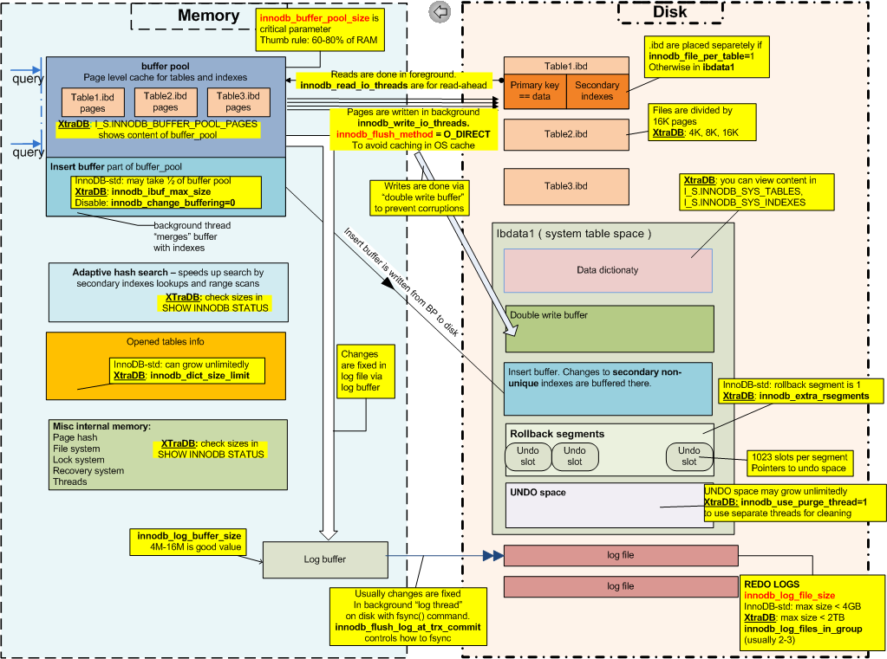

# Sơ lược MySQL Innodb Internal và cách MySQL Innodb thực hiện crash recovery 

## Sơ lược mysql innodb internal

### Kiến trúc mysql innodb 

      

- Kiến trúc gồm hai phần nằm ở cả memory và disk. Mọi thay đổi về dữ liệu đều được thực hiện trên `buffer pool` - một thành phần của innodb nằm trên memory trước. Data nằm trong buffer pool ở dạng các `page`. Mỗi page có kích cỡ chừng 16KB. Một page có hai trạng thái: `Dirty page` hoặc `clean page`.

  - `Dirty page`: Là những page có data thay đổi và chưa được flush xuống disk.
  - `Clean page`: Là những page không có data thay đổi hoặc có data thay đổi nhưng vừa được flush xuống disk.

- Hành động flush dirty page trong memory xuống disk cũng khá phức tạp. Mysql innodb sử dụng nhiều thành phần khác nhau để đảm bảo data có thể được bảo toàn và phục hồi khi có các sự cố nghiêm trọng như sụt nguồn hay kernel OS có vấn đề gì đó...Mỗi lần flush, innodb flush toàn bộ page 16KB thay vì chỉ flush những thay đổi trên page. Mục đích của mysql innodb là đẩy data từ memory xuống `data files` (`ibd files` hoặc `ibdata1` tùy vào cấu hình mysql có sử dụng `innodb_file_per_table` hay không). Các thành phần khác: `redo log`, und`o log`, `doublewrite buffer` chỉ hỗ trợ, nâng cao tính an toàn cho quá trình này.

- Để đảm bảo replay được các data nằm trong memory nhưng chưa được flush xuống disk. Innodb sử dụng các redo log (số lượng cũng như kích cỡ của từng redo log có thể được cấu hình). Mặc định innodb sử dụng hai redo log: `ib_logfile0` và `ib_logfile1`. Data được flush đồng thời vào cả hai redo log để tăng tốc.

- Để đảm bảo `rollback` được các transaction chưa kịp commit hoặc có explicit rollback, innodb sử dụng undo log nằm trong `system table space ibdata1`.

  > `Rollbacks` là thao tác khôi phục cơ sở dữ liệu về một trạng thái cũ. Các thao tác rollback có tầm quan trọng đối với tính toàn vẹn dữ liệu của cơ sở dữ liệu.

- Để đảm bảo loại bỏ các `half written pagem`, innodb sử dụng thêm một `doublewrite buffer` nằm trong `system table space ibdata1`.

  > `half written pagem` - trang được viết 1 nửa. Tình huống xảy ra khi mất điện đột ngột trong khi InnoDB đang flush data xuống disk.

- Quá trình hoạt động như sau:

  - Từ khu vực memory, có bốn luồng data được flush xuống khu vực disk. Chúng ta đi vào ba luồng flush data xuống `redo log`, `doublewrite buffer` và `data files`.

  - Innodb sẽ flush data xuống redo log nằm trên disk qua một `log buffer` nằm trên memory. Data ghi xuống redo log theo kiểu `sequence` còn data ghi xuống data files (ibd hoặc ibdata1) thì theo kiểu `random` do vậy, quá trình ghi data xuống redo log của innodb thường nhanh hơn nhiều. Innodb sẽ cố gắng ghi lại các thay đổi càng nhanh càng tốt xuống redo log còn với data files (ibd hoặc ibdata1) nó sẽ flush định kỳ. Để giảm dung lượng của redo log, bản thân redo log chỉ lưu các ***thay đổi*** trong page memory mà không phải toàn bộ page.

  - Khi flush page memory vào data files, innodb rất có thể gặp phải tình huống `half written page`. Một page memory có kích cỡ chừng 16KB trong khi đó một block data, đơn vị mang dữ liệu trên disk lại có kích cỡ nhỏ hơn nhiều chỉ là 4KB (Có thể xem block size qua output của lệnh `dumpe2fs`) nên OS sẽ cần phải `fragment data`(chia nhỏ data). Trong quá trinhg fragment đó có thể vì nhiều lý do mà toàn bộ các fragment không được flush xuống disk nên data không còn toàn vẹn. Một tình huống khác là các lỗi về hardware hay nguồn điện có thể làm cho innodb không kịp flush hết 16KB. Kết quả là sẽ có những half written page xuất hiện trong data files. Để giải quyết vấn đề này, innodb sử dụng thêm một `doublewrite buffer`. ( Tại sao redo log không giúp được gì trong tình huống này? Vì redo log chỉ chứa các thay đổi trong page chứ không phải toàn bộ page memory ). Như tên gọi, innodb sẽ flush toàn bộ page memory vào doublewrite buffer trước, sau đó nó gọi `system call fsync` (data chỉ được flush xuống disk sau khi fsync call thành công). Tiếp đó, cũng page memory đó, innodb lại flush vào data files (ibd hoặc ibdata1), sau đó nó gọi system call fsync. Như vậy là cùng một data được flush hai lần. Sự dư thừa này có tác động gì lên performance không? Thực sự thì không nhiều lắm. Mặc định, innodb vẫn sử dụng doublewrite buffer. Một fsync call không được gọi để flush cho từng page memory một mà thường là cho nhiều page memory nên sẽ không tạo ra quá nhiều hoạt động IO. Nhưng dữ liệu phải được flush vào doublewrite buffer trước khi đi xuống data files nên cũng có hạn chế nhất định. Tình huống khi mà doublewrite buffer đầy thì các page memory sẽ không thể flush được ngay xuống data files mà phải chờ.

### Một số thông tin khác:

- redo log, undo log, doublewrite buffer đều được flush theo kiểu sequence. Kiểu đẩy data tuần tự này rất thích hợp với các thiết bị lưu trữ như HDD. Một số chuyên gia khuyến cáo nên đặt redo log, undo log, doublewrite buffer trên HDD.

- data files (ibd, ibdata1) lại được flush theo kiểu random. Kiểu đẩy data này lại thích hợp với các thiết bị lưu trữ như SSD. Một số chuyên gia khuyến cáo nên đặt data files trên SSD

> Thâm khảo: Các thông tin về vị trí lưu log, data files trên HDD, SDD.

- Để tăng hiệu năng của quá trình flush data, innodb có sử dụng cấu hình `innodb_flush_method=O_DIRECT` cho phép data được flush xuyên thẳng đến buffer của device luôn mà không cần đi qua buffer của kernel.

- Thời điểm innodb flush data từ log buffer xuống redo log được điều khiển bởi option `innodb_flush_log_at_trx_commit`. Mặc định giá trị này là **1**. Đây là giá trị an toàn nhất. Bất cứ lúc nào có một transaction, log buffer được write xuống redo log và sau đó redo log flush liền xuống disk. Giá trị bằng **0** thì log buffer được write xuống redo log xấp xỉ sau mỗi giây và sau đó redo log liền được flush xuống disk. Khoảng thời gian mỗi giây không được đảm bảo vì CPU phải schedule để thực hiện nhiều tiến trình khác trong hệ thống chứ không hoàn toàn dành riêng cho mỗi mysqld. Giá trì bằng **2** thì log buffer được write xuống redo log khi có transaction, sau đó redo log được flush xuống disk sau mỗi giây (khoảng thời gian này không được đảm bảo cũng vì CPU scheduler).

## Mysql InnoDB thực hiện crash recovery như thế nào?

Sau một sự cố nghiêm trọng chẳng hạn như sụt nguồn, mysqld khi start trở lại sẽ cần thực hiện quá trình gọi là crash recovery. Ban đầu mysqld sẽ đọc redo log để replay các transaction chưa kịp flush vào data files. Trong các transaction đó có những transaction chưa kịp commit hoặc kết thúc bởi một explicit rollback. Mysqld sẽ tiếp tục đọc undo log để rollback các transaction đó. Cuối cùng mysqld cần phải loại bỏ các half written page khỏi data files. Nó sẽ thực hiện kiểm tra trong data files. Nếu nó thấy half written page, nó sẽ thay thế bằng full page có trong doublewrite buffer. Tất nhiên, bản thân trong doublewrite buffer cũng có thể có half written page, innodb sẽ discard các page này trong doublewrite buffer vì nó không thể tìm được nguồn thay thế.

## TÀI LIỆU THAM KHẢO
- https://techblog.vn/so-luoc-mysql-innodb-internal-va-cach-mysql-innodb-thuc-hien-crash-recovery
