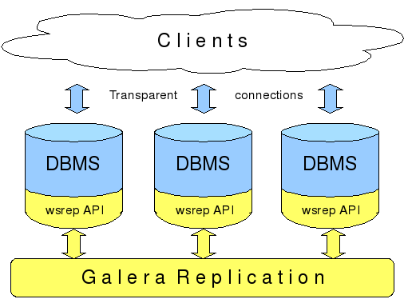

# Tìm hiểu về MariaDB Galera Cluster 

## Mục lục
  1. [Tổng quan](#1)
  2. [Hoạt động](#2)
  3. [Replicator Architecture](#3)
  4. [Phương thức đồng bộ](#4)
  5. [Phiên bản](#5)

<a name="1"></a>

## Tổng quan

<p align="center"></p>

- Galera Cluster là một synchronous multi-master cluster - cụm đồng bộ đa chủ sử dụng công cụ lưu trữ InnoDB. Trong MariaDB hỗ trợ các công cụ lưu trữ [XtraDB/InnoDB](https://mariadb.com/kb/en/library/innodb/) (có hỗ trợ thử nghiệm cho `MyISAM`)

- Sử dụng galera cluster, application có thể read/write trên bất cứ node nào. Một node có thể được thêm vào cluster cũng như gỡ ra khỏi cluster mà không có downtime dịch vụ, cách thức cũng đơn giản.

### Đặc điểm  

- Synchronous replication: Nhân bản đồng bộ
- Active-active multi-master topology: Cấu trúc liên kết đa chủ tích cực  
- Read and write to any cluster node: Đọc và ghi vào nút cluster bất kỳ
- Automatic membership control, failed nodes drop from the cluster: Kiểm soát thành viên tự động, các nốt bị fail sẽ xóa từ cluster  
- Automatic node joining: Tự động nút tham gia
- True parallel replication, on row level: Nhân bản song song được sử dụng trên cấp độ hàng
- Direct client connections, native MariaDB look & feel: Kết nối trực tiếp đến client, giao diện native MariaDB.  

### Lợi ích  

- Không có độ trễ slave
- Không có transaction bị mất
- Khả năng đọc và ghi lớn hơn
- Độ trễ máy client nhỏ hơn  

<a name="2"></a>

## Hoạt động

- Bản thân các hệ quản trị CSDL như `mariadb`, `percona xtradb` không có tính năng multi master được tích hợp sẵn bên trong. Các hệ quản trị CSDL này sẽ sử dụng một `galera replication plugin` để sử dụng tính năng multi master do galera cluster cung cấp. Về bản chất, `galera replication plugin` sử dụng một phiên bản mở rộng của mysql replication api, bản mở rộng này có tên là `wsrep api` - write set replication api.

- Dùng wsrep api, galera cluster sẽ thực hiện được certification based replication - nhân bản dựa trên chứng nhận sử dụng kỹ thuật giao tiếp nhóm và kỹ thuật đặt hàng giao dịch. Các thay đổi tại một node được nhóm thành một `write-set`(tập hợp ghi) trên `COMMIT` và `write-set` này sẽ được gửi đến các node khác. Mỗi node sẽ có node nguồn thực hiện 1 kiểm tra chứng nhận để quyết định xem write-set có được apply hay không. Chỉ khi qua được kiểm tra chứng nhận, write-set mới được apply giống như là một `transaction` và được COMMITT đến tất cả các node. Kiểm tra chứng nhận được dựa trên Global Ordering(đặt hàng toàn cầu) của các transaction, theo đó mỗi transaction sẽ được gán 1 `global transaction id - GTID`. Trong suốt thời gian COMMIT, transaction cuối được kiểm tra với các transaction trước đó để phát hiện bất kỳ xung đột chính nào và nếu phát hiện có xung đột thì kiểm tra chứng nhận thất bại. Nếu kiểm tra thành công, tất cả các node sẽ nhận được transaction với cùng một thứ tự toàn cầu.

  

- Để giữ trạng thái giống hệt nhau trên toàn cụm, API wsrep sử dụng ID giao dịch toàn cầu - GTID. Điều này cho phép nó xác định các thay đổi trạng thái và xác định trạng thái hiện tại liên quan đến thay đổi trạng thái cuối cùng. Đây là một ví dụ về GTID:  

  ```sh
  45eec521-2f34-11e0-0800-2a36050b826b:94530586304
  ```  

  `GTID` bao gồm:  
  **State UUID:** Đây là mã định danh duy nhất cho trạng thái và chuỗi các thay đổi mà nó trải qua.  
  **Ordinal Sequence Number:**  Là số nguyên dài 64 bit được sử dụng để biểu thị vị trí thay đổi trong chuỗi.  

  GTID cho phép bạn so sánh trạng thái ứng dụng và thiết lập thứ tự thay đổi trạng thái. Bạn có thể sử dụng nó để xác định xem có thay đổi được áp dụng hay không và liệu thay đổi đó có áp dụng cho một trạng thái nhất định hay không.

<a name="3"></a>

## Replicator Architecture

    

  

- MariaDB có sẵn cho các bản phân phối chính của Linux như openSUSE, Arch Linux, Fedora, CentOS, RedHat, Mint, Ubuntu, Debian, v.v. - 
- Chức năng của Galera Replication được cài đặt như một thư viện chia sẻ và có thể được link với bất kỳ hệ thống xử lý transaction nào nếu hệ thống này cài đặt wsrep API hooks.

- Thư viện Galera Replication là một stack giao thức cung cấp chức năng cho việc chuẩn bị, nhân bản và áp dụng các tập ghi transaction với các module như trên. 

  - `DBMS` (Database Manager System - hệ thống quản lý CSDL): ở đây chính là MariaDB Server
  - `wsrep API` - xác định giao diện, trách nhiệm cho DBMS và nhà cung cấp replication
  - `wsrep hooks` - tích hợp với công cụ database server phục vụ nhân bản write-set.
  - `Galera provider` - triển khai wsrep API cho thư viện Galera để cung cấp chức năng nhân bản write-set.
  - `certification` - chịu trách nhiệm chuẩn bị tập ghi (write sets) và thực hiện việc chứng nhận.
  - `Replication` - quản lý giao thức nhân bản và cung cấp toàn bộ khả năng ordering.
  - `GCS framework` - cung cấp kiến trúc plugin cho các hệ thống giao tiếp nhóm. Nhiều cài đặt GCS có thể được thích nghi (adapt), được thử nghiệm với những cài đặt in-house như: vsbes và gemini.

<a name="4"></a>

## Phương thức đồng bộ
  
- Galera sử dụng 3 phương thức để đồng bộ dữ liệu: **mysqldump**, **rsync** và **xtrabackup-v2**

  `rsync` là phương thức mặc định và yêu cầu ít thời gian setup nhất. Điểm yếu của nó là node đầu mối (donor node) sẽ bị block với tất cả các hoạt động trong lúc đang thực hiện SST.  

  `mysqldump` chuyển dữ liệu dưới dạng các lệnh SQL INSERT. Mỗi lệnh này sẽ tốn thời gian để thực thi trên các node đang join vào nếu kích thước của tập dữ liệu là đáng kể. Có một vài kỹ thuật để tăng hiệu suất insert, tuy nhiên nó không thể loại bỏ cản trở lớn nhất là dữ liệu được chuyển theo kiểu row-by-row thay vì file-by-file.  

  `xtrabackup-v2` sử dụng công cụ Percona XtraBackup để thu về một snapshot không bị block (non-blocking snapshot) của node đầu mối (donor node) và sau đó sử dụng snapshot đó để khởi động node mới join vào. Điều này yêu cầu cài đặt phức tạp hơn một chút, nhưng node đầu mối hầu như luôn sẵn sàng cho việc query trong suốt quá trình xử lý. Đây là phương thức nên sử dụng để cài đặt nếu muốn loại bỏ thời gian chết của node đầu mối.

- Galera sử dụng các cổng sau:

  - Cổng `3306` để kết nối với MySQL client và State Snapshot Transfer (SST) nếu sử dụng phương thức mysqldump để đồng bộ
  
  - Cổng `4567` dùng cho replication traffic, multicast. Sử dụng cả 2 giao thức UDP và TCP

  - Cổng `4568` dùng cho Incremental State Transfer(IST)

  - Cổng `4444` dùng cho State Snapshot Transfer nếu sử dụng phương thức rsync để đồng bộ

<a name="5"></a>

## Phiên bản Galera

- Galera Cluster Plugin là một bản vá mã nguồn mở cho MySQL được phát triển bởi Codership. Nó có sẵn tại [Codership](https://galeracluster.com/downloads/) dưới dạng 2 gói phần mềm - thư viện sao chép Galera và phiên bản MySQL gốc được mở rộng với Write Set Replication(wsrep) API (mysql-wsrep). Cùng với sản phẩm của Codership còn có 3 biến thể Galera:

  1. MySQL Galera Cluster bởi Codership

  2. MariaDB Galera Cluster bởi MariaDB

  3. Percona XtraDB Cluster for MySQL của Percona tích hợp Percona Server và Percona XtraBackup với thư viện Codership Galera.

- Trong MariaDB 10.1 trở lên, wsrep API cho Galera Cluster đã được tích hợp sẵn vào gói MariaDB. MariaDB Galera Cluster sử dụng thư viện Codership Galera và mysql-wsrep để triển khai thực hiện Cluster của nó. Phiên bản Galera sau tương ứng với từng phiên bản MariaDB Server:

  - Trong MariaDB 10.4 trở lên, MariaDB Galera Cluster sử dụng Galera 4. Điều này có nghĩa là bản vá MySQL-wsrep là phiên bản 26 và thư viện nhà cung cấp Galera wsrep là phiên bản 4.
  - Trong MariaDB 10.3 trở về trước, MariaDB Galera Cluster sử dụng Galera 3. Điều này có nghĩa là bản vá MySQL-wsrep là phiên bản 25 và thư viện nhà cung cấp Galera wsrep là phiên bản 3.

- Xem chi tiết thông tin về phiên bản Galera [***tại đây***](https://mariadb.com/kb/en/library/what-is-mariadb-galera-cluster/)


## TÀI LIỆU THAM KHẢO
- https://mariadb.com/kb/en/library/what-is-mariadb-galera-cluster/

- https://techblog.vn/cai-dat-ha-galera-cluster-mariadb-su-dung-maxscale-tren-centos-6

- https://galeracluster.com/library/documentation/tech-desc-introduction.html

- https://galeracluster.com/library/documentation/index.html

- https://severalnines.com/resources/tutorials/galera-cluster-mysql-tutorial

- https://dirtysalt.github.io/html/galera.html#orge0ea71c

- https://clusterengine.me/mariadb-galera-cluster/


