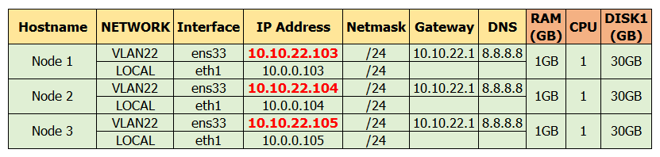

# Cài đặt Galera 3 node trên CentOS 8  

## Chuẩn bị
### Phân hoạch

  

### Mô Hình

    

### Yêu cầu
- Server sử dụng hệ điều hành CentOS 8
- Các node đã cài sẵn MariaDB 10.3.11(version mặc định trên CentOS8)  
## Cấu hình  
