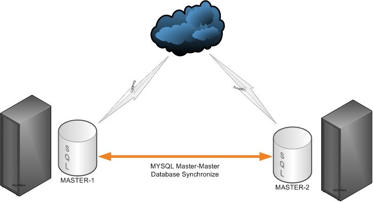
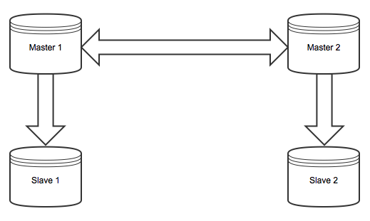
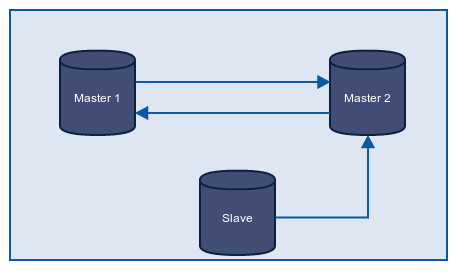
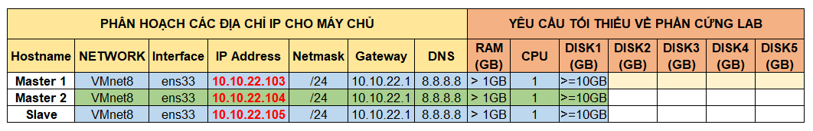
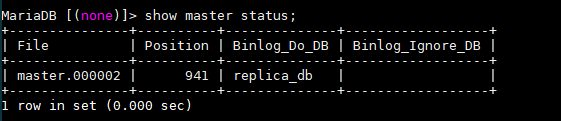
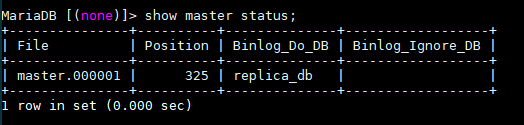
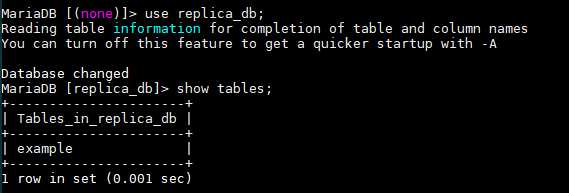
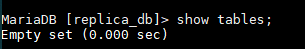

# MariaDB Master Master Replication  

<p align="center">  

## Mục lục


## Giới thiệu 

MariaDB Master Master Replication hay còn được gọi là “mariadb chained replication”, “mariadb master replication or “mariadb daisy chaining replication” là một phần mở rộng của mariadb master slave replication cho phép bạn tạo ra nhiều master server, các master server này cũng có thể được sử dụng với nhiều slave khác.  

## Các trường hợp sử dụng Master Master Replication  

- Migrations: 
  
  Giả sử bạn có các database nằm trên các server khác nhau, dữ liệu của bạn có thể lên đến hàng trăm gigabytes. Công việc của bạn là phải di chuyển csdl từ các server đó lên một hoặc nhiều server mới trong nhiều ngày khác nhau và phải đảm bảo `downtime` ít nhất có thể. Bạn có thể sử dụng `mysqldump` hoặc `Percona Xtrabackup` để backup và restore nhưng sao lưu dữ liệu cần rất nhiều thời gian nên đây không phải là lựa chọn hợp lý. Trường hợp này bạn nên sử dụng đồng bộ dữ liệu giữa server hiện tại và server mới sẽ tiết kiệm được thời gian chết.

- Improving replication performance: cải thiện hiệu suất nhân rộng:  

  Bằng cách sử dụng replication, cơ sở dữ liệu của bạn có thể được mở rộng theo chiều ngang. Tuy nhiên trong trường hợp có nhiều slave cùng kết nối đến master, mỗi slave tạo ra 1 tải bổ sung trên master, việc này nó có thể làm tăng tải mạng trên master làm giảm hiệu suất. Việc bổ sung thêm một master sẽ giúp làm giảm tải mạng cho hệ thống.  

    

## Hoạt động  

    

## Cấu hình  

### Mô hình

  

### Chi tiết thiết lập 

  <p align="center"></p>
     
- Cơ sở dữ liệu: `replica_db`

***Thiết lập server***  

- Các máy sử dụng hệ điều hành CentOS 8 và đã cài đặt MariaDB Server v10.3.11.   

### Các bước cấu hình  

- Trên Master Server 1:  

  - Chỉnh sửa file `/etc/my.cnf.d/mariadb-server.cnf` và thêm vào đoạn cấu hình sau:  

    ```sh
        [mariadb]
        server-id=1
        log_bin=master
        binlog_format=row
        binlog_do_db=replica_db
    ```

  - Lưu cấu hình và restart lại dịch vụ MariaDB Server

    ```sh
      # systemctl restart mariadb
    ```  

  - Sử dụng root user đăng nhập vào MariaDB Server
    
    ```sh
      # mysql -u root -p
    ```  

    - Tạo user `replicator@10.10.22.103` sử dụng để nhân bản dữ liệu trên Master 2  

      ```sh
        > create user 'replicator'@'10.10.22.104' identified by 'abc@123';
      ```

    - Cấp quyền nhân bản cho user mới tạo

      ```sh
        > grant replication slave on *.* to 'replicator'@'10.10.22.103' identified by 'abc@123';
      ```
    
    - Block tất cả các câu lệnh trên các bảng để đảm bảo trong quá trình backup dữ liệu được toàn vẹn:
      
      ```sh
        > FLUSH TABLES WITH READ LOCK;
      ````

    - Sử dụng lệnh dưới để xem thông tin về `Position`, `Binlog_Do_DB` và `Binlog_Ignore_DB`

      ```sh
        > show master status;
      ```

      OUTPUT

        

    - Backup CSDL và sao chép nó sang Master Server 2

      ```sh
        # mysqldump --all-databases --user=root --password --master-data > masterdatabase.sql
        # scp masterdatabase.sql root@10.10.22.104:/root/masterdatabase.sql
      ```

    - Sau khi hoàn thành backup dữ liệu, thực hiện `UNLOCK TABLES` để thực hiện các thao tác trên bảng
      
      ```sh
        > UNLOCK TABLES;
      ```

- Trên Master Server 2:  

  - Chỉnh sửa file `/etc/my.cnf.d/mariadb-server.cnf` và thêm vào đoạn cấu hình sau:  

    ```sh
        [mariadb]
        server-id=2
        log_bin=master
        binlog_format=row
        binlog_do_db=replica_db
    ```

  - Restore CSDL được backup từ Master 1

    ```sh
      > stop slave;
      # mysql -u root -p < /root/masterdatabase.sql
    ```

  - Lưu cấu hình và restart lại dịch vụ MariaDB Server

    ```sh
      # systemctl restart mariadb
    ```  

  - Sử dụng root user đăng nhập vào MariaDB Server
    
    ```sh
      # mysql -u root -p
    ```  

    - Tạo user `replicator@10.10.22.104` sử dụng để nhân bản dữ liệu trên Master 1  

      ```sh
        > create user 'replicator'@'10.10.22.104' identified by 'abc@123';
      ```

    - Cấp quyền nhân bản cho user mới tạo

      ```sh
        > grant replication slave on *.* to 'replicator'@'10.10.22.104' identified by 'abc@123';
      ```

    - Tạo CSDL `replica_db` để nhân bản  

      ```sh
        > create database replica_db;
      ```

    - Stop Slave. Sau đó hướng dẫn Master 2 tìm file Master Log file trên Master 1 và Start Slave.

      ```sh
        > stop slave;
        > change master to master_host='10.10.22.103', master_user='replicator', master_password='abc@123', master_log_file='master.000002', master_log_pos=941;
        > start slave;
      ```

    - Block tất cả các câu lệnh trên các bảng để đảm bảo trong quá trình backup dữ liệu được toàn vẹn:
      
      ```sh
        > FLUSH TABLES WITH READ LOCK;
      ````

    - Sử dụng lệnh dưới để xem thông tin về `Position`, `Binlog_Do_DB` và `Binlog_Ignore_DB`

      ```sh
        > show master status;
      ```

      OUTPUT

        

    - Backup CSDL và sao chép nó sang Master Server 2

      ```sh
        # mysqldump --all-databases --user=root --password --master-data > /var/masterdatabase.sql
        # scp /var/masterdatabase.sql root@10.10.22.103:/root/replica
      ```

    - Sau khi hoàn thành backup dữ liệu, thực hiện `UNLOCK TABLES` để thực hiện các thao tác trên bảng
      
      ```sh
        > UNLOCK TABLES;
      ```

- Trên Master 1  

  - Đăng nhập vào MariaDB Server sử dụng root user

    ```sh
      # mysql -u root -p
    ```  

  - Stop Slave. Sau đó hướng dẫn Master 1 tìm file Master Log file trên Master 2 và Start Slave.

    ```sh
      > stop slave;
      > change master to master_host='10.10.22.104', master_user='replicator', master_password='abc@123', master_log_file='master.000001', master_log_pos=325;
      > start slave;
    ```

- Kiểm tra hoạt động của Master Master Replication  

  ***Mô tả:***  

  - Tạo bảng `example` trong CSDL `replica_db` trên Master Server 1 và kiểm tra trên Master Server 2 có hiển thị không.

  - Đứng trên Master Server 2 xóa bảng `example` và kiểm tra trên Master Server 1 có còn hiển thị nữa không.

  ***Quy trình thực hiện:***

  - Tạo bảng `example` trên Master 1:  

    ```sh
      > create database replica_db;
      > use replica_db;
      > create table example (`id` varchar(10));
    ```

  - Kiểm tra trên Master 2:

    ```sh
      > use replica_db;
      > show tables;
    ```

    OUTPUT

      

  - Trên Master 2, xóa bảng `example`
    
    ```sh
      > drop table example;
    ```

  - Kiểm tra trên Master 1

    ```sh
      > show tables;
    ```

    OUTPUT

      

    


 

## TÀI LIỆU THAM KHẢO
- https://www.digitalocean.com/community/tutorials/how-to-set-up-mysql-master-master-replication#step-1-install-and-configure-mysql-on-server-c
 
- https://tecadmin.net/how-to-set-up-mysql-master-master-replication/

- https://linoxide.com/linux-how-to/5-steps-setup-mysql-master-master-replication-ubuntu-16-04/

- https://www.linuxhelp.com/how-to-configure-mysql-master-master-replication-in-centos-7

