# Tìm hiểu về MariaDB Master-Slave Replication  

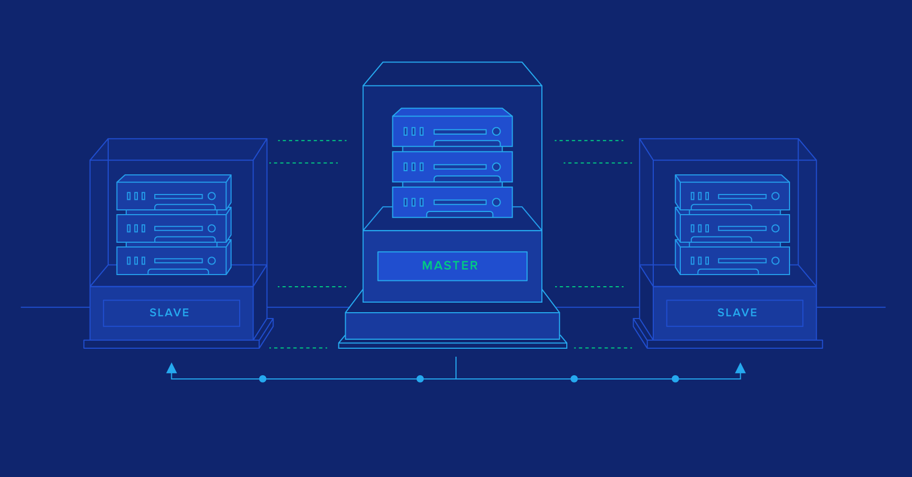

## Mục lục
### 1. [Giới thiệu](#1)
### 2. [Hoạt động của MariaDB Master Slave](#2)
### 3. [Thiết lập MariaDB Master-Slave Replication](#3)  

<a name="1"></a>

## I - Giới thiệu  
- Replication là một tính năng cho phép nội dung của một hoặc nhiều server(được gọi là master) được nhân đôi trên một hoặc nhiều máy chủ(được gọi là slave)
  
  Bạn có thể kiểm soát dữ liệu nào cần sao chép. Tất cả các cơ sở dữ liệu, một hoặc nhiều cơ sở dữ liệu hoặc các bảng trong cơ sở dữ liệu đều có thể được sao chép có chọn lọc.

- `Master-slave replication` là một kiểu nhân bản(replication) trong đó dữ liệu chỉ được replicated 1 chiều. 

  - Các thay đổi xảy ra với dữ liệu gốc trên Master cũng sẽ xảy ra với dữ liệu trên Slave. Slave sẽ tự động sao chép các thay đổi đó.  
  - Những thay đổi với dữ liệu được thực hiện trên Slave sẽ không thay đổi dữ liệu trên Master.  

- `Master-slave replication` được sử dụng cho một số mục đích:  

  - Khả năng mở rộng - Scalability: Bằng cách có một hoặc nhiều server slave, việc đọc có thể được trải rộng trên nhiều server, giảm tải cho master. Kịch bản phổ biến nhất cho môi trường đọc cao, viết thấp là có một master, trong đó tất cả các ghi xảy ra, sao chép thành nhiều slave, xử lý hầu hết các lần đọc.    
  - Phân tích dữ liệu - Data analysis: phân tích dữ liệu có thể ảnh hưởng nhiều đến master server do đó ta có thể sử dụng slave server để phân tích dữ liệu mà vẫn đảm bảo master server hoạt động bình thường.  
  - Hỗ trợ sao lưu - Backup assistance: 
  - Phân phối dữ liệu - Distribution of data: Thay vì được kết nối với một master server từ xa, ta ó thể sao chép dữ liệu cục bộ và làm việc từ dữ liệu này.

    <p align="center">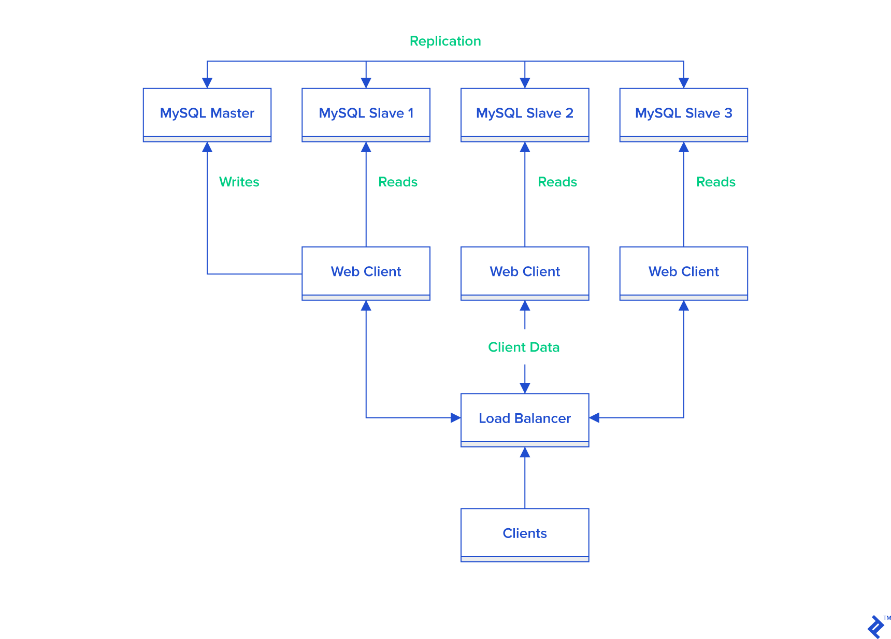</p>  

<a name="2"></a>

## II - Master-Slave Replication trong MariaDB hoạt động như thế nào?  

<p align="center">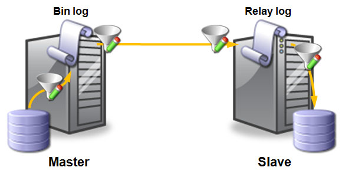</p>  

- Cơ chế chính của replication là **binary log** - nhật ký nhị phân. Nếu ghi nhật ký nhị phân được bật, tất cả các cập nhật cho cơ sở dữ liệu (CREATE, ALTER, INSERT, UPDATE và DELETE) sẽ được ghi vào `binary log` dưới dạng các sự kiện `binlog`. Các slave đọc binary log từ mỗi master để truy cập dữ liệu để sao chép. Một `relay log` - nhật ký chuyển tiếp được tạo trên slave server, sử dụng cùng định dạng với binary log được sử dụng để thực hiện sao chép. Các tệp nhật ký chuyển tiếp cũ được gỡ bỏ khi không còn cần thiết.  

- Một slave server sẽ theo dõi vị trí của sự kiện binlog cuối được ghi trong file nhật ký nhị phân của master. Điều này cho phép slave server kết nối lại và tiếp tục lại từ nơi nó dừng lại sau khi quá trình sao chép tạm thời bị dừng lại. Nó cũng cho phép một slave ngắt kết nối, tạo nhân bản và sau đó slave mới tiếp tục replication từ cùng một master.

- Master và slave không cần kết nối liên tục với nhau. Bạn có thể để server offline hoặc ngắt kết nối khỏi mạng và khi chúng quay lại hoạt động thì quá trình replication sẽ bắt đầu từ nơi nó dừng lại.  

- Hoạt động

  <p align="center">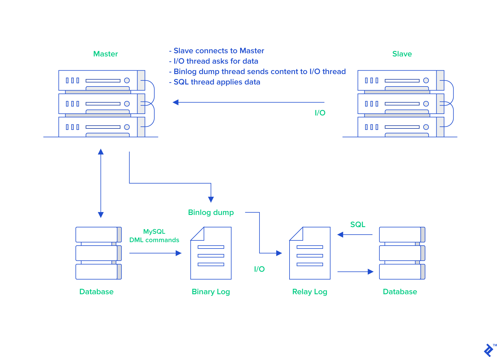</p>  

<a name="3"></a>  

## III - Thiết lập MariaDB Master-Slave Replication trên CentOS 7  
### 3.1. Mô hình  

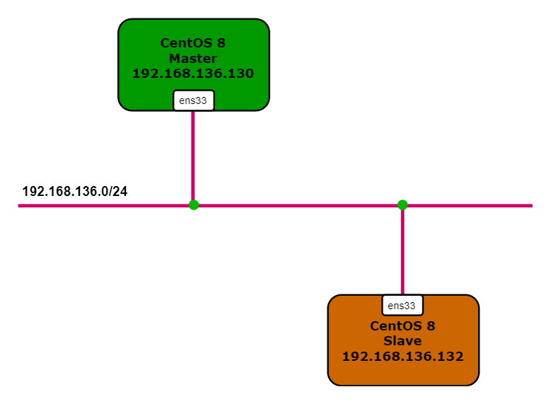

### 3.2. Quy hoạch IP và cấu hình tối thiểu

<p align="center">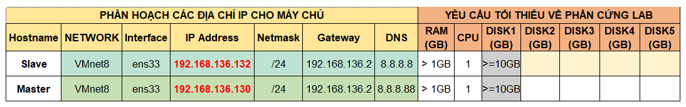</p> 

- 2 server sử dụng CentOS Linux release 8.0.1905 (Core)
- Đảm bảo cả 2 server đã cài đặt MariaDB 10.3.11   

### 3.3. Các bước thực hiện
- Bước 1: Cài đặt MariaDB trên Master Server và Slave Server  

  ```sh
    # yum install -y mariadb-server
    # systemtl enable mariadb
    # systemctl start mariadb
  ```

- Bước 2: Thiết lập mật khẩu cho Master và Slave  

  ```sh
    # mysql_secure_installation
  ```  

  <p align="center">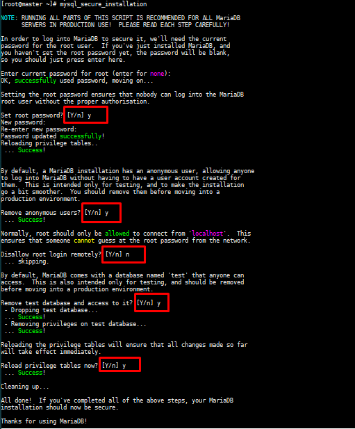</p>

- Bước 3: Cấu hình Master Node  

  - Cấu hình firewall, cho phép lắng nghe port 3306  

    ```sh
      # firewall-cmd --add-port=3306/tcp --zone=public --permanent
    success
    ```

  - Reload xác nhận cấu hình  

    ```sh
      # firewall-cmd --reload
    success
    ```

  - Chỉnh sửa file ` /etc/my.cnf.d/mariadb-server.cnf.d/mariadb-server.cnf`  

    ```sh
      # vi  /etc/my.cnf.d/mariadb-server.cnf.d/mariadb-server.cnf
    ```

    Trong phần `[mariadb]` thêm các dòng sau:

    ```sh
      [mariadb]
      server-id=1
      log-bin=master
      binlog-format=row
      binlog-do-db=replica_db
    ```

    Trong đó:  
    `server_id` là tùy chọn được sử dụng trong replication cho phép master server và slave server có thể nhận dạng lẫn nhau. Server_id Với mỗi server là khác nhau, nhận giá trị từ 1 đến 4294967295(mariadb >=10.2.2) và 0 đến 4294967295(mariadb =<10.2.1)  
    `log-bin` hay `log-basename` là tên cơ sở nhật ký nhị phân để tạo tên tệp nhật ký nhị phân. 
    `binlog-format` là định dạng dữ liệu được lưu trong file bin log.  
    `binlog-do-db` là tùy chọn để nhận biết cơ sở dữ liệu nào sẽ được replication. Nếu muốn replication nhiều CSDL, bạn phải viết lại tùy chọn binlog-do-db nhiều lần. Hiện tại không có option cho phép chọn toàn bộ CSDL để replica mà bạn phải ghi tất cả CSDL muốn replica ra theo option này.  

  - Restart lại dịch vụ mariadb để nhận cấu hình mới

    ```sh
      # systemctl restart mariadb
    ```

  - Sử dụng root user đăng nhập vào MariaDB  

    ```sh
      # mysql -u root -p
    ```

    - Tạo CSDL có tên là `replica_db`  

      ```sh
        > create database replica_db;
      Query OK, 1 row affected (0.002 sec)
      ```  

    - Tạo Slave user, password và gán quyền cho user đó. Ví dụ sử dụng username là `slave_user` và password là `abc@123`  

      ```sh
        > create user 'slave_user'@'%' identified by 'abc@123';
        > stop slave;
      Query OK, 0 rows affected, 1 warning (0.062 sec)
        > GRANT REPLICATION SLAVE ON *.* TO 'slave_user'@'%' IDENTIFIED BY 'abc@123';
      Query OK, 0 rows affected (0.061 sec)
      ```

    - Xác nhận lại các thay đổi với câu lệnh:  
      
      ```sh
        > FLUSH PRIVILEGES;
      Query OK, 0 rows affected (0.012 sec)
      ```  
    - Sử dụng câu lệnh dưới đây để chắc chắn rằng không có bất cứ điều gì được ghi vào master database trong quá trình replication dữ liệu. Ghi nhớ `filename` and `position` của `binary log` để có thể thực hiện cấu hình trên slave.  

      ```sh
        > FLUSH TABLES WITH READ LOCK;
      ```  
    - Sử dụng câu lệnh dưới để kiểm tra trạng thái của slave  

      ```sh
        > show master status;
      +--------------------+----------+--------------+------------------+
      | File               | Position | Binlog_Do_DB | Binlog_Ignore_DB |
      +--------------------+----------+--------------+------------------+
      | master.000001  |     939  | replica_db   |                  |
      +--------------------+----------+--------------+------------------+
      1 row in set (0.058 sec)
      ```  
- Bước 4: Tiến hành `backup` CSDL trên master server và chuyển nó đến slave server  

  ```sh
    # mysqldump --all-databases --user=root --password --master-data > masterdatabase.sql
    Enter password:
    # ls
    anaconda-ks.cfg  masterdatabase.sql  
  ```  

  - Đăng nhập vào MariaDB với root user và thực hiện unlock table bằng lệnh  

    ```sh
      > UNLOCK TABLES;
    ```  

  - Copy `masterdatabase.sql` file tới Slave server 

    ```sh
      # scp masterdatabase.sql root@192.168.136.132:/root/replica
    ```
    OUTPUT
    ```SH
    The authenticity of host '192.168.136.132 (192.168.136.132)' can't be established.
    ECDSA key fingerprint is SHA256:BkAckAHiVmMAiIWYmSiD9bYpFfDducZTUqutqZ3GaJM.
    Are you sure you want to continue connecting (yes/no)? yes
    Warning: Permanently added '192.168.136.132' (ECDSA) to the list of known hosts.
    root@192.168.136.132's password:
    masterdatabase.sql                                                                                                                 100%  469KB   8.8MB/s   00:00
    ```  

- Bước 5: Cấu hình Slave Server  

  - Chỉnh sửa ` /etc/my.cnf.d/mariadb-server.cnf` file

    ```sh
      # vi /etc/my.cnf.d/mariadb-server.cnf
    ```

    Sau đó thêm vào các dòng sau

    ```sh
    [mariadb]
    server-id = 2
    replicate-do-db=replica_db
    ```    

    Trong đó:  
      `replicate-do-db` là CSDL được tạo trên Master Server.   
      `server-id` là tùy chọn được sử dụng trong replication cho phép master server và slave server có thể nhận dạng lẫn nhau. Server_id Với mỗi server là khác nhau, nhận giá trị từ 1 đến 4294967295(mariadb >=10.2.2) và 0 đến 4294967295(mariadb =<10.2.1). 

  - Import CSDL master  

    ```sh
      # mysql -u root -p < /root/replica
    Enter password:
    ```  

  - Restart MariaDB service để tiếp nhận thay đổi  

    ```sh
      # systemctl restart mariadb
    ```  

  - Sử dụng root user đăng nhập vào MariaDB Server  

    ```sh
      # mysql -u root -p
    ```  

  - Stop Slave. Sau đó hướng dẫn Slave tìm file `Master Log file` và bắt đầu Slave.  

    ```sh
      > STOP SLAVE;
    Query OK, 0 rows affected (0.012 sec)
      > CHANGE MASTER TO MASTER_HOST='192.168.136.130', MASTER_USER='slave_user', MASTER_PASSWORD='abc@123', MASTER_LOG_FILE='mariadb-bin.000001', MASTER_LOG_POS=2088;
    Query OK, 0 rows affected (0.051 sec)
      > START SLAVE;
    Query OK, 0 rows affected (0.044 sec)
    ```  

  - Kiểm tra trạng thái của Slave, sử dụng lệnh:  

    ```sh
      > show slave status\G;
    ```

    OUTPUT

    <p align="center">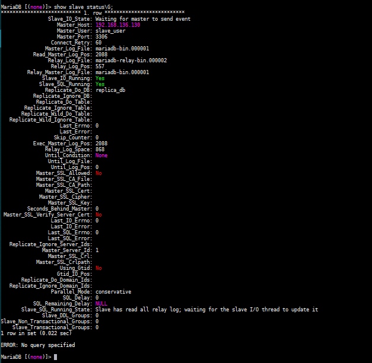</p>  


## IV-Kiểm tra MariaDB Replication  
### Master side:  
- Đăng nhập vào Master server sử dụng root user 

  ```sh
    # mysql -u root -p
  ```  

  - Tạo CSDL `replica_db`  

      

  - Tạo bảng `Persons`  

    ```sh
      > CREATE TABLE Persons ( PersonID int, LastName varchar(255), FirstName varchar(255), City varchar(255) );
    ```

    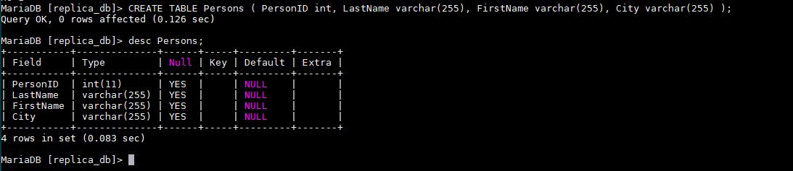  

  - Insert giá trị vào bảng  

    ```sh
      > INSERT INTO Persons (PersonID, LastName, FirstName, City) Values (1, 'Hien', 'Nguyen', 'HaNoi');
    ```  

    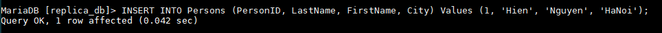  

  - Hiển thị thông tin trên bảng  

    ```sh
      > Select * from Persons;
    ```

    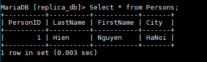  

### Slave side:  
- Sử dụng root user đăng nhập vào MariaDB trên Slave Server  

  ```sh
    # mysql -u root -p
  ```  

  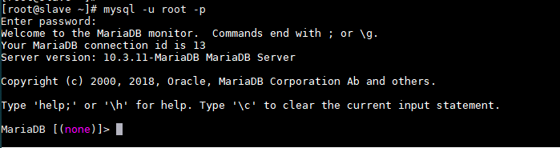  

- Hiển thị CSDL  

  ```sh
    > SHOW DATABASES;
  ```  

  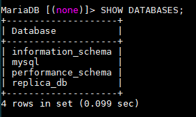  

  Như bạn thấy, CSDL `replica_db` đã tồn tại tức là nó đã được replication thành công.  

- Truy cập vào CSDL, kiểm tra xem có tồn tại bảng trong đó không

  ```sh
    > use replica_db;
  ```

  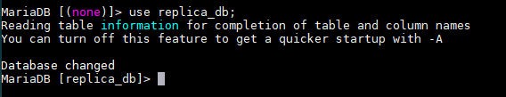  

  ```sh
    > SHOW TABLES;
  ```

  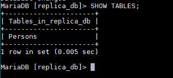  

- Kiểm tra dữ liệu trong bảng có được replication đầy đủ 

  ```sh
    > select * from Persons;
  ```

  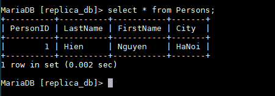  
  


## TÀI LIỆU THAM KHẢO
- https://kipalog.com/posts/Gioi-thieu-MySQL-Replication
- https://linoxide.com/how-tos/configure-mariadb-replication-centos-linux/
- https://www.linuxbabe.com/mariadb/master-slave-replication-ubuntu-18-04-18-10
- https://techblog.vn/gioi-thieu-ve-mysql-replication-master-slave
- https://mariadb.com/kb/en/library/replication-overview/
- https://mariadb.com/kb/en/library/relay-log/
- https://www.journaldev.com/29314/set-up-mariadb-master-slave-replication-centos
- https://dev.mysql.com/doc/refman/8.0/en/replication-options-binary-log.html
- https://mariadb.com/kb/en/library/replication-filters/
