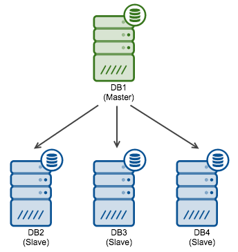
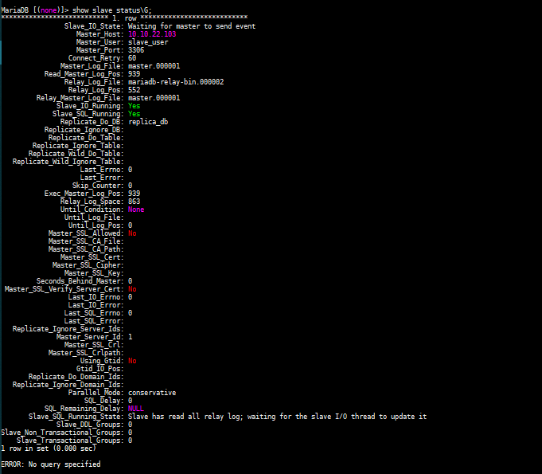

## 1. MariaDB Replication One Master Multi Slave  

- Mô hình:  

  <p  align="center" width="100%"></p>

- Kế hoạch IP:  

    

- Cấu hình trên Master:  

  - Cấu hình firewall, cho phép lắng nghe port 3306  

    ```sh
      # firewall-cmd --add-port=3306/tcp --zone=public --permanent
    success
    ```

  - Reload xác nhận cấu hình  

    ```sh
      # firewall-cmd --reload
    success
    ```

  - Chỉnh sửa file ` /etc/my.cnf.d/mariadb-server.cnf`  

    ```sh
      # vi  /etc/my.cnf.d/mariadb-server.cnf
    ```

    Trong phần `[mariadb]` thêm các dòng sau:

    ```sh
      [mariadb]
      server-id=1
      log-bin=master
      binlog-format=row
      binlog-do-db=replica_db
    ```

    Trong đó:  
    `server_id` là tùy chọn được sử dụng trong replication cho phép master server và slave server có thể nhận dạng lẫn nhau. Server_id Với mỗi server là khác nhau, nhận giá trị từ 1 đến 4294967295(mariadb >=10.2.2) và 0 đến 4294967295(mariadb =<10.2.1)  
    `log-bin` hay `log-basename` là tên cơ sở nhật ký nhị phân để tạo tên tệp nhật ký nhị phân. 
    `binlog-format` là định dạng dữ liệu được lưu trong file bin log.  
    `binlog-do-db` là tùy chọn để nhận biết cơ sở dữ liệu nào sẽ được replication. Nếu muốn replication nhiều CSDL, bạn phải viết lại tùy chọn binlog-do-db nhiều lần. Hiện tại không có option cho phép chọn toàn bộ CSDL để replica mà bạn phải ghi tất cả CSDL muốn replica ra theo option này.  

  - Restart lại dịch vụ mariadb để nhận cấu hình mới

    ```sh
      # systemctl restart mariadb
    ```

  - Sử dụng root user đăng nhập vào MariaDB  

    ```sh
      # mysql -u root -p
    ```

    - Tạo CSDL có tên là `replica_db`  

      ```sh
        > create database replica_db;
      Query OK, 1 row affected (0.002 sec)
      ```  

    - Tạo Slave user, password và gán quyền cho user đó. Ví dụ sử dụng username là `slave_user` và password là `abc@123`  

      ```sh
        > create user 'slave_user'@'%' identified by 'abc@123';
        > stop slave;
      Query OK, 0 rows affected, 1 warning (0.062 sec)
        > GRANT REPLICATION SLAVE ON *.* TO 'slave_user'@'%' IDENTIFIED BY 'abc@123';
      Query OK, 0 rows affected (0.061 sec)
      ```

    - Xác nhận lại các thay đổi với câu lệnh:  
      
      ```sh
        > FLUSH PRIVILEGES;
      Query OK, 0 rows affected (0.012 sec)
      ```  
    - Sử dụng câu lệnh dưới đây để chắc chắn rằng không có bất cứ điều gì được ghi vào master database trong quá trình replication dữ liệu. Ghi nhớ `filename` and `position` của `binary log` để có thể thực hiện cấu hình trên slave.  

      ```sh
        > FLUSH TABLES WITH READ LOCK;
      ```  

  - Tiến hành `backup` CSDL trên master server và chuyển nó đến slave server  

    ```sh
    # mysqldump --all-databases --user=root --password --master-data > masterdatabase.sql
    Enter password:
    # ls
    anaconda-ks.cfg  masterdatabase.sql  
    ```  

  - Đăng nhập vào MariaDB với root user và thực hiện unlock table bằng lệnh  

    ```sh
      > UNLOCK TABLES;
    ```  

  - Copy `masterdatabase.sql` file tới Slave server 

    ```sh
      # scp masterdatabase.sql root@10.10.22.104:/root/masterdatabase.sql
    ```
    OUTPUT
      ```SH
        The authenticity of host '10.10.22.103 (10.10.22.103)' can't be established.
        ECDSA key fingerprint is SHA256:PzOHVRzGT/OSMrtT/sqGFrbUpEyiHih6NO4ZQwtyIt8.
        Are you sure you want to continue connecting (yes/no)? yes
        Warning: Permanently added '10.10.22.103' (ECDSA) to the list of known hosts.
        root@10.10.22.103's password:
        masterdatabase.sql                                                                                                                 100%  469KB  38.2MB/s   00:00
      ```

  - Sử dụng câu lệnh dưới để kiểm tra trạng thái của slave  

    ```sh
      > show master status;
      +--------------------+----------+--------------+------------------+
      | File               | Position | Binlog_Do_DB | Binlog_Ignore_DB |
      +--------------------+----------+--------------+------------------+
      | mariadb-bin.000001 |     939  | replica_db   |                  |
      +--------------------+----------+--------------+------------------+
      1 row in set (0.058 sec)
    ```  

- Cấu hình trên Slave1  

  - Cấu hình firewall, cho phép lắng nghe port 3306  

    ```sh
      # firewall-cmd --add-port=3306/tcp --zone=public --permanent
    success
    ```

  - Reload xác nhận cấu hình  

    ```sh
      # firewall-cmd --reload
    success
    ```

  - Chỉnh sửa `/etc/my.cnf.d/mariadb-server.cnf` file

    ```sh
      # vi /etc/my.cnf.d/mariadb-server.cnf
    ```

    Sau đó thêm vào các dòng sau

    ```sh
    [mariadb]
    server-id = 2
    replicate-do-db=replica_db
    ```    

    Trong đó:  
      `replicate-do-db` là CSDL được tạo trên Master Server.   
      `server-id` là tùy chọn được sử dụng trong replication cho phép master server và slave server có thể nhận dạng lẫn nhau. Server_id Với mỗi server là khác nhau, nhận giá trị từ 1 đến 4294967295(mariadb >=10.2.2) và 0 đến 4294967295(mariadb =<10.2.1). 

  - Import CSDL master  

    ```sh
      # mysql -u root -p < /root/masterdatabase.sql
    Enter password:
    ```  

  - Restart MariaDB service để tiếp nhận thay đổi  

    ```sh
      # systemctl restart mariadb
    ```  

  - Restart MariaDB service để tiếp nhận thay đổi  

    ```sh
      # systemctl restart mariadb
    ```  

  - Sử dụng root user đăng nhập vào MariaDB Server  

    ```sh
      # mysql -u root -p
    ```  

  - Stop Slave. Sau đó hướng dẫn Slave tìm file `Master Log file` và bắt đầu Slave.  

    ```sh
      > CHANGE MASTER TO MASTER_HOST='10.10.22.103', MASTER_USER='slave_user', MASTER_PASSWORD='abc@123', MASTER_LOG_FILE='master.000001', MASTER_LOG_POS=939;
    Query OK, 0 rows affected (0.051 sec)
      > START SLAVE;
    Query OK, 0 rows affected (0.044 sec)
    ```  

  - Kiểm tra trạng thái của Slave, sử dụng lệnh:  

    ```sh
      > show slave status\G;
    ```

    OUTPUT

    <p align="center"></p>  

- Thêm Slave vào hệ thống

  - Cấu hình trên Master

    - Bật tính năng read only để không ghi thêm dữ liệu mới vào CSDL và tắt replication:

      ```sh
        > stop slave;
        > flush table with read lock;  
      ```  
    
    - Tiến hành `backup` CSDL trên master server và chuyển nó đến slave server  

    ```sh
    # mysqldump --all-databases --user=root --password --master-data > masterdatabase.sql
    Enter password:
    # ls
    anaconda-ks.cfg  masterdatabase.sql  
    ```  

  - Đăng nhập vào MariaDB với root user và thực hiện unlock table bằng lệnh  

    ```sh
      > UNLOCK TABLES;
    ```  

  - Copy `masterdatabase.sql` file tới Slave server 2

    ```sh
      # scp masterdatabase.sql root@10.10.22.105:/root/masterdatabase.sql
    ```

  - Cấu hình trên Slave 2:

    - Chỉnh sửa file `/etc/my.cnf.d/mariadb-server.cnf` và thêm vào dòng sau:  

      ```sh
        [mariadb]
        server-id = 3
        replicate-do-db=replica_db
      ```
    
    - Import CSDL master  

      ```sh
      # mysql -u root -p < /root/replica
      Enter password:
      ```  

    - Restart MariaDB service để tiếp nhận thay đổi  

      ```sh
      # systemctl restart mariadb
      ```  

    - Restart lại MariaDB Server để nhận cấu hình mới

      ```sh
        # systemctl restart mariadb
      ```  
    
    - Sử dụng user root đăng nhập vào MariaDB Server

      ```sh
        # mysql -u root -p
      ```

    - Stop Slave. Sau đó hướng dẫn Slave tìm file `Master Log file` và bắt đầu Slave.  

      ```sh
      > CHANGE MASTER TO MASTER_HOST='10.10.22.103', MASTER_USER='slave_user', MASTER_PASSWORD='abc@123', MASTER_LOG_FILE='master.000001', MASTER_LOG_POS=939;
      Query OK, 0 rows affected (0.051 sec)
      > START SLAVE;
      Query OK, 0 rows affected (0.044 sec)
      ``` 

    - Kiểm tra trạng thái của Slave, sử dụng lệnh:  

      ```sh
      > show slave status\G;
      ```

      OUTPUT

      <p align="center"></p>

## Kiểm tra
  Tạo CSDL, tạo bảng trong CSDL rồi chèn dữ liệu vào bảng để kiểm tra quá trình nhân bản.


## TÀI LIỆU THAM KHẢO
- https://dspace.ctu.edu.vn/jspui/bitstream/123456789/992/1/HNHT_2018_002_147-157.pdf
- https://codequs.com/p/rJSh0qVWm/mysql-replication-tutorial#section7

