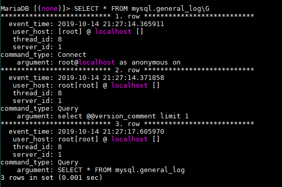

# General Query Log


## Giới thiệu

- Nhật ký truy vấn chung là nhật ký của mọi truy vấn SQL nhận được từ client, cũng như mỗi máy client kết nối hoặc không kết nối. Bởi vì nó là bản ghi của mọi truy vấn mà máy chủ nhận được nên nó có thể phát triển rất nhanh.  

- Nếu bạn chỉ muốn bản ghi của truy vấn thay đổi dữ liệu thì bạn có thể sử dụng nhật ký nhị phân(binary log) để thay thế. Binary log chỉ ghi nhật ký một truy vấn khi transaction(giao dịch) được commit bởi máy chủ nhưng nhật ký truy vấn chung sẽ ghi lại một truy vấn ngay lập tức khi nó nhận được từ server.  

## Enabling the General Query Log  

- Theo mặc định nhật ký truy vấn chung sẽ là `disable`  

- Để `enable` nhật ký truy vấn chung bạn cần set biến hệ thống general_log = 1. Nó có thể được thay đổi linh hoạt bằng việc set SET GLOBAL. Ví dụ:

  ```sh
    SET GLOBAL general_log=1;
  ```

  Nó cũng có thể được đặt trong một nhóm tùy chọn máy chủ trong một tệp tùy chọn trước khi khởi động máy chủ. Ví dụ:

  ```sh
  [mariadb]
  ...
  general_log
  ```

## Cấu hình tên tệp nhật ký truy vấn chung

- Theo mặc định tên của file nhật ký truy vấn chung được đặt theo cú pháp `${hostname}.log` và có thể được thay đổi.  

  - Cách 1: sử dụng `SET GLOBAL`

    ```sh
      SET GLOBAL general_log_file='mariadb.log';
    ```

  - Cách 2: chỉnh sửa file `/etc/my.cnf.d/mariadb-server.cnf`

    ```sh
      [mariadb]
      ...
      general_log
      general_log_file=mariadb.log
    ```

    hoặc

    ```sh
      [mariadb]
      ...
      log-basename=mariadb
      general_log
    ```

## Chọn đích đầu ra cho nhật ký truy vấn chung
  Nhật ký truy vấn chung có thể được ghi vào một file trên đĩa hoặc có thể được ghi vào bảng `general_log` trong CSDL MySQL/MariaDB. Để đặt đích đầu ra của nhật ký truy vấn chung bằng cách đặt biến hệ thống `log_output`  

- Viết nhật ký truy vấn chung vào một file:  

  ```sh
    SET GLOBAL log_output='FILE';
  ```

  hoặc

  ```sh
    [mariadb]
    ...
    log_output=FILE
    general_log
    general_log_file=queries.log
  ```  

- Viết nhật ký truy vấn chung vào bảng:

  ```sh
    SET GLOBAL log_output='TABLE';
  ```

  hoặc

  ```sh
    [mariadb]
    ...
    log_output=TABLE
    general_log
  ```

  Bạn có thể xem một số hàng trong bảng này bằng câu lệnh

  ```sh
  SELECT * FROM mysql.general_log\G
  ```

  OUTPUT

  


# TÀI LIỆU THAM KHẢO
- https://mariadb.com/kb/en/library/general-query-log/