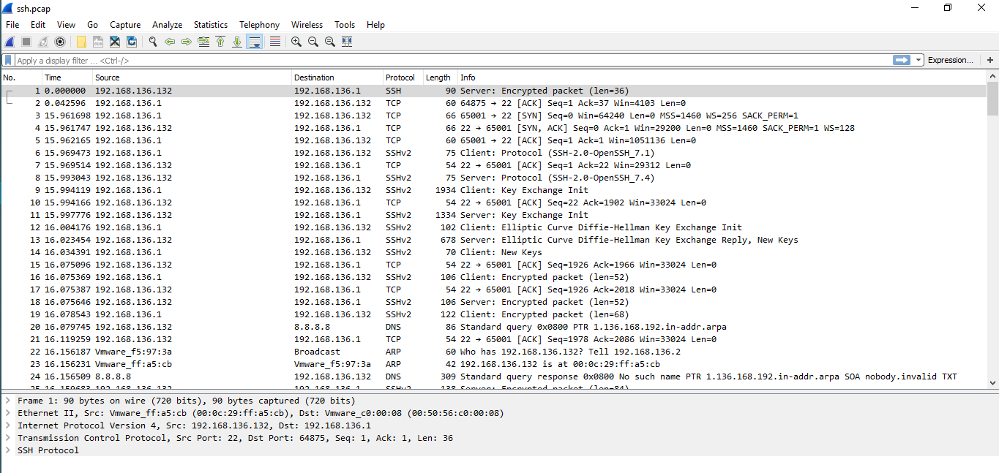

# Sử dụng Wireshark và tcpdump để bắt và phân tích các gói tin  

## Sử dụng `tcpdump` để bắt gói tin SSH  
- Câu lệnh dưới sẽ bắt 100 gói tin SSH và lưu các gói tin bắt được vào file `/root/ssh.pcap`  
  ```sh
    # tcpdump -i ens33 -c 100 -n -w ssh.pcap
  ```

## Sử dụng `MobaXterm` lấy file `ssh.pcap` về máy Window  
- Trên thanh tùy chọn của Moba, chọn `sftp`. Ở thanh tìm kiếm nhập vào đường dẫn chứa file `ssh.pcap`  

    

- Chuột phải vào file `ssh.pcap`, chọn `Download`  

    

- Một cửa sổ mới hiện ra, chọn thư mục chứa file `ssh.pcap` trên máy Window rồi chọn `OK`.  

   
  


## Sử dụng Wireshark để đọc file `ssh.pcap`  
- Sử dụng Wireshark mở file `ssh.pcap`, bạn sẽ nhận được thông tin các gói tin đã bắt được   

    