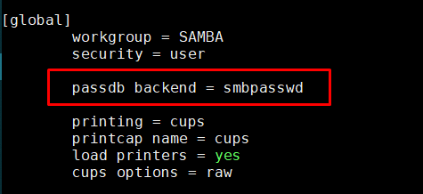
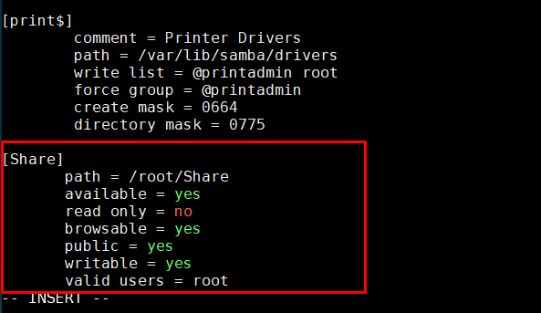
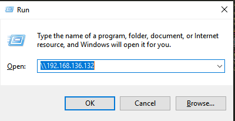
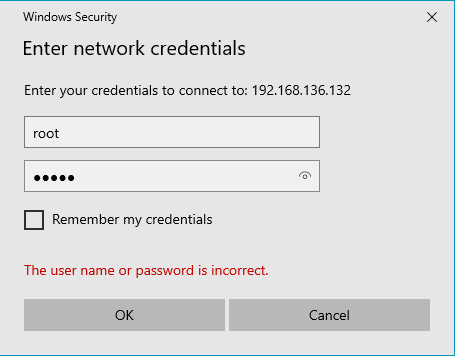
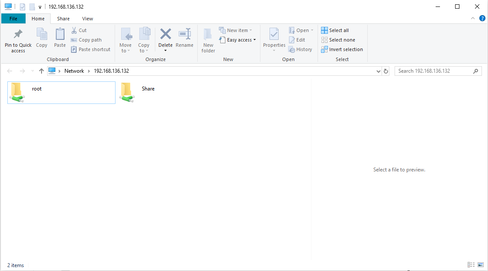

## Cài đặt Samba  
- Sử dụng câu lệnh sau để cài đặt Samba 
  ```sh
    # yum install -y samba
  ```  

- Cấu hình tường lửa cho phép sử dụng samba  
  ```sh
    # firewall-cmd --permanent --zone=public --add-service=samba  
    # firewall-cmd --reload
  ```  

- Tạo một folder để thực hiện share dữ liệu  
  ```sh
    # mkdir Share
  ```  

- Chuyển file `/root/ssh.pcap` sang folder `Share` mới tạo  
  ```sh
    # mv ssh.pcap Share
  ```  
- Cấp quyền cho folder `Share`  
  ```sh
    # chmod 777 -R Share/  
  ```  

- Vào chỉnh sửa file `/etc/samba/smb.conf`  
  - Sửa `passdb backend = tdbsam` thành `passdb backend = smbpasswd`  

      

  - Chèn vào cuối file đoạn sau  
    ```sh
    [Share]
    path = /path/Share
    available = yes 
    read only = no
    browsable = yes
    public = yes
    writable = yes
    valid users = [username]
    ```
    Ví dụ:  

      

- Đặt password cho người dùng Samba. Password này được sử dụng để truy cập vào thư mục được chia sẻ:  
  ```sh
    # smbpasswd -a root
  New SMB password:
  Retype new SMB password:
  ```
- Khởi động lại dịch vụ Samba để nhận cấu hình mới:  
  ```sh
    # systemctl restart smb
  ```  

  
- Trên máy Client, sử dụng `Window+R`, nhập vào địa chỉ IP của Server sau đó chọn `OK`  
  
    

- Một cửa sổ mới hiện ra, nhập vào username và password đã được cấu hình ở trên 

    

  Đăng nhập thành công, bạn sẽ nhìn thấy những folder được chia sẻ với user bạn vừa đăng nhập   

    

