# Các chuẩn giao tiếp sử dụng trong ổ cứng của máy chủ và thiết bị lưu trữ    

## Content

## I - Các chuẩn giao tiếp trên ổ cứng 
### 1. Giao tiếp IDE

- Chuẩn IDE sử dụng phương thức truyền tải dữ liệu song song.

- Ưu điểm: của truyền tải song song là tốc độ cao. Trong cùng một thời điểm có thể truyền tải nhiều bit dữ liệu hơn so với truyền tải nối tiếp.
- Nhược điểm: Sử dụng nhiều dây dẫn để truyền các bit dữ liệu đi nên gây ra hiện tượng tạp âm nhiễu. Đó là lý do vì sao ATA-66 sử dụng lên đến 80 dây dẫn. Bởi vì giữa các dây truyền tín hiệu là các dây đất nằm xen kẽ dây tín hiệu để chống nhiễu  

- Chuẩn EIDE: Do chuẩn IDE bị giới hạn dụng lượng đĩa cứng tối đa nên người ta sử dụng chuẩn EIDE để thay thế.
  - Chia làm 2 kênh (primary và secondary) và 2 kênh này sử dụng 2 đường BUS riêng.
  - Trên mỗi kênh lại chia làm 2 cấp (master và slaver) trên cùng 1 kênh. Vì cả 2 thiết chỉ được phép sử dụng 1 đường BUS trong cùng 1 thời điểm.
  - EIDE không có khả năng cho phép nhiều thiết bị sử dụng nhiều thiết bị trên cùng 1 BUS trong cùng 1 thời điểm. Nên các thiết bị sẽ được cấp phép để sử dụng tuần tự đường BUS.
### 1. Chuẩn giao tiếp SCSI  
- `SCSI` - viết tắt của Small Computer System Interface. 
- SCSI còn được gọi là parallel SCSI. Là chuẩn sử dụng phương thức truyền tải dữ liệu song song.
- Thường sử dụng trong các server lưu trữ và truyền dữ liệu với tốc độ cao
- Là chuẩn giao tiếp thường dùng để kết nối với ổ cứng, máy in, CD-ROM,…
- SCSI không quan tâm đến thiết bị nó kết nối đến là gì. Nó chỉ quan tâm thiết bị đó có làm việc được với chuẩn SCSI không.
- Không như EIDE, SCSI sử dụng Bus PCI hoặc ISAA để truyền tín hiệu dữ liệu.  

  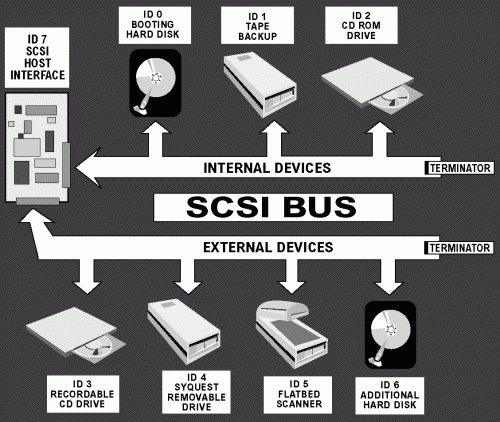  

- Chúng ta có thể kết nối 7 thiết bị SCSI chung với nhau rồi kết nối chúng với 1 SCSI Adapter.
- Ổ cứng SCSI có bộ điều khiển SCSI có vi xử lý riêng để xử lý việc truyền nhận dữ liệu và công việc của các thiết bị liên quan mà không cần sử dụng CPU chính để xử lý. Điều này giúp CPU không phải tốn tài nguyên để xử lý các công việc truyền tải mà sử dụng tài nguyên cho việc khác.  
- Hình ảnh các kết nối SCSI với kích thước thực tế: 

  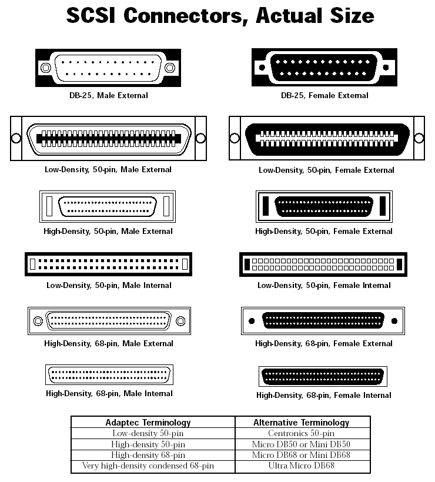
   
 
### 2. Chuẩn giao tiếp SATA và PATA 
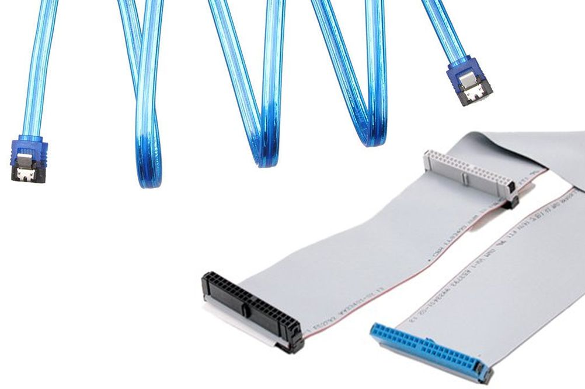  

- SATA (phát âm là say-da ), viết tắt của Serial ATA (viết tắt của Serial Advanced Technology Attachment), là một tiêu chuẩn IDE được phát hành lần đầu tiên vào năm 2001 để kết nối một ổ đĩa cứng hoặc SSD với phần còn lại của máy tính.
- Thuật ngữ SATA thường dùng để chỉ các loại cáp và kết nối tuân theo tiêu chuẩn này.
- SATA truyền dữ liệu theo dạng nối tiếp, được tạo ra nhằm thay thế cho PATA(Parallel ATA,thường được biết đến với tên IDE) – chuẩn kết nối truyền dữ liệu song song.
- SATA có thiết kế nhỏ hơn và có tốc độ truyền dữ liệu nhanh hơn(tốc độ khoảng 187.5 MB/s tới 1969 MB/s (từ phiên bản 3.2) trong khi tốc độ truyền dữ liệu tối đa của PATA là 133MB/s).  
- SATA sử dụng 7 dây dẫn, ít hơn nhiều so với PATA(40 dây) do đó nó có thể làm giảm tạp âm nhiễu(xảy ra trong quá trình truyền thông tin). 

  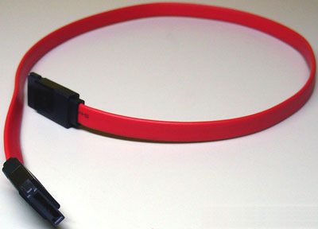
  &emsp;&emsp;&emsp;&emsp;&emsp;&emsp;&emsp;&emsp;Hình 1: Cáp Serial ATA

  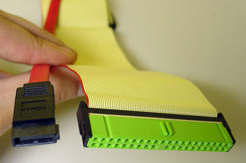  
  Hình 2: So sánh giữa cáp Serial ATA và cáp 80-dây được sử dụng bởi các thiết bị parallel IDE  

  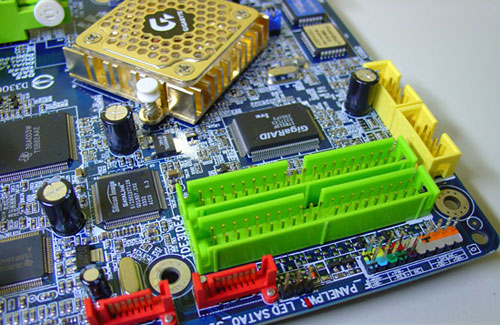  
  Hình 3: Các cổng Serial ATA (màu đỏ) và các cổng parallel IDE chuẩn (màu xanh)  

  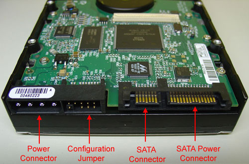  
  Hình 4: Các đầu nối của ổ đĩa cứng SATA  

  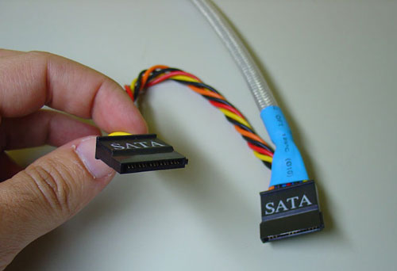  
  Hình 5: Các đầu kết nối nguồn Serial ATA trên các bộ nguồn ATX12V  

  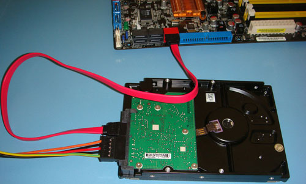  
  Hình 6: Ổ cứng SATA đã được kết nối với bo mạch chủ  

  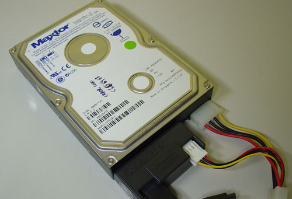  
  Hình 7: Ổ đĩa IDE chuẩn “đã được chuyển đổi” thành Serial ATA thông qua một adaptor Jumper SATA-150/SATA-300 

### 2. Chuẩn giao tiếp SAS  
- `SAS` là viết tắt của Serial Attached SCSI ra đời để thay thế cho phương thức truyền tải song song là Parallel SCSI. SAS là chuẩn giao tiếp sử dụng phương thức truyền tải nối tiếp point - to - point  dùng để truyền dữ liệu từ máy tính đến các thiết bị lưu trữ như đĩa cứng và băng từ (Tape drivers).  
- SAS có nhiều cải tiến về hiệu suất và tốc độ. Nó cho phép nhiều thiết bị (hơn 128 thiết bị) với các kích thước khác nhau được kết nối đồng thời vào cáp mỏng.
  - SAS rất mạnh trong việc quản lý dữ liệu, cho phép người dùng thao tác dễ dàng với dữ liệu
  - SAS cho phép làm việc với nhiều file dữ liệu cùng lúc.
  - Hỗ trợ các đĩa SAS tháo gắn nóng.

      

- Mỗi thiết bị SAS có một kết nối dành riêng (kết nối point-to-point) do đó tránh được xung đột trên đường truyền. Mỗi kết nối chạy riêng không chua sẻ, và chạy với tốc độ cao nhất.
- SAS cho phép kết nối lên đến 65.535 thiết bị với chiều dài cáp tối đa 10m. 
- Hình ảnh một số loại sas cable hay gặp:  
 
  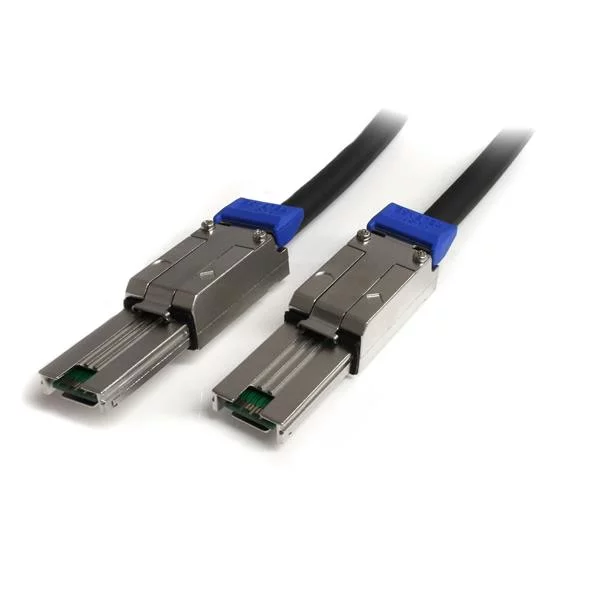  

  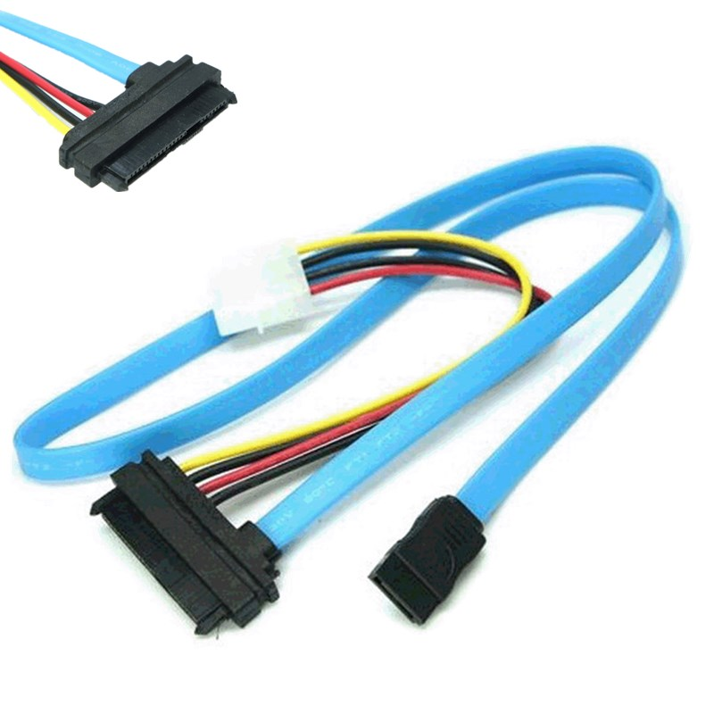  

  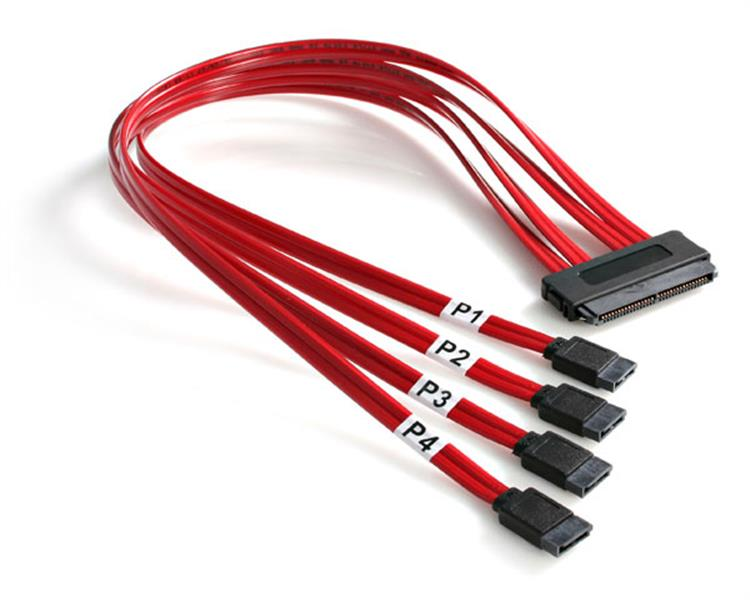  

  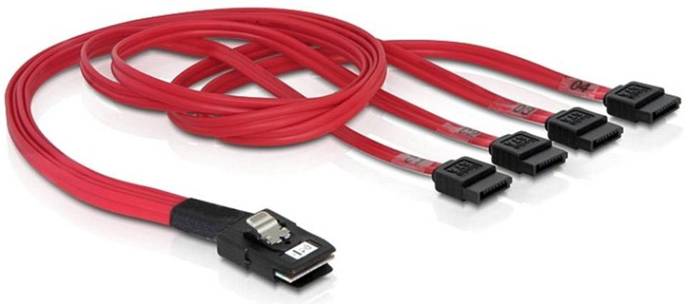  

- SAS có giá thành cao hơn SATA và cũng cần những kỹ năng cao hơn để quản trị hệ thống với SAS.
- SAS cho phép truyền dữ liệu với tốc độ lên tới 3Gb/s. Hiện nay, chuẩn SATA3 đã cho phép truyền dữ liệu lên tới 6Gb/s và SAS 3.0 cho phép tốc độ tới 12Gb/s.
- SAS cho phép cắm “nóng” rồi sử dụng ngay không cần phải khởi động lại hệ thống.

### Chuẩn giao tiếp NVMe  
- Non-Volatile Memory Express (NVMe) là một chuẩn giao tiếp hiệu năng cao dành cho các ổ cứng SSD có giao tiếp PCIe, cho phép cắm-và-chạy các SSD PCIe trên tất cả các nền tảng, được giới thiệu vào năm 2013. "Non-Volatile" có nghĩa là ổ cứng sẽ không bị xóa dữ liệu khi máy tính khởi động lại, trong khi "Express" lại đề cập đến quá trình truyền dữ liệu thông qua giao tiếp PCI Express (PCIe) có trên bo mạch chủ của máy tính. Điều này đảm bảo sự kết nối liền mạch giữa ổ cứng và bo mạch chủ bởi dữ liệu sẽ không cần phải thông qua một bộ điều khiền (controller) Serial Advance Technology Attachment (SATA).

  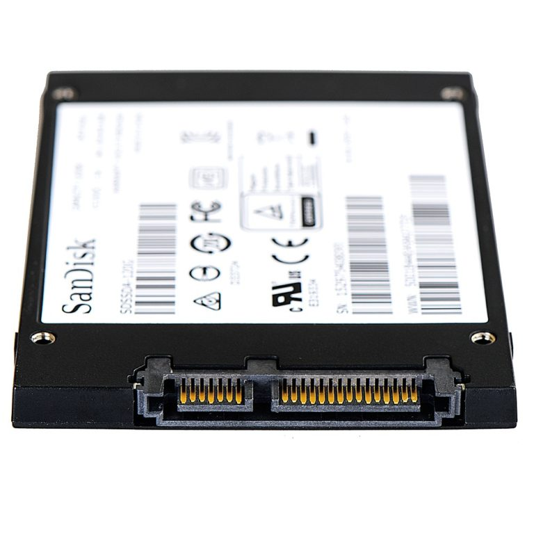  

## TÀI LIỆU THAM KHẢO  
- https://www.lifewire.com/serial-ata-sata-2626009
- https://www.wiringo.com/sata-cable.html
- https://quantrimang.com/nhung-dieu-nen-biet-ve-serial-ata-sata-46827
- https://thuannguyen.net/so-sanh-sata-va-sas-serial-attached-scsi.html
- http://svuit.vn/threads/chapter-4-2-cac-chuan-giao-tiep-cua-o-cung-server-1313/
- https://key.com.vn/chia-se/kien-thuc-14/nhung-dieu-nen-biet-ve-serial-ata-sata-1809/
- http://www.bradgoodman.com/sasprimer/
- https://taknet.com.vn/cong-nghe-giao-tiep-tren-o-cung-sata-va-sas/
- https://vietgame.asia/nvme-ky-nguyen-moi-cua-toc-do-truyen-du-lieu-nhanh-nhu-anh-sang-pr/
- https://topthuthuat.com/tim-hieu-nvme-la-gi/
