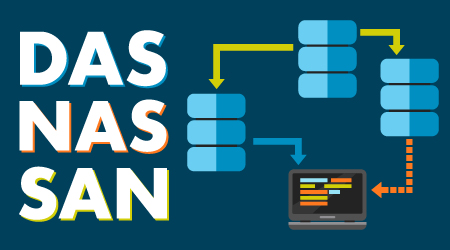
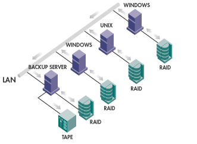
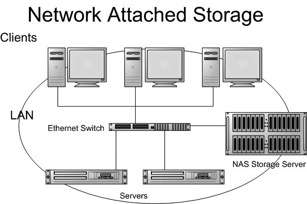
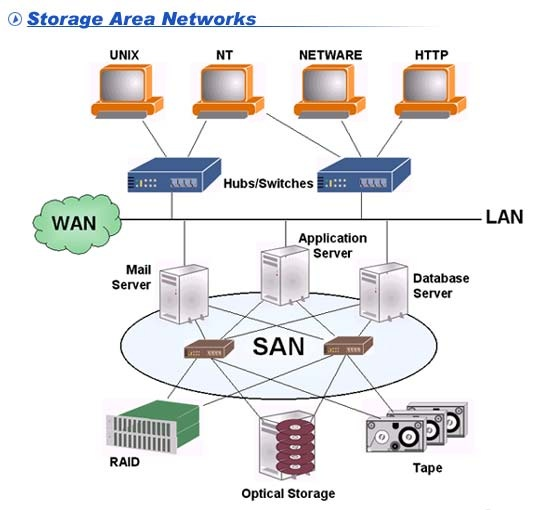

# Tìm hiểu về DAS-NAS-SAN  

  

  

## I. Direct Attached Storage (DAS)

### 1. Định nghĩa  
- `DAS` là hình thức lưu trữ mà các thiết bị lưu trữ nằm trong server hoặc kết nối trực tiếp vào server thông qua các khay ngoại vi (external array) hay qua một số interface phổ biến như **SCSI, SATA, NVMe, USB**

  

    
  

  
### 2. Ưu điểm
Do các thiết bị lưu trữ được kết nối trực tiếp vào server và giữa chúng không có bất kì thiết bị mạng nào như hub, switch, router…nên hệ thống DAS có những ưu điểm sau:

- Dễ triển khai và cấu hình
- Đỡ tốn kém chi phí đầu tư vào thiết bị mạng

### 3. Khuyết điểm
- Khả năng mở rộng hạn chế. Thực tế, DAS làm việc rất tốt với một server nhưng khi dữ liệu tăng, số lượng máy chủ cũng tăng sẽ tạo nên những vùng dữ liệu phân tán và gián đoạn. Điều đó sẽ làm tăng chi phí lưu trữ tổng thể cho doanh nghiệp và sẽ càng khó khăn hơn khi muốn sao lưu hay bảo vệ một hệ thống lưu trữ dữ liệu đang nằm rải rác và phân tán như vậy.

- Do thiết bị lưu trữ được kết nối trực tiếp vào server nên khi xảy ra sự cố về nguồn điện thì phần lưu trữ trên server đó sẽ không sử dụng được.

- Một khuyết điểm nữa là DAS chia sẻ chung khả năng xử lý và bộ nhớ của server trong quá trình read/write nên việc truy cập vào ổ đĩa sẽ bị chậm khi hệ điều hành bị quá tải.  

## II. Network Attached Storage (NAS)  
### 1. Định nghĩa
- `NAS` là hình thức lưu trữ sử dụng các thiết bị lưu trữ đặc biệt gắn trực tiếp vào mạng LAN như một thiết bị mạng bình thường (tương tự máy tính, switch hay router). Các thiết bị NAS cũng được gắn các địa chỉ IP cố định và được người dùng truy nhập thông qua sự điều khiển của máy chủ. Trong một số trường hợp, NAS có thể được truy cập trực tiếp không cần có sự quản lý của máy chủ.

- Các thiết bị NAS cung cấp khả năng truy cập lưu trữ ở mức tập tin (file-level), và người dùng phải sử dụng các giao thức như Common Internet File System (CIFS) với thiết bị Window, Server Message Block (SMB), hay Network File System (NFS) với thiết bị Linux để truy cập các file.

  

      
  

- Hệ thống NAS chứa 1 hoặc nhiều hard disk drives, thường được sắp xếp hợp lý thành các kho lưu trữ dự phòng hoặc RAID.
### 2. Ưu điểm
- `NAS` là lựa chọn lý tưởng đối với các doanh nghiệp đang tìm kiếm một giải pháp đơn giản và chi phí hợp lý, đáp ứng việc truy cập dữ liệu nhanh trên nhiều client.

- NAS đáp ứng nhiều nhu cầu hơn so với DAS ở các điểm sau:

  - Khả năng lưu trữ và khả năng mở rộng của NAS thường lớn hơn so với DAS
  - Do có thể được truy cập thông qua mạng nên các file thường được đặt tại một địa điểm, thay vì bị phân tán trên nhiều server hay thiết bị như DAS
  - NAS cung cấp khả năng tập trung dữ liệu với chi phí hợp lý
- Ngoài ra, NAS còn có các ưu điểm khác như dễ triển khai và vận hành khi có hoặc không có nhân viên IT tại chỗ.

### 3. Khuyết điểm  
- Với việc sử dụng chung hạ tầng mạng với các ứng dụng khác, việc lưu trữ dữ liệu có thể ảnh hưởng đến hiệu năng của toàn hệ thống (làm chậm tốc độ của LAN), điều này đặc biệt đáng quan tâm khi cần lưu trữ thường xuyên một lượng lớn dữ liệu.
- Trong môi trường có các hệ cơ sở dữ liệu thì NAS không phải là giải pháp tốt vì các hệ quản trị cơ sở dữ liệu thường lưu dữ liệu dưới dạng block chứ không phải dưới dạng file nên sử dụng NAS sẽ không cho hiệu năng tốt.  

## III. Storage Area Network (SAN)
### 1. Định nghĩa
- `SAN` là một mạng riêng tốc độ cao dùng cho việc truyền dữ liệu giữa các server tham gia vào hệ thống lưu trữ cũng như giữa các thiết bị lưu trữ với nhau. SAN cho phép thực hiện quản lý tập trung và cung cấp khả năng chia sẻ dữ liệu và tài nguyên lưu trữ. Hầu hết mạng SAN hiện nay dựa trên công nghệ kênh cáp quang, cung cấp cho người sử dụng khả năng mở rộng, hiệu năng và tính sẵn sàng cao.

- `SAN` cung cấp khả năng truy cập và sử dụng dữ liệu ở mức block. 

    

- Các loại giao thức của SAN
  - FC – Fibre Channel
  - iSCSI – Internet Small Computer System Interface
  - FCoE – Fibre Channel over Ethernet
  - ATA over Ethernet (AoE) 
  - HyperSCSI

### 2. Ưu điểm  
- Có khả năng sao lưu dữ liệu với dung lượng lớn và thường xuyên mà không làm ảnh hưởng đến lưu lượng thông tin trên mạng.
- Đặc biệt thích hợp với các ứng dụng cần tốc độ và độ trễ nhỏ ví dụ như các ứng dụng xử lý giao dịch trong ngành ngân hàng, tài chính…
- Dữ liệu luôn ở mức độ sẵn sàng cao.
- Dữ liệu được lưu trữ thống nhất, tập trung và có khả năng quản lý cao. Có khả năng khôi phục dữ liệu nếu có xảy ra sự cố.
- Hỗ trợ nhiều giao thức, chuẩn lưu trữ khác nhau như: iSCSI, FCIP, DWDM…
- Có khả năng mở rộng tốt trên cả phương diện số lượng thiết bị, dung lượng hệ thống cũng như khoảng cách vật lý.
- Mức độ an toàn cao do thực hiện quản lý tập trung cũng như sử dụng các công cụ hỗ trợ quản lý SAN.

  Do đó, SAN thường được sử dụng ở những trung tâm dữ liệu lớn vì mang một số đặc điểm nổi bật như: Giảm thiểu rủi ro cho dữ liệu, khả năng chia sẻ tài nguyên rất cao, khả năng phát triển dễ dàng, thông lượng lớn, hỗ trợ nhiều loại thiết bị, hỗ trợ và quản lý việc truyền dữ liệu lớn và tính an ninh dữ liệu cao.

  Hơn nữa, SAN tăng cường hiệu quả hoạt động của hệ thống bằng việc hỗ trợ đồng thời nhiều hệ điều hành, máy chủ và các ứng dụng, có khả năng đáp ứng nhanh chóng với những thay đổi về yêu cầu hoạt động của một tổ chức cũng như yêu cầu kỹ thuật của hệ thống mạng.

### 3. Khuyết điểm
Do việc cấu hình khá phức tạp nên khi triển khai SAN, ta cần có các công cụ quản lý cũng như nhân sự có kỹ năng chuyên môn cao.

Ngoài ra, chi phí để triển khai SAN cũng cao hơn DAS và NAS.

## TÀI LIỆU THAM KHẢO
- https://taknet.com.vn/thiet-bi-luu-tru-nas-la-gi/
- http://planet.com.vn/sanpham/NetPeripheral/NASRS/NAS-7410/view