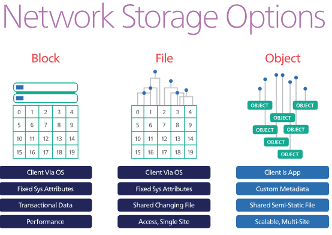
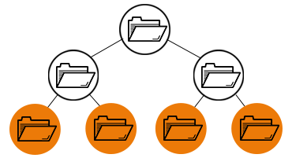
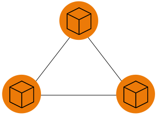
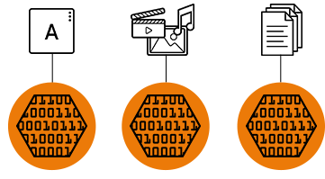

# 
Tìm hiểu về File - Block - Object

## Mục lục  

## Giới thiệu
Files, blocks và objects là các dạng lưu trữ để tổ chức, sắp xếp, trình bày dữ liệu theo các cách khác nhau, mỗi loại sẽ có giới hạn và khả năng riêng.  
- `File storage` tổ chức và biểu diễn dữ liệu dưới dạng phân cấp các tệp trong các thư mục.  
- `Block storage` lưu trữ dữ liệu dưới dạng các khối với tổ chức tùy ý, kích thước đồng đều.  
- `Object storage` - quản lý dữ liệu và liên kết nó với siêu dữ liệu liên quan.  

## File storage  

  

- `File storage` còn được gọi là `file-level` or `file-based storage` tổ chức dữ liệu theo dạng phân cấp: Dữ liệu được lưu trữ dưới dạng một mẩu thông tin bên trong một thư mục. Khi bạn cần truy cập vào phần dữ liệu đó, máy tính của bạn cần biết đường dẫn để tìm thấy nó.  
- Mỗi file đều có những thuốc tính riêng: như người tạo, người có thể truy cập, kích thước được lưu trữ thành metadata trong hệ thống.
- Các trường hợp sử dụng file storage:
  - Chia sẻ tệp: Thường sử dụng trong văn phòng thích hợp với mạng LAN để chia sẻ file/folder.
  - Lưu trữ cục bộ: Khả năng thích ứng liền mạch với khả năng mở rộng với giải pháp NAS mở rộng giúp lưu trữ ở cấp độ tệp trở thành một lựa chọn hiệu quả về chi phí để lưu trữ các tệp trong môi trường trung tâm dữ liệu nhỏ.
  - Bảo vệ dữ liệu: Kết hợp với triển khai dễ dàng, hỗ trợ các giao thức chuẩn, sao chép gốc và các công nghệ ổ đĩa khác nhau làm cho việc lưu trữ ở cấp độ tệp trở thành một giải pháp bảo vệ dữ liệu khả thi.
## Block storage  

 
- `Block storage` là dịch vụ lưu trữ dữ liệu theo block(khối). Thương được sử dụng trong mô hình lưu trữ kiểu SAN.
- Các thiết bị block storage giống như một hard drive qua Network. Các nhà cung cấp Cloud thường có các sản phẩm có thể cung cấp dịch vụ block storage với kích thước bất kỳ và có thể đính kèm nó vào máy ảo của bạn. 
- Bạn có thể định dạng nó với hệ thống tập tin và lưu trữ các tập tin trên đó, kết hợp nhiều thiết bị vào mảng RAID hoặc cấu hình một cơ sở dữ liệu để ghi trực tiếp vào block device.  
- Các thiết bị block storage phải được gắn với máy chủ đang chạy.
- Không chỉ tồn tại 1 đường dẫn tới dữ liệu được lưu trữ. Với block storage bạn có thể sử dụng dữ liệu từ nhiều HĐH khác nhau.

## Object Storage

  

- Trong thế giới điện toán đám mây hiện đại, object storage là lưu trữ và truy xuất các khối dữ liệu và siêu dữ liệu không có cấu trúc bằng cách sử dụng API HTTP. Thay vì chia nhỏ các tệp thành các khối để lưu trữ nó trên đĩa bằng cách sử dụng hệ thống tệp, chúng ta xử lý toàn bộ các đối tượng được lưu trữ trên mạng. Các đối tượng này có thể là tệp hình ảnh, nhật ký, tệp HTML hoặc bất kỳ byte đối tượng độc lập nào (self-contained blob of bytes). Chúng không có cấu trúc bởi vì chúng không cần phải tuân theo bất kỳ lược đồ hoặc định dạng cụ thể nào.
- Dễ hiểu hơn thì object storage chính là chính là các dịch vụ lưu trữ dữ liệu cloud. Dữ liệu của bạn sẽ không còn được ghi trực tiếp vào ổ cứng như trước mà sẽ được lưu trên cloud của các nhà cung cấp dịch vụ.  

## TÀI LIỆU THAM KHẢO  
- https://www.redhat.com/en/topics/data-storage/file-block-object-storage
- https://www.netapp.com/us/info/what-is-object-storage.aspx
- https://tech.bizflycloud.vn/tong-quan-object-storage-va-block-storage-la-gi-20180929092519105.htm
- https://blog.osam.io/su-khac-biet-giua-object-storage-va-block-storage/