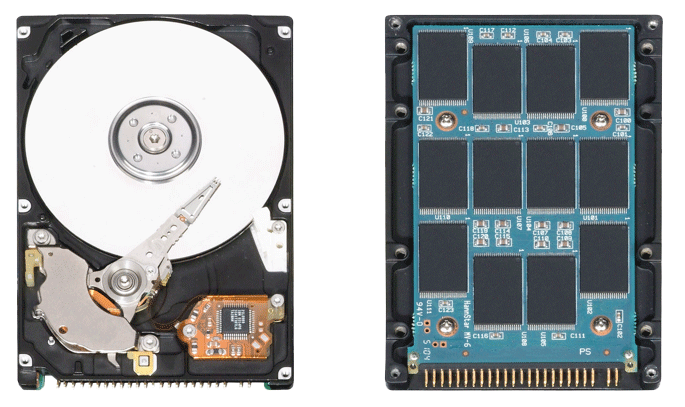
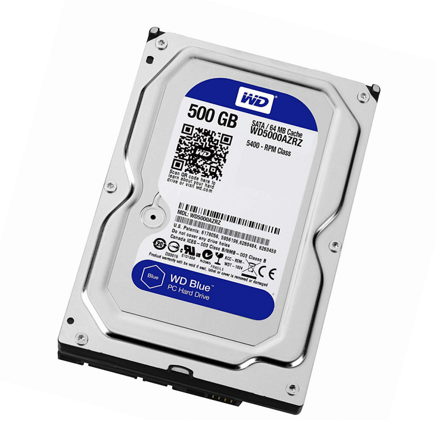
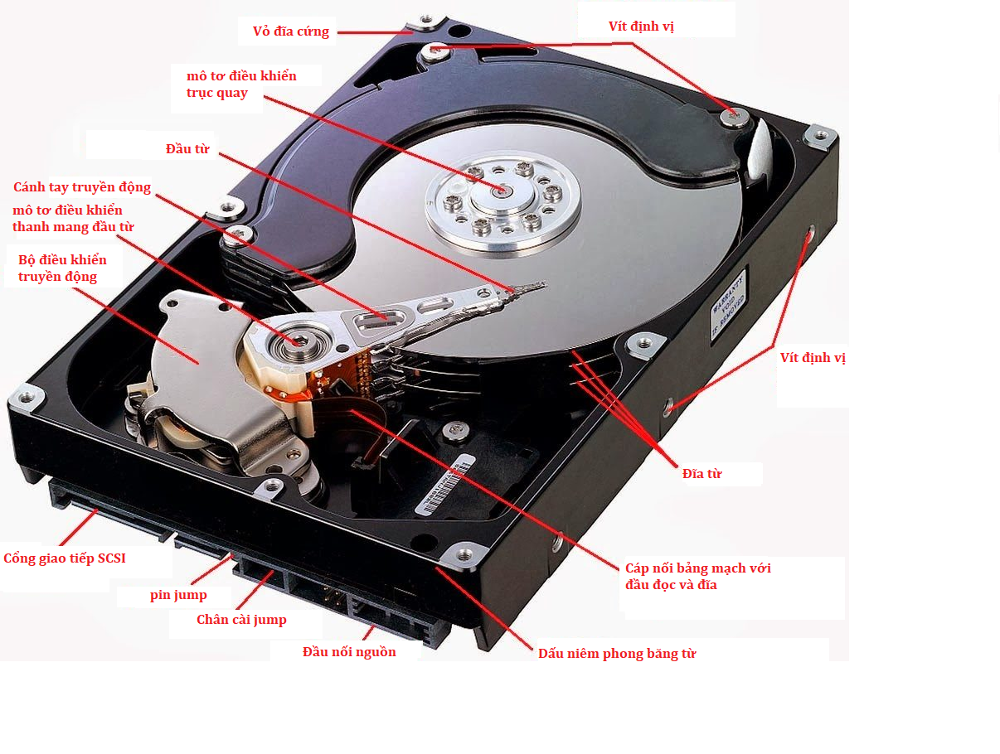
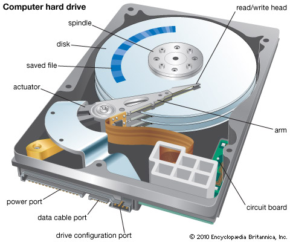
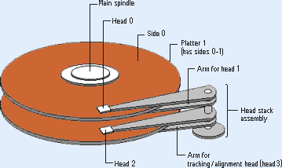
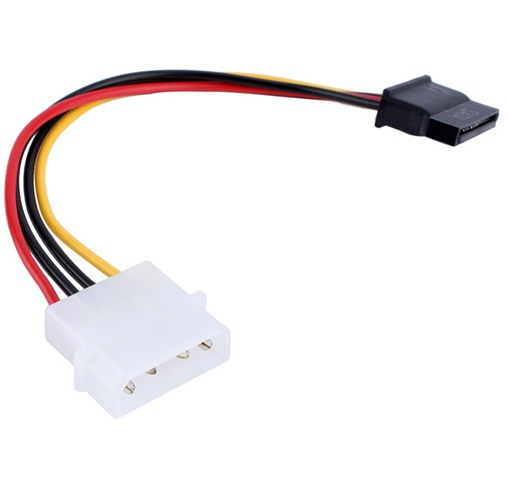
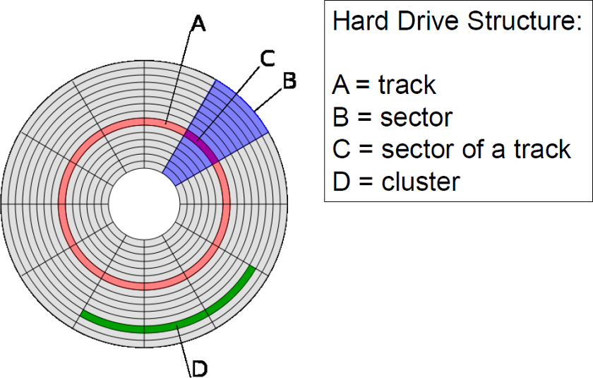
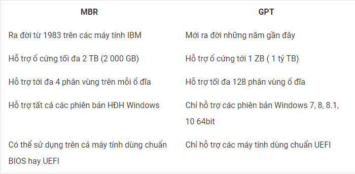
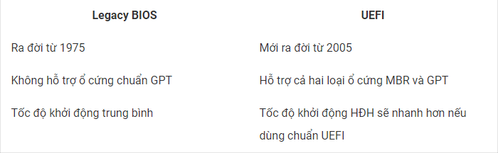
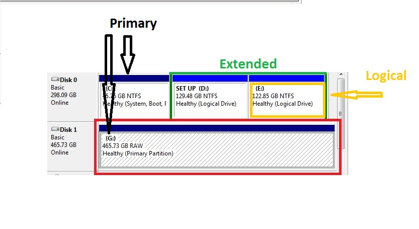

# Tìm hiểu về ổ đĩa cứng  

## Mục lục  
1. [Ổ cứng là gì](#1)
2. [Phân loại](#2)
3. [Ổ cứng HHD](#3)
4. [Ổ cứng SSD](#4)  
5. [Chuẩn ổ cứng](#5)  
6. [BIOS và UEFI](#7)  
7. [Quản lý đĩa và phân chia ổ cứng](#7)

---

## 1. Ổ cứng là gì?  
- Ổ cứng là một thành phần quan trọng của máy tính. Tất cả các dữ liệu về hệ điều hành, dữ liệu cá nhân của người dùng đều được lưu trên ổ cứng và chúng được truy xuất thường xuyên.  

## 2. Phân loại  
- Ổ cứng hiện nay có 2 loại chính là: HDD(Hard Disk Drive) và SSD(Solid State Disk)  

## 3. Ổ cứng HDD
- Hình ảnh bên ngoài ổ cứng HDD  

    
- Cấu tạo ổ cứng HDD   

   

  &nbsp;&nbsp;&nbsp;  

  - Võ đĩa cứng:  
    Cấu tạo của vỏ ổ đĩa cứng gồm 2 phần cơ bản: Phần đế chứa các linh kiện được gắn bên trong và phần nắp đậy để bảo vệ chúng khỏi các tác động có hại.

     Chức năng chính của vỏ đĩa cứng là định vị các linh kiện và ngăn cản tất cả hạt bụi trong không khí ở bên ngoài để đảm bảo không gian kín cho các linh kiện hoạt động.

     Ngoài ra vỏ đĩa cứng còn có khả năng chịu được sự tác động (ở mức độ thấp) để bảo vệ ổ đĩa cứng.
  
  - Cụm đĩa:  
    - Đĩa từ: Bên trong ổ đĩa cứng HDD có nhiều đĩa từ được làm bằng nhôm hoặc hợp chất gốm - thủy tinh. Trên bề mặt đĩa (cả trên và dưới) được phủ một lớp vật liệu từ là nơi chứa dữ liệu. Trong ổ cứng HDD có thể có một hoặc nhiều đĩa từ. Các đĩa này được xếp chồng, song song và cùng gắn lên một trục mô tơ quay. Trong khi sử dụng máy tính, các đĩa từ này luôn quay cùng tốc độ và cùng hướng.  

          

      [Video chuyển động của đĩa từ](https://ericscomputerservices.com/wp-content/uploads/2017/02/ClickingHD.mp4?_=1)

      Phụ thuộc vào từng hãng sản xuất khác nhau mà các loại đĩa này có thể sử dụng được một mặt hoặc cả hai mặt. Số lượng đĩa trong ổ đĩa cứng cũng không giống nhau, tùy thuộc vào dung lượng và công nghệ sản xuất của từng loại đĩa.  

    - Trục quay gắn với đĩa từ: Các đĩa từ được gắn song song với nhau thông qua trục quay. Trục quay được nối trực tiếp với động cơ và truyền chuyển động từ động cơ tới đĩa từ.  

      Hợp kim nhôm là vật liệu chính được dùng làm trục quay. Để đảm bảo tính chính xác trong quá trình làm việc của đĩa từ, trục quay được chế tạo cực kỳ chuẩn xác.

    - Động cơ: Được gắn đồng trục với trục quay và các đĩa.

  - Cụm đầu đọc:
    - Đầu từ đọc - ghi: Đầu đọc được cấu tạo giống với nam châm điện gồm lõi thép và cuộn dây. 
    
      Đầu đọc có chức năng đọc dữ liệu dưới dạng từ hóa trên bề  mặt đĩa từ. Đầu ghi có chức năng ghi dữ liệu lên đĩa, khi đầu ghi lướt qua đĩa cứng sẽ làm thay đổi vật liệu mang từ trên đĩa cứng, đó là cách dữ liệu được lưu lại trên đĩa cứng.
    
      Mỗi mặt đĩa đều có một đầu đọc và một đầu ghi. Vì vậy nếu một ổ cứng có 2 đĩa thì sẽ có 4 đầu đọc và 4 đầu ghi. Có trường hợp 2 đĩa nhưng chỉ sử dụng 3 mặt để chứa dữ liệu thì sẽ có 3 đầu đọc và 3 đầu ghi.

        

  - Cần di chuyển đầu đọc - ghi: Cần di chuyển các đầu từ đọc - ghi giúp các đầu từ dịch chuyển ngang trên bề mặt đĩa để đầu từ đọc hoặc ghi dữ liệu. Cần di chuyển theo phương song song với các đĩa từ ở một khoảng cách cố định.
    
    Các đầu từ được gắn cố định lên một trục nên chúng sẽ di chuyển cùng nhau.
    
    Sử dụng động cơ bước để truyền chuyển động hoặc sử dụng cuộn cảm để di chuyển bằng lực từ.  

  - Cụm mạch điều khiển:  
    - Là mạch nằm ở phía sau ổ cứng có nhiệm vụ điều khiển tốc độ quay đĩa, dịch chuyển các đầu từ và mã hóa, giải mã các tín hiệu ghi và đọc.
    - Cấu tạo:  
      - Mạch điều khiển động cơ: điều khiển sự di chuyển của đầu từ.
      - Mạch xử lý dữ liệu: Xử lý những dữ liệu đọc/ghi của ổ đĩa cứng.
      - Bộ nhớ đệm (cache hoặc buffer): là nơi mà dữ liệu của bạn được lưu trữ tạm thời trong quá trình đọc/ghi dữ liệu. Những dữ liệu này sẽ mất đi khi ổ đĩa cứng ngừng cung cấp điện.  
      - Đầu cắm nguồn: cung cấp điện cho ổ đĩa cứng.  
    
         

        
Đầu cắm nguồn của HDD

      - Đầu kết nối: có chức năng giao tiếp với máy tính.
      - Các cầu đấu thiết đặt (jumper): có khả năng cài đặt chế độ làm việc cho ổ đĩa cứng như tùy chọn trình tự các kênh trên giao tiếp IDE (master hay slave hoặc tự lựa chọn) hay thay đổi chế độ làm việc của ổ đĩa cứng (SATA 150 hoặc SATA 300) hoặc lựa chọn các thông số làm việc khác…

          

  - Track, Sector và Cylinder  

    - Track: các đường tròn đồng tâm dùng để ghi dữ liệu.  
    - Sector - cung: khi chia Track ra các phần bằng nhau ta có các Sector, mỗi Sector ghi được 512 Byte dữ liệu theo tiêu chuẩn thông thường.  
    - Cylinder: tập hợp các track có cùng bán kính ở các mặt đĩa khác nhau.  
    - Cluster - Liên cung: đơn vị lưu trữ 1 hoặc nhiều sector. Khi lưu dữ liệu vào ổ cứng, các dữ liệu được ghi vào hàng chục, hàng trăm cluster liền kề hoặc không liền kề nhau. Nếu không có sẵn có cluster liền nhau, HĐH sẽ tìm kiếm cluster còn trống ở gần và ghi tiếp dữ liệu lên đĩa.

        

    Số lượng Track và Sector đo được của mỗi ổ cứng là do nhà sản xuất sử dụng một chương trình đặc biệt để định dạng vật lý hay định dạng cấp thấp cho đĩa. Ví dụ như với một ổ đĩa cứng 10G có khoảng 7000 đường Track trên mỗi bề mặt đĩa và mỗi đường Track được chia thành khoảng 200 Sector.

    Ngày nay để tăng dung lượng của đĩa lên cao hơn, người ta chia các mặt đĩa ra nhiều Track hơn và mỗi Track cũng được chia thành nhiều Sector hơn.

## 4. Ổ cứng SSD  
- SSD là viết tắt của từ Solid-State Drive - ổ cứng thể rắn.
- Ổ cứng SSD được cấu thành bởi những chip nhớ flash được gắn trên bề mặt ổ đĩa, có nhiệm vụ ghi và lưu trữ dữ liệu, cho kết quả truy xuất dữ liệu ngay lập tức và ít có hiện tượng phân mảnh ổ đĩa như trên HDD.

    

  

## 5. Chuẩn ổ cứng  
- Tiêu chuẩn của ổ cứng quy định cách thức nhập xuất dữ liệu, sắp xếp và phân vùng ổ đĩa. Có 2 chuẩn ổ cứng: MBR và GPT
  - `MBR` là viết tắt của `Master Boot Record`, là một trong những cấu trúc phân vùng được sử dụng rộng rãi và được giới thiệu lần đầu tiên vào năm 1983. MBR là tiêu chuẩn ổ cứng được phổ biến trên các nền tảng như Windows, Linux, Mac.
  - `GPT` là viết tắt của `GUID Partition Table`, được Intel phát triển vào cuối những năm 1990. Chuẩn GPT được sinh ra vì MBR có nhiều hạn chế. GPT gắn liền với công nghệ mang tên UEFI – “Giao diện firmware mở rộng hợp nhất”. Không chỉ cài được Windows, Linux hay Mac mà ta còn có thể cài đặt một số hệ điều hành khác trên ổ cứng chuẩn GPT.  
    
    Bảng so sánh sự khác nhau giữa 2 chuẩn ổ cứng này:

      

## 6.  BIOS và UEFI  
- `BIOS` (đầy đủ là Legacy BIOS) và `UEFI` (Apply gọi là EFI) đều là phần mềm hệ thống kiểm tra các thiết bị vào ra trên máy tính của bạn, khi khởi động máy tính thì BIOS hoặc UEFI sẽ kiểm tra máy tính các thông số card màn hình, Ram, CPU,.. và gửi thông số đó cho HĐH và sau đó máy tính sẽ khởi động.  

    

- Mọi chức năng của BIOS đều được UEFI hỗ trợ và có thêm nhiều ưu điểm vượt trội nên UEFI đang thay thế hoàn toàn BIOS. Bạn không thể chuyển đổi qua lại giữa BIOS và UEFI.

### MBR/BIOS và GPT/UEFI
Các máy tính hiện này thường sử dụng theo cặp nếu dùng BIOS thì sẽ dùng ổ cứng chuẩn MBR còn nếu dùng UEFI thì sẽ dùng ổ cứng GPT. Bạn không thể dùng ổ cứng chuẩn GPT trên máy tính dùng BIOS nhưng có thể dùng cả hai chuẩn ổ cứng GPT và MBR trên UEFI. Tuy nhiên nếu sử dụng UEFI thì bạn nên dùng ổ cứng chuẩn GPT.

Khi bạn dùng GPT/UEFI thì tốc độ khởi động và tắt máy sẽ nhanh hơn đáng kể so với dùng MBR/BIOS hoặc MBR/UEFI.

## 7. Quản lý đĩa và phân chia ổ cứng  
### Quản lý đĩa
Có 2 cơ chế quản lý đĩa đó là:
- `Basic Disk`: đây là cơ chế defaut mặc định.
- `Dynamic`: dành cho các tính năng nâng cao như là Raid.  

Bài viết này chỉ bàn về `Basic Disk`  

### Basic disk
- Khi mua 1 ổ cứng về chúng ta có thể phân chia nó thành nhiều khu vực khác nhau. Các khu vực đó độc lập với nhau và được gọi là “phân vùng” hay “Partition” .  
- Nếu một phân vùng được format hoặc gặp sự cố thì những phân vùng khác sẽ không bị ảnh hưởng.  
- Có 3 loại phân vùng: Primary(phân vùng chính), Extended(mở rộng) và Logical

    

  - Thông thường trên 1 ổ cứng có thể tạo được tối đa 4 phân vùng Primary, 1 phân vùng Extended và không giới hạn số phân vùng Logical.  
  - Phân vùng primary chính là một ổ đĩa. Vậy sau khi tạo một phân vùng primary ta có thể đọc ghi dữ liệu trực tiếp vào đó. Tuy nhiên với Extend chỉ là giới hạn trong một khoảng của ổ cứng. Vì vậy khi ta tạo một extended thì ta sẽ không thể đọc ghi trực tiếp vào đây. Muốn truy xuất , truy cập được vào trong Extened. Ta phải chia nó thành các thành phần luận lý nhỏ hơn. Đó là Logical.
  
  **Ví dụ về cách phân vùng ổ cứng:** 
    - Nếu chỉ cần tối đa 4 phân vùng (hoặc ít hơn) trên ổ cứng, bạn có thể chia ổ cứng của mình thành các phân vùng Primary.

    - Nếu bạn muốn chia ổ cứng của mình thành 5 phân vùng trở lên, bạn sẽ phải tạo ra 3 phân vùng Primary và 1 phân vùng Extended. Ví dụ, nếu muốn chia ổ cứng thành 7 phân vùng, bạn sẽ phải chia ổ cứng thành 3 phân vùng Primary và 1 phân vùng Extended, sau đó tiếp tục chia phân vùng Extended này thành 4 phân vùng Logical. Phân vùng Extended có thể coi là một "hộp chứa" lớn để bạn có thể chia làm nhiều phân vùng nhỏ (Logical).

    - Nếu muốn có 7 phân vùng, bạn cũng có thể chia ổ cứng thành 1 phân vùng Primary và 1 phân vùng Extended bao gồm 6 phân vùng Logical, hoặc chia ổ cứng thành 2 phân vùng Primary và 1 phân vùng Extended được chia làm 5 phân vùng Logical

**Lưu ý:**
- Tối đa một Extended có thể tạo ra vô số phân vùng Logical. Các phân vùng này sẽ lấy tên các ký tự từ A đến Z. Vì vậy tối đa các phân vùng sẽ làm việc được trong một máy tính sử dụng Windows sẽ là 26. Muốn thấy dử liệu trong phân vùng thứ 27. Ta phải bỏ một ký tự nào đó trong số 26 phân vùng đã hiển thị và gán vào phân vùng số 27 thì ta mới sử dụng được. Ví dụ khi ta cài win hay ghost máy. Ta có thể lưu bản ghost vào một phân vùng nhưng không gán ký tự thì phân vùng này sẽ không hiển thị.
- Extended chỉ chứa các dữ liệu thông thường.
- Khi ta cần dưới 4 phân vùng thì ta có thể tạo 4 phân vùng Primary. Chứ không nhất thiết phải có Extended.
- Nếu ta cần lớn hơn 4 phân vùng ta mới tạo extended.  
- Primary mới có chức năng Boot. Vì vậy ta phải cài win vào phân vùng Primary. Chú ý là ta vẩn có thể cài vào phân vùng Logical nhưng sau đó windows sẽ không boot được và máy tính sẽ không hoạt động.

## TÀI LIỆU THAM KHẢO  
- https://www.cuudulieutransang.vn/post/2018/07/02/cấu-tạo-và-nguyên-lý-làm-việc-của-ổ-cứng-ảnh-động-3d
- https://hocvienit.vn/hdd-la-gi/
- https://cuudulieupro.com/cau-tao-va-cach-thuc-hoat-dong-cua-o-hdd/
- https://cuudulieupro.com/cau-tao-va-cach-thuc-hoat-dong-cua-o-hdd/
- https://secure.vinahost.vn/ac/knowledgebase/261/-cng-SSD-la-gi-Phan-bit-khac-nhau-gia--cng-SSD-va-HDD-Trng-hp-nao-nen-s-dng-SSD.html
- https://dulieuocung.com/cau-tao-ben-trong-mot-o-cung-ssd.html
- https://vitinhquan7.info/quan-ly-dia-va-phan-chia-o-cung/
- https://kenhsinhvien.vn/topic/co-nen-chia-o-cung-thanh-nhieu-phan-vung-uu-va-nhuoc-diem-cua-viec-chia-o-cung.496812/
- https://vitinhquan7.info/quan-ly-dia-va-phan-chia-o-cung/