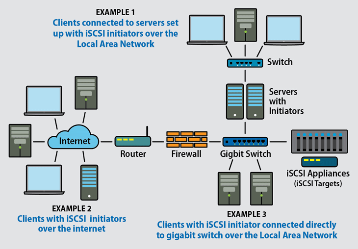
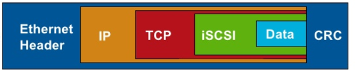
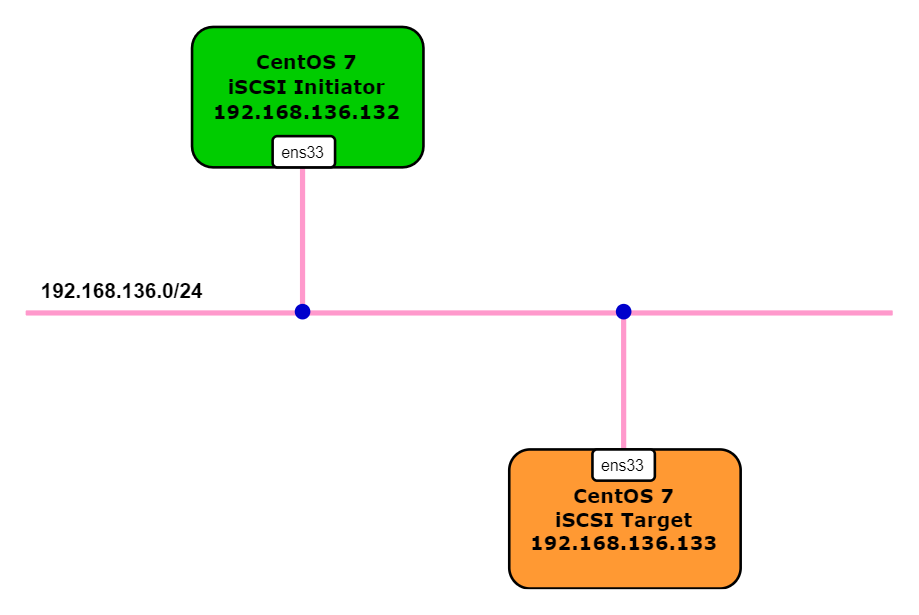
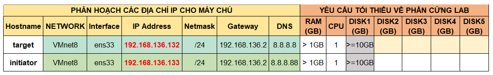

# iSCSI là gì ? Tìm hiểu về hệ thống lưu trữ iSCSI SAN

## Mục lục  
1. [iSCSI là gì?](#1)  
2. [Cách thức hoạt động của iSCSI](#2)
3. [LAB sử dụng iSCSI](#3)  
  3.1. [3.1. Một số khái niệm sử dụng trong bài lab](#3.1)  
  3.2. [Chuẩn bị và mô hình lab](#3.2)    
  3.3. [Các bước cấu hình](#3.3)  
    &emsp;3.3.1. [Cấu hỉnh iSCSI Target](#3.3.1)  
    &emsp;3.3.2. [Cấu hình iSCSI Initiator](#3.3.2)  
    &emsp;3.3.3. [Tạo file system trên iSCSI](#3.3.3)  
    

## 1. iSCSI là gì?  
- `iSCSI`*(đọc là: ai-x-kơ-zi)* là viết tắt của **I**nternet **S**mall **C**omputer **S**ystems **I**nterface. iSCSI là một giao thức lớp vận chuyển(Transport) hoạt động dựa trên giao thức TCP/IP. Nó cho phép truyền dữ liệu cấp khối giữa `iSCSI target` và `iSCSI initiators` bằng đường Network(LAN/WAN). iSCSI hỗ trợ mã hóa các gói mạng và giải mã khi đến đích.

  - `iSCSI target` là từ dùng để chỉ các thiết bị iSCSI SAN(hay IP SAN). Các thiết bị này là các server dùng để lưu trữ dữ liệu. Chúng sử dụng 1 HĐH bất kỳ và có cài tính năng hỗ trợ iSCSI. Từ máy chủ iSCSI Target sẽ tiếp nhận các request gửi từ iSCSI Initiator gửi đến và gửi trả dữ liệu trở về  
  - `iSCSI initiators` là từ để chỉ các thiết bị truy cập đến IP SAN(client trong kiến trúc hệ thống lưu trữ qua mạng). iSCSI Initiator sẽ kết nối đến máy chủ iSCSI Target và truyền tải các lệnh SCSI thông qua đường truyền mạng TCP/IP . iSCSI Initiator có thể được khởi chạy từ chương trình phần mềm trên OS hoặc phần cứng thiết bị hỗ trợ iSCSI.

    >iSCSI initiators(client) được cài sẵn trong Win Vista/7 và 2008. Đối với iSCSI target, có nhiều Soft, ví dụ StarWind trên nền Win, và OpenFiler trên nền Linux.

- `iSCSI` dễ dùng, linh hoạt, dễ mở rộng, vì hoạt động dựa trên nền IP và Ethernet/Internet, không đòi hỏi nhiều phần cứng. Đặc biệt hiệu quả trong mạng Ethernet 10G.  

- `iSCSI` có rất nhiều ưu điểm nổi bật như:
  - Chi phí rẻ hơn nhiều so với Fiber Channel SAN
  - Tạo và quản lý được nhiều ổ cứng cho nhiều máy tính nội-ngoại mạng(VPN).
  - Gián tiếp mở rộng dung lượng lưu trữ cho các máy tính nội-ngoại mạng(VPN).
  - Cài VMware trên ổ cứng iSCSI hoặc cài phần mềm từ xa.
  - Hiển thị y hệt ổ cứng trong máy, thân thiện với người dùng phổ thông.
  - Bảo mật cao bằng mật khẩu.
  - Kết nối rất nhanh, không cần qua nhiều bước.
  - Thích hợp cho doanh nghiệp quản lý dữ liệu của máy nhân viên.

- Ví dụ sử dụng iSCSI trong một vài cấu hình mạng:   

    

  - ***Ví dụ 1:*** Clients kết nối với server(có thể là: File servers, Database servers, Exchange servers hoặc Web servers) được cài đặt iSCSI initiators qua mạng LAN.  
  Điều này cho phép thêm nhiều bộ nhớ hơn trong thời gian thực mà không cần tắt máy chủ.

  - ***Ví dụ 2:*** Client hoặc server đã cài đặt iSCSI initiators có thể truy cập tới iSCSI target qua Internet. iSCSI target và firewal phải được cấu hình để cho phép phát hiện và xác thực máy client qua mạng WAN. Yêu cầu kết nối băng thông rộng hoặc cao để có độ tin cậy và tốc độ truyền đủ.
 
  - ***Ví dụ 3:*** Admin hoặc user có yêu cầu lưu trữ hiệu suất cao hơn có thể kết nối trực tiếp với thiết bị iSCSI thông qua Gigabit Switch.


## 2. Cách thức hoạt động của iSCSI  
iSCSI hoạt động thông qua việc truyền và nhận dữ liệu cấp khối giữa bộ khởi tạo iSCSI(iSCSI initiators) trên client và mục tiêu iSCSI(iSCSI target) trên server lưu trữ. Các câu lệnh SCSI và dữ liệu sẽ được đóng gói vào [iSCSI PDU](http://www.3kranger.com/HP3000/mpeix/en-hpux/T1452-90011/img/gfx12.gif) và truyền đi qua mạng. Hình dưới cho thấy cấu trúc của một iSCSI Frame

<p align="center"></p>

<a name ="3"></a>

## 3. LAB sử dụng iSCSI

<a name="3.1"></a>

### &emsp;3.1. Một số khái niệm sử dụng trong bài lab  
- `IQN` - iSCSI qualified name - Tên đủ điều kiện iSCSI được dùng để xác định target và initiator.  
  - IQN có các thuộc tính sau:
    - Nó là duy nhất. Không có hai initiator hoặc target có thể có cùng tên.
    - Nó có thể dài tới 255 ký tự.
    - Nó chỉ có thể chứa các số (0-9), chữ cái (AZ và az), dấu hai chấm (:), dấu gạch nối (-) và dấu chấm (.).

  - Một IQN đầy đủ có dạng: 
    ```sh
    iqn.yyyy-mm.<reversed domain name>:[identifier]
    ```
    Trong đó:
    - `yyyy-mm` là ngày tháng giá trị domain còn tồn tại
    - `reversed domain name` - tên miền đảo ngược của đơn vị đặt tên
    - `identifier` - Tên duy nhất là bất kỳ tên nào bạn muốn sử dụng, ví dụ như tên của máy chủ lưu trữ của bạn. Đơn vị đặt tên phải đảm bảo rằng bất kỳ tên nào được gán sau dấu hai chấm là duy nhất.  
  - Ví dụ:   
    iqn.1999-06.com.veritas:abc  
    qn.1998-01.com.vmware.iscsi:name1  
    iqn.1998-01.com.vmware.iscsi:name2  
    iqn.1998-01.com.vmware.iscsi:name999  
- `Backend Storage` - Các thiết bị lưu trữ được sử dụng làm iSCSI target  
- `Target` - Dịch vụ trên máy chủ iSCSi cho phép truy cập vào backend storage devices.
- `Initiator` - iSCSI client kết nối với iSCSI target và được IQN xác định.  
- `ACl` - Danh sách kiểm soát truy cập dựa trên iSCSI initiator IQN và được sử dụng để cung cấp quyền truy cập cho người dùng cụ thể.
- `LUN` - Logical Unit Number -  đơn vị số logic gắn cho iSCSI dùng để tập hợp các ổ đĩa chạy bằng các loại giao thức SCSI, iSCSI và Fibre Channel. Các backend storage devices được chia sẻ thông qua target. Target có thể là bất kỳ thiết bị nào có hỗ trợ các hoạt động đọc/ghi, ví dụ như disk, partitions, logical volumes, files or tape drves.
- `Portal` - Địa chỉ IP và cổng mà mục tiêu hoặc người khởi tạo sử dụng để thiết lập kết nối.
- `TPG` - Target Portal Group - Tập hợp các địa chỉ IP và cổng TCP mà iSCSI target cụ thể sẽ lắng nghe.
- `Discovery` - Khám phá các mục tiêu có sẵn bằng cách sử dụng lệnh `iscsiadm`.
  Câu lệnh:  
  ```sh
    # iscsiadm --m discovery -t sendtargets --p [portal] --discover
  ```
  Trong đó: 
  - `sendtargets` - xác định làm thế nào để tìm ra mục tiêu.
  - `portal` - báo cho iscsiadm địa chỉ IP và cổng tới địa chỉ để thực hiện khám phá. Cổng mặc định là 3260. Thường sẽ để giá trị IP
  - `--discover` - nói với dịch vụ iscsid để thực hiện khám phá.
- `Login` - Xác thực cho phép initiator truy cập vào LUN trên target. Sau khi đăng nhập thành công, thông tin đăng nhập được lưu trữ tự động trên bộ khởi tạo. Đăng nhập được thực hiện bằng lệnh `iscsiadm`

  ```sh
    # iscsiadm -m node --login
  ```  
- LVM - Logical Volumn Manager: là phương pháp cho phép ấn định không gian đĩa cứng thành những `Logical Volume` khiến cho việc thay đổi kích thước trở nên dễ dàng hơn (so với partition). Với kỹ thuật LVM bạn có thể thay đổi kích thước mà không cần phải sửa lại table của OS. Điều này hữu ích với những trường hợp bạn đã sử dụng hết phần bộ nhớ còn trống của partition và muốn mở rộng dung lượng của nó.

### &emsp;3.2. Mô hình

<p align="center"></p>

<p align="center"></p>

<a name="3.3"></a>

### &emsp;3.3. Các bước thực hiện  

<a name="3.3.1"></a>

#### &emsp;&emsp;3.3.1. Trên `iSCSI Target`
##### &emsp;&emsp;Cấu hình lưu trữ 
- Tạo Backend Storage: Sử dụng câu lệnh `fdisk` để tạo một phân vùng mới `/dev/sdb1` với kích thước 1GB, loại phân vùng là `LVM` sử dụng làm bộ nhớ chia sẻ dữ liệu với client. Nếu bạn muốn sử dụng toàn bộ đĩa cho LVM, hãy bỏ qua bước phân vùng đĩa.
  ```sh
  [root@storage ~]# fdisk /dev/sdb
  Welcome to fdisk (util-linux 2.23.2).

  Changes will remain in memory only, until you decide to write them.
  Be careful before using the write command.

  Command (m for help): n  #New partition
  Partition type:
   p   primary (0 primary, 0 extended, 4 free)
   e   extended
  Select (default p): p   #Pimary partition
  Partition number (1-4, default 1): 1   #Partition number
  First sector (2048-8388607, default 2048):  #Just enter
  Using default value 2048
  Last sector, +sectors or +size{K,M,G} (2048-8388607, default 8388607): +1G   #Enter the size
  Partition 1 of type Linux and of size 1 GiB is set

  Command (m for help): t   #Change label
  Selected partition 1
  Hex code (type L to list all codes): 8e    #Change it as LVM label
  Changed type of partition 'Linux' to 'Linux LVM'

  Command (m for help): p  #print

  Disk /dev/sdb: 10.7 GB, 10737418240 bytes, 20971520 sectors
  Units = sectors of 1 * 512 = 512 bytes
  Sector size (logical/physical): 512 bytes / 512 bytes
  I/O size (minimum/optimal): 512 bytes / 512 bytes
  Disk label type: dos
  Disk identifier: 0x4d1714e2

   Device Boot      Start         End      Blocks   Id  System
   /dev/sdb1            2048     2099199     1048576   8e  Linux


  Command (m for help): w   #Save
  The partition table has been altered!

  Calling ioctl() to re-read partition table.
  Syncing disks.

  reload the partition table
  ```

  - Tạo LVM với phân vùng `/dev/sdb1` (thay thế /dev/sdb1 bằng tên đĩa của bạn)
    ```sh
      # yum install -y lvm2   ##Cài đặt gói lvm2
    ```

    ```sh
      # pvcreate /dev/sdb1
    Physical volume "/dev/sdb1" successfully created.
      # vgcreate vg_iscsi /dev/sdb1
    Volume group "vg_iscsi" successfully created
      # lvcreate -l 100%FREE -n lv_iscsi vg_iscsi
    Logical volume "lv_iscsi" created.
    ```

  - Cập nhật `partition table`  
    ```sh
      # partprobe
    ```

  - Xác thực phân vùng mới
    ```sh
      # ls -l /dev/sd*
      brw-rw---- 1 root disk 8,  0 Sep 11 20:35 /dev/sda
      brw-rw---- 1 root disk 8,  1 Sep 11 20:35 /dev/sda1
      brw-rw---- 1 root disk 8,  2 Sep 11 20:35 /dev/sda2
      brw-rw---- 1 root disk 8,  3 Sep 11 20:35 /dev/sda3
      brw-rw---- 1 root disk 8, 16 Sep 11 20:35 /dev/sdb
      brw-rw---- 1 root disk 8, 17 Sep 11 20:35 /dev/sdb1
    ```

##### &emsp;&emsp;Configure iSCSI target
- Cài đặt `targetcli` - công cụ quản trị cung cấp giao diện mặc định để quản lý target.  
  ```sh
    # yum install targetcli -y
  ```
  - `targetcli` cung cấp cấu trúc phân cấp như `filesystem`. Sử dụng lệnh `targetcli` để gọi câu lệnh `targetcli` như dưới đây:
    ```sh
      # targetcli
    Warning: Could not load preferences file /root/.targetcli/prefs.bin.
    targetcli shell version 2.1.fb49
    Copyright 2011-2013 by Datera, Inc and others.
    For help on commands, type 'help'.

    />
    ```  
    - Sử dụng `help` để hiển thị các câu lệnh có thể được dùng, sử dụng câu lệnh `ls` để xem các đối tượng cấu hình có sẵn:  

  - Sử dụng một `logical volume` đã tồn tại (/dev/vg_iscsi/lv_iscsi) làm kho lưu trữ kiểu khối cho đối tượng lưu trữ `scsi_disk1_server`   
    ```sh
      /> cd backstores/block
      /backstores/block> create scsi_disk1_server /dev/vg_iscsi/lv_iscsi
    Created block storage object scsi_disk1_server using /dev/vg_iscsi/lv_iscsi.
    ```  

  - Tạo `target`  
    ```sh
    /backstores/block> cd /iscsi
    /iscsi> create iqn.2016-02.local.itzgeek.server:disk1
    Created target iqn.2016-02.local.itzgeek.server:disk1.
    Created TPG 1.
    Global pref auto_add_default_portal=true
    Created default portal listening on all IPs (0.0.0.0), port 3260.
    ```  

  - Tạo ACL cho máy client(Đó là IQN mà máy client sử dụng để kết nối).
    ```sh
      /iscsi> cd /iscsi/iqn.2016-02.local.itzgeek.server:disk1/tpg1/acls
      /iscsi/iqn.20...sk1/tpg1/acls> create iqn.2016-02.local.itzgeek.server:node1node2
      Created Node ACL for iqn.2016-02.local.itzgeek.server:node1node2
    ```  

  - Tạo một LUN dưới target. LUN nên sử dụng đối tượng lưu trữ sao lưu được đề cập trước đó là `scsi_disk1_server`  
    ```sh
      /iscsi/iqn.20...er:disk1/tpg1> cd /iscsi/iqn.2016-02.local.itzgeek.server:disk1/tpg1/luns
      /iscsi/iqn.20...sk1/tpg1/luns> create /backstores/block/scsi_disk1_server
    Created LUN 0.
    Created LUN 0->0 mapping in node ACL iqn.2016-02.local.itzgeek.server:node1node2
    ```

  - Xác nhận cấu hình target server.

      

    ```sh
    /> saveconfig
    Configuration saved to /etc/target/saveconfig.json
    /> exit
    Global pref auto_save_on_exit=true
    Last 10 configs saved in /etc/target/backup/.
    Configuration saved to /etc/target/saveconfig.json
    ```

  - Enable and restart the target service.
    ```sh
      # systemctl enable target.service
      # systemctl restart target.service
    ```

  - Configure the firewall to allow iSCSI traffic
    ```sh
      # firewall-cmd --permanent --add-port=3260/tcp
      # firewall-cmd --reload
    ```

<a name="3.3.2"></a>

#### &emsp;&emsp;3.3.2. Configure Initiator
- Cài đặt gói `iscsi-initiator-utils` trên máy client
  ```sh
    # yum install iscsi-initiator-utils -y
  ```

- Chỉnh sửa `initiatorname.iscsi` file
  ```sh
    # vi /etc/iscsi/initiatorname.iscsi
  ```

- Xóa tên mẫu cũ có sẵn và thêm tên mới `iSCSI initiator`
  ```sh
  InitiatorName=iqn.2016-02.local.itzgeek.server:node1node2
  ```

- Khám phá `iSCSI target` bằng cách sử dụng lệnh dưới đây.
  ```sh
    # iscsiadm -m discovery -t st -p 192.168.136.132
  ```
  OUTPUT
  ```sh
  192.168.136.132:3260,1 iqn.2016-02.local.itzgeek.server:disk1
  ```

- Restart and enable the initiator service.
  ```sh
    # systemctl restart iscsid.service
    # systemctl enable iscsid.service
  ```

- Login to the discovered target
  ```sh
    # iscsiadm -m node –targetname iqn.2016-02.local.itzgeek.server:disk1  -p 192.168.136.132 -l
  ```
  OUTPUT
  ```sh
  Logging in to [iface: default, target: iqn.2016-02.local.itzgeek.server:disk1, portal: 192.168.136.132,3260] (multiple)
  Login to [iface: default, target: iqn.2016-02.local.itzgeek.server:disk1, portal: 192.168.136.132,3260] successful.
  ```

  - Sau khi đăng nhập, một session với iSCSI target được thiết lập. Sử dụng câu lệnh dưới đây để giám sát các target 
    ```sh
      # iscsiadm --mode node -P 1
    Target: iqn.2016-02.local.itzgeek.server:disk1
        Portal: 192.168.136.132:3260,1
                Iface Name: default
    ```
  - Sau khi thực hiện kết nối với iSCSI target, bạn có thể thấy các thiết bị iSCSI được cung cấp bởi target. Sử dụng câu lệnh:
    ```sh
      # lsscsi
    ```
    OUTPUT
    ```sh
    [0:0:0:0]    disk    VMware,  VMware Virtual S 1.0   /dev/sda
    [2:0:0:0]    cd/dvd  NECVMWar VMware IDE CDR10 1.00  /dev/sr0
    [6:0:0:0]    disk    LIO-ORG  scsi_disk1_serv  4.0   /dev/sdb
    ```

<a name="3.3.3"></a>

#### &emsp;&emsp;3.3.3. Create File System on ISCSI Disk  
- Liệt kê các đĩa đính kèm.
  ```sh
    # cat /proc/partitions
  ```  
  OUTPUT
  ```sh
    major minor  #blocks  name

   8        0   20971520 sda
   8        1     512000 sda1
   8        2     975872 sda2
   8        3   19482624 sda3
  11        0     940032 sr0
   8       16    1044480 sdb
  ```

- Định dạng đĩa mới(có thể định dạng theo phân vùng hoặc định dạng toàn bộ ổ đĩa)  
  ```sh
    # mkfs.xfs /dev/sdb
    meta-data=/dev/sdb               isize=512    agcount=4, agsize=65280 blks
         =                       sectsz=512   attr=2, projid32bit=1
         =                       crc=1        finobt=0, sparse=0
    data     =                       bsize=4096   blocks=261120, imaxpct=25
         =                       sunit=0      swidth=0 blks
    naming   =version 2              bsize=4096   ascii-ci=0 ftype=1
    log      =internal log           bsize=4096   blocks=855, version=2
         =                       sectsz=512   sunit=0 blks, lazy-count=1
    realtime =none                   extsz=4096   blocks=0, rtextents=0
  ```

- Mount đĩa
  ```sh
    # mount /dev/sdb /mnt
  ```

- Kiểm tra đĩa đã được mount chưa:
  ```sh
    # df -hT
    Filesystem     Type      Size  Used Avail Use% Mounted on
    /dev/sda3      xfs        19G  1.3G   18G   7% /
    devtmpfs       devtmpfs  476M     0  476M   0% /dev
    tmpfs          tmpfs     487M     0  487M   0% /dev/shm
    tmpfs          tmpfs     487M  7.7M  479M   2% /run
    tmpfs          tmpfs     487M     0  487M   0% /sys/fs/cgroup
    /dev/sda1      xfs       497M  120M  378M  25% /boot
    tmpfs          tmpfs      98M     0   98M   0% /run/user/0
    /dev/sdb       xfs      1017M   33M  985M   4% /mnt
  ```

- Lưu trữ iSCSI tự động
  - Lấy UUID bằng câu lệnh:
    ```sh
      # blkid /dev/sdb
    /dev/sdb: UUID="53240904-540c-4681-ad1c-482e9372a657" TYPE="xfs"
    ```

  - Chỉnh sửa `/etc/fstab` file và thêm vào đoạn sau:
    ```sh
    UUID=53240904-540c-4681-ad1c-482e9372a657 /mnt xfs _netdev 0 0
    ```

- Remove iSCSI storage  
  ```sh
    # umount /mnt
    # iscsiadm -m node –targetname iqn.2016-02.local.itzgeek.server:disk1  -p 192.168.136.132 -u
    Logging out of session [sid: 4, target: iqn.2016-02.local.itzgeek.server:disk1, portal: 192.168.136.132,3260]
    Logout of [sid: 4, target: iqn.2016-02.local.itzgeek.server:disk1, portal: 192.168.136.132,3260] successful.
  ```  


## TÀI LIỆU THAM KHẢO  
- https://resources.infosecinstitute.com/iscsi-security-considerations-cloud/
- https://www.addonics.com/technologies/iscsi_tutorial.php
- https://www.packetflow.co.uk/iscsi-san-protocols-explained/#howdoesiscsiwork
- https://www.golinuxcloud.com/configure-iscsi-target-initiator-targetcli-rhel-centos-7/
- http://blogit.edu.vn/cau-hinh-iscsi-target-initiator-tren-centos-7phan-2/
- https://kifarunix.com/how-install-and-configure-iscsi-storage-server-on-centos-7/
- https://www.itzgeek.com/how-tos/linux/centos-how-tos/configure-iscsi-target-initiator-on-centos-7-rhel7.html
- https://www.itzgeek.com/how-tos/linux/centos-how-tos/configure-iscsi-target-initiator-on-centos-7-rhel7.html